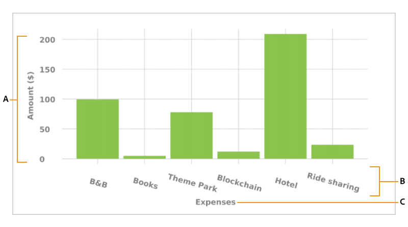

# インタラクティブ通信内でグラフを使用する {#using-charts-in-interactive-communications}

>[!CAUTION]
>
>AEM 6.4 の拡張サポートは終了し、このドキュメントは更新されなくなりました。 詳細は、 [技術サポート期間](https://helpx.adobe.com/jp/support/programs/eol-matrix.html). サポートされているバージョンを見つける [ここ](https://experienceleague.adobe.com/docs/?lang=ja).

インタラクティブ通信でグラフを使用すると、大量の情報を分析しやすく、視覚的な形式を理解しやすくまとめることができます

グラフやグラフは、データを視覚的に表現したものです。 大量の情報を分かりやすい視覚的形式にまとめ、インタラクティブ通信の受信者は複雑なデータをより良く視覚化、解釈、分析できます。

インタラクティブ通信を作成する際にグラフを追加することにより、インタラクティブ通信のフォームデータモデルから取得した 2 次元のデータを視覚的に表現することができます。グラフコンポーネントを使用すると、次のタイプのグラフを追加および設定できます。

* 円グラフ
* 列
* ドーナツグラフ
* バー（Web チャネルのみ）
* Line
* 線とポイント
* ポイント
* 領域

## インタラクティブ通信でグラフを追加および設定 {#add-and-configure-chart-in-an-interactive-communication}

インタラクティブ通信にグラフを追加するには、次の手順を実行します。

1. AEMサイドバーのコンポーネントから、グラフコンポーネントを、インタラクティブ通信の印刷チャネルまたは Web チャネルの次のいずれかにドラッグ&amp;ドロップします。

   * 印刷チャネル：ターゲット領域と画像フィールド
   * Web チャネル：パネルとターゲット領域

   ドロップグラフコンポーネントは、グラフのプレースホルダーを作成します。

1. インタラクティブ通信エディターでグラフコンポーネントをタップし、コンポーネントツールバーからを選択します。 **[!UICONTROL 設定 (]** ) をクリックします。

   プロパティサイドバーが表示され、グラフの基本プロパティがフォーカスされます。

   
   **図：** *印刷チャネルの折れ線グラフの基本プロパティ*

   
   **図：** *Web チャネルの折れ線グラフの基本プロパティ*

1. 印刷チャネルと Web チャネルのグラフの基本プロパティを設定します。 共通のプロパティ以外に、印刷チャネルと Web チャネル、およびグラフの種類に固有のプロパティがあります。

   * **[!UICONTROL 名前]**:グラフオブジェクトの名前。 ここで指定したグラフの名前は、グラフ出力には表示されませんが、グラフを参照するためのルールで使用されます。
   * **[!UICONTROL グラフのタイプ]**:グラフのタイプを指定します。円グラフ、列グラフ、ドーナツグラフ、線グラフ、線グラフ、線とポイントグラフ、ポイントグラフ、面グラフのいずれかを指定できます。
   * **[!UICONTROL オブジェクトを非表示]**:最終的な出力でグラフを非表示にする場合に選択します。
   * 次の項目を指定します。 **[!UICONTROL x 軸]** および **[!UICONTROL y 軸]**:

      * **[!UICONTROL タイトル]**:インタラクティブ通信に表示する X 軸と Y 軸のタイトルを指定します。
      * **[!UICONTROL データモデルオブジェクト*]**:インタラクティブ通信の作成時に指定したフォームデータモデルから、グラフの X 軸と Y 軸のデータモデルオブジェクトを参照して選択します。 グラフの X 軸と Y 軸にプロットするために、互いに関連して意味のある同じ親データモデルオブジェクトの 2 つのコレクション/配列タイプのプロパティを選択します。
      * **[!UICONTROL 関数]**:統計関数を使用して軸の値を計算するには、X/Y 軸の関数を選択します。 関数について詳しくは、 [グラフでの関数の使用](#usefunction) および [例 2:折れ線グラフでの合計関数と平均関数の適用](#applicationsumfrequency).

   >[!NOTE]
   >
   >印刷チャネルの X 軸の場合、連結するデータモデルオブジェクトは、数値、文字列、日付のいずれかのタイプにする必要があります。 Y 軸では、連結するデータモデルオブジェクトは「数値」タイプである必要があります。 印刷チャネルでは、右側の凡例を使用することをお勧めします。

   グラフのプロパティの詳細については、 [グラフの基本プロパティ](#basicpropertiescharts).

1. （印刷チャネルのみ）「エージェントの設定」で、エージェントがこのグラフを使用する必要があるかどうかを指定します。 次の場合： **[!UICONTROL エージェントがこのグラフを使用するには t が必須です]** 「 」オプションが選択されていない場合、エージェント UI の「コンテンツ」タブにあるグラフの目のアイコンをタップして、グラフの表示/非表示を切り替えることができます。

   

1. プロパティサイドバーで、 .

   プレビューを使用して、グラフの外観とデータを確認します。 必要に応じて、グラフのプロパティを再設定します。

1. インタラクティブ通信での他の変更に戻ります。

## 例 1：印刷チャネルと Web チャネルのグラフ出力 {#chartoutputprintweb}

「基本」タブでは、グラフの種類、データを含むソースフォームデータモデルのプロパティ、グラフの X 軸と Y 軸にプロットするラベル、およびオプションで統計関数を定義して、グラフ上のプロットの値を計算できます。

ここでは、インタラクティブ通信を使用して生成されたクレジットカード明細書を利用して、基本的なプロパティで最低限必要な情報について詳しく説明します。 文内の様々な費用の量を表すグラフを生成する場合を考えてみます。 インタラクティブ通信の印刷出力と Web 出力に異なる種類のグラフを使用する場合。

これをおこなうには、次を指定する必要があります。

* **[!UICONTROL グラフのタイプ]**  — この例では、印刷チャネル用の列と Web チャネル用のドーナツが表示されます
* **[!UICONTROL データモデルオブジェクト]** グラフの X 軸と Y 軸のソースとして — この例では、X 軸のトランザクション金額と Y 軸の費用名です
* **[!UICONTROL タイトル]** X 軸と Y 軸の場合（この例では、印刷チャネルの [ 列 ] タイプのグラフの場合のみ）、この例では、X 軸の場合は [ 金額 ($)]、Y 軸の場合は [ 費用 ] となります。
* **[!UICONTROL ラベルの方向]** （この例では、印刷チャネルの列タイプのグラフのみ） — この例 `Tilt Left`

* **[!UICONTROL ツールチップ]** 費用（web チャネルのみ）の上にマウスを置くと表示されます。この例では `${x}: $ ${y}`は、次の形式で表示されます。 `[Expense Label: $ Amount]` ( 例：テーマパーク訪問：$ 315)


**図：** *インタラクティブ通信の印刷出力の縦棒グラフ*

**A.** Y 軸 — フォームデータモデルのプロパティから取得した金額と、「タイトル」プロパティを「金額 ($)」に設定した金額 **B.** X 軸のラベル方向を左に傾けるに設定 **C.** X 軸 — フォームデータモデルのプロパティから取得した費用の説明で、「タイトル」プロパティを「費用」に設定します。


**図：** *インタラクティブ通信の Web 出力のドーナツグラフ*

**A.** ドーナツグラフの内側の半径プロパティが設定されています **B.** [ 凡例を表示 ] プロパティが選択され、[ 凡例の位置 ] プロパティが [ 右 ] に設定されている **C.** ツールチップはマウスを合わせると項目の詳細を表示します。ツールチップは${x} に設定されています。$${y}

## 例 2: 線グラフ内で Sum 関数と Frequency 関数を適用する {#applicationsumfrequency}

グラフ内で関数を適用すると、フォームデータモデルでは直接指定できないデータを描画することができます。ここでは、クレジットカードの取引明細を例として、Sum 関数と Frequency 関数をグラフに適用する方法について説明します。


**図：** *3 つの「Bed and Breakfast」トランザクションを含む機能を持たない折れ線グラフ*

### Sum 関数 {#sum-function}

sum 関数を適用して、同じデータプロパティの複数のインスタンスの値を合計し、1 回だけ表示することができます。 例えば、次のグラフでは、 Y 軸に Sum 関数が適用され、3 つの Bed and Breakfast トランザクション ($99.45、$78、$12) の金額が合計され、1 つのトランザクション ($189.45) のみが表示されます。

同じデータプロパティで複数のインスタンスが存在する場合は、Sum 関数を適用して合計値を表示すると、グラフが見やすくなります。


### Frequency 関数 {#frequency-function}

Frequency 関数は、他の軸の特定の値の X 軸または Y 軸の値の数を返します。 Y 軸 (Amount/TransAmount) に Frequency 関数を適用すると、Bed and Breakfast トランザクションが 3 回発生し、残りのトランザクションのタイプが 1 回発生したことがグラフに表示されます。


## グラフの基本プロパティ {#basicpropertiescharts}

「基本」タブで、次のプロパティを設定できます。

**名前** グラフ要素の識別子。 名前はグラフに表示されませんが、他のコンポーネント、スクリプト、SOM 式から要素を参照する際に役立ちます。

**タイトル（印刷チャネルのみ）** グラフのタイトルを指定します。

**グラフのタイプ** 生成するグラフのタイプを指定します。 使用可能なオプションは、円グラフ、列グラフ、ドーナツグラフ、棒グラフ（Web チャネルのみ）、線グラフ、線グラフ、ポイントグラフ、ポイントグラフ、領域グラフです。 詳しくは、例 1 を参照してください。印刷および Web でのグラフ出力。

**X 軸/タイトル** X 軸のタイトルを指定します。

**X 軸/データモデルオブジェクト&amp;ast;** X 軸にプロットするフォームデータモデルコレクション項目の名前を指定します。

**X 軸/関数** x 軸の値の計算に使用する統計/カスタム関数を指定します。 関数の詳細については、「グラフでの関数の使用」および「例 2:折れ線グラフでの合計関数と平均関数の適用。

**X 軸/ラベルの方向** 印刷チャネルでのグラフ上のラベルの方向。 ラベルの方向を [ カスタム回転 ] として選択した場合は、[ カスタム回転角度（度）] フィールドが表示されます。 [ カスタム回転角度（度）] フィールドで、回転角度を 15 度のステップで選択できます。

**Y 軸/タイトル** Y 軸のタイトルを指定します。

**Y 軸/データモデルオブジェクト (&amp;A);** Y 軸に印刷するフォームデータモデルコレクション項目を指定します。 印刷チャネルでは、Y 軸のデータモデルオブジェクトのタイプは数値である必要があります。

**Y 軸/機能** Y 軸の値の計算に使用する統計/カスタム関数を指定します。 関数の詳細については、「グラフでの関数の使用」および「例 2:折れ線グラフでの合計関数と平均関数の適用。

**凡例を表示** 有効にすると、円グラフまたはドーナツグラフの凡例が表示されます。

**凡例の位置** グラフを基準にした凡例の位置を指定します。 使用できるオプションは、右端、左端、上、下です。

**高さ（印刷チャネルのみ）** グラフの高さ（ピクセル単位）。

**幅（印刷チャネルのみ）** グラフの幅（ピクセル単位）。

>[!NOTE]
>
>Web チャネルのグラフの幅については、スタイルレイヤーを使用するかテーマを適用して調整することができます。

**ツールチップ（Web チャネルのみ）** Web チャネル内のグラフのデータポイントにマウスを置くときにツールチップが表示される形式を指定します。 デフォルト値は\${x}(\${y}) です。 グラフの種類に応じて、グラフ内のポイント、棒、スライスにマウスを置くと、変数\${x} と\${y} が x 軸と y 軸の対応する値に動的に置き換えられ、ツールチップに表示されます。

ツールヒントを無効にするには、ツールヒントフィールドを空白にします。このオプションは線グラフと領域グラフには適用できません。詳しくは、[例 1：印刷と web のグラフ出力](#chartoutputprintweb)を参照してください。

**CSS クラス（Web チャネルのみ）** CSS クラスの名前を「 CSS クラス」フィールドに指定し、グラフにカスタムスタイルを適用します。

**前に改ページする必須（印刷チャネルのみ）** グラフの前に必須の改ページを追加し、新しいページの上にグラフを配置する場合に選択します。

**直後に改ページする必須（印刷チャネルのみ）** グラフの後に必須の改ページを追加し、新しいページの上部でグラフの後にコンテンツを配置する場合に選択します。

**インデント（印刷チャネルのみ）** ページの左からグラフのインデントを指定します。

**グラフ固有の設定** 一般的な設定に加えて、次のグラフ固有の設定を使用できます。

* **内半径**:ドーナツグラフでは、グラフ内の内側の円の半径（ピクセル単位）を指定できます。
* **線の色**:折れ線グラフ、折れ線グラフ、点グラフ、面グラフで使用でき、グラフ内の線の色を 16 進値で指定できます。
* **ポイントの色**:ポイントグラフと折れ線グラフとポイントグラフで使用でき、グラフ内のポイントの色を 16 進値で指定できます。

* **領域の色**:面グラフで使用可能：グラフの線の下の領域の色を 16 進値で指定します。

## グラフでの関数の使用 {#usefunction}

統計関数を使用してグラフを設定し、ソースデータの値を計算して、グラフにプロットできるようにします。 グラフ内で関数を適用すると、フォームデータモデルでは直接指定できないデータを描画することができます。

グラフコンポーネントには組み込み関数がいくつかありますが、独自の関数を記述し、Web チャネルのグラフ設定で使用できるようにすることができます。


>[!NOTE]
>
>関数を使用して、グラフの X 軸または Y 軸の値を計算できます。

### デフォルトの関数 {#default-functions}

デフォルトでは、以下の関数をグラフコンポーネントに使用できます。

**平均**：X 軸または Y 軸の値を指定したとき、もう一方の軸にある値の平均値を返します。

**合計**：X 軸または Y 軸の値を指定したとき、もう一方の軸にあるすべての値の合計を返します。

**最大**：X 軸または Y 軸の値を指定したとき、もう一方の軸にある値の最大値を返します。

**頻度**：X 軸または Y 軸の値を指定したとき、もう一方の軸にある値の個数を返します。

**範囲**：X 軸または Y 軸の値を指定したとき、もう一方の軸にある値の最大値と最小値の差異を返します。

**中央値**：X 軸または Y 軸の値を指定したとき、もう一方の軸にある値を上位の値都会の値の中央になる値を返します。

**最小**：X 軸または Y 軸の値を指定したとき、もう一方の軸にある値の最小値を返します。

**モード** 他の軸にある特定の値の X 軸または Y 軸で最も多く出現する値を返します

### Web チャネルのカスタム関数 {#custom-functions-in-web-channel}

グラフでデフォルトの関数を使用する以外に、JavaScript™でカスタム関数を記述し、Web チャネルのグラフコンポーネントの関数のリストで使用できるようにします。

関数は、配列または値、およびカテゴリ名を入力として受け取り、値を返します。 次に例を示します。

```
Multiply(valueArray, category) {
 var val = 1;
 _.each(valueArray, function(value) {
 val = val * value;
 });
 return val;
}
```

カスタム関数を作成したら、次の手順を実行して、グラフの設定で使用できるようにします。

1. 関連するインタラクティブ通信に関連付けられたクライアントライブラリにカスタム関数を追加します。 詳しくは、[送信アクションの設定](/help/forms/using/configuring-submit-actions.md)と[クライアントサイドのライブラリの使用](/help/sites-developing/clientlibs.md)を参照してください。

1. CRXDe Lite の関数ドロップダウンにカスタム関数を表示するには、以下のプロパティを指定して、apps フォルダー内に `nt:unstructured` ノードを作成します。

   * `guideComponentType` プロパティを追加し、値として `fd/af/reducer` を指定します。(mandatory)
   * `value` プロパティを追加し、カスタムの JavaScript™ 関数の完全修飾名を指定します。（必須）このプロパティの値を、カスタム関数の名前に設定します（Multiply など）。
   * `jcr:description` プロパティを追加し、カスタム関数の名前として表示される値を指定します。この名前が、関数ドロップダウンに表示されます。例えば、**Multiply** と表示されます。
   * `qtip` プロパティを追加し、値としてカスタム関数の簡単な説明を指定します。「**関数**」ドロップダウンリスト内の関数名にポインターを置くと、ここで指定した説明がツールヒントとして表示されます。

1. クリック **すべて保存** 設定を保存します。

これで、関数がグラフで使用できるようになりました。
