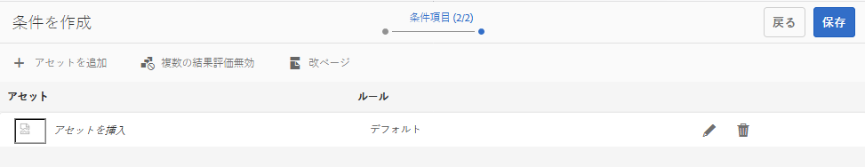
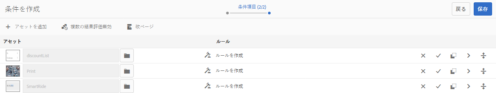
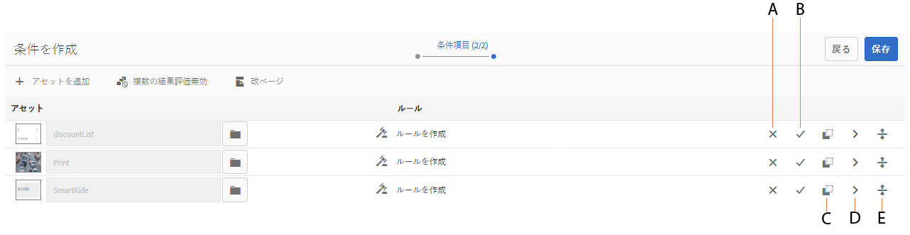
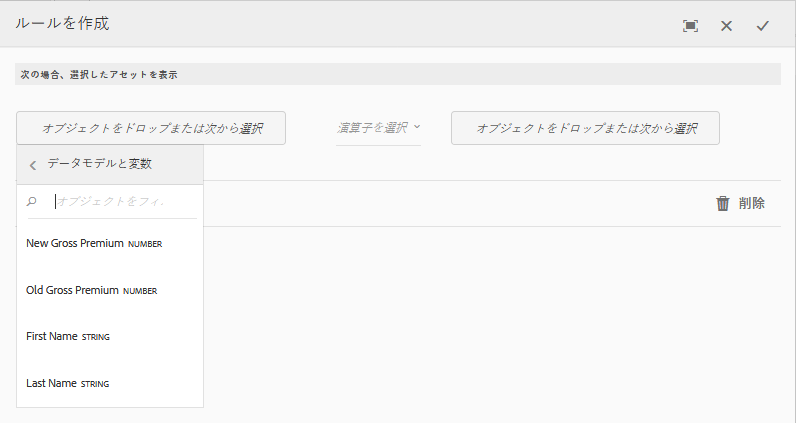
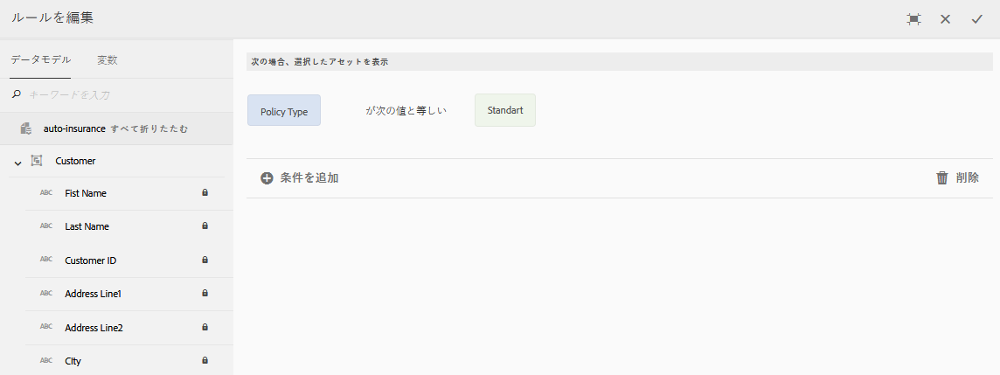
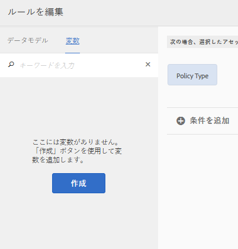

# インタラクティブ通信内の条件 {#conditions-in-interactive-communications}

ここでは、インタラクティブ通信で使用する条件フラグメントの作成方法と編集方法について説明します。インタラクティブ通信の作成では 4 種類のドキュメントフラグメントが使用されますが、条件フラグメントはそのうちの 1 つです。他の 3 つは、テキストフラグメント、リストフラグメント、レイアウトフラグメントです。

## 概要 {#overview}

条件は、インタラクティブ通信に含めることができるドキュメントフラグメントです。他のドキュメントフラグメントには、[テキストフラグメント](/help/forms/using/texts-interactive-communications.md)、リストフラグメント、レイアウトフラグメントがあります。条件を使用すると、指定されたデータとルールに基づいてインタラクティブ通信に含める 1 つ以上のコンテキストアセットを定義できます。

例えば、次のような問題です。

* 顧客が使用しているクレジットカードの種類に基づいて、そのクレジットカードの年会費と画像を取引明細書に表示する。
* 顧客が居住している国の税制に基づいて、保険料支払期日の通知に税額の計算結果を表示する。

条件内のアセットは、適用されるルールと、そのルールに渡される値に基づいてレンダリングされます。条件のルールは、次のタイプのデータの値を確認できます。

* 関連するフォームデータモデルのプロパティ
* 条件内で作成する変数
* 文字列
* 数値
* 数式
* 日付

## 条件の作成 {#createcondition}

1. 「**[!UICONTROL フォーム]**／**[!UICONTROL ドキュメントフラグメント]**」を選択します。
1. 選択 **[!UICONTROL 作成]** > **[!UICONTROL 条件]**.
1. 次の情報を指定します。

   * **[!UICONTROL タイトル]**:（オプション）条件のタイトルを入力します。 タイトルは一意である必要はなく、特殊文字や英語以外の文字を含めることもできます。条件は、サムネールやプロパティなど、タイトル（使用可能な場合）で参照されます。
   * **[!UICONTROL 名前]**:フォルダー内の条件の一意の名前。 どのような状態であっても、1 つのフォルダー内に、同じ名前を持つ 2 つのドキュメントフラグメント（テキスト、条件、リスト）を保管することはできません。「名前」フィールドでは、英数字およびハイフンのみ使用できます。「名前」フィールドは、タイトルフィールドに基づいて自動的に入力されます。「タイトル」フィールドに入力された特殊文字、スペース、数字および英語以外の文字は、「名前」フィールドではハイフンに置き換えられます。 「タイトル」フィールドの値は「名前」フィールドに自動的にコピーされますが、値を編集することもできます。
   * **[!UICONTROL 説明]**：ドキュメントフラグメントの説明を入力します。
   * **[!UICONTROL フォームデータモデル]**：（任意）フォームデータモデルに基づいて条件を作成する場合は、「フォームデータモデル」ラジオボタンを選択します。「フォームデータモデル」ラジオボタンを選択すると、「**[!UICONTROL フォームデータモデル]**」*フィールドが表示されます。フォームデータモデルを参照して選択します。インタラクティブ通信用の条件を作成する場合は、そのインタラクティブ通信で使用するものと同じデータモデルを使用する必要があります。フォームデータモデルについて詳しくは、 [データ統合](/help/forms/using/data-integration.md).
   * **[!UICONTROL タグ]**：（任意）カスタムタグを作成する場合は、テキストフィールドに値を入力して Enter キーをタップします。この条件を保存すると、新しく追加されたタグが作成されます。

1. 「**[!UICONTROL 次へ]**」をタップします。

   条件の作成ページが表示されます。

   

1. タップ **[!UICONTROL アセットを追加]**.

   アセットの選択ページが表示されます。このページには、条件内に追加できるテキスト、リスト、条件、画像が表示されます。

   >[!NOTE]
   >
   >アセットの選択ページには、新しく作成されたアセットと FDM ベースのアセット（作成する条件と同じ FDM を使用して作成されたアセット）だけが表示されます。

1. 条件に含めるアセットをタップして選択し、「**[!UICONTROL 完了]**」をタップします。

   条件の作成ページが表示されます。このページには、作成されたアセットが一覧表示されます。

   

   以下のオプションを使用して、条件内のアセットを管理することができます。

   

   **`[A]`変更を拒否します。** 条件内のアセットとルールに加えた変更を拒否するには、このアイコンをタップします。

   **`[B]`変更を受け入れます。** 条件のアセットとルールに加えた変更を受け入れるには、このアイコンをタップします。

   **`[C]`アセットを複製します。**&#x200B;適用対象のルール（存在する場合）と共に条件内のアセットのコピーを作成する場合は、このアイコンをタップします。その後、複製されたアセットで、ルールとアセットの編集を行うことができます。特定のコンテキストに基づいて代替のアセットを表示するための類似のルールを作成する場合は、アセットを複製すると便利です。

   **`[D]`プレビューを表示.** このアイコンをタップすると、条件を作成/編集ページ内にアセットのプレビューが表示されます。

   **`[E]`並べ替え.** 条件内でアセットを並べ替えるには、このアイコンを長押ししてアセットをドラッグ&amp;ドロップします。

   条件の実行時の動作を指定するには、次のオプションを選択します。

   * **複数の結果評価を無効化 / 複数の結果評価を有効化**：「複数の結果評価を有効化」オプションを選択すると、すべての条件が評価され、その結果として、すべての true ルールの要約が表示されます。「複数の結果評価を無効化」オプションを選択すると、true と判断された最初のルールだけが評価され、そのルールが条件の出力になります。
   * **改ページ**:このオプション ( ) をクリックして、条件のアセット間に改ページを追加します。 このオプションが選択されていない場合 ( ) を指定した場合、条件が印刷出力の次のページにオーバーフローすると、条件全体が次のページに移動し、条件内のアセット間で区切られるのではなく、条件全体が次のページに移動します。

1. 「**[!UICONTROL ルールを作成]**」をタップして、アセットの表示と非表示を切り替えるためのルールを必要に応じて追加します。ルール内で変数を使用する方法については、「[変数の作成](#variables)」を参照してください。詳しくは、 [条件へのルールの追加](#ruleeditor).

   作成されたルールが、条件作成画面の「ルール」列に表示されます。

   

   >[!NOTE]
   >
   >既にルールが設定されている条件（または繰り返しが適用されている条件）にアセットを挿入することができます。

1. 「**[!UICONTROL 保存]**」をタップします。

   これで、条件が作成されました。この条件を使用して、インタラクティブ通信を作成することができます。

   >[!NOTE]
   >
   >新しい条件や編集後の条件を保存するには、条件内に追加する各アセットについて、1 つ以上のルールを設定する必要があります。

## 条件の編集 {#edit-a-condition}

以下の手順により、条件を編集することができます。ポップアップメニューで「フラグメントを編集」を選択して、インタラクティブ通信内から条件の編集を選択することもできます。

1. 「**[!UICONTROL フォーム]**／**[!UICONTROL ドキュメントフラグメント]**」を選択します。
1. 目的の条件に移動して、その条件を選択します。
1. 「**[!UICONTROL 編集]**」をタップします。
1. 条件内で、必要な変更を行います。条件で変更できる情報について詳しくは、 [条件を作成](#createcondition).
1. タップ **[!UICONTROL 保存]** 次に、 **[!UICONTROL 閉じる]**.

## 条件内でルールを作成する {#ruleeditor}

条件内でルールエディターを使用して、**事前に定義された条件**&#x200B;に基づいてアセットの表示と非表示を切り替えるためのルールを作成することができます。事前に定義された条件は、以下のデータに基づいて設定することができます。

* 文字列
* 数値
* 数式
* 日付
* 関連するフォームデータモデルのプロパティ
* 作成済みの任意の[変数](#variables)

### 条件内でルールを作成する {#create-rule-in-condition}

1. 条件の作成時または編集時に、  （ルールエディター）関連するアセットのアイコン。

   ルール作成ダイアログが表示されます。文字列、数値、数式、日付のほかに、以下のデータをルールエディターで使用して、ルールのステートメントを作成することができます。

   * 関連するフォームデータモデルのプロパティ
   * 作成済みの任意の[変数](#variables)

   

   評価するオプションを選択します。

   >[!NOTE]
   >
   >Collection プロパティを使用して、アセットを表示するためのルールを作成することはできません。

1. 「次の値と等しい」、「次の値を含む」、「次の値で始まる」など、ルールを評価するための適切な演算子を選択します。
1. 評価式、文字列、データモデルプロパティ、変数、または日付を挿入します。

   

   ポリシータイプが「標準」の場合にアセットを表示するためのルール

   * ルールを作成または編集する際に、  （サイズ変更）をクリックして、[ ルールを作成/ルールを編集 ] ダイアログを展開します。 ダイアログを拡張して全画面表示にすると、ルールを構成する[変数](#variables)を作成できるようになります。もう一度「サイズ変更」をタップすると、通常のルール作成ダイアログに戻ります。
   * 1 つのルールで複数の条件を作成することもできます。

1. 「**[!UICONTROL 完了]**」をタップします。

   これで、ルールがアセットに適用されます。

## 条件内で変数を作成して使用する {#variables}

条件内でルールを作成または編集しているときに、  （サイズ変更）をクリックして、[ ルールを作成\ルールを編集 ] ダイアログを展開します。 ダイアログを拡張して全画面表示にすると、以下の操作を実行できるようになります。

* ルール内で変数を作成して使用する
* フォームデータモデルのプロパティと変数をルールにドラッグ&amp;ドロップ

サイズ変更アイコンをもう一度タップすると、通常のサイズのダイアログに戻ります。

### 変数の作成 {#create-variables}

1. 条件内でルールを作成または編集しているときに、  （サイズ変更）をクリックして、[ ルールを作成/ルールを編集 ] ダイアログを展開します。

   拡張されたダイアログが全画面モードで表示されます。

   

1. 左側のウィンドウで、 **[!UICONTROL 変数]**.

   変数ペインが表示されます。

   

1. 「**[!UICONTROL 作成]**」をタップします。

   変数作成ペインが表示されます。

1. 次の情報を入力し、 **[!UICONTROL 作成]**:

   * **[!UICONTROL 名前*]**：変数の名前を入力します。
   * **[!UICONTROL 説明]**:必要に応じて、変数の説明を入力します。
   * **[!UICONTROL タイプ*]**:変数のタイプを選択します。文字列、数値、ブール値、日付のいずれかです。
   * **[!UICONTROL 特定の値のみ許可]**：文字列タイプまたは数値タイプの変数の場合、このオプションを選択すると、エージェント UI のプレースホルダーの特定の値セットから、エージェントによって値が選択されます。一連の値を指定するには、このオプションを選択し、 **[!UICONTROL 値*]** フィールドに入力します。

1. 「**[!UICONTROL 作成]**」をタップします。

   作成された変数が変数ペインに表示されます。

1. ルール内に変数を挿入するには、ルール内の任意のオプションのプレースホルダーにその変数をドラッグアンドドロップします。
1. 有効なルールを作成したら、 **[!UICONTROL 完了]**.

   必要に応じて、条件内でさらに変更を行い、その変更内容を保存します。
