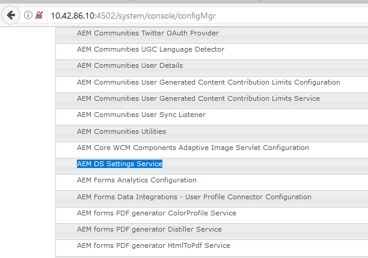

# AEM DS の設定 {#configuring-aem-ds-settings}

この記事では、**AEM DS Settings Service** の設定方法について説明します。この設定は、次のような場合に使用できます。

* Correspondence Management内

   * AEM Forms ワークフローを設定する場合
   * ドラフトまたは送信のリモート保存にフォームポータルを使用する場合

* アダプティブフォームにおいては、アダプティブフォームが発行インスタンスから送信される場合

次の手順に従って、「**[!UICONTROL AEM DS 設定]**」を構成します。

1. URLを使用して、パブリッシュインスタンス上のConfiguration Managerを開きます。

   *http://localhost:port/system/console/configMgr*&#x200B;を参照してください。

   

1. **[!UICONTROL Adobe Experience Manager Webコンソール設定]**&#x200B;ウィンドウで、「**[!UICONTROL AEM DS設定]**」オプションを探してクリックします。

   

1. **[!UICONTROL AEM DS 設定サービス]**&#x200B;ウィンドウに、AEM DS コンポーネントの共通設定が表示されます。

   

1. 次の情報をそれぞれのフィールドに追加します。

   **[!UICONTROL 処理サーバーURL]**:処理サーバーは、FormsまたはAEMワークフローをトリガーする必要があるサーバーです。これは、AEM オーサーインスタンスの URL または他のサーバー URL（つまり、http://localhost:port/）と同じである可能性があります。

   **[!UICONTROL 処理サーバーのユーザー名]**:使用中のサーバーURLに基づ [くワークフローユーザーのユーザー名]

   **[!UICONTROL 処理サーバーのパスワード]**：ワークフローユーザーのパスワード

   >[!NOTE]
   >
   >* Forms または AEM ワークフローのいずれかを使用しているときは、発行サーバーから送信を行う前に、DS 設定サービスを構成する必要があります。このサービスを構成しないと、フォームの送信が失敗します。

