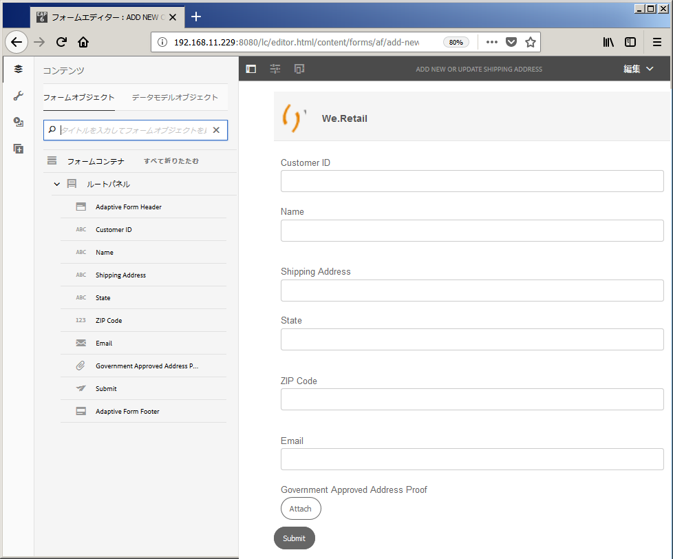

# チュートリアル：アダプティブフォームの作成 {#do-not-publish-tutorial-create-an-adaptive-form}

これは、「[最初のアダプティブフォームを作成する](/help/forms/using/create-your-first-adaptive-form.md)」シリーズを構成するチュートリアルです。チュートリアル内のユースケースを理解して実際に操作できるように、このシリーズのチュートリアルを最初から順に学習することをお勧めします。

## このチュートリアルについて {#about-the-tutorial}

アダプティブフォームは、動的でレスポンシブな次世代型のフォームです。アダプティブフォームを使用して、エクスペリエンスをカスタマイズすることができます。また、アダプティブフォームを Adobe Analytics に統合して統計情報を分析したり、Adobe Campaign に統合してキャンペーン管理を行うこともできます。アダプティブフォームの機能について詳しくは、 [アダプティブフォームのオーサリングの概要](/help/forms/using/introduction-forms-authoring.md).

正しい手順を踏めば、フォームの作成と管理を簡単に行うことができます。このチュートリアルでは、以下の操作を行う方法について説明します。

* [顧客が配送先住所を追加するためのアダプティブフォームを作成する](/help/forms/using/create-adaptive-form.md#step-create-the-adaptive-form)

* [顧客の情報を表示して保存するためのアダプティブフォームフィールドのレイアウトを設定する](/help/forms/using/create-adaptive-form.md#step-add-header-and-footer)

* [フォームコンテンツが記載された電子メールを送信するためのアクションを作成する](/help/forms/using/create-adaptive-form.md#step-add-components-to-capture-and-display-information)
* [アダプティブフォームのプレビューと送信を行う](/help/forms/using/create-adaptive-form.md)

このチュートリアルの最後に、以下のようなフォームにアクセスするためのリンクがあります。

    

## 手順 1：アダプティブフォームを作成する {#step-create-the-adaptive-form}

1. AEM オーサーインスタンスにログインし、**Adobe Experience Manager**／**フォーム**／**フォームとドキュメント**&#x200B;に移動します。デフォルトの URL は [http://localhost:4502/aem/forms.html/content/dam/formsanddocuments](http://localhost:4502/aem/forms.html/content/dam/formsanddocuments).
1. 「**作成**」をタップして、「**アダプティブフォーム**」を選択します。テンプレートを選択するためのオプションが表示されます。**空白**&#x200B;テンプレートをタップして選択し、「**次へ**」をタップします。

1. 「**プロパティを追加**」オプションが表示されます。「**タイトル**」フィールドと「**名前**」フィールドは入力必須です。

   * **タイトル：** 指定 `Add new or update shipping address` 」と入力します。 「タイトル」フィールドに入力した値が、フォームの表示名になります。タイトルを指定すると、AEM Forms ユーザーインターフェイス内のフォームを特定しやすくなります。
   * **名前**：このフィールドに、「`shipping-address-add-update-form`」と入力します。「名前」フィールドに入力した値が、フォームの名前になります。指定された名前のノードがリポジトリーに作成されます。タイトルを入力し始めると、名前フィールドの値が自動的に生成されます。候補として入力された値は変更可能です。「ドキュメント名」フィールドには、英数字、ハイフン、アンダースコアのみを使用できます。無効な入力は、すべてハイフンに置き換えられます。

1. 「**作成**」をタップします。アダプティブフォームが作成され、フォームを編集用に開くためのダイアログが表示されます。「**開く**」をタップし、新しく作成されたフォームを新しいタブで開きます。フォームが編集モードで表示されます。新しく作成されたフォームを必要に応じてカスタマイズするためのサイドバーも表示されます。

   アダプティブフォームのオーサリングインターフェースと使用可能なコンポーネントについて詳しくは、「[アダプティブフォームの作成について](/help/forms/using/creating-adaptive-form.md)」を参照してください。

   

## 手順 2：ヘッダーとフッターを追加する {#step-add-header-and-footer}

AEM Forms には、アダプティブフォーム上で情報を表示するための様々なコンポーネントが用意されています。ヘッダーコンポーネントとフッターコンポーネントを使用すると、フォームの全体的な外観を統一することができます。ヘッダーには通常、会社のロゴ、フォームのタイトル、フォームの概要を指定します。フッターには通常、著作権に関する情報と他のページへのリンクを指定します。

1. タップ  > . コンポーネントブラウザーが表示されます。次をドラッグ： **ヘッダー** コンポーネントブラウザーからアダプティブフォームへのコンポーネント
1. 「**ロゴ**」をタップします。ツールバーが表示されます。タップ  ツールバーに、 **We.Retail**&#x200B;をタップし、 .

1. 「画像」をタップします。ツールバーが表示されます。タップ . 画面の左側にプロパティブラウザーが表示されます。「**参照**」をタップして、ロゴ画像をアップロードします。タップ . 画像がヘッダーに表示されます。

   上記の「Get file」をタップすると、このチュートリアルで使用するロゴをダウンロードすることができます。

[ファイルを入手](assets/logo.png)

1. 次をドラッグ： **フッター** コンポーネント  をアダプティブフォームに追加します。 この段階では、フォームは次のようになります。

   

## 手順 3：情報を取得して表示するためのコンポーネントを追加する {#step-add-components-to-capture-and-display-information}

コンポーネントは、アダプティブフォームを構成するための構築ブロックです。AEM Formsは、アダプティブフォームで情報を取得して表示するための多くのコンポーネントを提供します。 コンポーネントは、  をフォームに追加します。 使用可能なコンポーネントと対応する機能については、 [アダプティブフォームのオーサリングの概要](/help/forms/using/introduction-forms-authoring.md).

1. 数値ボックスコンポーネントをアダプティブフォームにドラッグし、フッターコンポーネントの前にドロップします。コンポーネントのプロパティを開き、 **タイトル** の **`Customer ID`**，変更 **エレメント名** から **`customer_ID`**、を有効にします。 **必須フィールド** オプション、有効 **HTML5 番号入力タイプを使用** オプションを選択し、をタップします。 .
1. 3 つのテキストボックスコンポーネントをアダプティブフォームにドラッグし、フッターコンポーネントの前にドロップします。これらのテキストボックスについて、以下のプロパティを設定します。：

<table> 
 <tbody> 
  <tr> 
   <td>プロパティ</td> 
   <td>テキストボックス 1  </td> 
   <td>テキストボックス 2  </td> 
   <td>テキストボックス 3</td> 
  </tr> 
  <tr> 
   <td>タイトル</td> 
   <td>名前  </td> 
   <td>発送先住所</td> 
   <td>状態</td> 
  </tr> 
  <tr> 
   <td>要素名</td> 
   <td>customer_Name  </td> 
   <td>customer_Shipping_Address</td> 
   <td>customer_State</td> 
  </tr> 
  <tr> 
   <td>必須フィールド</td> 
   <td>Enabled</td> 
   <td>有効</td> 
   <td>有効</td> 
  </tr> 
  <tr> 
   <td>複数行を許可  </td> 
   <td>無効</td> 
   <td>有効</td> 
   <td>無効</td> 
  </tr> 
 </tbody> 
</table>

1. **数値ボックス**&#x200B;コンポーネントをフッターコンポーネントの前にドラッグします。コンポーネントのプロパティを開き、以下の表に示す値を設定して、をタップします。 .

   | プロパティ | 値 |
   |---|---|
   | タイトル | 郵便番号 |
   | 要素名 | customer_ZIPCode |
   | 最大桁数 | 6 |
   | 必須フィールド | 有効 |
   | 表示パターンタイプ | パターンなし |

1. **電子メール**&#x200B;コンポーネントをフッターコンポーネントの前にドラッグします。コンポーネントのプロパティを開き、次の表に示す値を設定して、をタップします。 .

   | プロパティ | 値 |
   |---|---|
   | タイトル | 電子メール |
   | 要素名 | customer_Email |
   | 必須フィールド | 有効 |

1. **添付ファイル**&#x200B;コンポーネントをフッターコンポーネントの前にドラッグします。コンポーネントのプロパティを開き、次の表に示す値を設定して、をタップします。 .

<table> 
 <tbody> 
  <tr> 
   <td>プロパティ</td> 
   <td>値</td> 
  </tr> 
  <tr> 
   <td>タイトル</td> 
   <td>Government approved address proof  </td> 
  </tr> 
  <tr> 
   <td>要素名</td> 
   <td>customer_Address_Proof</td> 
  </tr> 
  <tr> 
   <td>必須フィールド</td> 
   <td>有効</td> 
  </tr> 
 </tbody> 
</table>

1. **送信ボタン**&#x200B;コンポーネントをアダプティブフォームにドラッグし、フッターコンポーネントの前にドロップします。コンポーネントのプロパティを開き、「要素名」を「 **address_addition_update_submit**&#x200B;をタップします。 . これでフォームのレイアウトが設定され、フォームが以下のように表示されます。

   

## 手順 4：アダプティブフォームの送信アクションを設定する {#step-configure-submit-action-for-the-adaptive-form}

アダプティブフォームの「送信」ボタンをタップすると、送信アクションがトリガーされます。送信アクションを使用して、フォームデータをローカルリポジトリに保存したり、フォームデータを REST エンドポイントに送信したり、フォームデータを電子メールとして送信したりすることができます。アダプティブフォームには、そのほかにも、すぐに使用できる送信アクションがいくつか用意されています。詳しくは、「[送信アクションの設定](/help/forms/using/configuring-submit-actions.md)」を参照してください。

次の手順を使用して、フォームの電子メール送信アクションとデモ送信アクションを設定できます。

1. 電子メールサーバーを設定します。詳しくは、「[電子メール通知の設定](/help/sites-administering/notification.md)」を参照してください。

   /content/help/en/experience-manager/6-4/sites-administering/notification.html

1. タップ **フォームコンテナ** コンテンツブラウザーでをタップし、 . 左側にプロパティブラウザーが開きます。
1. **送信**／**送信アクション**&#x200B;に移動します。「**電子メールを送信**」を選択します。次の値を指定し、 .

   | プロパティ | 値 |
   |--- |--- |
   | 送信元 | `donotreply@weretail.com` |
   | To | `${customer_Email}` |
   | 件名 | Acknowledgement: You have added shipping address on We.Retail website. |
   | 電子メールテンプレート | こんにちは `${customer_Name}`の場合、次の住所がアカウントの配送先住所として追加されます。  `${customer_Name}`, `${customer_Shipping_Address}`, `${customer_State}`, `${customer_ZIPCode}`  よろしくお願いします。We.Retail |
   | 添付ファイルを含める | 有効 |

   これでフォームが作成されました。フォームのプレビューを表示して機能をテストすることができます。このチュートリアルに記載されている値を指定し、AEM Forms サーバーで稼働するマシン上に作成されたフォームにアクセスする場合は、対応するフォームが [http://localhost:4502/editor.html/content/forms/af/shipping-address-add-update-form.html](http://localhost:4502/editor.html/content/forms/af/shipping-address-add-update-form.html) に用意されています。

## 手順 5：アダプティブフォームのプレビューを表示して、アダプティブフォームを送信する {#step-preview-and-submit-the-adaptive-form}

**プレビューオプション**&#x200B;を使用して、フォームの外観と動作を確認することができます。プレビューモードでフォームを送信し、フォームに適用された検証機能を確認することもできます。例えば、必須フィールドに値が入力されていな場合は、エラーメッセージが表示されます。

アダプティブフォームには、各種のデバイスでフォームの操作性をエミュレートするためのオプションも用意されています。例えば、iPhone、iPad、デスクトップパソコンなどのデバイスについて、エミュレーションを行うことができます。次の両方を使用できます **プレビュー** および **エミュレーター**  オプションを組み合わせて使用し、画面サイズが異なるデバイスでフォームをプレビューすることもできます。

1. フォームエディター右側の「**プレビュー**」オプションをタップします。プレビューモードでフォームが開きます。 このチュートリアルに記載されている値を使用してフォームを作成した場合、フォームのプレビュー URL は [http://localhost:4502/content/dam/formsanddocuments/shipping-address-add-update-form/jcr:content?wcmmode=disabled](http://localhost:4502/content/dam/formsanddocuments/shipping-address-addition-updation-form/jcr:content?wcmmode=disabled) になります。
1. 用途  を使用して、様々なデバイスでのフォームの表示を確認できます。
1. フォームのフィールドに値を入力して「**送信**」をタップします。フォームが送信され、デフォルトの「**ありがとうございます**」ページにリダイレクトされます。カスタムの「ありがとうございます」ページを指定することもできます。詳しくは、「[リダイレクトページの設定](/help/forms/using/configuring-redirect-page.md)」を参照してください。

これで、住所を追加するためのアダプティブフォームの準備が完了しました。このチュートリアルに記載されている値を指定し、AEM Forms サーバーで稼働するマシン上に作成されたフォームにアクセスする場合は、対応するフォームが [http://localhost:4502/editor.html/content/forms/af/shipping-address-add-update-form.html](http://localhost:4502/editor.html/content/forms/af/shipping-address-add-update-form.html) に用意されています。
