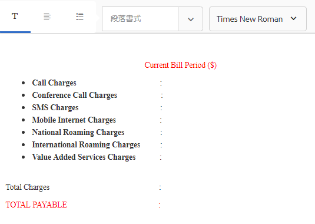

# チュートリアル：ドキュメントフラグメントの作成  {#tutorial-create-document-fragments}

>[!CAUTION]
>
>AEM 6.4 の拡張サポートは終了し、このドキュメントは更新されなくなりました。 詳細は、 [技術サポート期間](https://helpx.adobe.com/jp/support/programs/eol-matrix.html). サポートされているバージョンを見つける [ここ](https://experienceleague.adobe.com/docs/?lang=ja).

インタラクティブ通信用のドキュメントフラグメントの作成

これは、「[最初のインタラクティブ通信の作成](/help/forms/using/create-your-first-interactive-communication.md)」シリーズを構成するチュートリアルです。チュートリアルの使用例を理解、実行、デモするために、時系列に従うことをお勧めします。

ドキュメントフラグメントは、インタラクティブ通信の作成に使用される通信の再利用可能なコンポーネントです。 ドキュメントフラグメントには、次の種類があります。

* テキスト - テキストアセットは、1 つまたは複数の段落で構成される 1 つのコンテンツです。段落は静的または動的にすることができます。
* リスト - リストは、テキスト、リスト、条件、画像を含む、一連のドキュメントフラグメントです。
* 条件 - 条件により、フォームデータモデルから受信したデータに基づいてインタラクティブ通信に含めるコンテキストを定義することができます。

本チュートリアルは、[インタラクティブ通信の計画](/help/forms/using/planning-interactive-communications.md)セクションの分析に基づいて、複数のテキストドキュメントフラグメントの作成方法を順を追って説明します。このチュートリアルを完了すると、次の操作を実行できるようになります。

* ドキュメントフラグメントの作成
* 変数の作成
* ルールの作成と適用

このチュートリアルで作成されたドキュメントフラグメントのリストは次のとおりです。

* [請求明細](/help/forms/using/create-document-fragments.md#step-create-bill-details-text-document-fragment)
* [顧客情報](/help/forms/using/create-document-fragments.md#step-create-customer-details-text-document-fragment)
* [請求内容](/help/forms/using/create-document-fragments.md#step-create-bill-summary-text-document-fragment)
* [請求概要](/help/forms/using/create-document-fragments.md#step-create-summary-of-charges-text-document-fragment)

各ドキュメントフラグメントには、スタティックテキスト、フォームデータモデルから受信したデータ、エージェント UI を使用して入力したデータが含まれます。すべてのフィールドは、[インタラクティブ通信の計画](/help/forms/using/planning-interactive-communications.md)セクションに示されています。

このチュートリアルでドキュメントフラグメントを作成する際、エージェント UI を使用してデータを受信するフィールドの変数が作成されます。

このチュートリアルのドキュメントフラグメントを作成するためのフォームデータモデルとして、[フォームデータモデルを作成](create-form-data-model-tutorial.md)の説明に従って、**FDM_Create_First_IC** を使用します。

## 手順 1:請求詳細テキストドキュメントフラグメントを作成 {#step-create-bill-details-text-document-fragment}

請求の詳細ドキュメントフラグメントには、次のフィールドが含まれます。

| フィールド | データソース |
|---|---|
| 請求書番号 | エージェント UI |
| 請求期間 | エージェント UI |
| 請求日 | エージェント UI |
| プラン | フォームデータモデル |

以下の手順を実行して、エージェント UI をデータソースとして使用するフィールドの変数を作成し、静的テキストを作成し、ドキュメントフラグメント内でフォームデータモデル要素を使用します。

1. 「**[!UICONTROL フォーム]**／**[!UICONTROL ドキュメントフラグメント]**」を選択します。

1. **作成**／**テキスト**&#x200B;の順に選択します。
1. 次の情報を指定します。

   1. 入力 **bill_details_first_ic** を **タイトル** フィールドに入力します。 タイトルが **名前** フィールドに入力します。
   1. 選択 **フォームデータモデル** から **データモデル** 」セクションに入力します。
   1. 選択 **FDM_Create_First_IC** フォームデータモデルとしてをタップし、 **選択**.
   1. 「**次へ**」をタップします。

1. を選択します。 **変数** タブをタップし、 **作成**.
1. 内 **変数を作成** セクション：

   1. 入力 **Invoicenumber** を変数の名前として使用します。
   1. 選択 **文字列** をタイプとして使用します。
   1. 「**作成**」をタップします。

   

   手順 4 と 5 を繰り返して、次の変数を作成します。

   * 請求期間：文字列タイプ
   * 請求日：日付タイプ

   

1. 右側のウィンドウを使用して、次のフィールドの静的テキストを作成します。

   * 請求書番号
   * 請求期間
   * 請求日
   * プラン

   

1. 「**請求書番号**」フィールドの隣にカーソルを置き、左側のペインで、「**変数**」タブの&#x200B;**InvoiceNumber** 変数をダブルクリックします。
1. **請求期間**&#x200B;フィールドの隣にカーソルを置き、**Billperiod** 変数をダブルクリックします。
1. **請求日**&#x200B;フィールドの隣にカーソルを置き、**Bill Date** 変数をダブルクリックします。
1. 左側のペインで、「**データモデルオブジェクト**」タブを選択します。
1. **計画**&#x200B;フィールドの隣にカーソルを置き、**顧客**／**customerplan** プロパティをダブルクリックします。

   

1. 「**保存**」をクリックして、請求明細のテキストドキュメントフラグメントを作成します。

## 手順 2:顧客詳細テキストドキュメントフラグメントを作成 {#step-create-customer-details-text-document-fragment}

顧客詳細ドキュメントフラグメントには、次のフィールドが含まれています。

| フィールド | データソース |
|---|---|
| 顧客名 | フォームデータモデル |
| アドレス | フォームデータモデル |
| 供給場所 | エージェント UI |
| 都道府県コード | エージェント UI |
| モバイル番号 | フォームデータモデル |
| 代替連絡先番号 | フォームデータモデル |
| 関係番号 | フォームデータモデル |
| 接続数 | エージェント UI |

以下の手順を実行して、エージェント UI をデータソースとして使用するフィールドの変数を作成し、静的テキストを作成し、ドキュメントフラグメント内でフォームデータモデル要素を使用します。

1. 「**[!UICONTROL フォーム]**／**[!UICONTROL ドキュメントフラグメント]**」を選択します。
1. **作成**／**テキスト**&#x200B;の順に選択します。
1. 次の情報を指定します。

   1. **タイトル**&#x200B;フィールドに、**customer_details_first_ic** を名前として入力します。タイトルが **名前** フィールドに入力します。
   1. 選択 **フォームデータモデル** から **データモデル** 」セクションに入力します。
   1. 選択 **FDM_Create_First_IC** フォームデータモデルとしてをタップし、 **選択**.
   1. 「**次へ**」をタップします。

1. を選択します。 **変数** タブをタップし、 **作成**.
1. 内 **変数を作成** セクション：

   1. 変数の名前として、**Placesupply** を入力します。
   1. 選択 **文字列** をタイプとして使用します。
   1. 「**作成**」をタップします。

   手順 4 と 5 を繰り返して、次の変数を作成します。

   * ステートコード：数値のタイプ
   * 接続数：数値のタイプ

1. 「**データモデルオブジェクト**」タブを選択し、右側のペインにカーソルを置き、**カスタマー**／**名前**&#x200B;プロパティをダブルクリックします。
1. カーソルを次の行に移動するには Enter キーを押し、**カスタマー**／**住所**&#x200B;プロパティをダブルクリックします。
1. 右側のウィンドウを使用して、次のフィールドの静的テキストを作成します。

   * モバイル番号
   * 代替連絡先番号
   * 供給場所
   * 関係番号
   * 都道府県コード
   * 接続数

   

1. 「**携帯電話番号**」フィールドの隣にカーソルを置き、**カスタマー**／**mobilenum** プロパティをダブルクリックします。
1. カーソルを **代替連絡先番号** フィールドに入力し、 **顧客** > **alternatemobilenumber** プロパティ。
1. 「**関係番号**」フィールドの隣にカーソルを置き、**カスタマー**／**relationshipnumber** プロパティをダブルクリックします。
1. 「**変数**」タブを選択して、「**供給場所**」フィールドの隣にカーソルを置き、**Placesupply** 変数をダブルクリックします。
1. 「**都道府県コード**」フィールドの隣にカーソルを置き、**Statecode** 変数をダブルクリックします。
1. 「**接続数**」フィールドの隣にカーソルを置き、**Numberconnections** 変数をダブルクリックします。

   

1. 「**保存**」をクリックして、顧客情報のテキストドキュメントフラグメントを作成します。

## 手順 3：請求内容テキストドキュメントフラグメントの作成 {#step-create-bill-summary-text-document-fragment}

請求内容ドキュメントフラグメントには次のフィールドが含まれています。

| フィールド | データソース |
|---|---|
| 前の残高 | エージェント UI |
| 支払い | エージェント UI |
| 調整 | エージェント UI |
| 現在の請求期間の請求 | フォームデータモデル |
| 支払額 | エージェント UI |
| 期限 | エージェント UI |

以下の手順を実行して、エージェント UI をデータソースとして使用するフィールドの変数を作成し、静的テキストを作成し、ドキュメントフラグメント内でフォームデータモデル要素を使用します。

1. 「**[!UICONTROL フォーム]**／**[!UICONTROL ドキュメントフラグメント]**」を選択します。
1. **作成**／**テキスト**&#x200B;の順に選択します。
1. 次の情報を指定します。

   1. **タイトル**&#x200B;フィールドに、**bill_summary_first_ic** を名前として入力します。タイトルが **名前** フィールドに入力します。
   1. 選択 **フォームデータモデル** から **データモデル** 」セクションに入力します。
   1. 選択 **FDM_Create_First_IC** フォームデータモデルとしてをタップし、 **選択**.
   1. 「**次へ**」をタップします。

1. を選択します。 **変数** タブをタップし、 **作成**.
1. 内 **変数を作成** セクション：

   1. 変数の名前として、**Previousbalance** を入力します。
   1. **番号**&#x200B;をタイプとして選択します。
   1. 「**作成**」をタップします。

   手順 4 と 5 を繰り返して、次の変数を作成します。

   * 支払い：数値のタイプ
   * 調整：数値のタイプ
   * 量：数値のタイプ
   * 期日：日付タイプ

1. 右側のウィンドウを使用して、次のフィールドの静的テキストを作成します。

   * 前の残高
   * 支払い
   * 調整
   * 現在の請求期間の請求
   * 支払額
   * 期限
   * 期限後の延滞支払手数料は$ 20 です

   

1. **繰越請求額**&#x200B;フィールドの隣にカーソルを置き、**Previousbalance** 変数をダブルクリックします。
1. **支払い**&#x200B;フィールドの隣にカーソルを置き、**Payments** 変数をダブルクリックします。
1. **調整**&#x200B;フィールドの隣にカーソルを置き、**Adjustments** 変数をダブルクリックします。
1. **請求額**&#x200B;フィールドの隣にカーソルを置き、**Amountdue** 変数をダブルクリックします。
1. **支払期日**&#x200B;フィールドの隣にカーソルを置き、**Duedate** 変数をダブルクリックします。
1. **データモデルオブジェクト**&#x200B;タブを選択し、右側のペイン **現在の請求期間の料金**&#x200B;フィールドの隣にカーソルを置き、**bills**／**usagecharges** プロパティをダブルクリックします。

   

1. **保存**&#x200B;をクリックして、顧客情報のテキストドキュメントフラグメントを作成します。

## 手順 4：請求概要テキストドキュメントフラグメントの作成 {#step-create-summary-of-charges-text-document-fragment}

請求概要ドキュメントフラグメントには、次のフィールドが含まれています。

| フィールド | データソース |
|---|---|
| 通話料 | フォームデータモデル |
| 会議通話料 | フォームデータモデル |
| SMS 料金 | フォームデータモデル |
| モバイルインターネット料金 | フォームデータモデル |
| 全国ローミング料金 | フォームデータモデル |
| 国際ローミング料金 | フォームデータモデル |
| 付加価値サービス料 | フォームデータモデル |
| 合計請求額 | フォームデータモデル |
| 買掛金合計 | フォームデータモデル |

静的テキストを作成し、ドキュメントフラグメント内でフォームデータモデル要素を使用するには、以下の手順を実行します。

1. 「**[!UICONTROL フォーム]**／**[!UICONTROL ドキュメントフラグメント]**」を選択します。
1. **作成**／**テキスト**&#x200B;の順に選択します。
1. 次の情報を指定します。

   1. **タイトル**&#x200B;フィールドに、**summary_charges_first_ic** を名前として入力します。「名前」フィールドにタイトルが自動入力されます。
   1. 選択 **フォームデータモデル** から **データモデル** 」セクションに入力します。
   1. 選択 **FDM_Create_First_IC** フォームデータモデルとしてをタップし、 **選択**.
   1. 「**次へ**」をタップします。

1. 右側のウィンドウを使用して、次のフィールドの静的テキストを作成します。

   * 通話料
   * 会議通話料
   * SMS 料金
   * モバイルインターネット料金
   * 全国ローミング料金
   * 国際ローミング料金
   * 付加価値サービス料
   * 合計請求額
   * 買掛金合計

   

1. 「**データモデルオブジェクト**」タブを選択します。
1. **通話料金** フィールドの隣にカーソルを置き、**bills**／**callcharges** プロパティをダブルクリックします。
1. **会議 通話料金**&#x200B;フィールドの隣にカーソルを置き、**bills**／**confcallcharges** プロパティをダブルクリックします。
1. **SMS 料金**&#x200B;フィールドの隣にカーソルを置き、**bills**／**smscharges** プロパティをダブルクリックします。
1. **携帯インターネット料金**&#x200B;フィールドの隣にカーソルを置き、**bills**／**internetcharges** プロパティをダブルクリックします。
1. **国内ローミング料金**&#x200B;フィールドの隣にカーソルを置き、**bills**／**roamingnational** プロパティをダブルクリックします。
1. **国際ローミング料金**&#x200B;フィールドの隣にカーソルを置き、**bills**／**roamingintnl** プロパティをダブルクリックします。
1. 「**付加価値サービス料金**」フィールドの隣にカーソルを置き、**bills**／**vas** プロパティをダブルクリックします。
1. 「**合計請求金額**」フィールドの隣にカーソルを置き、**bills**／**usagecharges** プロパティをダブルクリックします。
1. 「 **合計支払金額**」フィールドの隣にカーソルを置き、**bills**／**usagecharges** プロパティをダブルクリックします。

   

1. **付加価値サービス料金**&#x200B;行のテキストを選択し、「**ルールの作成**」をタップして、インタラクティブ通信で表示された行に基づいて条件を作成します。
1. の **ルールを作成** ポップアップウィンドウ：

   1. 選択 **データモデルと変数** その後 **手形** > **料金**.
   1. 選択 **次よりも小さい** を演算子として使用します。
   1. 選択 **数値** 値をに入力します。 **60**.

   この条件に基づき、「付加価値サービス料金」行は、「通話料金」フィールドの値が 60 未満の場合にのみ表示されます。

   

1. 「**保存**」をクリックして、請求概要のテキストドキュメントフラグメントを作成します。
