# チュートリアル：フォームデータモデルの作成 {#tutorial-create-form-data-model}

インタラクティブ通信用フォームデータモデルの作成


このチュートリアルは、 [最初のインタラクティブ通信を作成する](/help/forms/using/create-your-first-interactive-communication.md) 系列。 チュートリアル内のユースケースを理解して実際に操作できるように、このシリーズのチュートリアルを最初から順に学習することをお勧めします。

## このチュートリアルについて {#about-the-tutorial}

AEM Formsデータ統合モジュールを使用すると、AEMユーザープロファイル、RESTful Web サービス、SOAP ベースの Web サービス、OData サービス、リレーショナルデータベースなど、様々なバックエンドデータソースからフォームデータモデルを作成できます。 フォームデータモデル内でデータモデルオブジェクトとサービスを設定し、そのフォームデータモデルをアダプティブフォームに関連付けることができます。アダプティブフォームのフィールドは、データモデルオブジェクトのプロパティに連結されます。フォームデータモデル内のサービスを使用して、アダプティブフォームに事前にデータを取り込み、送信されたフォームデータをデータモデルオブジェクトに書き込むことができます。

フォームデータの統合機能とフォームデータモデルについて詳しくは、「[AEM Forms のデータ統合機能](data-integration.md)」を参照してください。

このチュートリアルでは、フォームデータモデルの準備、作成、設定を行い、そのフォームデータモデルをインタラクティブ通信に関連付けるための手順について、順を追って説明します。このチュートリアルを完了すると、次の操作を実行できるようになります。

* [データベースの設定](#step-set-up-the-database)
* [MySQL データベースをデータソースとして設定する](#step-configure-mysql-database-as-data-source)
* [フォームデータモデルの作成](#step-create-form-data-model)
* [フォームデータモデルを設定する](#step-configure-form-data-model)
* [フォームデータモデルのテストを行う](#step-test-form-data-model-and-services)

フォームデータモデルは以下に類似しています。

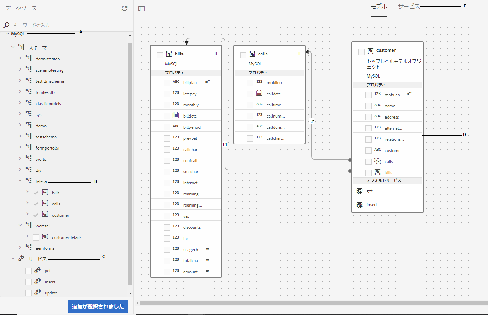

**A.** 設定済みのデータソース **B.** データソーススキーマ **C.** 利用可能なサービス **D.** データモデルオブジェクト **E.** 設定済みサービス

## 前提条件 {#prerequisites}

作業を開始する前に、以下の条件が満たされているかどうかを確認してください。

* 「[データベースを設定する](#step-set-up-the-database)」セクションの記載に従って MySQL データベースにサンプルデータが取り込まれていること
* MySQL JDBC ドライバー用の OSGi バンドル ( [JDBC データベースドライバのバンドル](https://helpx.adobe.com/experience-manager/6-3/sites-developing/jdbc.html#bundling-the-jdbc-database-driver)

## 手順 1：データベースの設定 {#step-set-up-the-database}

インタラクティブ通信の作成にはデータベースが不可欠です。このチュートリアルではデータベースを使用して、インタラクティブ通信のフォームデータモデルと永続性機能を表示します。顧客テーブル、請求テーブルおよび通話テーブルを含むデータベースを設定します。\
以下の画像は、顧客テーブルのサンプルデータを示しています。


次の DDL 文を使用して、 **顧客** テーブルをデータベースに追加します。

```sql
CREATE TABLE `customer` (
   `mobilenum` int(11) NOT NULL,
   `name` varchar(45) NOT NULL,
   `address` varchar(45) NOT NULL,
   `alternatemobilenumber` int(11) DEFAULT NULL,
   `relationshipnumber` int(11) DEFAULT NULL,
   `customerplan` varchar(45) DEFAULT NULL,
   PRIMARY KEY (`mobilenum`),
   UNIQUE KEY `mobilenum_UNIQUE` (`mobilenum`)
 ) ENGINE=InnoDB DEFAULT CHARSET=utf8
```

次の DDL 文を使用して、 **手形** テーブルをデータベースに追加します。

```sql
CREATE TABLE `bills` (
   `billplan` varchar(45) NOT NULL,
   `latepayment` decimal(4,2) NOT NULL,
   `monthlycharges` decimal(4,2) NOT NULL,
   `billdate` date NOT NULL,
   `billperiod` varchar(45) NOT NULL,
   `prevbal` decimal(4,2) NOT NULL,
   `callcharges` decimal(4,2) NOT NULL,
   `confcallcharges` decimal(4,2) NOT NULL,
   `smscharges` decimal(4,2) NOT NULL,
   `internetcharges` decimal(4,2) NOT NULL,
   `roamingnational` decimal(4,2) NOT NULL,
   `roamingintnl` decimal(4,2) NOT NULL,
   `vas` decimal(4,2) NOT NULL,
   `discounts` decimal(4,2) NOT NULL,
   `tax` decimal(4,2) NOT NULL,
   PRIMARY KEY (`billplan`)
 ) ENGINE=InnoDB DEFAULT CHARSET=utf8
```

次の DDL 文を使用して、 **呼び出し** テーブルをデータベースに追加します。

```sql
CREATE TABLE `calls` (
   `mobilenum` int(11) DEFAULT NULL,
   `calldate` date DEFAULT NULL,
   `calltime` varchar(45) DEFAULT NULL,
   `callnumber` int(11) DEFAULT NULL,
   `callduration` varchar(45) DEFAULT NULL,
   `callcharges` decimal(4,2) DEFAULT NULL,
   `calltype` varchar(45) DEFAULT NULL
 ) ENGINE=InnoDB DEFAULT CHARSET=utf8
```

この **呼び出し** テーブルには、通話日、通話時間、通話番号、通話時間、通話料金などの通話の詳細が含まれます。 この **顧客** テーブルは、「モバイル番号 (mobilenum) 」フィールドを使用して呼び出しテーブルにリンクされています。 次に示す各モバイル番号： **顧客** テーブル内に複数のレコードが存在する **呼び出し** 表。 例えば、 **1457892541** を参照してモバイル番号 **呼び出し** 表。

この **手形** 表には、請求日、請求期間、月額料金、通話料などの請求の詳細が含まれます。 この **顧客** テーブルが **手形** 「請求計画」フィールドを使用するテーブル の各顧客に関連するプランがあります **顧客** 表。 この **手形** 表には、既存のすべてのプランの価格設定の詳細が含まれます。 例えば、**Sarah** のプランの詳細を顧客テーブルから取得し、この情報を使って請求テーブルから価格の詳細を取得することができます。********

## 手順 2：MySQL データベースをデータソースとして設定する {#step-configure-mysql-database-as-data-source}

各種のデータソースを設定して、フォームデータモデルを作成することができます。このチュートリアルでは、サンプルデータが取り込まれた MySQL データベースの設定を行います。サポートされている他のデータソースとその設定方法については、「[AEM Forms のデータ統合機能](data-integration.md)」を参照してください。

MySQL データベースを設定するには、以下の手順を実行します。

1. MySQL データベース用の JDBC ドライバーを OSGi バンドルとしてインストールします。

   1. AEM Forms のオーサーインスタンスに管理者としてログインし、AEM Web コンソールバンドルに移動します。デフォルトの URL は、[http://localhost:4502/system/console/bundles](http://localhost:4502/system/console/bundles) です。
   1. タップ **インストール/更新**. 「**Upload / Install Bundles**」ダイアログが表示されます。
   1. 「**Choose File**」をタップし、MySQL JDBC ドライバーの OSGi バンドルを探して選択します。選択 **バンドルを開始** および **パッケージを更新**&#x200B;をタップし、 **インストール** または **更新**. Oracle が提供する MySQL の JDBC ドライバーがアクティブになっていることを確認します。このドライバーは、既にインストールされています。

1. 以下の手順により、MySQL データベースをデータソースとして設定します。

   1. AEM Web コンソール（[http://localhost:4502/system/console/configMgr](http://localhost:4502/system/console/configMgr)）に移動します。
   1. 「**Apache Sling Connection Pooled DataSource**」という設定を探し、その設定をタップして編集モードで開きます。
   1. 設定ダイアログで、以下の詳細情報を指定します。

      * **Datasource name**：任意のデータソース名を指定します。例えば、次のように指定します。 **MySQL**.
      * **DataSource service property name**：データソース名を保管するサービスプロパティの名前を指定します。この名前は、データソースインスタンスを OSGi サービスとして登録する際に指定されます。例えば、「**datasource.name**」などを指定します。
      * **JDBC driver class**：JDBC ドライバーの Java クラス名を指定します。MySQL データベースの場合は、次を指定します。 **com.mysql.jdbc.Driver**.
      * **JDBC connection URI**：データベースの接続 URL を指定します。MySQL データベースがポート 3306 およびスキーマ teleca で実行されている場合、URL は次のようになります。 `jdbc:mysql://[server]:3306/teleca?autoReconnect=true&useUnicode=true&characterEncoding=utf-8`
      * **Username**：データベースのユーザー名を指定します。データベースとの接続を確立するには、JDBC ドライバーを有効にする必要があります。
      * **Password**：データベースのパスワードを指定します。データベースとの接続を確立するには、JDBC ドライバーを有効にする必要があります。
      * **借用でテスト：** を有効にします。 **借りてテスト** オプション。
      * **リターン時のテスト：** を有効にします。 **リターンテスト** オプション。
      * **Validation Query**：プールからの接続状態を確認するための SQL SELECT クエリを指定します。このクエリでは、1 行以上の行が返される必要があります。例： **&amp;ast；を選択顧客から**.
      * **Transaction Isolation**：このオプションの値を「**READ_COMMITTED**」に設定します。

   他のプロパティはデフォルトのままにします [値](https://tomcat.apache.org/tomcat-7.0-doc/jdbc-pool.html) とタップします。 **保存**.

   以下のような設定が作成されます。

   

## 手順 3：フォームデータモデルを作成する {#step-create-form-data-model}

AEM Formsは、 [フォームデータモードの作成](data-integration.md)設定済みのデータソースから。 1 つのフォームデータモデル内で複数のデータソースを使用することができます。本チュートリアルのユースケースでは、MySQL をデータソースとして使用します。

フォームデータモデルを作成するには、以下の手順を実行します。

1. AEM オーサーインスタンスで、**フォーム**／**データ統合**&#x200B;に移動します。
1. **作成**／**フォームデータモデル**&#x200B;の順にタップします。
1. フォームデータモデルを作成ウィザードで、 **名前** フォームデータモデルの 例： **FDM_Create_First_IC**. 「**次へ**」をタップします。
1. データソース選択画面に、すべての設定済みデータソースが一覧表示されます。選択 **MySQL** データソースとタップ **作成**.

   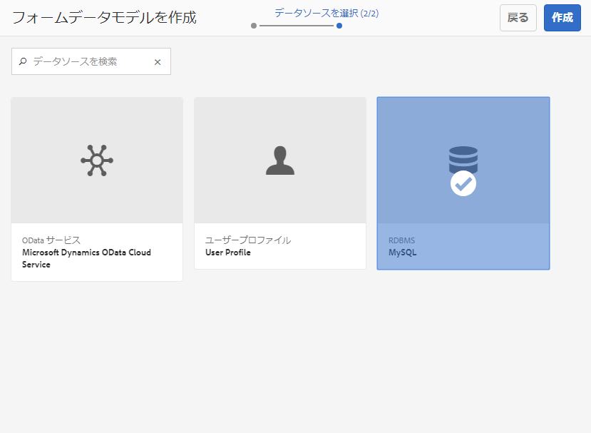

1. 「**完了**」をクリックします。この **FDM_Create_First_IC** フォームデータモデルが作成されます。

## 手順 4：フォームデータモデルを設定する {#step-configure-form-data-model}

フォームデータモデルの設定には以下が含まれます。

* [データモデルオブジェクトとサービスの追加](#add-data-model-objects-and-services)
* [データモデルオブジェクト用の計算済み子プロパティの作成](#create-computed-child-properties-for-data-model-object)
* [データモデルオブジェクト間の関連付けの追加](#add-associations-between-data-model-objects)
* [データモデルオブジェクトプロパティの編集](#edit-data-model-object-properties)
* [データモデルオブジェクト用サービスの設定](#configure-services)

### データモデルオブジェクトとサービスの追加 {#add-data-model-objects-and-services}

1. AEMオーサーインスタンスで、に移動します。 **Forms** > **データ統合**. デフォルトの URL は、[http://localhost:4502/aem/forms.html/content/dam/formsanddocuments-fdm](http://localhost:4502/aem/forms.html/content/dam/formsanddocuments-fdm) です。
1. この **FDM_Create_First_IC** 先ほど作成したフォームデータモデルがここに表示されます。 これを選択し、「**編集**」をタップします。

   選択したデータソース **MySQL** が **データソース** ウィンドウ

   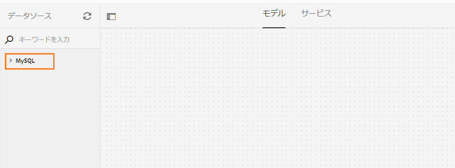

1. **MySQL** データソースツリーを展開します。次のデータモデルオブジェクトとサービスを選択します。 **teleca** schema:

   * **データモデルオブジェクト**:

      * 請求
      * 通話
      * 顧客
   * **Services:**

      * get
      * 更新

   「**選択項目を追加**」をタップして、選択したデータモデルオブジェクトとサービスをフォームデータモデルに追加します。

   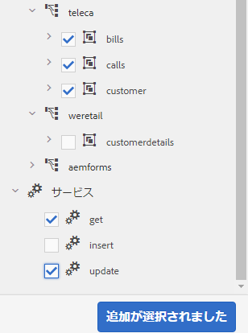

   請求、通話および顧客のデータモデルオブジェクトは、「**モデル**」タブの右側のペインに表示されます。get サービスと update サービスは、「**サービス**」タブに表示されます。

   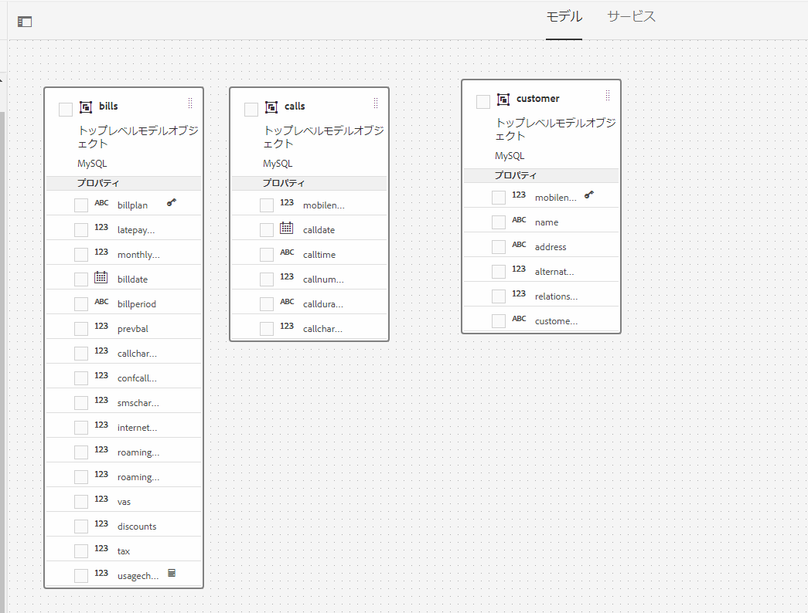

### データモデルオブジェクト用の計算済み子プロパティの作成 {#create-computed-child-properties-for-data-model-object}

計算済みプロパティとは、ルールまたは式に基づいて値が計算されるプロパティのことです。ルールを使用して、計算済みプロパティの値を、リテラル文字列、数値、数式の計算結果、フォームデータモデル内の別のプロパティの値に設定することができます。

ユースケースに基づき、以下の数式を使って&#x200B;**請求**&#x200B;データモデルオブジェクトの **usagecharges** 計算済み子プロパティを作成します。

* 使用料金=通話料+電話会議通話料+ SMS 料金+モバイルインターネット料金+ローミング国内+ローミング国際+ VAS （これらのプロパティはすべて請求データモデルオブジェクトに存在します）

   詳しくは、 **usagecharges** 子計算済みプロパティ：を参照してください。 [インタラクティブ通信の計画](/help/forms/using/planning-interactive-communications.md).

請求データモデルオブジェクト用の計算済み子プロパティを作成するには、次の手順を実行します。

1. の上部にあるチェックボックスをオンにします。 **手形** データモデルオブジェクトを選択してをタップします。 **子プロパティを作成**.
1. **子プロパティを作成**&#x200B;ペインで、

   1. 子プロパティの名前として **usagecharges** を入力します。
   1. 「**計算済み**」を有効にします。
   1. 選択 **浮動小数** をタイプとして使用し、 **完了** 子プロパティを **手形** データモデルオブジェクト。

   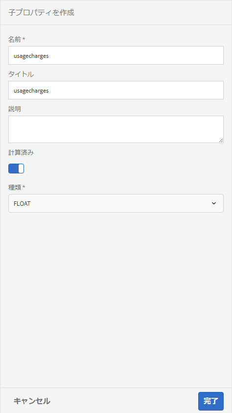

1. タップ **ルールを編集** をクリックして、ルールエディターを開きます。
1. 「**作成**」をタップします。この **値を設定** ルールウィンドウが開きます。
1. オプション選択ドロップダウンで、「**数式**」を選択します。

   

1. 数式で、 **料金** および **confallcharges** を、それぞれ第 1 および第 2 のオブジェクトとして。 演算子として「**プラス**」を選択します。数式内の領域をタップして「**拡張式**」をタップし、**smscharges**、**internetcharges**、**roamingnational**、**roamingintnl**、および **vas** を数式のオブジェクトに追加します。

   次の画像はルールエディター内の数式を示しています。

   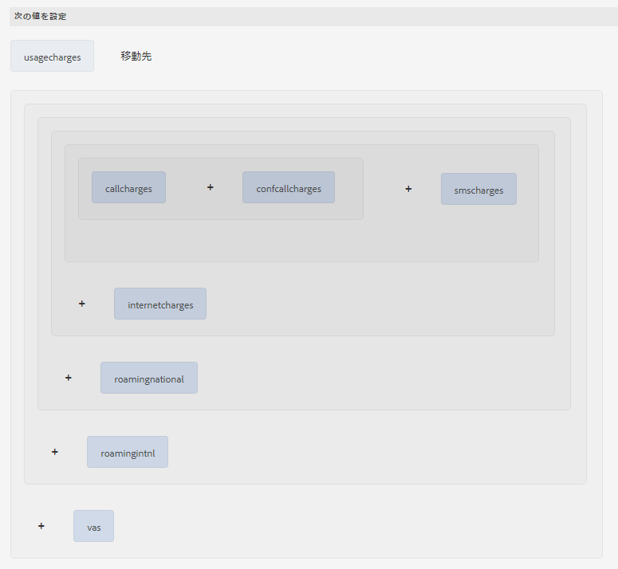

1. 「**完了**」をタップします。 ルールがルールエディターで作成されます。
1. タップ **閉じる** をクリックして、[ ルールエディタ ] ウィンドウを閉じます。

### データモデルオブジェクト間の関連付けの追加 {#add-associations-between-data-model-objects}

データモデルオブジェクトが定義されたら、オブジェクト間の関連付けを作成できます。この関連付けは、1 対 1 の場合もあれば、1 対多の場合もあります。例えば、1 人の従業員に対して複数の扶養家族を関連付けることができます。これを、1 対多の関連付けといいます。関連するデータモデルオブジェクトを接続するライン上では、「1:n」として表示されます。それに対して、特定の従業員 ID で一意の従業員名が返される場合などは、1 対 1 の関連付けになります。

データソース内の関連データモデルオブジェクトをフォームデータモデルに追加した場合、それらの関連付けは維持され、矢印の線で接続された状態で表示されます。

ユースケースに基づき、データモデルオブジェクト間で以下の関連付けを作成します。

| 関連付け | データモデルオブジェクト |
|---|---|
| 1:n | customer:calls（月々の請求書で、1 人の顧客と複数の通話を関連付けられます） |
| 1:1 | customer:bills（特定の月の請求書で、1 つの請求を 1 人の顧客と関連付けます） |

データモデルオブジェクト間で関連性を作成するには、以下の手順を実行します。

1. の上部にあるチェックボックスをオンにします。 **顧客** データモデルオブジェクトを選択してをタップします。 **関連付けを追加**. この **関連付けを追加** プロパティウィンドウが開きます。
1. **関連付けを追加**&#x200B;ペインで、以下の操作を実行します。

   * 関連付けのタイトルを入力します。これはオプションのフィールドです。
   * 「**タイプ**」ドロップダウンリストから「**1 対多**」を選択します。
   * 「**モデルオブジェクト**」ドロップダウンリストから **calls** を選択します。
   * 「**サービス**」ドロップダウンリストから **get** を選択します。
   * タップ **追加** リンク **顧客** データモデルオブジェクトを **呼び出し** プロパティを使用するデータモデルオブジェクト。 ユースケースに基づいて、通話データモデルオブジェクトは顧客データモデルオブジェクトの携帯電話番号プロパティにリンクされている必要があります。この **引数を追加** ダイアログボックスが開きます。

   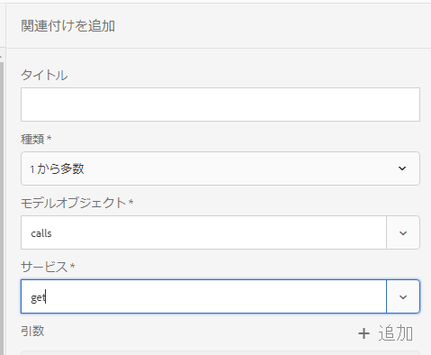

1. **引数を追加**&#x200B;ダイアログボックスで、

   * 「**名前**」ドロップダウンリストから「**mobilenum**」を選択します。携帯電話プロパティは、顧客および通話データモデルオブジェクトで利用できる共通プロパティです。その結果、プロパティは顧客と通話データモデルオブジェクト間の関連付けを作成するために使用されます。

      顧客データモデルオブジェクトに用意された各携帯電話番号ごとに、通話テーブルに複数の記録を参照できます。

   * 引数の任意のタイトルと説明を指定する。
   * 「**連結先**」ドロップダウンリストから「**customer**」を選択します。
   * 「**連結値**」ドロップダウンリストから「**mobilenum**」を選択します。
   * 「**追加**」をタップします。

   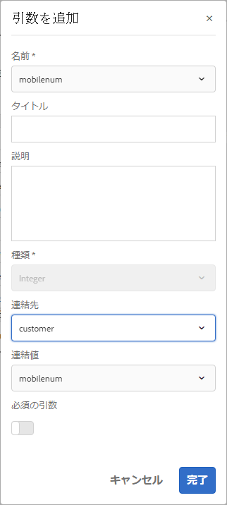

   mobilenum プロパティが&#x200B;**引数**&#x200B;セクションに表示されます。

   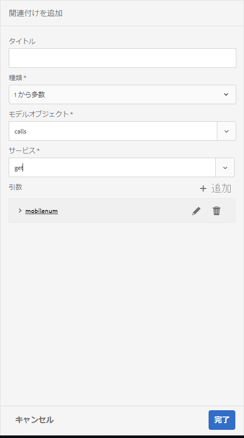

1. タップ **完了** ：顧客と呼び出しデータモデルオブジェクトの間に 1:n の関連付けを作成します。

   顧客および通話データモデルオブジェクト間で関連付けを作成したら、顧客と通話データモデルオブジェクト間で 1:1 の関連付けを作成します。

1. の上部にあるチェックボックスをオンにします。 **顧客** データモデルオブジェクトを選択してをタップします。 **関連付けを追加**. この **関連付けを追加** プロパティウィンドウが開きます。
1. **関連付けを追加**&#x200B;ペインで、以下の操作を実行します。

   * 関連付けのタイトルを入力します。これはオプションのフィールドです。
   * 選択 **1 対 1** から **タイプ** 」ドロップダウンリストから選択できます。
   * 選択 **手形** から **モデルオブジェクト** 」ドロップダウンリストから選択できます。
   * 「**サービス**」ドロップダウンリストから **get** を選択します。この **billplan** プロパティ（請求テーブルの主キー）は、既に **引数** 」セクションに入力します。

      請求および顧客データモデルオブジェクトは、それぞれbillplan（請求）および customerplan（顧客）プロパティを使ってリンクされています。これらのプロパティ間で連結を作成し、MySQL データベースに含まれるあらゆる顧客の計画の詳細を取得します。

   * 「**連結先**」ドロップダウンリストから「**customer**」を選択します。
   * 「**連結値**」ドロップダウンリストから「**customerplan**」を選択します。
   * タップ **完了** billplan プロパティと customerplan プロパティの間に連結を作成する場合。

   

   以下の画像は、データモデルオブジェクト間の関連付けと、関連付けの作成に使用されているプロパティを示します。

   

### データモデルオブジェクトプロパティの編集 {#edit-data-model-object-properties}

顧客とほかのデータモデルオブジェクト間で関連付けを作成後、顧客プロパティを編集し、データモデルオブジェクトから取得されたデータに基づいてプロパティを定義します。ユースケースに基づいて、携帯電話番号は顧客データモデルオブジェクトからデータを取得するためのプロパティとして使用されます。

1. の上部にあるチェックボックスをオンにします。 **顧客** データモデルオブジェクトを選択してをタップします。 **プロパティを編集**. **プロパティを編集**&#x200B;ペインが開きます。
1. **顧客**&#x200B;を&#x200B;**トップレベルモデルオブジェクト**&#x200B;として指定します。
1. 「**読み取りサービス**」ドロップダウンで「**get**」を選択します。
1. **引数**&#x200B;セクションで、

   * 「**連結先**」ドロップダウンリストから「**属性を要求**」を選択します。
   * **mobilenum** を連結値として指定します。

1. **書き込み**&#x200B;サービスのドロップダウンリストから「**更新**」を選択します。
1. **引数**&#x200B;セクションで、

   * **mobilenum** プロパティとして、「**連結先**」ドロップダウンリストから「**顧客**」を選択します。
   * 「**連結値**」ドロップダウンリストから「**mobilenum**」を選択します。

1. タップ **完了** をクリックしてプロパティを保存します。

   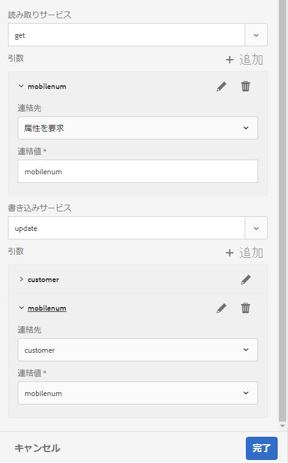

1. の上部にあるチェックボックスをオンにします。 **呼び出し** データモデルオブジェクトを選択してをタップします。 **プロパティを編集**. **プロパティを編集**&#x200B;ペインが開きます。
1. **トップレベルモデルオブジェクト**&#x200B;を、**通話**&#x200B;データモデルオブジェクトに対して無効にします。
1. 「**完了**」をタップします。

   手順 8～10 を繰り返し、**請求**&#x200B;データモデルオブジェクトのプロパティを設定します。

### サービスの設定 {#configure-services}

1. 「**サービス**」タブに移動します。
1. を選択します。 **get** サービスとタップ **プロパティを編集**. **プロパティを編集**&#x200B;ペインが開きます。
1. **プロパティを編集**&#x200B;ペインで、

   * 任意のタイトルと説明を入力します。
   * 「**出力モデルオブジェクト**」ドロップダウンリストから「**顧客**」を選択します。
   * タップ **完了** をクリックしてプロパティを保存します。

   

1. を選択します。 **更新** サービスとタップ **プロパティを編集**. **プロパティを編集**&#x200B;ペインが開きます。
1. **プロパティを編集**&#x200B;ペインで、

   * 任意のタイトルと説明を入力します。
   * 選択 **顧客** から **モデルオブジェクトを入力** 」ドロップダウンリストから選択できます。
   * 「**完了**」をタップします。
   * 「**保存**」をタップして、フォームデータモデルを保存します。

   

## 手順 5：フォームデータモデルとサービスのテストを実行する {#step-test-form-data-model-and-services}

データモデルオブジェクトとサービスをテストして、フォームデータモデルが正しく設定されていることを確認できます。

テストを実行するには、以下の手順を実行します。

1. 次に移動： **モデル** タブで、 **顧客** データモデルオブジェクトを選択し、をタップします。 **モデルオブジェクトのテスト**.
1. 内 **フォームデータモデルをテスト** ウィンドウ：選択 **モデルオブジェクトを読み取り** から **モデル/サービスを選択** 」ドロップダウンリストから選択できます。
1. 内 **入力** セクションで、 **mobilenum** 設定済みの MySQL データベースに存在するプロパティをタップし、 **テスト**.

   以下に示すように、指定した mobilenum プロパティに関連付けられた顧客の詳細が取得され、「出力」セクションに表示されます。 ダイアログボックスを閉じます。

   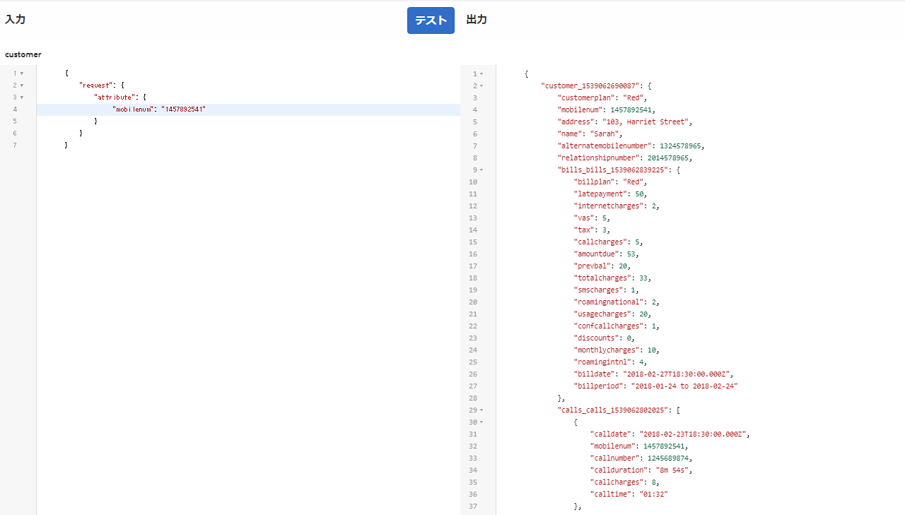

1. 「**サービス**」タブに移動します。
1. を選択します。 **get** サービスとタップ **テストサービス。**
1. 内 **入力** セクションで、 **mobilenum** 設定済みの MySQL データベースに存在するプロパティをタップし、 **テスト**.

   以下に示すように、指定した mobilenum プロパティに関連付けられた顧客の詳細が取得され、「出力」セクションに表示されます。 ダイアログボックスを閉じます。

   

### サンプルデータの編集と保存 {#edit-and-save-sample-data}

フォームデータモデルエディターを使用して、計算済みプロパティを含むすべてのデータモデルオブジェクトプロパティのサンプルデータを、フォームデータモデル内で生成することができます。各プロパティで設定されたデータタイプに基づいて、一連のランダムな値がサンプルデータとして生成されます。このサンプルデータを編集して保存することもできます。サンプルデータを再生成した場合も、編集したサンプルデータは保存されたままになります。

サンプルデータを生成、編集して保存するには、以下の手順を実行します。

1. フォームデータモデルページで、 **サンプルデータを編集**. サンプルデータが生成され、サンプルデータ編集ウィンドウに表示されます。

   

1. 「**サンプルデータを編集**」ウィンドウでデータを編集して「**保存**」をタップします。ウィンドウを閉じます。
