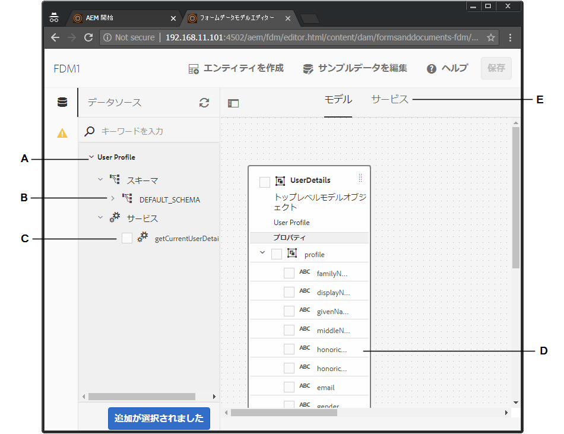
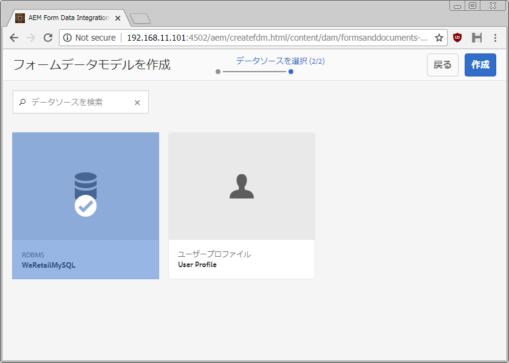
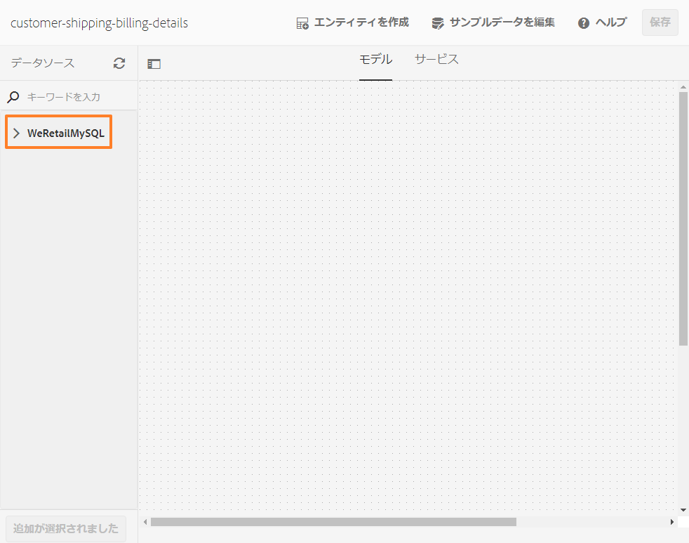
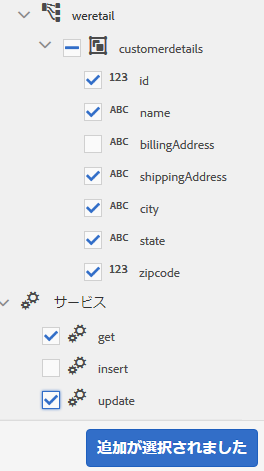
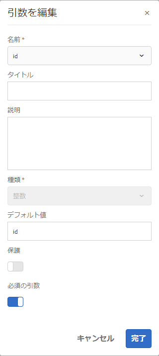
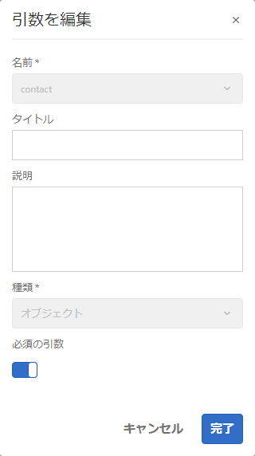
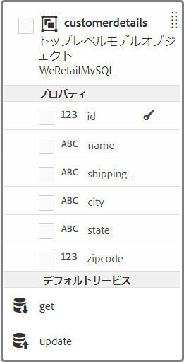
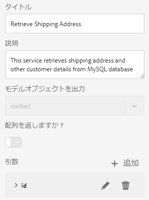

# チュートリアル：フォームデータモデルの作成  {#tutorial-create-form-data-model}

>[!CAUTION]
>
>AEM 6.4 の拡張サポートは終了し、このドキュメントは更新されなくなりました。 詳細は、 [技術サポート期間](https://helpx.adobe.com/jp/support/programs/eol-matrix.html). サポートされているバージョンを見つける [ここ](https://experienceleague.adobe.com/docs/?lang=ja).

このチュートリアルは、 [最初のアダプティブフォームを作成する](/help/forms/using/create-your-first-adaptive-form.md) 系列。 チュートリアルの使用例を理解、実行、デモするために、時系列に従うことをお勧めします。

## このチュートリアルについて {#about-the-tutorial}

AEM Forms のデータ統合モジュールにより、AEM ユーザープロファイル、RESTful Web サービス、SOAP ベースの Web サービス、OData サービス、リレーショナルデータベースなど、様々なバックエンドデータソースを使用してフォームデータモデルを作成することができます。フォームデータモデル内でデータモデルオブジェクトとサービスを設定し、アダプティブフォームに関連付けることができます。 アダプティブフォームのフィールドは、データモデルオブジェクトのプロパティに連結されます。 このサービスを使用すると、アダプティブフォームに事前に入力し、送信されたフォームデータをデータモデルオブジェクトに書き戻すことができます。

フォームデータの統合機能とフォームデータモデルについて詳しくは、「[AEM Forms のデータ統合機能](/help/forms/using/data-integration.md)」を参照してください。

このチュートリアルでは、フォームデータモデルを準備し、作成し、設定し、アダプティブフォームに関連付ける手順について説明します。 このチュートリアルを完了すると、次の操作を実行できるようになります。

* [MySQL データベースをデータソースとして設定する](#config-database)
* [MySQL データソースを使用して、フォームデータモデルを作成する](#create-fdm)
* [フォームデータモデルを設定する](#config-fdm)
* [フォームデータモデルのテストを行う](#test-fdm)

フォームデータモデルは、次のように表示されます。

**A.** 設定済みのデータソース **B.** データソーススキーマ **C.** 利用可能なサービス **D.** データモデルオブジェクト **E.** 設定済みサービス

## 前提条件 {#prerequisites}

開始する前に、次の点を確認してください。

* MySQL データベースに、「前提条件」の節に記載されているサンプルデータが含まれている [最初のアダプティブフォームを作成する](/help/forms/using/create-your-first-adaptive-form.md)
* [JDBC データベースドライバーのバンドル](/help/sites-developing/jdbc.md#bundling-the-jdbc-database-driver)の説明に従って、MySQL JDBC ドライバー用の OSGi バンドルが設定されていること
* 最初のチュートリアル「[アダプティブフォームの作成](/help/forms/using/create-adaptive-form.md)」の説明に従って、アダプティブフォームが設定されていること

## 手順 1:MySQL データベースをデータソースとして設定する {#config-database}

様々なタイプのデータソースを設定して、フォームデータモデルを作成できます。 このチュートリアルでは、サンプルデータを設定して入力した MySQL データベースを設定します。 その他のサポート対象データソースとその設定方法について詳しくは、 [AEM Forms Data Integration](/help/forms/using/data-integration.md).

MySQL データベースを設定するには、以下の手順を実行します。

1. 以下の手順により、MySQL データベース用の JDBC ドライバーを OSGi バンドルとしてインストールします。

   1. AEM Forms のオーサーインスタンスに管理者としてログインし、AEM Web コンソールバンドルに移動します。デフォルトの URL は [http://localhost:4502/system/console/bundles](http://localhost:4502/system/console/bundles).

   1. **Install/Update** をタップします。「**Upload / Install Bundles**」ダイアログが表示されます。

   1. 「**Choose File**」をタップし、MySQL JDBC ドライバーの OSGi バンドルを探して選択します。「**バンドルを開始**」と「**パッケージを更新**」を選択して「**インストールまたはアップデート**」をタップします。Corporation の MySQL 用 JDBCOracleがアクティブであることを確認します。 ドライバーがインストールされます。

1. MySQL データベースをデータソースとして設定する：

   1. AEM Web コンソール ( ) に移動します。 [http://localhost:4502/system/console/configMgr](http://localhost:4502/system/console/configMgr).
   1. 「**Apache Sling Connection Pooled DataSource**」という設定を探し、その設定をタップして編集モードで開きます。
   1. 設定ダイアログで、次の詳細を指定します。

      * **データソース名：** 任意の名前を指定できます。 例えば、「**WeRetailMySQL**」などを指定します。
      * **DataSource サービスのプロパティ名**:DataSource 名を含むサービスプロパティの名前を指定します。 データソースインスタンスを OSGi サービスとして登録する際に指定されます。 例： **datasource.name**.
      * **JDBC ドライバークラス**:JDBC ドライバーの Java クラス名を指定します。 MySQL データベースの場合は、**com.mysql.jdbc.Driver** と指定します。
      * **JDBC connection URI**：データベースの接続 URL を指定します。ポート 3306 およびスキーマ weretail で実行される MySQL データベースの場合、URL は次のようになります。 `jdbc:mysql://[server]:3306/weretail?autoReconnect=true&useUnicode=true&characterEncoding=utf-8`
      * **Username**：データベースのユーザー名を指定します。データベースとの接続を確立するには、JDBC ドライバーを有効にする必要があります。
      * **Password**：データベースのパスワードを指定します。データベースとの接続を確立するには、JDBC ドライバーを有効にする必要があります。
      * **Test on Borrow：** は **Test on Borrow** オプションを有効にします。
      * **Test on Return：** は **Test on Return** オプションを有効にします。
      * **検証クエリ：** プールからの接続を検証する SQL SELECT クエリを指定します。 クエリは、少なくとも 1 つの行を返す必要があります。 例： **&amp;ast；を選択顧客の詳細から**.
      * **Transaction Isolation**：このオプションの値を「**READ_COMMITTED**」に設定します。

      上記以外のプロパティはデフォルト[値](https://tomcat.apache.org/tomcat-7.0-doc/jdbc-pool.html)のままにして **Save** をタップします。
   以下のような設定が作成されます。

   

## 手順 2：フォームデータモデルを作成する {#create-fdm}

AEM Formsは、 [フォームデータモデルを作成する](data-integration.md) 設定済みのデータソースから。 1 つのフォームデータモデル内で複数のデータソースを使用することができます。このユースケースでは、設定済みの MySQL データソースを使用します。

フォームデータモデルを作成するには、以下の手順を実行します。

1. AEMオーサーインスタンスで、に移動します。 **Forms** >  **データ統合** s.
1. **作成**／**フォームデータモデル**&#x200B;の順にタップします。
1. フォームデータモデル作成ダイアログで、フォームデータモデルの&#x200B;**名前**&#x200B;を指定します。例えば、**customer-shipping-billing-details** などを指定します。「**次へ**」をタップします。
1. データソース選択画面に、すべての設定済みデータソースが一覧表示されます。「**WeRetailMySQL**」データソースを選択して「**作成**」をタップします。

   

**customer-shipping-billing-details** というフォームデータモデルが作成されます。

## 手順 3:フォームデータモデルを設定する {#config-fdm}

フォームデータモデルを設定するには、次の操作を行います。

* データモデルオブジェクトとサービスを追加する
* データモデルオブジェクトの読み取りサービスと書き込みサービスの設定

フォームデータモデルを設定するには、以下の手順を実行します。

1. AEM オーサーインスタンスで、**フォーム／データ統合**&#x200B;に移動します。デフォルトの URL は [http://localhost:4502/aem/forms.html/content/dam/formsanddocuments-fdm](http://localhost:4502/aem/forms.html/content/dam/formsanddocuments-fdm).
1. 前の手順で作成した **customer-shipping-billing-details** というフォームデータモデルが表示されます。編集モードで開きます。

   選択したデータソース **WeRetailMySQL** がフォームデータモデル内に設定されている。

   

1. データソースツリーで WeRailMySQL データソースを展開します。**weretail**／**customerdetails** スキーマで、以下のデータモデルオブジェクトをフォームデータモデルに対して選択します。

   * **データモデルオブジェクト**：

      * id
      * name
      * shippingAddress
      * 市区町村
      * ステート
      * 郵便番号
   * **サービス:**

      * get
      * 更新

   タップ **選択項目を追加** 選択したデータモデルオブジェクトとサービスをフォームデータモデルに追加する場合。

   

   >[!NOTE]
   >
   >JDBC データソースのデフォルトの get サービス、update サービス、insert サービスは、フォームデータモデルでそのまま使用することができます。

1. データモデルオブジェクトの読み取りサービスと書き込みサービスを設定します。

   1. を選択します。 **customerdetails** データモデルオブジェクトをタップします。 **プロパティを編集**.
   1. 「読み取りサービス」ドロップダウンで「**get**」を選択します。customerdetails データモデルオブジェクトのプライマリキーである **id** 引数が自動的に追加されます。タグ  をタップして 、次のように引数を設定します。

      

   1. 同様に、 **更新** を書き込みサービスとして使用する。 この **customerdetails** オブジェクトが引数として自動的に追加されます。 引数は次のように設定します。

      

      **id** 引数を追加して以下のように設定します。

      

   1. 「**完了**」をタップして、データモデルオブジェクトのプロパティを保存します。  次に「**保存**」をタップして、フォームデータモデルを保存します。

      **get** サービスと **update** サービスが、データモデルオブジェクトのデフォルトのサービスとして追加されます。

      

1. 「**サービス**」タブに移動し、**get** サービスと **update** サービスを設定します。

   1. **get** サービスを選択して「**プロパティの編集**」をタップします。プロパティダイアログが開きます。
   1. プロパティを編集ダイアログで、以下のプロパティを指定します。

      * **タイトル**:サービスのタイトルを指定します。 例：配送先住所を取得します。
      * **説明**:サービスの詳細な機能を含む説明を指定します。 次に例を示します。

         このサービスは、MySQL データベースから配送先住所とその他の顧客の詳細を取得します

      * **出力モデルオブジェクト**：顧客データを保管するスキーマを選択します。次に例を示します。

         customerdetail スキーマ
      * **配列を返す**:を無効にします。 **配列を返す** オプション。
      * **引数**:次の名前の引数を選択 **ID**.

      「**完了**」をタップします。これで、顧客の詳細情報を MySQL データベースから取得するサービスが設定されました。

      

   1. **update** サービスを選択して「**プロパティの編集**」をタップします。プロパティダイアログが開きます。

   1. プロパティを編集ダイアログで、以下のプロパティを指定します。

      * **タイトル**:サービスのタイトルを指定します。 例えば、「配送先住所を更新」などです。

      * **説明**:サービスの詳細な機能を含む説明を指定します。 次に例を示します。

         このサービスは、配送先住所とそれに関連するフィールドを MySQL データベース内で更新します

      * **入力モデルオブジェクト**：顧客データを保管するスキーマを選択します。次に例を示します。

         customerdetail スキーマ

      * **出力タイプ**：「**ブール演算式**」を選択します。
      * **引数**：**ID** という引数と **customerdetails** という引数を選択します。

      「**完了**」をタップします。この **更新** MySQL データベースの顧客の詳細を更新するサービスが設定されました。

      

フォームデータモデル内のデータモデルオブジェクトとサービスが設定されています。 これで、フォームデータモデルをテストできます。

## 手順 4:フォームデータモデルをテストする {#test-fdm}

データモデルオブジェクトとサービスをテストすることにより、フォームデータモデルが正しく設定されているかどうかを確認することができます。

テストを実行するには、以下の手順を実行します。

1. 次に移動： **モデル** タブで、 **customerdetails** データモデルオブジェクトを選択し、をタップします。 **モデルオブジェクトのテスト**.
1. **モデル／サービスのテスト**&#x200B;ウィンドウの「**モデル／サービスを選択**」ドロップダウンで「**モデルオブジェクトを読み込み**」を選択します。
1. 内 **customerdetails** セクションで、 **id** 引数が設定済みの MySQL データベースに存在し、をタップします。 **テスト**.

   指定した id 引数に関連付けられている顧客の詳細情報がデータベースから取得され、以下のように **Output** セクションに表示されます。

   

1. 同様に、書き込みモデルのオブジェクトとサービスをテストできます。

   次の例では、更新サービスは、データベース内の ID 7102715のアドレスの詳細を正常に更新します。

   

   この状態で、7102715 という ID に対して読み取りモデルサービスのテストをもう一度実行すると、以下のように、更新後の顧客の詳細情報が画面に表示されます。

   
