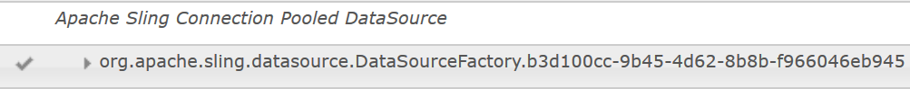

# チュートリアル：フォームデータモデルの作成  {#tutorial-create-form-data-model}

これは、「[最初のアダプティブフォームを作成する](/help/forms/using/create-your-first-adaptive-form.md)」シリーズを構成するチュートリアルです。チュートリアル内のユースケースを理解して実際に操作できるように、このシリーズのチュートリアルを最初から順に学習することをお勧めします。

## このチュートリアルについて {#about-the-tutorial}

AEM Formsデータ統合モジュールを使用すると、AEMユーザープロファイル、RESTful Web サービス、SOAP ベースの Web サービス、OData サービス、リレーショナルデータベースなど、様々なバックエンドデータソースからフォームデータモデルを作成できます。 フォームデータモデル内でデータモデルオブジェクトとサービスを設定し、そのフォームデータモデルをアダプティブフォームに関連付けることができます。アダプティブフォームのフィールドは、データモデルオブジェクトのプロパティに連結されます。フォームデータモデル内のサービスを使用して、アダプティブフォームに事前にデータを取り込み、送信されたフォームデータをデータモデルオブジェクトに書き込むことができます。

フォームデータの統合機能とフォームデータモデルについて詳しくは、「[AEM Forms のデータ統合機能](/help/forms/using/data-integration.md)」を参照してください。

このチュートリアルでは、フォームデータモデルの準備、作成、設定を行い、そのフォームデータモデルをアダプティブフォームに関連付けるための手順について、順を追って説明します。このチュートリアルを完了すると、次の操作を実行できるようになります。

* [MySQL データベースをデータソースとして設定する](#config-database)
* [MySQL データベースを使用してフォームデータモデルを作成する](#create-fdm)
* [フォームデータモデルを設定する](#config-fdm)
* [フォームデータモデルのテストを行う](#test-fdm)

フォームデータモデルは、以下のように表示されます。

**A.** 設定済みのデータソース **B.** データソーススキーマ **C.** 利用可能なサービス **D.** データモデルオブジェクト **E.** 設定済みサービス

## 前提条件 {#prerequisites}

作業を開始する前に、以下の条件が満たされているかどうかを確認してください。

* 「[最初のアダプティブフォームを作成する](/help/forms/using/create-your-first-adaptive-form.md)」の「前提条件」セクションの記載に従って、MySQL データベースにサンプルデータが取り込まれていること
* MySQL JDBC ドライバー用の OSGi バンドル ( [JDBC データベースドライバのバンドル](/help/sites-developing/jdbc.md#bundling-the-jdbc-database-driver)
* 最初のチュートリアルで説明されているアダプティブフォーム [アダプティブフォームの作成](/help/forms/using/create-adaptive-form.md)

## 手順 1：MySQL データベースをデータソースとして設定する {#config-database}

各種のデータソースを設定して、フォームデータモデルを作成することができます。このチュートリアルでは、サンプルデータが取り込まれた MySQL データベースの設定を行います。サポートされている他のデータソースとその設定方法については、「[AEM Forms のデータ統合機能](/help/forms/using/data-integration.md)」を参照してください。

MySQL データベースを設定するには、以下の手順を実行します。

1. MySQL データベース用の JDBC ドライバーを OSGi バンドルとしてインストールします。

   1. AEM Forms のオーサーインスタンスに管理者としてログインし、AEM Web コンソールバンドルに移動します。デフォルトの URL は、[http://localhost:4502/system/console/bundles](http://localhost:4502/system/console/bundles) です。

   1. タップ **インストール/更新**. 「**Upload / Install Bundles**」ダイアログが表示されます。

   1. 「**Choose File**」をタップし、MySQL JDBC ドライバーの OSGi バンドルを探して選択します。選択 **バンドルを開始** および **パッケージを更新**&#x200B;をタップし、 **インストールまたは更新**. Oracle が提供する MySQL の JDBC ドライバーがアクティブになっていることを確認します。このドライバーは、既にインストールされています。

1. 以下の手順により、MySQL データベースをデータソースとして設定します。

   1. AEM Web コンソール（[http://localhost:4502/system/console/configMgr](http://localhost:4502/system/console/configMgr)）に移動します。
   1. 「**Apache Sling Connection Pooled DataSource**」という設定を探し、その設定をタップして編集モードで開きます。
   1. 設定ダイアログで、以下の詳細情報を指定します。

      * **Datasource name**：任意のデータソース名を指定します。例えば、次のように指定します。 **WeRetailMySQL**.
      * **DataSource service property name**：データソース名を保管するサービスプロパティの名前を指定します。この名前は、データソースインスタンスを OSGi サービスとして登録する際に指定されます。例えば、「**datasource.name**」などを指定します。
      * **JDBC driver class**：JDBC ドライバーの Java クラス名を指定します。MySQL データベースの場合は、次を指定します。 **com.mysql.jdbc.Driver**.
      * **JDBC connection URI**：データベースの接続 URL を指定します。ポート 3306 およびスキーマ weretail で実行される MySQL データベースの場合、URL は次のようになります。 `jdbc:mysql://[server]:3306/weretail?autoReconnect=true&useUnicode=true&characterEncoding=utf-8`
      * **Username**：データベースのユーザー名を指定します。データベースとの接続を確立するには、JDBC ドライバーを有効にする必要があります。
      * **Password**：データベースのパスワードを指定します。データベースとの接続を確立するには、JDBC ドライバーを有効にする必要があります。
      * **借用でテスト：** を有効にします。 **借りてテスト** オプション。
      * **リターン時のテスト：** を有効にします。 **リターンテスト** オプション。
      * **Validation Query**：プールからの接続状態を確認するための SQL SELECT クエリを指定します。このクエリでは、1 行以上の行が返される必要があります。例： **&amp;ast；を選択顧客の詳細から**.
      * **Transaction Isolation**：このオプションの値を「**READ_COMMITTED**」に設定します。

      他のプロパティはデフォルトのままにします [値](https://tomcat.apache.org/tomcat-7.0-doc/jdbc-pool.html) とタップします。 **保存**.
   以下のような設定が作成されます。

   

## 手順 2：フォームデータモデルを作成する {#create-fdm}

AEM Formsは、 [フォームデータモデルを作成する](data-integration.md) 設定済みのデータソースから。 1 つのフォームデータモデル内で複数のデータソースを使用することができます。このユースケースでは、既に設定されている MySQL データソースを使用します。

フォームデータモデルを作成するには、以下の手順を実行します。

1. AEMオーサーインスタンスで、に移動します。 **Forms** >  **データ統合** s.
1. **作成**／**フォームデータモデル**&#x200B;の順にタップします。
1. フォームデータモデル作成ダイアログで、フォームデータモデルの&#x200B;**名前**&#x200B;を指定します。例えば、「**customer-shipping-billing-details**」などを指定します。「**次へ**」をタップします。
1. データソース選択画面に、すべての設定済みデータソースが一覧表示されます。選択 **WeRetailMySQL** データソースとタップ **作成**.

   

この **customer-shipping-billing-details** フォームデータモデルが作成されます。

## 手順 3：フォームデータモデルを設定する {#config-fdm}

フォームデータモデルを設定するには、以下の操作を行う必要があります。

* データモデルオブジェクトとサービスの追加
* データモデルオブジェクト用の読み取りサービスと書き込みサービスを設定する

フォームデータモデルを設定するには、以下の手順を実行します。

1. AEM オーサーインスタンスで、**フォーム／データ統合**&#x200B;に移動します。デフォルトの URL は、[http://localhost:4502/aem/forms.html/content/dam/formsanddocuments-fdm](http://localhost:4502/aem/forms.html/content/dam/formsanddocuments-fdm) です。
1. この **customer-shipping-billing-details** 先ほど作成したフォームデータモデルがここに表示されます。 このフォームデータモデルを編集モードで開きます。

   前の手順で選択した **WeRetailMySQL** というデータソースが、フォームデータモデル内に設定されています。

   

1. データソースツリーで WeRailMySQL データソースを展開します。次のデータモデルオブジェクトとサービスを選択します。 **weretail** >  **customerdetails** スキーマからフォームデータモデル：

   * **データモデルオブジェクト**:

      * id
      * name
      * shippingAddress
      * 市区町村
      * state
      * zipcode
   * **Services:**

      * get
      * 更新

   「**選択項目を追加**」をタップして、選択したデータモデルオブジェクトとサービスをフォームデータモデルに追加します。

   

   >[!NOTE]
   >
   >JDBC データソースのデフォルトの get、update、insert サービスは、フォームデータモデルで標準で提供されています。

1. 以下の手順により、データモデルオブジェクトの読み取りサービスと書き込みサービスを設定します。

   1. 「**customerdetails**」データモデルオブジェクトを選択して「**プロパティの編集**」をタップします。
   1. 「読み取りサービス」ドロップダウンで「**get**」を選択します。この **id** 引数。customerdetails データモデルオブジェクトのプライマリキーです。 タップ  およびは、次のように引数を設定します。

      

   1. 同様に、書き込みサービスとして「**update**」を選択します。**customerdetails** オブジェクトが引数として自動的に追加されます。この引数を以下のように設定します。

      

      **id** 引数を追加して以下のように設定します。

      

   1. 「**完了**」をタップして、データモデルオブジェクトのプロパティを保存します。次に、 **保存** フォームデータモデルを保存します。

      **get** サービスと **update** サービスが、データモデルオブジェクトのデフォルトのサービスとして追加されます。

      

1. 「**サービス**」タブに移動し、**get** サービスと **update** サービスを設定します。

   1. を選択します。 **get** サービスとタップ **プロパティを編集**. プロパティダイアログが開きます。
   1. プロパティを編集ダイアログで、以下のプロパティを指定します。

      * **タイトル**：サービスのタイトルを指定します。例えば、「Retrieve Shipping Address」などを指定します。
      * **説明**：サービスの詳細な機能を示す説明を入力します。次に例を示します。

         このサービスは、MySQL データベースから配送先住所とその他の顧客の詳細を取得します

      * **出力モデルオブジェクト**：顧客データを保管するスキーマを選択します。次に例を示します。

         customerdetail スキーマ
      * **配列を返す**：「**配列を返す**」オプションを無効にします。
      * **引数**：**ID** という引数を選択します。

      「**完了**」をタップします。 これで、顧客の詳細情報を MySQL データベースから取得するサービスが設定されました。

      

   1. を選択します。 **更新** サービスとタップ **プロパティを編集**. プロパティダイアログが開きます。

   1. プロパティを編集ダイアログで、以下のプロパティを指定します。

      * **タイトル**：サービスのタイトルを指定します。例えば、「Update Shipping Address」などを指定します。

      * **説明**：サービスの詳細な機能を示す説明を入力します。次に例を示します。

         このサービスは、MySQL データベースの配送先住所と関連するフィールドを更新します

      * **入力モデルオブジェクト**：顧客データを保管するスキーマを選択します。次に例を示します。

         customerdetail スキーマ

      * **出力タイプ**：「**ブール演算式**」を選択します。
      * **引数**：**ID** という引数と **customerdetails** という引数を選択します。

      「**完了**」をタップします。 これで、MySQL データベース内の顧客の詳細情報を更新する **update** サービスが設定されました。

      

これで、フォームデータモデル内のデータモデルオブジェクトとサービスが設定されました。次に、フォームデータモデルのテストを実行します。

## 手順 4：フォームデータモデルのテストを実行する {#test-fdm}

データモデルオブジェクトとサービスをテストして、フォームデータモデルが正しく設定されていることを確認できます。

テストを実行するには、以下の手順を実行します。

1. 「**モデル**」タブに移動し、**customerdetails** データモデルオブジェクトを選択して「**モデルオブジェクトをテスト**」をタップします。
1. 「**モデル / サービスのテスト**」ウィンドウの「**モデル / サービスを選択**」ドロップダウンで「**モデルオブジェクトを読み込み**」を選択します。
1. 「**customerdetails**」セクションで、設定済み MySQL データベース内の **id** 引数を指定して「**テスト**」をタップします。

   指定した id 引数に関連付けられている顧客の詳細情報がデータベースから取得され、以下のように「**出力**」セクションに表示されます。

   

1. 同様の手順で、書き込みモデルオブジェクトと書き込みサービスをテストします。

   以下の例では、データベース内で 7102715 という ID が設定されている住所情報が、update サービスによって正しく更新されています。

   

   この状態で、7102715 という ID に対して読み取りモデルサービスのテストをもう一度実行すると、以下のように、更新後の顧客情報が画面に表示されます。

   
