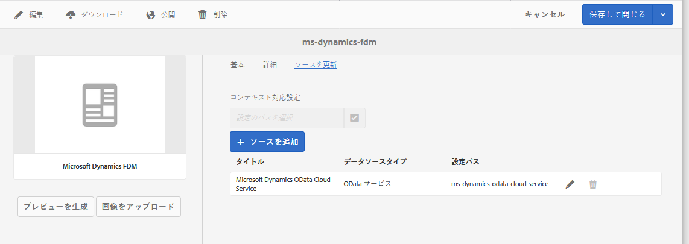

# フォームデータモデルの作成 {#create-form-data-model}

>[!CAUTION]
>
>AEM 6.4 の拡張サポートは終了し、このドキュメントは更新されなくなりました。 詳細は、 [技術サポート期間](https://helpx.adobe.com/jp/support/programs/eol-matrix.html). サポートされているバージョンを見つける [ここ](https://experienceleague.adobe.com/docs/?lang=ja).

ここでは、データソースを使用せずにフォームデータモデルを作成する方法と、既に設定されているデータソースを使用してフォームデータモデルを作成する方法について説明します。

AEM Forms データ統合は、フォームデータモデルを作成して操作するための直感的なユーザーインターフェイスを提供します。フォームデータモデルは、データの交換にデータソースに依存します。ただし、データソースの有無に関わらず、フォームデータモデルを作成することはできます。 フォームデータモデルを作成する方法には、以下の 2 つがあります。データソースが既に設定されているかどうかに応じて、いずれかの方法を選択してください。

* **事前に設定されたデータソースを使用する場合**：「[データソースの設定](/help/forms/using/configure-data-sources.md)」の説明に従ってデータソースが既に設定されている場合は、フォームデータモデルを作成する際に、それらのデータソースを選択できます。この方法の場合、選択したデータソースのすべてのデータモデルオブジェクト、プロパティ、サービスをフォームデータモデル内で使用することができます。

* **データソースなし**:フォームデータモデルのデータソースを設定していない場合でも、データソースを持たずにフォームデータモデルを作成することができます。 フォームデータモデルを使用して、アダプティブフォームやインタラクティブ通信を作成し、サンプルデータを使用してテストすることができます。 データソースが使用可能な場合、フォームデータモデルをデータソースと連結すると、関連付けられているアダプティブフォームとインタラクティブ通信に自動的に反映されます。

>[!NOTE]
>
>フォームデータモデルの作成と操作を行うには、**fdm-author** グループと **forms-user** グループのメンバーである必要があります。AEM管理者に連絡して、グループのメンバーになります。

## フォームデータモデルの作成 {#data-sources}

フォームデータモデル内で使用するデータソースが、[データソースの設定](/help/forms/using/configure-data-sources.md)の説明に従って設定されていることを確認してください。設定されているデータソースに基づいてフォームデータモデルを作成するには、以下の手順を実行します。

1. AEM オーサーインスタンスで、**[!UICONTROL フォーム／データ統合]**&#x200B;に移動します。
1. **[!UICONTROL 作成／フォームデータモデル]**&#x200B;の順にタップします。
1. フォームデータモデルを作成ダイアログで、以下の操作を行います。

   * フォームデータモデルの名前を指定します。
   * (**オプション**) フォームデータモデルのタイトル、説明、タグを指定します。
   * (**オプションで、データソースが設定されている場合にのみ適用できます**) **[!UICONTROL データソースの設定]** 「 」フィールドを選択し、使用するデータソース用のクラウドサービスが存在する設定ノードを選択します。 この操作により、選択した設定ノード内の有効なデータソースだけが、以下のページに選択可能なデータソースとして表示されます。ただし、デフォルトでは、JDBC データベースとAEMユーザープロファイルのデータソースが表示されます。 設定ノードを選択しない場合は、すべての設定ノードのデータソースが表示されます。

   「**[!UICONTROL 次へ]**」をタップします。

1. (**データソースが設定されている場合にのみ適用できます**) **[!UICONTROL データソースを選択]** 画面に、使用可能なデータソースがある場合は、そのデータソースが一覧表示されます。 フォームデータモデルで使用するデータソースを選択します。
1. 「**[!UICONTROL 作成]**」をタップし、確認ダイアログで「**[!UICONTROL 開く]**」をタップして、フォームデータモデルエディターを開きます。

ここで、フォームデータモデルエディターの UI の様々なコンポーネントを確認してみましょう。

**A. データソース** フォームデータモデルのデータソースをリストします。データソースを展開すると、データモデルオブジェクトとサービスが表示されます。

**B. データソース定義を更新** データソース定義内の変更内容が設定済みデータソースから取得され、フォームデータモデルエディターの「データソース」タブでその変更内容が反映されます。

**C. モデル** 追加されたデータモデルオブジェクトのコンテンツ領域が表示されます。

**D. サービス** 追加したデータソースの操作やサービスのコンテンツ領域が表示されます。

**E. ツールバー** フォームデータモデルを操作するためのツールです。選択したフォームデータモデルのオブジェクトに応じて、追加のオプションがツールバーに表示されます。

**F. 選択** 選択したデータモデルオブジェクトとサービスをフォームデータモデルに追加します。

フォームデータモデルエディターの詳細と、フォームデータモデルエディターを使用してフォームデータモデルの編集と設定を行う方法については、[フォームデータモデルの操作](/help/forms/using/work-with-form-data-model.md) を参照してください。

## データソースの更新 {#update}

既存のフォームデータモデルにデータソースを追加するには（または、既存のフォームデータモデルのデータソースを更新するには）、以下の手順を実行します。

1. **[!UICONTROL フォーム／データ統合]** に移動し、データソースを追加または更新するフォームデータモデルを選択して、**[!UICONTROL プロパティ]** をタップします。
1. フォームデータモデルのプロパティで、「**[!UICONTROL ソースを更新]**」タブに移動します。

   「ソースを更新」タブで、以下の操作を実行します。

   * 「**[!UICONTROL コンテキスト対応設定]**」フィールドで参照アイコンをタップし、追加するデータソースのクラウド設定が存在する設定ノードを選択します。ノードを選択しなかった場合、「**[!UICONTROL ソースを追加]**」をタップすると、`global` ノード内のクラウド設定だけが表示されます。
   * 新しいデータソースを追加する場合は、「**[!UICONTROL ソースを追加]**」をタップし、フォームデータモデルに追加するデータソースを選択します。`global` ノード内で設定されているデータソースと、選択した設定ノード内で構成されているデータソースが、すべて表示されます。
   * 既存のデータソースを、同じタイプの別のデータソースで置き換える場合は、置き換え前のデータソースの「**[!UICONTROL 編集]**」アイコンをタップし、有効なデータソースのリストで、置き換え後のデータソースを選択します。
   * 既存のデータソースを削除する場合は、目的のデータソースの「**[!UICONTROL 削除]**」アイコンをタップします。データソース内のデータモデルオブジェクトがフォームデータモデルに追加されている場合、「削除」アイコンは無効になります。

   

1. 「**[!UICONTROL 保存して閉じる]**」をタップして、変更内容を保存します。

>[!NOTE]
>
>フォームデータモデルで新しいデータソースを追加したり、既存のデータソースを更新したりしたら、更新後のフォームデータモデルを使用するアダプティブフォームおよびインタラクティブ通信で、必要に応じて連結参照を更新します。

## 次の手順 {#next-steps}

これで、データソースが追加されたフォームデータモデルが作成されました。 次に、フォームデータモデルを編集して、データモデルオブジェクトとサービスの追加と設定、データモデルオブジェクト間の関連付けの追加、プロパティの編集、カスタムデータモデルオブジェクトとプロパティの追加、サンプルデータの生成などを行います。

詳しくは、「[フォームデータモデルの操作](/help/forms/using/work-with-form-data-model.md)」を参照してください。
