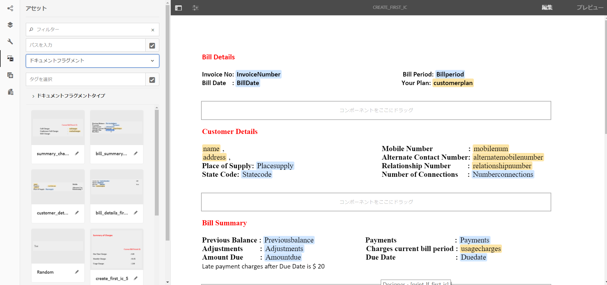
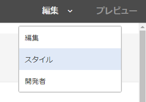
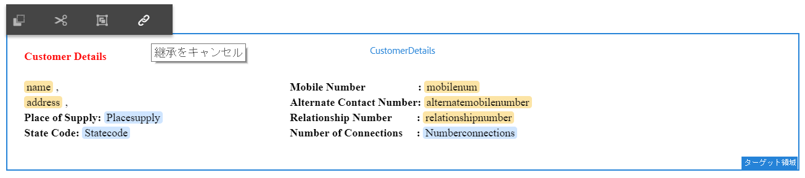

# チュートリアル：インタラクティブ通信の作成 {#tutorial-create-interactive-communication}

すべての構築ブロックを使ってインタラクティブ通信を作成する

このチュートリアルは、 [最初のインタラクティブ通信を作成する](/help/forms/using/create-your-first-interactive-communication.md) 系列。 チュートリアル内のユースケースを理解して実際に操作できるように、このシリーズのチュートリアルを最初から順に学習することをお勧めします。

フォームデータモデル、ドキュメントフラグメント、テンプレート、Web 版用のテーマなどのすべての構築ブロックの作成が終わったら、インタラクティブ通信の作成を開始できます。

インタラクティブ通信は、印刷チャネルと Web チャネルという 2 つのチャネルを使用して配信することができます。また、印刷チャネルをマスターとしてインタラクティブ通信を作成することも可能です。印刷チャネルを Web チャネルのマスターとして使用すると、Web チャネルに連結されたコンテンツ、継承設定、データが印刷チャネルから取得されます。また、印刷チャネルで加えられた変更が Web チャネルでも同期されるようにします。ただし、インタラクティブ通信の作成者は、Web チャネル内の特定のコンポーネントの継承設定を解除することができます。

本チュートリアルは、印刷版および Web 版のインタラクティブ通信の作成方法を順を追って説明します。このチュートリアルを完了すると、次の操作を実行できるようになります。

* 印刷チャネル用のインタラクティブ通信の作成
* Web チャネル用のインタラクティブ通信の作成
* 印刷をマスターとする印刷版および Web 版インタラクティブ通信の作成

## 同期なしでの印刷版および Web 版のインタラクティブ通信の作成 {#create-interactive-communications-for-print-and-web-with-no-synchronization}

### 印刷チャネル用のインタラクティブ通信の作成 {#create-interactive-communication-for-print-channel}

以下は、本チュートリアル内で既に作成済みで、印刷チャネル用のインタラクティブ通信を作成する際に必要になるリソース一覧です。

**印刷テンプレート：** [create_first_ic_print_template](/help/forms/using/create-templates-print-web.md)

**フォームデータモデル：** [FDM_Create_First_IC](create-form-data-model-tutorial.md)

**ドキュメントフラグメント：** [bill_details_first_ic, customer_details_first_ic, bill_summary_first_ic, summary_charges_first_ic](/help/forms/using/create-document-fragments.md)

**レイアウトフラグメント：** [table_lf](/help/forms/using/create-templates-print-web.md)

**画像：** PayNow および ValueAddedServices

1. AEM オーサーインスタンスにログインし、**[!UICONTROL Adobe Experience Manager]**／**[!UICONTROL フォーム]**／**[!UICONTROL フォームとドキュメント]**&#x200B;に移動します。
1. タップ **作成** を選択し、 **インタラクティブ通信**. この **インタラクティブ通信の作成** ウィザードが表示されます。
1. 「**タイトル**」と「**名前**」フィールドに **create_first_ic** と入力します。選択 **FDM_Create_First_IC** をフォームデータモデルとしてタップし、 **次へ**.
1. 内 **チャネル** ウィザード：

   1. 指定 **create_first_ic_print_template** 印刷テンプレートとしてをタップし、 **選択**. 次を確認します。 **印刷を Web チャネルのマスターとして使用** チェックボックスが選択されていません。
   1. 指定 **Create_First_IC_templates** フォルダー > **Create_First_IC_Web_Template** を Web テンプレートとしてタップし、 **選択**.
   1. 「**作成**」をタップします。

   インタラクティブ通信が正常に作成されたことを通知する確認メッセージが表示されます。

1. 「**編集**」をタップし、右側のペインでインタラクティブ通信を開きます。
1. 次に移動： **Assets** 」タブをクリックし、フィルターを適用して、ドキュメントフラグメントのみを左側のウィンドウに表示します。
1. 以下のドキュメントフラグメントをインタラクティブ通信のターゲット領域にドラッグアンドドロップします。

   | ドキュメントフラグメント | ターゲット領域 |
   |---|---|
   | bill_details_first_ic | BillDetails |
   | customer_details_first_ic | CustomerDetails |
   | bill_summary_first_ic | BillSummary |
   | summary_charges_first_interactive_communication | 料金 |

   

1. タップ **グラフ** ターゲット領域を選択し、をタップします。 **+** 追加する **グラフ** コンポーネント。
1. グラフコンポーネントをタップし、「 」を選択します。  （設定）を参照してください。 グラフのプロパティが左側のペインに表示されます：

   1. グラフ名を指定します。
   1. 「**グラフのタイプ**」ドロップダウンリストから「**円グラフ**」を選択します。
   1. **X 軸**&#x200B;セクションの&#x200B;**通話**&#x200B;データモデルオブジェクトタイプから **Calltype** プロパティを選択します。タップ .
   1. 「**関数**」ドロップダウンリストから&#x200B;**頻度**&#x200B;を選択します。
   1. を選択します。 **calltype** プロパティを **呼び出し** のデータモデルオブジェクトタイプ **Y 軸** 」セクションに入力します。 タップ .
   1. タップ  をクリックして、グラフのプロパティを保存します。

1. 次に移動： **Assets** 」タブをクリックし、フィルターを適用して、レイアウトフラグメントのみを左側のウィンドウに表示します。 **table_lf** レイアウトフラグメントを&#x200B;**通話明細**&#x200B;のターゲット領域にドラッグアンドドロップします。
1. 「 **日付** 列とタップ  （設定）を参照してください。
1. 「**連結タイプ**」ドロップダウンリストから「**データモデルオブジェクト**」を選択し、**calls**／**calldate** の順に選択します。タップ  プロパティを保存する場合に 2 回実行します。

   同様に、**時刻**、**番号**、**時間**、および&#x200B;**料金**&#x200B;のテキストフィールドについて、それぞれ&#x200B;**calltime**、**callnumber**、**callduration**、および **callcharges** との連結を作成します。

1. タップ **PayNow** ターゲット領域を選択し、をタップします。 **+** 追加する **画像** コンポーネント。
1. 画像コンポーネントをタップし、「 」を選択します。  （設定）を参照してください。 画像のプロパティが左側のペインに表示されます：

   1. 「**名前**」フィールドで、**PayNow** を画像の名前として指定します。
   1. 「**アップロード**」をタップし、ローカルのファイルシステムに保存された画像を選択して「**開く**」をタップします。
   1. タップ  をクリックして、画像のプロパティを保存します。

1. 手順 13 と 14 を繰り返して、 **ValueAddedServices** 画像を **ValueAddedServices** ターゲット領域。

### Web チャネル用インタラクティブ通信の作成 {#create-interactive-communication-for-web-channel}

以下は、本チュートリアル内で既に作成済みで、Web チャネル用のインタラクティブ通信を作成する際に必要になるリソース一覧です。

**Web テンプレート：** [Create_First_IC_Web_Template](/help/forms/using/create-templates-print-web.md)

**フォームデータモデル：** [FDM_Create_First_IC](create-form-data-model-tutorial.md)

**ドキュメントフラグメント：** [bill_details_first_ic, customer_details_first_ic, bill_summary_first_ic, summary_charges_first_ic](/help/forms/using/create-document-fragments.md)

**画像：** PayNowWeb および ValueAddedServicesWeb

1. AEM オーサーインスタンスにログインし、**[!UICONTROL Adobe Experience Manager]**／**[!UICONTROL フォーム]**／**[!UICONTROL フォームとドキュメント]**&#x200B;に移動します。
1. タップ **作成** を選択し、 **インタラクティブ通信**. この **インタラクティブ通信の作成** ウィザードが表示されます。
1. 「**タイトル**」と「**名前**」フィールドに **create_first_ic** と入力します。選択 **FDM_Create_First_IC** をフォームデータモデルとしてタップし、 **次へ**.
1. 内 **チャネル** ウィザード：

   1. 指定 **create_first_ic_print_template** 印刷テンプレートとしてをタップし、 **選択**. 次を確認します。 **印刷を Web チャネルのマスターとして使用** チェックボックスが選択されていません。
   1. 指定 **Create_First_IC_templates** フォルダー > **Create_First_IC_Web_Template** を Web テンプレートとしてタップし、 **選択**.
   1. 「**作成**」をタップします。

   インタラクティブ通信が正常に作成されたことを通知する確認メッセージが表示されます。

1. 「**編集**」をタップし、右側のペインでインタラクティブ通信を開きます。
1. 次をタップします。 **チャネル** 左側のウィンドウから「 」タブをクリックし、 **Web**.
1. 次に移動： **Assets** 」タブをクリックし、フィルターを適用して、ドキュメントフラグメントのみを左側のウィンドウに表示します。
1. 以下のドキュメントフラグメントをインタラクティブ通信のターゲット領域にドラッグアンドドロップします。

   | ドキュメントフラグメント | ターゲット領域 |
   |---|---|
   | bill_details_first_ic | BillDetails |
   | customer_details_first_ic | CustomerDetails |
   | bill_summary_first_ic | BillSummary |
   | summary_charges_first_interactive_communication | 料金 |

1. タップ **料金の概要** ターゲット領域を選択し、をタップします。 **+** 追加する **グラフ** コンポーネント。
1. グラフコンポーネントをタップし、「 」を選択します。  （設定）を参照してください。 グラフのプロパティが左側のペインに表示されます：

   1. グラフ名を指定します。
   1. 「**グラフのタイプ**」ドロップダウンリストから「**円グラフ**」を選択します。
   1. **X 軸**&#x200B;セクションの&#x200B;**通話**&#x200B;データモデルオブジェクトタイプから **Calltype** プロパティを選択します。タップ .
   1. 「**関数**」ドロップダウンリストから&#x200B;**頻度**&#x200B;を選択します。
   1. を選択します。 **calltype** プロパティを **呼び出し** のデータモデルオブジェクトタイプ **Y 軸** 」セクションに入力します。 タップ .
   1. タップ  をクリックして、グラフのプロパティを保存します。

1. 左側のペインから「**データソース**」タブを選択し、**通話** データモデルオブジェクトを&#x200B;**通話明細**&#x200B;のターゲット領域にドラッグアンドドロップします。すべてのプロパティ ( **呼び出し** データモデルオブジェクトは、テーブル列として **通話項目別** ターゲット領域を右側のウィンドウに表示します。

   ユースケースに基づいて、テーブルには、通話日、通話時刻、通話番号、通話時間、そして通話料金の列が必要です。

   

1. 選択 **Mobilenum** 表の列見出しと「 」を選択します。 **その他のオプション** > **列を削除**. 同様に、**Calltype** の列を削除します。
1. を選択します。 **Calldate** 表の列見出しとタップ  （編集）テキストの名前をに変更します。 **通話日**. 同様に、テーブル内の他の列見出しの名前を変更します。
1. ユースケースに基づき、「**Pay Now**」（今すぐ支払う）ボタンをインタラクティブ通信に挿入し、ユーザーがボタンをクリックして支払いを行えるようにします。ボタンを挿入するには、次の手順を実行します。

   1. タップ **今すぐ支払う** ターゲット領域を選択し、をタップします。 **+** 追加する **テキスト** コンポーネント。
   1. テキストコンポーネントをタップし、  （編集）。
   1. テキストの名前を **Pay Now** に変更します。
   1. テキストを選択し、ハイパーリンクアイコンをタップします。
   1. **パス**&#x200B;フィールドで支払い URL を指定します。
   1. 「**ターゲット**」ドロップダウンリストから「**新規タブ**」を選択します。
   1. タップ  ハイパーリンクのプロパティを保存します。

1. 「**プレビュー**」オプションの隣にあるドロップダウンリストから「**スタイル**」を選択します。

   

1. ハイパーリンクテキストのスタイルを設定し、インタラクティブ通信でボタンとして表示するには次の手順を実行します。

   1. テキストコンポーネントをタップし、「 」を選択します。  （編集）。
   1. 「**境界線**」セクションで、**境界線の幅**&#x200B;を **1.5px** に指定します。**境界線のスタイル**&#x200B;として&#x200B;**実線**&#x200B;を選択し、**境界線の半径**&#x200B;を **46px** に指定します。
   1. 「**背景**」セクションから、ボタンの背景色に赤を選択します。
   1. 「**寸法と位置**」セクションの「**余白**」フィールドで、「**同時に編集**」アイコンをタップして、**右**&#x200B;の余白を **450px** に設定します。「上」、「下」、「左」の各フィールドは空白に設定されます。

   

1. タップ **今すぐ支払う** ターゲット領域を選択し、をタップします。 **+** 追加する **画像** コンポーネント。
1. 画像コンポーネントをタップし、「 」を選択します。  （設定）を参照してください。 画像のプロパティが左側のペインに表示されます：

   1. 「**名前**」フィールドで、**PayNow** を画像の名前として指定します。
   1. タップ **アップロード**&#x200B;を選択し、 **PayNowWeb** ローカルファイルシステムに保存された画像をタップします。 **開く**.
   1. タップ  をクリックして、画像のプロパティを保存します。

1. ユースケースに基づいて、 **購読** ボタンをクリックして、値が追加されたサービスを購読するオプションをユーザーに提供するインタラクティブ通信のボタン。

   手順 13 ～ 17 を繰り返して、 **購読** ボタン **付加価値サービス** ターゲット領域を追加し、 **ValueAddedServicesWeb** 画像。

## 自動同期での印刷版および Web 版のインタラクティブ通信の作成 {#create-interactive-communications-for-print-and-web-with-auto-synchronization}

インタラクティブ通信は、印刷チャネルと Web チャネル間の自動同期を有効化することでも作成できます。自動同期を有効化するには、インタラクティブ通信を作成する際に印刷をマスターオプションとして選択します。印刷チャネルをマスターとして選択すると、Web チャネルに連結されたコンテンツ、継承設定、データが印刷チャネルから取得されます。また、印刷チャネルで加えられた変更が Web チャネルにも反映されるようにします。

印刷チャネルを使って Web チャネルのコンテンツを派生するには、次の手順を実行します。

1. AEM オーサーインスタンスにログインし、**[!UICONTROL Adobe Experience Manager]**／**[!UICONTROL フォーム]**／**[!UICONTROL フォームとドキュメント]**&#x200B;に移動します。
1. タップ **作成** を選択し、 **インタラクティブ通信**. この **インタラクティブ通信の作成** ウィザードが表示されます。
1. 「**タイトル**」と「**名前**」フィールドに **create_first_ic** と入力します。選択 **FDM_Create_First_IC** をフォームデータモデルとしてタップし、 **次へ**.
1. 内 **チャネル** ウィザード：

   1. 指定 **create_first_ic_print_template** 印刷テンプレートとしてをタップし、 **選択**.
   1. を選択します。 **印刷を Web チャネルのマスターとして使用** チェックボックス。
   1. 指定 **Create_First_IC_templates** フォルダー > **Create_First_IC_Web_Template** を Web テンプレートとしてタップし、 **選択**.
   1. 「**作成**」をタップします。

   インタラクティブ通信が正常に作成されたことを通知する確認メッセージが表示されます。

1. 「**編集**」をタップし、右側のペインでインタラクティブ通信を開きます。
1. 手順 6 ～ 15 /を実行します。 [印刷チャネル用のインタラクティブ通信の作成](#create-interactive-communication-for-print-channel) 」セクションに入力します。
1. 次をタップします。 **チャネル** 左側のウィンドウから「 」タブをクリックし、 **Web** をクリックして、印刷チャネルから Web チャネルのコンテンツを自動生成します。
1. を **印刷を Web チャネルのマスターとして使用** 手順 4 でチェックボックスをオンにすると、Web チャネル用のコンテンツとバインディングが印刷チャネルから自動生成されます。

   印刷チャネルのコンテンツは Web チャネルのテンプレートコンテンツの下に挿入されます。印刷チャネルから自動生成された Web チャネルのコンテンツを変更するには、どのターゲット領域の継承もキャンセルできます。

   Web チャネルの関連するターゲット領域にカーソルを合わせ、「 」を選択します。  （継承をキャンセル）、 **継承をキャンセル** ダイアログ、タップ **はい**.

   

   コンポーネントの継承をキャンセルした場合は、その継承を再度有効にすることができます。継承を再度有効にするには、コンポーネントを含む関連するターゲット領域の境界線にカーソルを合わせ、をタップします .

1. 左側のペインで、「**コンテンツ**」タブを選択します。
1. 自動生成された Web チャネルコンテンツを、コンテンツツリーを使用して Web テンプレートの既存のパネルにドラッグアンドドロップします。以下は配置を調節する必要があるコンポーネントの一覧です。

   * 請求明細コンポーネントを請求明細パネルに
   * 顧客情報コンポーネントを顧客情報パネルに
   * 請求内容コンポーネントを請求内容パネルに
   * 請求概要コンポーネントを請求概要パネルに
   * レイアウトフラグメント（テーブル）を通話明細パネルに

   

1. 「[Web チャネル用インタラクティブ通信の作成](#create-interactive-communication-for-web-channel)」の手順 13～18 を繰り返し、「**Pay Now**」（今すぐ支払う）および「**登録**」ハイパーリンクをインタラクティブ通信の Web チャネルに挿入します。
