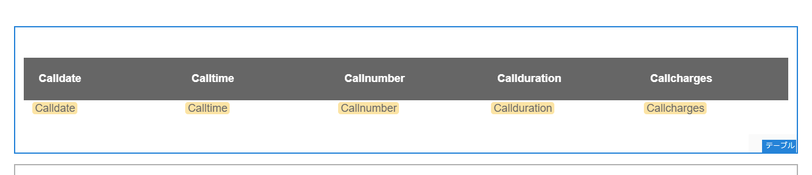
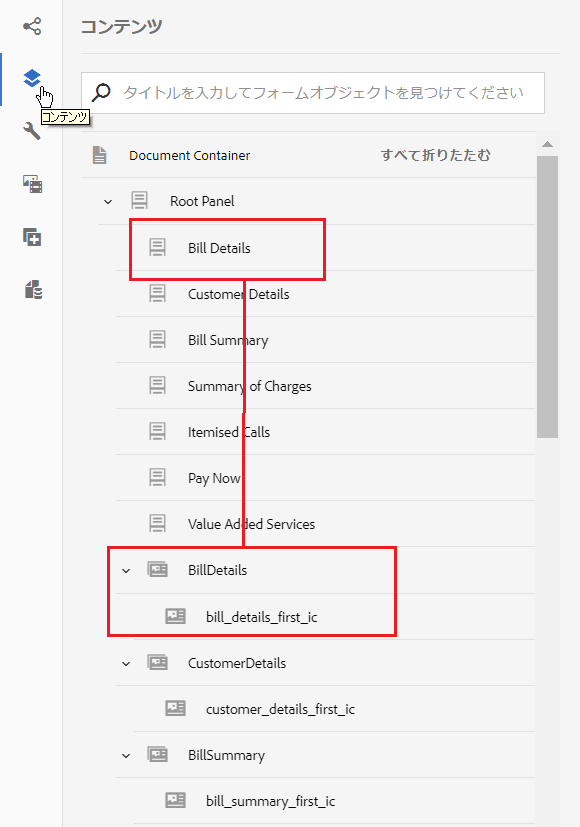

# チュートリアル：インタラクティブ通信の作成 {#tutorial-create-interactive-communication}

>[!CAUTION]
>
>AEM 6.4 の拡張サポートは終了し、このドキュメントは更新されなくなりました。 詳細は、 [技術サポート期間](https://helpx.adobe.com/jp/support/programs/eol-matrix.html). サポートされているバージョンを見つける [ここ](https://experienceleague.adobe.com/docs/?lang=ja).

すべての構築ブロックを使ってインタラクティブ通信を作成する

これは、「[最初のインタラクティブ通信の作成](/help/forms/using/create-your-first-interactive-communication.md)」シリーズを構成するチュートリアルです。チュートリアルの使用例を理解、実行、デモするために、時系列に従うことをお勧めします。

Web 版のフォームデータモデル、ドキュメントフラグメント、テンプレート、テーマなど、すべての構築ブロックを作成したら、インタラクティブ通信の作成を開始できます。

インタラクティブ通信は、次の 2 つのチャネルを通じて配信できます。印刷と Web。 印刷チャネルをマスターとして使用してインタラクティブ通信を作成することもできます。 Web チャネルのマスターとして印刷オプションを使用すると、Web チャネルのコンテンツ、継承、データ連結が印刷チャネルから派生するようになります。 また、印刷チャネルで行った変更が Web チャネルで確実に同期されます。 ただし、インタラクティブ通信の作成者は、Web チャネル内の特定のコンポーネントの継承を解除できます。

このチュートリアルでは、印刷チャネルと Web チャネル用のインタラクティブ通信を作成する手順を説明します。 このチュートリアルを完了すると、次の操作を実行できるようになります。

* 印刷チャネル用のインタラクティブ通信の作成
* Web チャネル用のインタラクティブ通信の作成
* 印刷と Web のインタラクティブ通信を作成し、印刷をマスター

## 同期を行わない印刷および Web 用のインタラクティブ通信の作成 {#create-interactive-communications-for-print-and-web-with-no-synchronization}

### 印刷チャネル用のインタラクティブ通信の作成 {#create-interactive-communication-for-print-channel}

次のリストは、このチュートリアルで既に作成済みで、印刷チャネル用のインタラクティブ通信を作成する際に必要なリソースを示しています。

**印刷テンプレート：** [create_first_ic_print_template](/help/forms/using/create-templates-print-web.md)

**フォームデータモデル：**[FDM_Create_First_IC](create-form-data-model-tutorial.md)

**ドキュメントフラグメント：** [bill_details_first_ic、customer_details_first_ic、bill_summary_first_ic、summary_charges_first_ic](/help/forms/using/create-document-fragments.md)

**レイアウトフラグメント：** [table_lf](/help/forms/using/create-templates-print-web.md)

**画像：** PayNow と ValueAddedServices

1. AEM オーサーインスタンスにログインし、**[!UICONTROL Adobe Experience Manager]**／**[!UICONTROL フォーム]**／**[!UICONTROL フォームとドキュメント]**&#x200B;に移動します。
1. 「**作成**」をタップし、「**インタラクティブ通信**」を選択します。**インタラクティブ通信の作成**&#x200B;ウィザードが表示されます。
1. 「**タイトル**」と「**名前**」フィールドに **create_first_ic** と入力します。**FDM_Create_First_IC** をフォームデータモデルとして選択し、「**次へ**」をタップします。
1. **チャンネル**&#x200B;ウィザードで以下を実行します。

   1. **create_first_ic_print_template** を印刷テンプレートとして指定し、「**選択**」をタップします。「**Web チャンネルのマスターとして印刷を使用**」のチェックボックスが選択されていないことを確認してください。
   1. **Create_First_IC_templates** フォルダー／**Create_First_IC_Web_Template** を Web テンプレートとして指定し、「**選択**」をタップします。
   1. 「**作成**」をタップします。

   インタラクティブ通信が正常に作成されたことを示す確認メッセージが表示されます。

1. タップ **編集** をクリックして、右側のウィンドウでインタラクティブ通信を開きます。
1. 「**アセット**」タブに移動してフィルターを適用し、左側のペインのドキュメントフラグメントだけを表示します。
1. 次のドキュメントフラグメントを、インタラクティブ通信のターゲット領域にドラッグ&amp;ドロップします。

   | ドキュメントフラグメント | ターゲット領域 |
   |---|---|
   | bill_details_first_ic | BillDetails |
   | customer_details_first_ic | CustomerDetails |
   | bill_summary_first_ic | BillSummary |
   | summary_charges_first_interactive_communication | 料金 |

   

1. **グラフ**&#x200B;のターゲット領域をタップし、**+** をタップして&#x200B;**グラフ**&#x200B;のコンポーネントを追加します。
1. グラフのコンポーネントをタップし、（設定）を選択します。グラフのプロパティが左側のペインに表示されます。

   1. グラフの名前を指定します。
   1. 「**グラフのタイプ**」ドロップダウンリストから「**円グラフ**」を選択します。
   1. **X 軸**&#x200B;セクションの&#x200B;**通話**&#x200B;データモデルオブジェクトタイプから **Calltype** プロパティを選択します。 をタップします。
   1. 「**関数**」ドロップダウンリストから「**頻度**」を選択します。
   1. **Y 軸**&#x200B;セクションの&#x200B;**通話**&#x200B;データモデルオブジェクトタイプから **Calltype** プロパティを選択します。 をタップします。
   1.  をタップして、グラフのプロパティを保存します。

1. 「**アセット**」タブに移動してフィルターを適用し、左側のペインのレイアウトフラグメントだけを表示します。**table_lf** レイアウトフラグメントを&#x200B;**通話明細**&#x200B;のターゲット領域にドラッグアンドドロップします。
1. 「**日付**」列のテキストフィールドを選択し、（設定）をタップします。
1. 「**連結タイプ**」ドロップダウンリストから「**データモデルオブジェクト**」を選択し、**calls**／**calldate** の順に選択します。 をタップしてプロパティを保存します。

   同様に、**時刻**、**番号**、**時間**、および&#x200B;**料金**&#x200B;のテキストフィールドについて、それぞれ **calltime**、**callnumber**、**callduration**、および **callcharges** との連結を作成します。

1. **PayNow** のターゲット領域をタップし、**+** をタップして&#x200B;**画像**&#x200B;のコンポーネントを追加します。
1. 画像のコンポーネントをタップし、（設定）を選択します。左側のペインにイメージのプロパティが表示されます。

   1. 指定 **PayNow** を **名前** フィールドに入力します。
   1. 「**アップロード**」をタップし、ローカルのファイルシステムに保存された   の画像を選択して「**開く**」をタップします。
   1.  をタップして、画像のプロパティを保存します。

1. 手順 13～14 を繰り返し、**ValueAddedServices** の画像を **ValueAddedServices** のターゲット領域に追加します。

### Web チャネル用のインタラクティブ通信の作成 {#create-interactive-communication-for-web-channel}

次に、このチュートリアルで既に作成済みで、Web チャネル用のインタラクティブ通信を作成する際に必要なリソースのリストを示します。

**Web テンプレート：** [Create_First_IC_Web_Template](/help/forms/using/create-templates-print-web.md)

**フォームデータモデル：** [FDM_Create_First_IC](create-form-data-model-tutorial.md)

**ドキュメントフラグメント：** [bill_details_first_ic、customer_details_first_ic、bill_summary_first_ic、summary_charges_first_ic](/help/forms/using/create-document-fragments.md)

**画像：** PayNowWeb および ValueAddedServicesWeb

1. AEM オーサーインスタンスにログインし、**[!UICONTROL Adobe Experience Manager]**／**[!UICONTROL フォーム]**／**[!UICONTROL フォームとドキュメント]**&#x200B;に移動します。
1. 「**作成**」をタップし、「**インタラクティブ通信**」を選択します。**インタラクティブ通信の作成**&#x200B;ウィザードが表示されます。
1. 「**タイトル**」と「**名前**」フィールドに **create_first_ic** と入力します。**FDM_Create_First_IC** をフォームデータモデルとして選択し、「**次へ**」をタップします。
1. **チャンネル**&#x200B;ウィザードで以下を実行します。

   1. **create_first_ic_print_template** を印刷テンプレートとして指定し、「**選択**」をタップします。「**Web チャンネルのマスターとして印刷を使用**」のチェックボックスが選択されていないことを確認してください。
   1. **Create_First_IC_templates** フォルダー／**Create_First_IC_Web_Template** を Web テンプレートとして指定し、「**選択**」をタップします。
   1. 「**作成**」をタップします。

   インタラクティブ通信が正常に作成されたことを示す確認メッセージが表示されます。

1. タップ **編集** をクリックして、右側のウィンドウでインタラクティブ通信を開きます。
1. 左側のペインから「**チャンネル**」タブをタップし、「**Web**」をタップします。
1. 「**アセット**」タブに移動してフィルターを適用し、左側のペインのドキュメントフラグメントだけを表示します。
1. 次のドキュメントフラグメントを、インタラクティブ通信のターゲット領域にドラッグ&amp;ドロップします。

   | ドキュメントフラグメント | ターゲット領域 |
   |---|---|
   | bill_details_first_ic | BillDetails |
   | customer_details_first_ic | CustomerDetails |
   | bill_summary_first_ic | BillSummary |
   | summary_charges_first_interactive_communication | 料金 |

1. **請求概要**&#x200B;のターゲット領域をタップし、**+** をタップして&#x200B;**グラフ**&#x200B;のコンポーネントを追加します。
1. グラフのコンポーネントをタップし、（設定）を選択します。グラフのプロパティが左側のペインに表示されます。

   1. グラフの名前を指定します。
   1. 「**グラフのタイプ**」ドロップダウンリストから「**円グラフ**」を選択します。
   1. **X 軸**&#x200B;セクションの&#x200B;**通話**&#x200B;データモデルオブジェクトタイプから **Calltype** プロパティを選択します。 をタップします。
   1. 「**関数**」ドロップダウンリストから「**頻度**」を選択します。
   1. **Y 軸**&#x200B;セクションの&#x200B;**通話**&#x200B;データモデルオブジェクトタイプから **Calltype** プロパティを選択します。 をタップします。
   1.  をタップして、グラフのプロパティを保存します。

1. 左側のペインから「**データソース**」タブを選択し、**通話**&#x200B;データモデルオブジェクトを&#x200B;**通話明細**&#x200B;のターゲット領域にドラッグアンドドロップします。**通話**&#x200B;データモデルオブジェクトに含まれるすべてのプロパティが、右側のペインの&#x200B;**通話明細**&#x200B;のターゲット領域にテーブル列として表示されます。

   ユースケースに基づいて、テーブルには、通話日、通話時刻、通話番号、通話時間、そして通話料金の列が必要です。

   

1. **Mobilenum** テーブルの列見出しを選択し、**追加のオプション**／**列の削除**&#x200B;の順に選択します。同様に、**Calltype** の列を削除します。
1. **Calldate** テーブル列見出しを選択し、「」をタップしてテキストの名前を「**通話日**」に変更します。同様に、テーブル内の他の列見出しの名前を変更します。
1. ユースケースに基づいて、 **今すぐ支払う** ボタンをクリックして支払いを行うオプションをユーザーに提供するインタラクティブ通信のボタン。 ボタンを挿入するには、次の手順を実行します。

   1. **Pay Now** のターゲット領域をタップし、**+** をタップして&#x200B;**テキスト**&#x200B;のコンポーネントを追加します。
   1. テキストコンポーネントをタップし、「」をタップします。
   1. テキストの名前をに変更します。 **今すぐ支払う**.
   1. テキストを選択し、ハイパーリンクアイコンをタップします。
   1. 支払い URL を **パス** フィールドに入力します。
   1. 選択 **新しいタブ** から **ターゲット** 」ドロップダウンリストから選択できます。
   1.  をタップして、ハイパーリンクのプロパティを保存します。

1. 「**プレビュー**」オプションの隣にあるドロップダウンリストから「**スタイル**」を選択します。

   

1. ハイパーリンクテキストのスタイルを設定し、インタラクティブ通信でボタンとして表示するには次の手順を実行します。

   1. テキストコンポーネントをタップし、「」を選択します。
   1. 内 **境界線** セクション、指定 **1.5px** as **境界線の幅**&#x200B;を選択します。 **実線** as **境界線のスタイル**、を指定します。 **46px** as **境界線の半径**.
   1. ボタンの背景色として、赤を **背景** 」セクションに入力します。
   1. 内 **余白** ～のフィールド **Dimensionと位置** セクションで、 **同時に編集** アイコンをクリックし、 **右** 余白 **450px**. 上、下、左のフィールドは空白に設定されます。

   

1. **Pay Now** のターゲット領域をタップし、**+** をタップして&#x200B;**画像**&#x200B;のコンポーネントを追加します。
1. 画像のコンポーネントをタップし、（設定）を選択します。左側のペインにイメージのプロパティが表示されます。

   1. 指定 **PayNow** を **名前** フィールドに入力します。
   1. 「**アップロード**」をタップし、ローカルのファイルシステムに保存された **PayNowWeb** の画像を選択して「**開く**」をタップします。
   1.  をタップして、画像のプロパティを保存します。

1. ユースケースに基づき、「**登録**」ボタンをインタラクティブ通信に挿入し、ユーザーがボタンをクリックして付加価値サービスを追加できるようにします。

   手順 13～17 を繰り返し、**付加価値サービス** ターゲット領域に「**登録**」ボタンを追加し、**ValueAddedServicesWeb**&#x200B;画像を追加します。

## 自動同期を使用して印刷および Web 用のインタラクティブ通信を作成 {#create-interactive-communications-for-print-and-web-with-auto-synchronization}

印刷チャネルと Web チャネル間の自動同期を有効にして、インタラクティブ通信を作成することもできます。 自動同期を有効にするには、インタラクティブ通信の作成時に「マスターとして印刷」オプションを選択します。 「マスターとして印刷」オプションを選択すると、Web チャネルのコンテンツ、継承、データ連結が印刷チャネルから派生するようになります。 また、印刷チャネルで行った変更が Web チャネルに反映されるようにします。

印刷チャネルを使用して Web チャネルのコンテンツを派生させるには、次の手順を実行します。

1. AEM オーサーインスタンスにログインし、**[!UICONTROL Adobe Experience Manager]**／**[!UICONTROL フォーム]**／**[!UICONTROL フォームとドキュメント]**&#x200B;に移動します。
1. 「**作成**」をタップし、「**インタラクティブ通信**」を選択します。**インタラクティブ通信の作成**&#x200B;ウィザードが表示されます。
1. 「**タイトル**」と「**名前**」フィールドに **create_first_ic** と入力します。**FDM_Create_First_IC** をフォームデータモデルとして選択し、「**次へ**」をタップします。
1. **チャネル**&#x200B;ウィザードで以下を実行します。

   1. **create_first_ic_print_template** を印刷テンプレートとして指定し、「**選択**」をタップします。
   1. 「**Web チャネルのマスターとして印刷を使用**」チェックボックスを選択します。
   1. **Create_First_IC_templates** フォルダー／**Create_First_IC_Web_Template** を Web テンプレートとして指定し、「**選択**」をタップします。
   1. 「**作成**」をタップします。

   インタラクティブ通信が正常に作成されたことを示す確認メッセージが表示されます。

1. タップ **編集** をクリックして、右側のウィンドウでインタラクティブ通信を開きます。
1. 「[印刷チャネル用のインタラクティブ通信の作成](#create-interactive-communication-for-print-channel)」セクションの手順 6 ～ 15 を実行します。
1. 左側のペインのタブから「**チャネル**」をタップし、「**Web**」をタップし、印刷チャネルから Web チャネル用にコンテンツを自動生成します。
1. 手順 4 で「**Web チャネルのマスターとして印刷を使用**」のチェックボックスを選択したので、コンテンツと連結は印刷チャネルから Web チャネル用に自動生成されます。

   印刷チャネルのコンテンツは、Web チャネルのテンプレートコンテンツの下に挿入されます。 印刷チャネルから自動生成された Web チャネルコンテンツを変更するには、任意のターゲット領域の継承をキャンセルします。

   Web チャネル内の関連するターゲット領域にカーソルを置いて （継承キャンセル）を選択し、**継承をキャンセル**&#x200B;ダイアログで「**はい**」をタップします。

   

   コンポーネントの継承をキャンセルした場合は、その継承を再度有効にすることができます。継承をもう一度有効にするには、目的のコンポーネントが含まれているターゲット領域の境界線にカーソルを置いて  をタップします。

1. を選択します。 **コンテンツ** 」タブをクリックします。
1. コンテンツツリーを使用して、自動生成された Web チャネルコンテンツを Web テンプレートの既存のパネルにドラッグ&amp;ドロップします。 再配置が必要なコンポーネントのリストを次に示します。

   * 請求明細コンポーネントから請求詳細パネルへ
   * 顧客詳細コンポーネントから顧客詳細パネル
   * 請求要約コンポーネントから請求要約パネルへ
   * 料金コンポーネントの概要から料金パネルの概要へ
   * レイアウトフラグメント（表）を通話定義パネルに

   

1. 「[Web チャネル用インタラクティブ通信の作成](#create-interactive-communication-for-web-channel)」の手順 13 ～ 18 を繰り返し、「**Pay Now**」（今すぐ支払う）および「**登録**」ハイパーリンクをインタラクティブ通信の Web チャネルに挿入します。
