# インタラクティブ通信の作成  {#create-an-interactive-communication}

インタラクティブ通信を作成するには、インタラクティブ通信エディターを使用します。ドラッグアンドドロップ機能を使用してインタラクティブ通信を作成し、各種のデバイスで印刷出力と Web 出力のプレビューを表示することができます。

## 概要 {#overview}

インタラクティブ通信を使用すると、各種のインタラクティブな通信記録の作成と配信を、カスタマイズされた安全な方法で一元的に管理することができます。印刷出力を Web 用のマスターチャネルとして使用することにより、インタラクティブ通信の Web 出力を作成する手間を大幅に省くことができます。

### 前提条件 {#prerequisites}

インタラクティブ通信を作成するための前提条件を以下に示します。

* テストデータを含む[フォームデータモデル](/help/forms/using/data-integration.md)、またはMicrosoft® Dynamicsのインスタンスなどの実際のデータソースを設定します。
* [ドキュメントフラグメント](/help/forms/using/document-fragments.md)があることを確認します。
* 印刷およびWebチャネル用の[テンプレート](/help/forms/using/web-channel-print-channel.md)があることを確認します。
* Web チャネルで必要な[テーマ](/help/forms/using/themes.md)が設定されていること。

## インタラクティブ通信の作成  {#createic}

1. AEM オーサーインスタンスにログインし、**[!UICONTROL Adobe Experience Manager]**／**[!UICONTROL フォーム]**／**[!UICONTROL フォームとドキュメント]**&#x200B;に移動します。
1. 「**[!UICONTROL 作成]**」をタップし、「**[!UICONTROL 対話型通信]**」を選択します。 [対話型通信の作成]ページが表示されます。

   

1. 以下の情報を入力します。：

   * **[!UICONTROL タイトル]**：インタラクティブ通信のタイトルを入力します。
   * **[!UICONTROL 名前*]**:対話型通信の名前は、入力したタイトルから得られます。必要に応じて編集します。
   * **[!UICONTROL 説明]**:対話型通信に関する説明を入力します。
   * **[!UICONTROL フォームデータモデル*]**：フォームデータモデルを参照して選択します。フォームデータモデルについて詳しくは、[AEM Formsデータ統合](/help/forms/using/data-integration.md)を参照してください。
   * **[!UICONTROL 事前入力サービス]**:データを取得し、インタラクティブ通信を事前入力するには、事前入力サービスを選択します。
   * **[!UICONTROL 後処理タイプ]**:対話型通信が送信されたときにトリガーされるAEMまたはFormsワークフローを選択できます。トリガーするワークフローのタイプを選択します。
   * **[!UICONTROL 後処理]**：トリガーするワークフローの名前を選択します。AEMワークフローを選択する場合は、「添付ファイルのパス」、「レイアウトのパス」、「PDFパス」、「印刷データのパス」および「Webデータのパス」を指定します。
   * **[!UICONTROL タグ]**:対話型通信に適用するタグを選択します。また、新しいタグ名やカスタムタグ名を入力し、Enterキーを押して作成することもできます。
   * **[!UICONTROL 作成者]**：作成者名は、ログインしたユーザー名から自動的に取得されます。
   * **[!UICONTROL 発行日：インタラクティブコミュニケーションを発行する日付を]** 入力します。
   * **[!UICONTROL 非公開日]**:対話型通信の公開を取り消す日付を入力します。

1. 「**[!UICONTROL 次へ]**」をタップします。印刷とWebチャネルの詳細を指定する画面が表示されます。
1. 以下を入力します。

   * **[!UICONTROL 印刷]**:対話型通信の印刷チャネルを生成する場合は、このオプションを選択します。
   * **[!UICONTROL Print Template*:XDPを]** 参照し、印刷テンプレートとして選択します。
   * **[!UICONTROL Webチャネル用にマスターとして印刷を使用：印刷チャネルと同期するWebチャネルを作成する場合は、]** このオプションを選択します。印刷チャネルを Web チャネルのマスターとして使用すると、Web チャネルに連結されたコンテンツとデータが印刷チャネルから取得され、「同期」をタップしたときに、印刷チャネルに対する変更内容が Web チャネルに反映されます。ただし、作成者は、Web チャネル内の特定のコンポーネントについて、必要に応じて継承設定を解除することができます。詳細については、「[Webチャネルと印刷チャネルの同期](/help/forms/using/create-interactive-communication.md#synchronize)」を参照してください。
   * **[!UICONTROL Web:Interactive CommunicationのWebチャネルまたはレスポンシブ出力を生成する場合は、このオプションを]** 選択します。
   * **[!UICONTROL Interactive Communication Web Template*:Webテンプレートを]** 参照して選択します。
   * **[!UICONTROL テ]** ーマを **[!UICONTROL 選択*]**:対話型通信のWebチャネルのスタイルを設定するテーマを参照して選択します。詳しくは、「[AEM Forms のテーマ](/help/forms/using/themes.md)」を参照してください。

   印刷チャネルとWebチャネルについて詳しくは、[印刷チャネルとWebチャネル](/help/forms/using/web-channel-print-channel.md)を参照してください。

1. 「**[!UICONTROL 作成]**」をタップします。対話型通信が作成され、警告ボックスが表示されます。 「**[!UICONTROL 編集]**」をタップすると、対話型通信オーサリングユーザーインターフェイス](#step2)を使用して、[追加コンテンツの説明に従って対話型通信のコンテンツを作成する開始が作成されます。 または、「**[!UICONTROL 完了]**」をタップし、後で対話型通信を編集するように選択することもできます。

## インタラクティブ通信にコンテンツを追加する {#step2}

対話型通信を作成した後、対話型通信オーサリングインターフェイスを使用してそのコンテンツを作成できます。

Interactive Communicationオーサリングインターフェイスについて詳しくは、「[Interactive Communicationオーサリングの概要](/help/forms/using/introduction-interactive-communication-authoring.md)」を参照してください。

1. [対話型通信を作成](#createic)で説明されているように、「編集」をタップすると、対話型通信オーサリングインターフェイスが起動します。 または、AEM上の既存の対話型通信アセットに移動し、そのアセットを選択し、「**[!UICONTROL 編集]**」をタップして対話型通信オーサリングインターフェイスを起動します。

   既定では、[対話型通信]が[Webチャネルのみ]でない限り、[対話型通信]の印刷チャネルが表示されます。 Interactive Communicationの印刷チャネルには、選択したXDP/印刷チャネルテンプレートで使用可能なターゲット領域が表示されます。 これらのターゲット領域とフィールドで、コンポーネントやアセットを追加することができます。

1. 印刷チャネルを選択した状態で、「**[!UICONTROL コンポーネント]**」タブを選択します。 印刷チャネルでは、以下のコンポーネントを使用することができます。

   | **コンポーネント** | **機能** |
   |---|---|
   | グラフ | フォームデータモデルコレクションから取得した2次元データを視覚的に表すために、Interactive Communicationで使用できるグラフを追加します。 詳しくは、[対話型通信でのグラフの使用](/help/forms/using/chart-component-interactive-communications.md)を参照してください。 |
   | ドキュメントフラグメント | テキスト、リスト、条件などの再利用可能なコンポーネントをインタラクティブコミュニケーションに追加できます。 インタラクティブ通信に追加する再利用可能なコンポーネントは、フォームデータモデルベースのコンポーネントでも、フォームデータモデルを持たないコンポーネントでもかまいません。 |
   | 画像 | 画像を挿入できるようにします。。 |

   コンポーネントを対話型通信にドラッグ&amp;ドロップし、必要に応じて設定します。

1. 印刷チャネルを選択した場合は、「**[!UICONTROL アセット]**」タブに移動して、必要なアセットだけを表示するためのフィルターを適用します。

   アセットブラウザを使用して、インタラクティブコミュニケーションターゲット領域にアセットを直接ドラッグ&amp;ドロップすることもできます。

   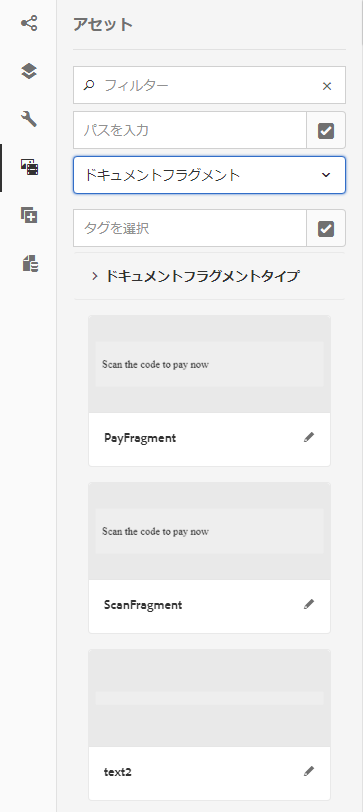

1. ドキュメントフラグメントをインタラクティブ通信にドラッグアンドドロップします。以下の表に、インタラクティブ通信の印刷チャネルで使用できるドキュメントフラグメントのタイプを示します。

<table> 
 <tbody> 
  <tr> 
   <td><strong>ドキュメントフラグメントタイプ</strong></td> 
   <td><strong>用途の例</strong></td> 
  </tr> 
  <tr> 
   <td><a href="/help/forms/using/texts-interactive-communications.md" target="_blank">テキスト</a></td> 
   <td>レターの住所、受信者の電子メール、本文を追加するテキスト </td> 
  </tr> 
  <tr> 
   <td><a href="/help/forms/using/conditions-interactive-communications.md" target="_blank">条件</a></td> 
   <td>ポリシーのタイプに基づいて通信に適切なヘッダー画像を追加する条件：StandardまたはPremium。  </td> 
  </tr> 
  <tr> 
   <td>リスト</td> 
   <td>テキスト、条件、その他のリスト、ドキュメントを含む、画像フラグメントのグループです。  </td> 
  </tr> 
 </tbody> 
</table>

ドキュメントフラグメントについて詳しくは、「[ドキュメントフラグメント](/help/forms/using/document-fragments.md)」を参照してください。

1. 変数の連結を設定するには、変数をタップし、（設定）を選択してから、サイドバーのプロパティパネルで連結プロパティを設定します。

   * **[!UICONTROL なし]**：このプロパティを選択すると、エージェントによって変数の値が設定されます。
   * **[!UICONTROL テキストフラグメント]**：このプロパティを選択すると、フィールド内でコンテンツがレンダリングされるテキストドキュメントフラグメントを参照して選択できるようになります。変数を含まない変数に連結できるのは、テキストドキュメントフラグメントだけです。
   * **[!UICONTROL Data Model Object]**:フィールドに値が入力されるフォームデータモデルのプロパティを選択します。

   関連するテキストドキュメントフラグメントを設定することもできます。プロパティパネルには、そのテキストドキュメントフラグメントの変数リストが表示されます。変数名の横にある「」（編集）をタップすると、その変数の編集用設定が表示されます。

1. テーブルを追加するには、印刷チャネルを選択した状態で、レイアウトフラグメントだけを表示するためのフィルターを「**[!UICONTROL アセット]**」タブで適用します。次に、必要なレイアウトフラグメントをインタラクティブ通信にドラッグアンドドロップします。レイアウトフラグメントはXDPに基づいており、動的データが埋め込まれるInteractive Communicationのグラフィカルレイアウトや静的および動的テーブルの作成に使用できます。

   例えば、新しいポリシーと古いポリシーで、保険料の総額、特別割引率（%）、緊急ロードサイドサービスを表示するためのレイアウトテーブルを作成することができます。

   レイアウトフラグメントについて詳しくは、「[ドキュメントフラグメント](/help/forms/using/document-fragments.md)」を参照してください。

1. 印刷チャネルを選択した状態で、画像を表示するためのフィルターを「**[!UICONTROL アセット]**」タブで適用します。必要な画像(会社のロゴなど)をInteractive Communicationにドラッグ&amp;ドロップします。

   また、インタラクティブ通信で以下の操作を行います。

   * [グラフの追加と設定](/help/forms/using/chart-component-interactive-communications.md)
   * [Web チャネルと印刷チャネルの同期](/help/forms/using/create-interactive-communication.md#synchronize)

      * 自動同期
      * 継承のキャンセル
      * 継承を再度有効にする
      * 同期
   * [添付ファイルとライブラリへのアクセス](/help/forms/using/create-interactive-communication.md#attachmentslibrary)
   * [XDP またはレイアウトフィールドのプロパティの設定](/help/forms/using/create-interactive-communication.md#xdplayoutfieldproperties)
   * [コンポーネントへのルールの追加](/help/forms/using/create-interactive-communication.md#rules)

1. **[!UICONTROL Webチャネル]**&#x200B;に切り替えます。 Interactive Communication EditorにWebチャネルが表示されます。 印刷チャネルからWebチャネルに初めて切り替えると、自動同期が行われます。 詳しくは、「[印刷チャネルからのWebチャネルの同期](/help/forms/using/create-interactive-communication.md#synchronize)」を参照してください。

   この例では、Web チャネルのマスターとして印刷チャネルを使用しているため、印刷チャネルのプレースホルダー、コンテンツ、データ連結が Web チャネルに同期されます。ただし、Web チャネルの特定のコンテンツを必要に応じてカスタマイズすることができます。

   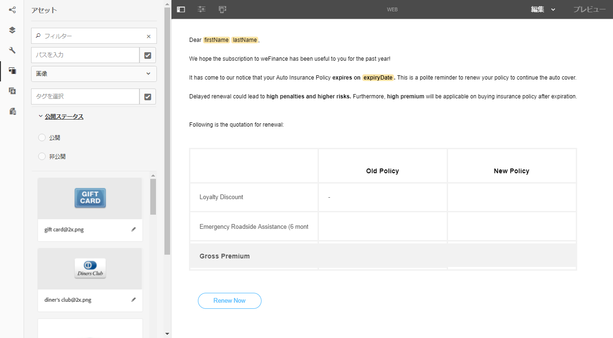

1. Web チャネルにコンポーネントを追加するには、Web チャネルを選択した状態で「**[!UICONTROL コンポーネント]**」をタップします。必要に応じて、Interactive CommunicationのWebチャネルーにコンポーネントをドラッグ&amp;ドロップし、設定に進みます。

   | コンポーネント | 機能 |
   |---|---|
   | グラフ | フォームデータモデルのコレクションから取得した2次元のデータを視覚的に表すために、Interactive Communicationで使用できるグラフを追加します。 詳しくは、[グラフコンポーネント](/help/forms/using/chart-component-interactive-communications.md)の使用を参照してください。 |
   | ドキュメントフラグメント | 再利用可能なコンポーネント、テキスト、リスト、または条件をインタラクティブコミュニケーションに追加できます。 インタラクティブ通信に追加する再利用可能なコンポーネントは、フォームデータモデルベースのコンポーネントでも、フォームデータモデルなしのコンポーネントでもかまいません。 |
   | 画像 | 画像を挿入できるようにします。。 |
   | パネル | パネルコンポーネントは、他のコンポーネントをグループ化するためのプレースホルダーです。パネルコンポーネントにより、インタラクティブ通信内でのコンポーネントグループ（アコーディオンやタブなど）の配置方法が制御されます。パネルコンポーネントを使用して、エンドユーザーが繰り返し使用できるコンポーネントグループ（学歴を入力するための複数のエントリなど）を作成することもできます。 |
   | テーブル | 行と列のデータを整理するためのテーブルを追加することができます。 |
   | ターゲット領域 | Web チャネル固有のコンポーネントを整理するためのターゲット領域を、その Web チャネルに挿入することができます。ターゲット領域は、Web チャネル固有のコンポーネントをグループ化するためのプレーンコンテナです。 |
   | テキスト | インタラクティブ通信の Web チャネルにリッチテキストを追加することができます。追加したテキストでフォームデータオブジェクトを使用して、動的なコンテンツを作成することもできます。 |

1. 必要に応じて、Web チャネルにアセットを挿入します。

   [対話型通信](#previewic)をプレビューして、対話型通信の印刷とWeb出力の見た目を確認し、必要に応じて変更を続けることができます。

## インタラクティブ通信のプレビュー表示 {#previewic}

**[!UICONTROL プレビュー]**&#x200B;オプションを使用して、対話型通信の外観を評価できます。 Interactive CommunicationのWebチャネルは、様々なデバイスでのInteractive Communicationのエクスペリエンスをエミュレートするオプションも提供します。 例えば、iPhone、iPad、デスクトップパソコンなどのデバイスについて、エミュレーションを行うことができます。**[!UICONTROL プレビュー]**&#x200B;と&#x200B;**[!UICONTROL エミュレータ]** の両方のオプションを組み合わせて使用し、画面サイズの異なるデバイスのWeb出力をプレビューできます。 プレビュー内のサンプルデータは、指定したフォームデータモデルから入力されます。

1. プレビュー表示する印刷チャネルまたは Web チャネルを選択して「プレビュー」をタップします。対話型通信が表示されます。

   >[!NOTE]
   >
   >プレビュー画面には、指定したフォームデータモデルのサンプルデータが表示されます。他のデータとの対話型通信のプレビュー、または事前入力サービスの使用について詳しくは、[フォームデータモデル](/help/forms/using/using-form-data-model.md)と[フォームデータモデル](/help/forms/using/work-with-form-data-model.md)の使用を参照してください。

1. Webチャネルーの場合は、を使用して、様々なデバイスでの対話型通信の見え方を表示します。

   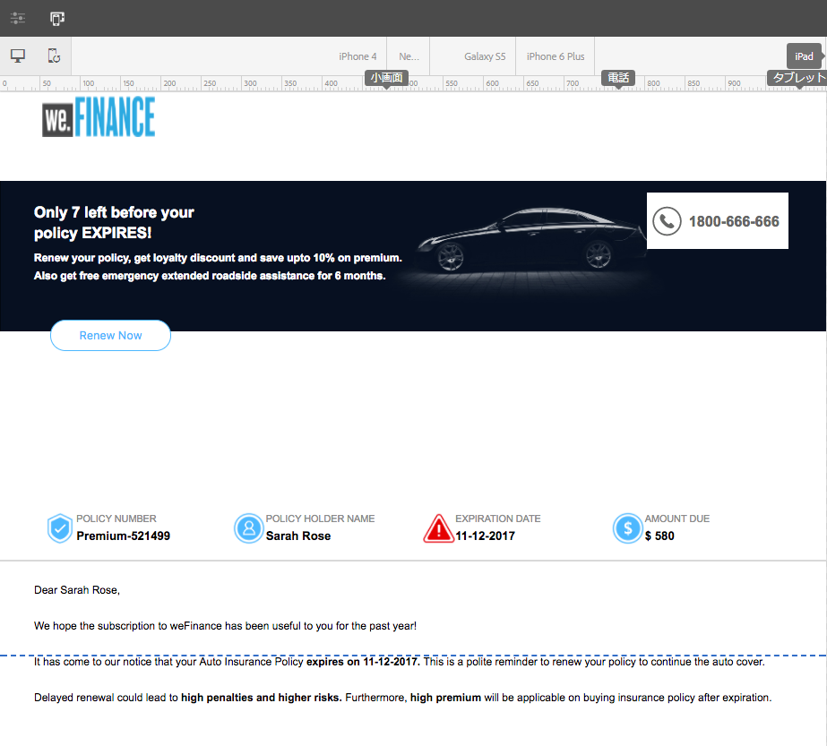

さらに、[エージェントUI](/help/forms/using/prepare-send-interactive-communication.md)を使用して、対話型通信の準備と送信を行うこともできます。

## インタラクティブ通信でプロパティを設定する  {#configuring-properties-in-interactive-communication}

### 添付ファイルとライブラリへのアクセス {#attachmentslibrary}

印刷チャネルでは、添付ファイルとライブラリへのアクセスを設定して、インタラクティブ通信の添付ファイルをエージェント UI で管理することができます。

1. 印刷チャネルでドキュメントコンテナをハイライト表示して、「**[!UICONTROL プロパティ]**」をタップします。

   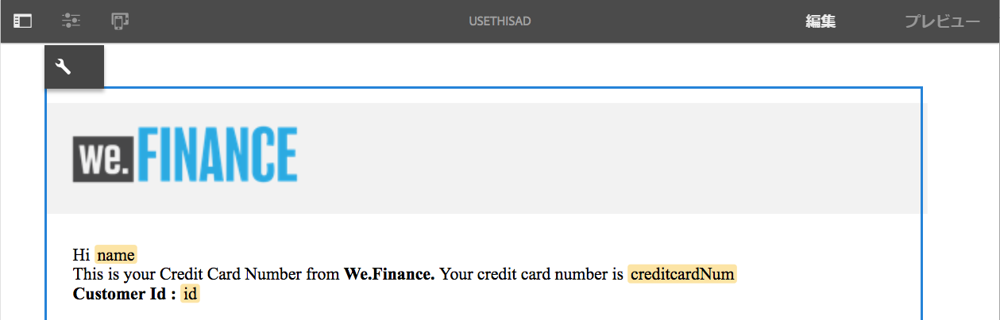

   サイドバーにプロパティパネルが表示されます。

   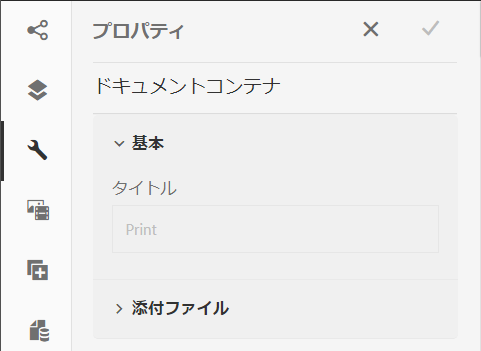

1. 「**[!UICONTROL 添付ファイル]**」を展開し、以下のプロパティを指定します。

   * **[!UICONTROL ライブラリのアクセスを許可]**：エージェント UI でエージェントによるライブラリへのアクセスを許可する場合は、このプロパティを選択します。このプロパティを選択すると、インタラクティブ通信の準備を行う際に、エージェントを使用してライブラリ内のファイルを追加できるようになります。
   * **[!UICONTROL 添付ファイルの順番の変更を許可]**：インタラクティブ通信の添付ファイルの順序を変更できるようにするには、このプロパティを選択します。
   * **[!UICONTROL 許可される添付ファイルの最大数]**：インタラクティブ通信で許可される添付ファイルの最大数を指定します。
   * **[!UICONTROL 添付ファイル]**:「 **** 追加」をタップし、添付するファイルを参照して選択し、次の項目を指定します。

      * **[!UICONTROL デフォルトでドキュメントにこのファイルを添付する]**：ファイルの添付が必須でない場合のみ、このオプションを変更することができます。
      * **[!UICONTROL 必須]**：このオプションを選択すると、エージェント UI で添付ファイルを削除できなくなります。

   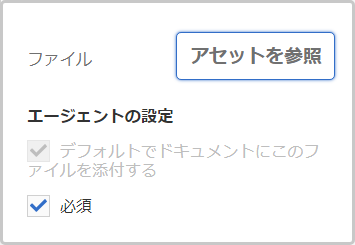

1. 「**[!UICONTROL 完了]**」をタップします。

### XDP またはレイアウトフィールドのプロパティの設定 {#xdplayoutfieldproperties}

1. Interactive Communicationの印刷チャネルを編集中に、印刷チャネルテンプレートに組み込まれているフィールドの上にカーソルを置き、（設定）を選択します。

   サイドバーにプロパティダイアログが表示されます。

   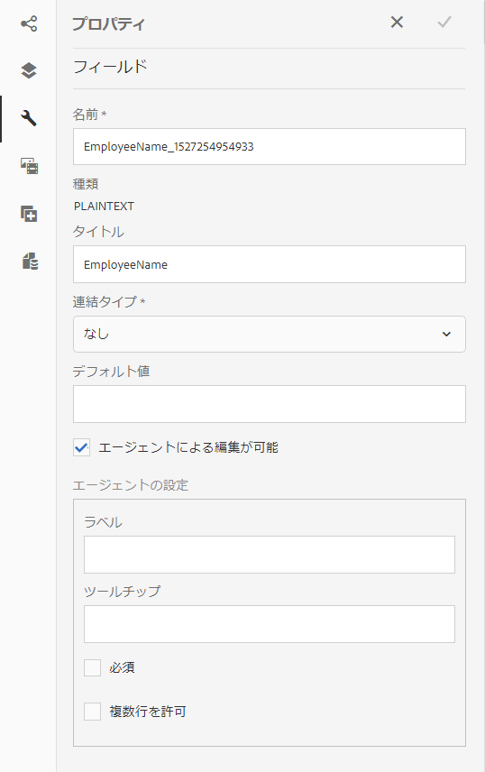

1. 以下のプロパティを指定します。

   * **[!UICONTROL 名前]**:JCRノード名。
   * **[!UICONTROL タイトル]**：タイトルを入力します。ここで入力したタイトルは、エージェント UI とドキュメントコンテナツリーに表示されます。
   * **[!UICONTROL 連結の種類]**:フィールドに対して、次のいずれかの連結の種類を選択します。

      * なし：このプロパティを選択すると、エージェントによってプロパティの値が設定されます。
      * テキストフラグメント：このプロパティを選択すると、フィールド内でコンテンツがレンダリングされるテキストドキュメントフラグメントを参照して選択できるようになります。
      * データモデルオブジェクト：フィールド内に値を取り込むデータモデルプロパティを選択します。
   * **[!UICONTROL デフォルト値]**：指定したデータモデルオブジェクトまたはテキストフラグメントでフィールドの値を設定しなかった場合、そのフィールドにデフォルト値が設定されます。データ連結の種類が「なし」の場合、デフォルト値はフィールドに事前入力されます。
   * **[!UICONTROL エージェントによる編集が可能]**：エージェント UI のフィールド値をエージェントを使用して編集できるようにするには、このオプションを選択します。この設定は、「連結の種類」が「テキストフラグメント」の場合は適用されません。
   * **[!UICONTROL ラベル]**：フィールドと共にエージェント UI に表示されるテキスト文字列を指定します。この設定は、「連結の種類」が「テキストフラグメント」の場合は適用されません。
   * **[!UICONTROL ツールチップ]**:エージェントUIのエージェントにマウスを移動すると表示されるテキスト文字列を入力します。この設定は、「連結の種類」が「テキストフラグメント」の場合は適用されません。
   * **[!UICONTROL 必須]**：フィールドを入力必須にするには、このオプションを選択します。この設定は、「連結の種類」が「テキストフラグメント」の場合は適用されません。
   * **[!UICONTROL 複数行]**：フィールドに複数行のテキストを入力できるようにするには、このオプションを選択します。この設定は、「連結の種類」が「テキストフラグメント」の場合は適用されません。

1. をタップします。

## インタラクティブ通信のコンポーネントにルールを適用する {#rules}

インタラクティブコミュニケーション内のコンポーネントまたはコンテンツを条件付きにするには、コンポーネント/コンテンツの一部をタップし、（ルールを作成）を選択してルールエディターを起動します。

詳しくは、次を参照してください。

* [ルールエディター](/help/forms/using/rule-editor.md)
* [インタラクティブ通信オーサリング の概要](/help/forms/using/introduction-interactive-communication-authoring.md)

## テーブルの使用 {#tables}

### インタラクティブ通信の動的テーブル {#dynamic-tables-in-interactive-communication}

レイアウトフラグメントを使用して、インタラクティブ通信に動的テーブルを追加できます。 以下の手順では、クレジットカードの取引明細を例として、レイアウトフラグメントを使用して、インタラクティブ通信内に動的なテーブルを作成する方法について説明します。

1. テーブルを作成するために必要なレイアウトフラグメントが AEM で使用可能な状態になっていることを確認します。
1. Interactive Communicationの印刷チャネルで、レイアウトフラグメント（複数列のテーブルを含む）をAsset Browserからターゲット領域にドラッグ&amp;ドロップします。

   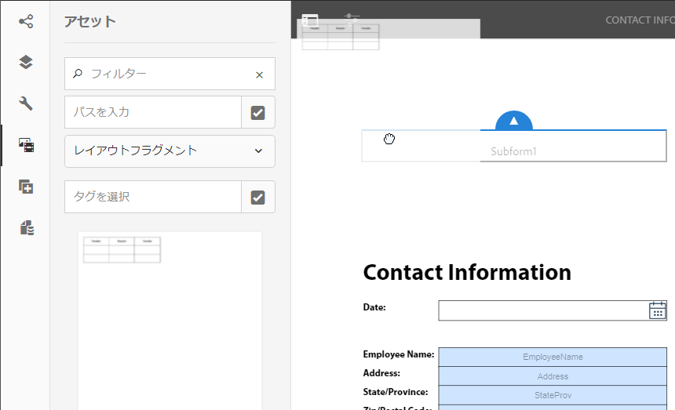

   インタラクティブ通信のレイアウト領域にテーブルが表示されます。

   

1. テーブル内のセルごとに、データ連結を指定します。繰り返し可能な行を作成するには、共通のコレクションプロパティに属する行にフォームデータモデルのプロパティを挿入します。

   1. テーブル内のセルをタップし、（設定）を選択します。

      サイドバーにプロパティダイアログが表示されます。

      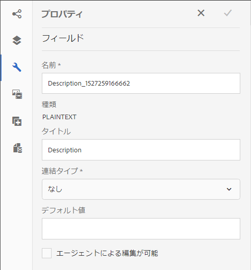

   1. 以下のプロパティを設定します。

      * **[!UICONTROL 名前]**:JCRノード名。
      * **[!UICONTROL タイトル]**:対話型通信エディタに表示するタイトルを入力します。
      * **[!UICONTROL バインディングの種類]**(&amp;A):フィールドに対して、次のいずれかの連結の種類を選択します。

         * **[!UICONTROL なし]**
         * **[!UICONTROL データモデルオブジェクト]**:フォームデータモデルのプロパティの値がフィールドに入力されます。
      * **[!UICONTROL Data Model Object]**:フィールドに値が入力されるフォームデータモデルのプロパティ。
      * **[!UICONTROL デフォルト値]**:デフォルト値では、指定したデータモデルオブジェクトに値が指定されていない場合、フィールドが空でないことを確認します。デフォルト値はフィールドに事前入力されます。
      * **[!UICONTROL エージェントによる編集が可能]**：エージェント UI のフィールド値をエージェントを使用して編集できるようにするには、このオプションを選択します。
   1. をタップします。

1. 対話型通信をプレビューして、データと共にレンダリングされたテーブルを表示します。

   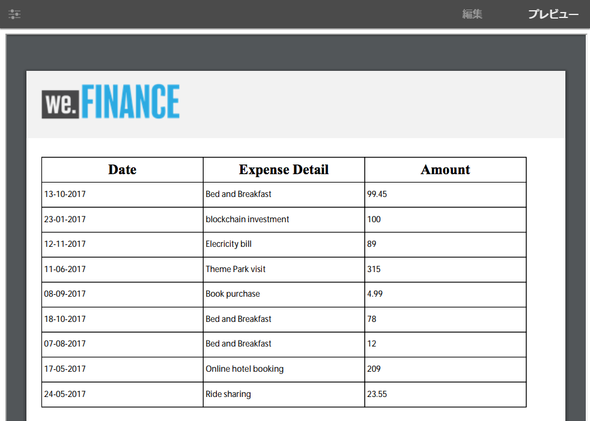

### Web チャネル専用テーブル {#web-channel-only-tables}

Interactive Communicationでは、型のコレクションのdata modelプロパティを使用して、Webチャネルのみの動的テーブルを作成できます。 このようなテーブルは、コレクションプロパティの子プロパティを表したものです。 編集できるのは、テーブル内のセルの書式設定プロパティだけです。

1. Webチャネルーに切り替え、データソースブラウザーの表示を選択します。
1. コレクションプロパティをサブフォームにドラッグアンドドロップします。

   サブフォーム内にテーブルが作成されます。

1. インタラクティブ通信の Web チャネル内のテーブルをプレビュー表示します。

## Web チャネルと印刷チャネルの同期 {#synchronize}

インタラクティブ通信を作成する際に、Web チャネルのマスターとして印刷チャネルを選択すると、印刷チャネルに同期された Web チャネルが作成されます。Web チャネルに連結されたコンテンツとデータは印刷チャネルから取得され、「同期」をタップすると、印刷チャネルに対する変更内容が Web チャネルに反映されます。

ただし、作成者は、Web チャネル内のコンポーネントについて、必要に応じて継承設定を解除することができます。
[クリックして拡大](assets/printweb_2-3.png)

### 自動同期 {#auto-sync}

Web チャネルのマスターとして印刷チャネルを使用している場合、印刷チャネルから Web チャネルに切り替えると、自動同期が実行されます。自動同期により、印刷チャネルのプレースホルダー、コンテンツ、データ連結が Web チャネルに取り込まれます。Interactive Communicationの複雑さと内容によっては、自動同期には少し時間がかかる場合があります。

>[!NOTE]
>
>チャネルを同期すると、ドキュメントフラグメント、画像、条件、リスト、およびレイアウトフラグメントのみが印刷チャネルから Web チャネルに同期されます。このような要素を含むサブフォームまたはその親ノードは同期されません。

### 継承のキャンセル {#cancel-inheritance}

Web チャネルでは、ターゲット領域内にコンポーネントが組み込まれます。

Webチャネルーの関連するターゲット領域の上にカーソルを置き、「」（継承をキャンセル）を選択して、継承をキャンセルダイアログで「**[!UICONTROL はい]**」をタップします。

ターゲット領域内のコンポーネントの継承がキャンセルされ、必要に応じて編集できるようになります。

### 継承を再度有効にする {#re-enable-inheritance}

Web チャネルでコンポーネントの継承をキャンセルした場合は、その継承を再度有効にすることができます。継承を再有効にするには、コンポーネントを含む、関連するターゲット領域の境界の上にマウスポインターを置き、をタップします。

継承を元に戻すためのダイアログが表示されます。

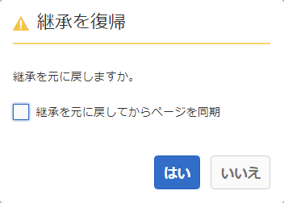

必要に応じて、「**[!UICONTROL 継承を元に戻してからページを同期]**」を選択します。対話型通信全体を同期するには、このオプションを選択します。 このオプションを選択しない場合、継承の復元時に関連するターゲット領域だけが同期されます。

「**[!UICONTROL はい]**」をタップします。

### 同期 {#synchronize-1}

Web チャネルのマスターとして印刷チャネルを使用している場合は、印刷チャネルを変更して「同期」をタップすると、その変更内容が Web チャネルに反映されます。

1. Webチャネルーを印刷チャネルと同期するには、**[!UICONTROL 同期]**&#x200B;をタップします。

   マスターチャネルからコンテンツを同期ダイアログが表示されます。

   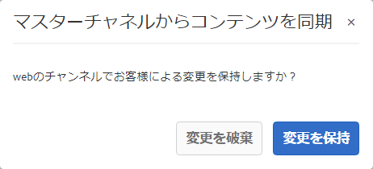

1. 以下に示すいずれかのオプションをタップします。

   * **[!UICONTROL 変更を破棄]**:Webチャネルーで行われた変更に関係なく、Webチャネルーに対して行われたすべての変更を破棄します。
   * **[!UICONTROL 変更を保持]**:継承がキャンセルされないターゲット領域のコンテンツのみを同期します。

