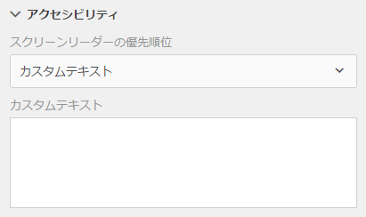

# アクセシブルなアダプティブフォームの作成 {#creating-accessible-adaptive-forms}

>[!CAUTION]
>
>AEM 6.4 の拡張サポートは終了し、このドキュメントは更新されなくなりました。 詳細は、 [技術サポート期間](https://helpx.adobe.com/jp/support/programs/eol-matrix.html). サポートされているバージョンを見つける [ここ](https://experienceleague.adobe.com/docs/?lang=ja).

## はじめに {#introduction}

アクセシブルなフォームとは、特別な支援を必要とするユーザーを含むすべてのユーザーが使用できるフォームを意味します。Adobe Experience Manager(AEM) には、様々な能力を持つユーザー向けのアダプティブフォームの使いやすさを高めるための様々な機能が含まれています。 このソリューションは、フォーム作成者がアクセスしやすいアダプティブフォームを作成する上でも役立ちます。

アダプティブフォームへのアクセシビリティを構築すると、コンテンツの閲覧者を最も幅広くするだけでなく、アクセシビリティ標準への準拠が義務付けられている地域のドキュメントを提供する際の要件にもなります。 AEM Forms では、フォーム開発者がアクセシビリティ標準に準拠できるよう支援します。

アダプティブフォームの作成時に、作成者は次の点を考慮して、アクセシブルなアダプティブフォームを作成する必要があります。

* フォームのコントロールに対する正しいラベルの提供
* 画像の代替テキストの提供
* 十分なカラーコントラストの提供
* フォームのコントロールがキーボードでアクセスできることの確認

## フォームのコントロールに対する正しいラベルの提供 {#provide-proper-labels-for-form-controls}

コンポーネントのラベルまたはタイトルにより、フォームコンポーネントの内容が分かります。例えば、「名」というテキストは、テキストフィールドに名を入力する必要があることをユーザーに伝えます。 ラベルは、スクリーンリーダーによってアクセスできるように、フォームコンポーネントにプログラム的に関連付けられます。 または、フォームコントロールに追加のアクセシビリティ情報が設定されます。

スクリーンリーダーが認識するラベルは、必ずしも視覚的なキャプションと同じである必要はありません。 場合によっては、コントロールの目的をより具体的に指定する必要があります。 フォーム内の各フィールドオブジェクトに対して、アクセシビリティオプションを使用して、スクリーンリーダーが特定のフォームフィールドを識別するために何を読み上げるかを指定できます。

「アクセシビリティ」オプションを使用するには、次の手順に従います。

1. コンポーネントを選択して、 をタップします。
1. サイドバーの&#x200B;**アクセシビリティ**&#x200B;をクリックして、必要なアクセシビリティオプションを選択します。

### フォームコンポーネントのアクセシビリティオプション {#accessibility-options-in-form-components}

**カスタムテキスト**&#x200B;フォーム作成者は、アクセシビリティオプションカスタムテキストフィールドにコンテンツを入力します。スクリーンリーダーなどの支援機能は、このカスタムテキストを使用します。ほとんどのシナリオでは、タイトル設定が最適なオプションです。 「タイトル」や「短い説明」を使用できない場合にのみ、カスタムの画面Readerテキストを作成することを検討してください。

**簡単な説明** ほとんどのコンポーネントでは、ユーザーがコンポーネントの上にポインターを置くと、実行時に簡単な説明が表示されます。このオプションは、ヘルプコンテンツオプションの簡単な説明フィールドで設定できます。

**タイトル** このオプションを使用すると、AEM Forms はフォームフィールドに関連付けられている表示ラベルをスクリーンリーダーのテキストとして使用できます。

**名前** バインディングタブの名前フィールドに値を指定できます。名前には空白を含めることはできません。

**なし** 「なし」を選択すると、フォームオブジェクトは発行されたフォームに名前が表示されなくなります。フォームのコントロールに対して「なし」を設定することは推奨しません。

>[!NOTE]
>
>ラジオボタンとチェックボックスには、アクセシビリティのために 2 つだけオプション（カスタムテキストとタイトル）を設定することができます。

>[!NOTE]
>
>XFA ベースのアダプティブフォームの場合、アクセシビリティオプションは XDP で設定されたアクセシビリティオプションから継承されます。 XDP のツールヒントは短い説明にマッピングされ、キャプションはタイトルにマッピングされます。 その他のオプションは、そのまま機能します。

## 画像の代替テキストの提供 {#provide-text-equivalents-for-images}

画像は、一部のユーザーに対して理解度を高めるのに役立ちます。 ただし、スクリーンリーダーを使用するユーザーの場合、画像を使用するとフォームのアクセシビリティが低下します。 画像を使用する場合は、すべての画像に対してテキストの説明を入力します。

このテキストは、フォーム内のオブジェクトとその目的を説明するものです。 スクリーンリーダーは、画像を検出した場合に、この代替テキストを読み上げます。 画像には常に代替テキストを指定する必要があります。

画像コンポーネントを選択し  をタップします。サイドバーのプロパティで、画像の代替テキストを指定します。

## 十分なカラーコントラストの提供 {#provide-sufficient-color-contrast}

アクセシビリティのデザインでは、色の使用に関する追加のガイドラインを考慮する必要があります。 フォーム作成者は、カラーを使用して様々なフォームのコンポーネントを強調表示することで、フォームの外観を改善できます。しかし、色の不適切な使用は、異なる能力を持つ人々がフォームを読むのを困難または不可能にする可能性があります。

視覚障碍を持つユーザーがデジタルコンテンツを読む際には、テキストと背景のコントラストが大きく依存します。 十分なコントラストがないと、一部のユーザーがフォームを読むのが不可能ではないにせよ、困難になる場合があります。

デフォルトのフォントと背景色（白の背景に黒のコンテンツ）を使用することをお勧めします。 既定の色を変更する場合は、明るい背景色の暗い前景色を選択するか、またはその逆を選択します。

詳しくは、 [アダプティブフォームのカスタムテーマの作成](/help/forms/using/creating-custom-adaptive-form-themes.md)アダプティブフォームのカラーコントラストとテーマの変更に関する詳細

## フォームのコントロールがキーボードでアクセスできることの確認 {#ensure-that-form-controls-are-keyboard-accessible}

アクセシブルなフォームは、キーボードまたは同等の入力デバイスのみを使用して完全に入力できます。 動きや視覚に障害のあるユーザーは、キーボードを使用する以外に選択肢がない場合があり、マウスを使用できる多くのユーザーは、キーボード入力を好みます。 様々な入力方法を許可することで、アクセシブルなフォームを作成できるだけでなく、すべてのユーザーの好みに合ったフォームを作成できます。

AEM Formsでは、次のキーボードショートカットを使用できます。

| 動作 | キーボードショートカット |
|---|---|
| フォーム内でカーソルを前に移動する | タブ |
| フォーム内でカーソルを後ろに移動する | Shift + Tab |
| 次のパネルに移動 | Alt +右矢印 |
| 前のパネルに移動 | Alt +左向き矢印 |
| フォーム内の入力済みデータをリセット | Alt + R |
| フォームを送信 | Alt + S | configuring-watched-folder-endpoints.md |
