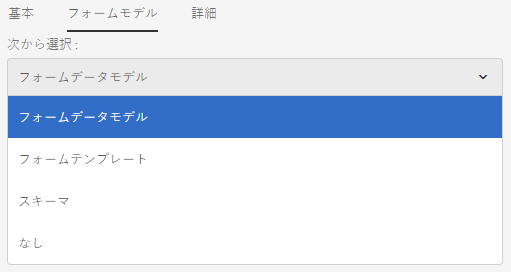
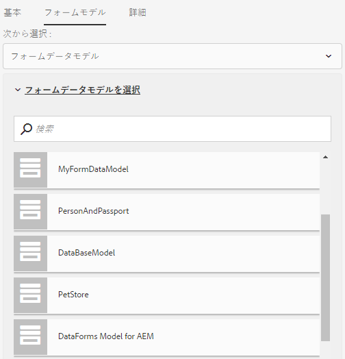
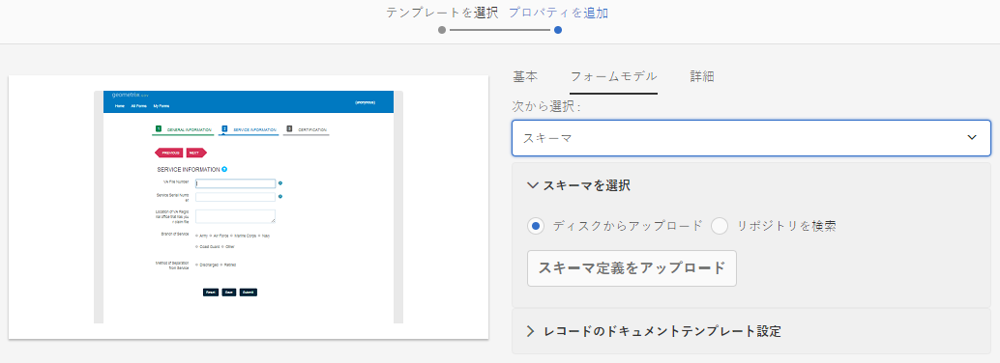
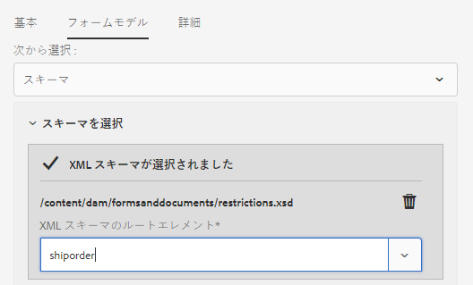

# アダプティブフォームの作成 {#creating-an-adaptive-form}

>[!CAUTION]
>
>AEM 6.4 の拡張サポートは終了し、このドキュメントは更新されなくなりました。 詳細は、 [技術サポート期間](https://helpx.adobe.com/jp/support/programs/eol-matrix.html). サポートされているバージョンを見つける [ここ](https://experienceleague.adobe.com/docs/?lang=ja).

## <strong>アダプティブフォームの作成</strong> {#strong-create-an-adaptive-form-strong}

次の手順に従って、アダプティブフォームを作成します。

1. 次の場所にあるAEM Formsオーサーインスタンスにアクセスする `https://[server]:[port]/<custom-context-if-any>.`

   ```
   
   ```

1. AEMログインページに資格情報を入力します。

   ログインした後、左上隅のをタップします。 **[!UICONTROL Adobe Experience Manager / Forms / Forms &amp; Documents]**.

   >[!NOTE]
   >
   >デフォルトのインストールでは、ログインは `admin`、パスワードは `admin` に設定されています。

1. 「**[!UICONTROL 作成]**」をタップして、「**[!UICONTROL アダプティブフォーム]**」を選択します。
1. テンプレートを選択するためのオプションが表示されます。テンプレートについて詳しくは、「[アダプティブフォームのテンプレート](/help/forms/using/creating-adaptive-form.md#p-adaptive-form-templates-p)」を参照してください。テンプレートをタップして選択し、「次へ」をタップします。
1. 「プロパティの追加」オプションが表示されます。以下のプロパティフィールドの値を指定します。「タイトル」フィールドと「ドキュメント名」フィールドは必須です。

   * **[!UICONTROL タイトル：]**&#x200B;フォームの表示名を指定します。タイトルを指定すると、AEM Formsユーザーインターフェイス内のフォームを識別しやすくなります。
   * **[!UICONTROL 名前：]**&#x200B;フォームの名前を指定します。指定された名前のノードがリポジトリーに作成されます。タイトルを入力し始めると、名前フィールドの値が自動的に生成されます。候補として入力された値は変更可能です。「ドキュメント名」フィールドには、英数字、ハイフン、アンダースコアのみを使用できます。無効な入力は、すべてハイフンに置き換えられます。
   * **[!UICONTROL 説明：]**&#x200B;フォームに関する詳細情報を指定します。
   * **[!UICONTROL タグ：]**&#x200B;アダプティブフォームをユニークに特定するためのタグを指定します。タグを指定すると、フォームを検索しやすくなります。タグを作成するには、「**タグ**」ボックスに新しいタグ名を入力します。

1. 次のフォームモデルのいずれかを基にアダプティブフォームを作成できます。

   * [フォームデータモデル](#fdm)
   * [XFA フォームテンプレート](/help/forms/using/creating-adaptive-form.md#p-create-an-adaptive-form-based-on-an-xfa-form-template-p)
   * [XML または JSON スキーマ](/help/forms/using/creating-adaptive-form.md#p-create-an-adaptive-form-based-on-xml-or-json-schema-p)
   * なし、またはフォームモデルを使用しない

   これらは、**[!UICONTROL プロパティを追加]**&#x200B;ページの「**[!UICONTROL フォームモデル]**」タブから設定できます。デフォルトで選択されているフォームモデルは、「**[!UICONTROL なし]**」です。

1. 「**作成**」をタップします。アダプティブフォームが作成され、編集用フォームを開くためのダイアログが表示されます。

   すべてのプロパティを指定した後、「**[!UICONTROL 作成]**」をクリックします。アダプティブフォームが作成され、編集用フォームを開くためのダイアログが表示されます。

   すべてのプロパティを指定した後、「**[!UICONTROL 作成]**」をクリックします。アダプティブフォームが作成され、編集用フォームを開くためのダイアログが表示されます。

1. 「**[!UICONTROL 開く]**」をタップし、新しく作成されたフォームを新しいタブで開きます。フォームが編集用に開かれ、テンプレート内の利用可能なコンテンツが表示されます。新しく作成されたフォームを必要に応じてカスタマイズするためのサイドバーも表示されます。

   アダプティブフォームのタイプに基づいて、関連する XFA フォームテンプレート、XML スキーマ、JSON スキーマに存在するフォーム要素が **[!UICONTROL データモデルオブジェクト]** タブ **[!UICONTROL コンテンツブラウザー]** サイドバーに表示されます。 また、これらの要素をドラッグ&amp;ドロップしてアダプティブフォームを作成することもできます。

   アダプティブフォームのオーサリングインターフェイスと使用可能なコンポーネントについて詳しくは、 [アダプティブフォームのオーサリングの概要](/help/forms/using/introduction-forms-authoring.md).

   >[!NOTE]
   >
   >ブラウザーでポップアップウィンドウを許可して、新しく作成されたフォームを新しいタブで開きます。

## フォームデータモデルに基づくアダプティブフォームの作成 {#fdm}

[AEM Formsデータ統合](/help/forms/using/data-integration.md) では、複数のデータソースを統合し、そのエンティティとサービスを統合して、フォームデータモデルを作成することができます。 これは、JSON スキーマの拡張機能です。フォームデータモデルを使用して、アダプティブフォームを作成することができます。 フォームデータモデルで設定されたエンティティまたはデータモデルオブジェクトは、フォームのオーサリング用のデータモデルオブジェクトとして使用できます。 これらは各データソースに結合され、フォームの事前入力や送信済みデータの各データソースへの書き戻しに使用されます。アダプティブフォームのルールを使用して、フォームデータモデル内で設定されたサービスを呼び出すこともできます。

フォームデータモデルを使用してアダプティブフォームを作成するには：

1. プロパティを追加画面の「フォームモデル」タブで、 **[!UICONTROL 次から選択]** ドロップダウンリストから「**[!UICONTROL フォームデータモデル]**」を選択します。

   

1. 「**[!UICONTROL フォームデータモデルを選択]**」をタップして展開します。使用可能なすべてのフォームデータモデルが表示されます。

   データモデルからを選択します。

   

>[!NOTE]
>
>アダプティブフォーム向けにフォームデータモデルを変更することもできます。手順について詳しくは、[アダプティブフォームのフォームモデルプロパティの編集](#edit-form-model)を参照してください。

## XFA フォームテンプレートに基づくアダプティブフォームの作成 {#create-an-adaptive-form-based-on-an-xfa-form-template}

XFA フォームテンプレートを再利用して、アダプティブフォームを作成することができます。 再利用するには、XFA フォームテンプレートをアップロードし、アダプティブフォームに関連付けます。 フォームテンプレート（XFA フォーム）の要素は、アダプティブフォームの作成時にコンテンツファインダーで使用できるようになります。 フォームテンプレート要素は、コンテンツファインダーからフォームにドラッグ&amp;ドロップできます。

>[!NOTE]
>
>[XFA フォームテンプレートのアップロード](/help/forms/using/get-xdp-pdf-documents-aem.md) をAEM Formsにアップロードしてから、フォームテンプレートに基づいてアダプティブフォームを作成します。

アダプティブフォームのフォームモデルとして XFA フォームテンプレートを使用するには、以下の手順を実行します。

1. の **[!UICONTROL プロパティを追加]** ページで、 **[!UICONTROL フォームモデル]** タブをクリックします。
1. 「フォームモデル」タブで、ドロップダウンリストから「 **[!UICONTROL フォームテンプレート]**. AEM Forms UI を使用してリポジトリにアップロードされたすべてのフォームテンプレートが、選択用にリスト表示されます。 リストからテンプレートを選択します。

   
   **図：** *フォームテンプレートの選択*

   >[!NOTE]
   >
   >アダプティブフォームのフォームテンプレートを変更することもできます。 手順について詳しくは、[アダプティブフォームのフォームモデルプロパティの編集](#edit-form-model)を参照してください。

## XML スキーマまたは JSON スキーマに基づくアダプティブフォームの作成 {#create-an-adaptive-form-based-on-xml-or-json-schema}

XML スキーマおよび JSON スキーマは、組織内のバックエンドシステムによってデータが作成または使用される構造を表します。アダプティブフォームにスキーマを関連付け、そのスキーマの要素を使用することにより、アダプティブフォームに動的なコンテンツを追加することができます。スキーマの要素は、アダプティブフォームを作成する際に、コンテンツブラウザーの「データモデルオブジェクト」タブで使用できます。スキーマ要素をドラッグ＆ドロップしてフォームを作成できます。

アダプティブフォームをオーサリングするための XML または JSON スキーマのデザイン方法については、以下のドキュメントを参照してください。

* [XML スキーマを使用したアダプティブフォームの作成](/help/forms/using/adaptive-form-xml-schema-form-model.md)
* [JSON スキーマを使用したアダプティブフォームの作成](/help/forms/using/adaptive-form-json-schema-form-model.md)

アダプティブフォームのフォームモデルとして XML スキーマまたは JSON スキーマを使用するには、以下を行ってください。

1. アダプティブフォーム作成ページの&#x200B;**[!UICONTROL プロパティを追加]**&#x200B;ステップで、「**[!UICONTROL フォームモデル]**」タブをタップします。
1. 「フォームモデル」のタブで、 **[!UICONTROL 次から選択]** ドロップダウンから「**[!UICONTROL スキーマ]**」を選択します。

1. 「**[!UICONTROL スキーマを選択]**」をタップして、以下のいずれかの操作を行います。

   * **[!UICONTROL ディスクからアップロード]** - このオプションを選択して、「スキーマ定義をアップロード」をタップし、ファイルシステムから XML スキーマまたは JSON スキーマを参照してアップロードします。アップロードされたスキーマファイルはフォームと共に存在し、他のアダプティブフォームからはアクセスできません。
   * **[!UICONTROL リポジトリーを検索]** - このオプションを選択して、リポジトリーで使用できるスキーマ定義ファイルのリストから選択します。XML または JSON スキーマファイルをフォームモデルとして選択します。選択したスキーマは参照によってフォームに関連付けられ、他のアダプティブフォームで使用するためにアクセス可能になります。

   >[!CAUTION]
   >
   >JSON スキーマファイル名が **.schema.json** で終わることを確認してください。例：mySchema.schema.json

   
   **図**：*XML または JSON スキーマの選択*

1. （XML スキーマのみ）XML スキーマを選択またはアップロードした後、選択した XSD ファイルのルートエレメントを指定してアダプティブフォームにマッピングします。

   
   **図**：*XSD ルート要素の選択*

>[!NOTE]
>
>アダプティブフォームのスキーマを変更することもできます。手順について詳しくは、[アダプティブフォームのフォームモデルプロパティの編集](#edit-form-model)を参照してください。

## アダプティブフォームテンプレート {#adaptive-form-templates}

テンプレートは基本的な構造を提供し、アダプティブフォームの外観（レイアウトとスタイル）を定義します。 これには、特定のプロパティやコンテンツ構造を有するフォーマット済みのコンポーネントが含まれます。デフォルトでは、AEM Formsにはアダプティブフォームテンプレートがいくつか用意されています。 高度なテンプレートを含む完全なテンプレートパッケージを取得するには、AEM Formsアドオンパッケージをインストールする必要があります。 詳しくは、 [AEM Formsアドオンパッケージのインストール](/help/forms/using/installing-configuring-aem-forms-osgi.md).

さらに、テンプレートエディターを使用して独自のテンプレートを作成できます。 テンプレートの操作について詳しくは、 [アダプティブフォームテンプレート](/help/forms/using/template-editor.md).

>[!NOTE]
>
>高度なテンプレートを使用して作成されたアダプティブフォームを編集用に開くと、エラーメッセージが表示されます。 高度なテンプレートには署名ステップコンポーネントがあり、Acrobat Signはデフォルトで有効になっています。 を作成して選択します。 [Acrobat Signクラウド設定](/help/forms/using/adobe-sign-integration-adaptive-forms.md) および [署名者の設定](/help/forms/using/working-with-adobe-sign.md#addsignerstoanadaptiveform) をクリックしてエラーを解決します。

## アダプティブフォームのフォームモデルプロパティの編集 {#edit-form-model}

アダプティブフォームは、フォームモデルを使用せず（フォームモデルの「なし」オプションを使用）、またはフォームテンプレート、XML スキーマ、JSON スキーマ、フォームデータモデルなどのフォームモデルを使用して作成されます。 アダプティブフォームのフォームモデルは、「なし」から別のフォームモデルに変更できます。 フォームモデルに基づくアダプティブフォームの場合は、同じフォームモデルに対して別のフォームテンプレート、XML スキーマ、JSON スキーマ、またはフォームデータモデルを選択できます。 ただし、フォームモデルを別のフォームモデルに変更することはできません。

1. アダプティブフォームを選択し、「**プロパティ**」アイコンをタップします。
1. 「**[!UICONTROL フォームモデル]**」タブを開き、以下のいずれかを実行します。

   * アダプティブフォームにフォームモデルがない場合は、別のフォームモデルを選択し、それに応じて、フォームテンプレート、XML スキーマ、JSON スキーマ、またはフォームデータモデルを選択できます。
   * アダプティブフォームがフォームモデルに基づいている場合、同じフォームモデルに対して別のフォームテンプレート、XML スキーマ、JSON スキーマ、またはフォームデータモデルを選択できます。

1. 「**[!UICONTROL 保存]**」をタップして、プロパティを保存します。

## アダプティブフォームの自動保存 {#auto-save-an-adaptive-form}

デフォルトでは、アダプティブフォームのコンテンツは、保存ボタンを押したときなど、ユーザーの操作時に保存されます。 アダプティブフォームを設定して、イベントまたは時間間隔に基づいてコンテンツの自動保存を開始することもできます。 自動保存オプションは、次の場合に便利です。

* 匿名ユーザーおよびログインユーザー向けにコンテンツを自動的に保存
* ユーザーの介入をほとんどまたはほとんど必要とせずにフォームのコンテンツを保存する
* ユーザーイベントに基づいてフォームのコンテンツの保存を開始する
* 指定した時間間隔の後で繰り返しフォームのコンテンツを保存する

### アダプティブフォームの自動保存を有効にする {#enable-auto-save-for-an-adaptive-form}

デフォルトでは、自動保存オプションは有効になっていません。 自動保存オプションは、アダプティブフォームの「自動保存」タブで有効にすることができます。 「自動保存」タブには、その他の設定オプションもいくつか用意されています。 次の手順を実行して、アダプティブフォームの自動保存オプションを有効に設定します。

1. プロパティの「自動保存」セクションにアクセスするには、コンポーネントを選択して、／**[!UICONTROL アダプティブフォームコンテナ]**／  の順にタップします。
1. 内 **[!UICONTROL 自動保存]** セクション **[!UICONTROL 有効にする]** 自動保存オプション
1. 内 **[!UICONTROL アダプティブフォームイベント]** ボックスに 1 を指定するか、TRUE を指定すると、フォームがブラウザに読み込まれたときに自動的にフォームの保存が開始されます。 また、イベントの条件式を指定すると、そのイベントがトリガーされて true が返され、フォームのコンテンツの保存が開始されます。
1. トリガー 自動保存は、設定に基づいてトリガーされます。 以下のオプションがあります。

   * **[!UICONTROL 時刻ベース]**：指定の時間間隔に基づいてコンテンツの保存を開始するには、このオプションを選択します。
   * **[!UICONTROL イベントベース]**：イベントがトリガーされたときにコンテンツの保存を開始するには、このオプションを選択します。

   「トリガー」を選択すると、「方法の設定」ボックスが有効になります。 「方法の設定」ボックスでは、次の操作を実行できます。

   * **[!UICONTROL 時刻ベース]**&#x200B;のトリガーを選択した場合は、時間間隔を指定します。
   * **[!UICONTROL イベントに基づく]**&#x200B;トリガーを選択した場合は、イベントの名前を指定します。

   また、独自のカスタム方法を作成してリストに追加することもできます。 詳しくは、 [フォームを自動保存するためのカスタム方法の実装](/help/forms/using/auto-save-an-adaptive-form.md#p-implement-a-custom-strategy-to-enable-autosave-for-adaptive-forms-p).

1. （時間ベースの自動保存のみ）次の手順を実行して、時間ベースの自動保存のオプションを設定します。

   1. 内 **[!UICONTROL この間隔で自動保存]** ボックスに、時間間隔を秒単位で指定します。 「間隔」ボックスに指定した秒数が経過すると、フォームは繰り返し保存されます。

1. （イベントベースの自動保存のみ）次の手順を実行して、イベントベースの自動保存のオプションを設定します。

   1. 「**このイベント後に自動保存**」ボックスで、[GuideBridge](https://helpx.adobe.com/jp/aem-forms/6/javascript-api/GuideBridge.html) イベントを指定します。式が TRUE に評価されるたびに、フォームが保存されます。

1. （オプション）匿名ユーザーに対するコンテンツを自動的に保存するには、「**匿名ユーザーの自動保存を有効にする**」オプションを選択し、「**[!UICONTROL OK]**」をクリックします。

   >[!NOTE]
   >
   >自動保存オプションを匿名ユーザーに対して機能させるには、すべてのユーザーがフォームのプレビュー、確認および署名を行えるように Forms 共通設定サービスが設定されていることを確認します。
   >
   >このサービスを設定するには、`https://[server]:[host]/system/console/configMgr` にある AEM web コンソール設定に移動して **[!UICONTROL Forms 共通設定サービス]** を編集し、「**[!UICONTROL 許可]**」フィールドで「**[!UICONTROL すべてのユーザー]**」オプションを選択して、設定を保存します。
