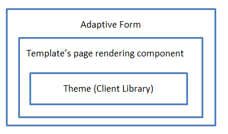
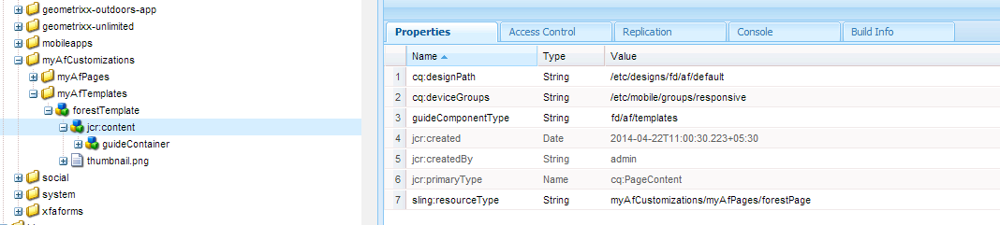

# カスタムアダプティブフォームテーマの作成 {#creating-custom-adaptive-form-themes}

>[!CAUTION]
>
>AEM Forms [テーマエディター](/help/forms/using/themes.md) アダプティブフォームの作成と変更の機能 [テーマ](/help/forms/using/themes.md). この記事に示す手順は、 [テーマエディター](/help/forms/using/themes.md) また、LESS/CSS ファイルを使用して作成されたテーマに対する投資が既に存在します（テーマ前のエディター方式）。

## 前提条件 {#prerequisites}

* LESS(Leaner CSS) フレームワークに関する知識
* Adobe Experience Manager でのクライアントライブラリの作成方法
* 作成したテーマを使用するための[アダプティブフォームテンプレートの作成](/help/forms/using/custom-adaptive-forms-templates.md)

## アダプティブフォームテーマ {#adaptive-form-theme}

**アダプティブフォームテーマ**&#x200B;は、アダプティブフォームのスタイル（ルック＆フィール）を定義するために使用する AEM クライアントライブラリのことです。

**アダプティブテンプレート**&#x200B;を作成し、テンプレートにテーマを適用します。そしてこのカスタムテンプレートを使い、**アダプティブフォーム**&#x200B;を作成します。



## アダプティブフォームテーマを作成するには {#to-create-an-adaptive-form-theme}

>[!NOTE]
>
>次の手順では、ノード、プロパティ、フォルダーなどのAEM オブジェクトに対し、サンプル名を使用して説明します。
>
>この手順にしたがって同じ名前を使用すると、結果として次のスナップショットと同じようなテンプレートが出来上がるはずです：


**図：** *フォレストテーマのサンプル*

1. タイプのノードの作成 `cq:ClientLibraryFolder` の下に `/apps`ノード。

   例として、以下のノードを作成します：

   `/apps/myAfThemes/forestTheme`

1. 複数の値を持つ文字列プロパティ `categories`をノードに追加し、適切な値に設定します。

   例えば、プロパティを `af.theme.forest` に設定します。

   

1. 2 つのフォルダーを追加します。 `less` および `css`、ファイル `css.txt` を手順 1 で作成したノードに追加します。

   * `less` フォルダー：次を含む `less` 変数ファイルを定義します。 `less` 変数と `less mixins` .css スタイルの管理に使用される

      このフォルダーは、`less` 変数ファイル、`less` ミックスインファイル、ミックスインと変数を使用してスタイルを定義する `less` ファイルから構成されています。そして、これらすべての less ファイルは、styles.less にインポートされます。

   * `css` フォルダー：テーマで使用される静的スタイルを定義する CSS ファイルが含まれています。

   **LESS 変数ファイル**：これらは、CSS スタイルを定義するために使用される変数を定義または上書きするためのファイルです。

   アダプティブフォームは、次の LESS ファイルで定義されている OOTB 変数を提供します：

   * `/apps/clientlibs/fd/af/guidetheme/common/less/globalvariables.less`
   * `/apps/clientlibs/fd/af/guidetheme/common/less/layoutvariables.less`

   アダプティブフォームは、次のファイルで定義されているサードパーティ変数も提供しています：

   `/apps/clientlibs/fd/af/third-party/less/variables.less`

   アダプティブフォームで提供される LESS 変数 を使用する、これらの変数を上書きする、または 新しく LESS 変数を作成することができます。

   >[!NOTE]
   >
   >LESS プリプロセッサーのファイルをインポートする際には、インポートステートメント内でファイルの相対パスを指定してください。

   上書き変数の例：

   ```
   @button-background-color: rgb(19, 102, 44);
   @button-border-color: rgb(19, 102, 44);
   @button-border-size: 0px;
   @button-padding: 10px 15px;
   @button-font-color: #ffffff;
   ```

   を上書きするには、 `less`変数：

   1. デフォルトのアダプティブフォーム変数を読み込む：

      `/apps/clientlibs/fd/af/guidetheme/common/less/globalvariables.less/apps/clientlibs/fd/af/guidetheme/common/less/layoutvariables.less`

   1. 次に、上書きされた変数を含む LESS ファイルをインポートします。

   新しい変数の定義の例：

   ```
   @button-focus-bg-color: rgb(40, 208, 90);
   @button-hover-bg-color: rgb(30, 156, 67);
   ```

   **LESS ミックスインファイル：**&#x200B;変数を引数として受け入れる関数を定義することができます。これらの関数の出力が、結果のスタイルとなります。異なるスタイルでこれらのミックスインを使用することにより、CSS スタイルの繰り返しを避けることができます。

   アダプティブフォームは、次のファイルで定義されている OOTB ミックスインを提供します：

   * `/apps/clientlibs/fd/af/guidetheme/common/less/adaptiveforms-mixins.less`

   アダプティブフォームは、次のファイルで定義されているサードパーティミックスインも提供しています：

   * `/apps/clientlibs/fd/af/third-party/less/mixins.less`

   ミックスインの定義の例： 

   ```
   .rounded-corners (@radius) {
     -webkit-border-radius: @radius;
     -moz-border-radius: @radius;
     -ms-border-radius: @radius;
     -o-border-radius: @radius;
     border-radius: @radius;
   }
   
   .border(@color, @type, @size) {
      border: @color @size @type;
   }
   ```

   **styles.less ファイル：**&#x200B;このファイルは、クライアントライブラリに使わなくてはならないすべての LESS ファイル（変数、ミックスイン、スタイル）を含むために使用します。

   次の `styles.less` ファイルのサンプルでは、インポートステートメントは任意の順序で配置することができます。

   次の LESS ファイルをインポートするためのステートメントは必須です：

   * `globalvariables.less`
   * `layoutvariables.less`
   * `components.less`
   * `layouts.less`

   ```
   @import "../../../clientlibs/fd/af/guidetheme/common/less/globalvariables.less";
   @import "../../../clientlibs/fd/af/guidetheme/common/less/layoutvariables.less";
   @import "forestTheme-variables";
   @import "../../../clientlibs/fd/af/guidetheme/common/less/components.less";
   @import "../../../clientlibs/fd/af/guidetheme/common/less/layouts.less";
   
   /* custom styles */
   
   .guidetoolbar {
     input[type="button"], button, .button {
       .rounded-corners (@button-radius);
       &:hover {
         background-color: @button-hover-bg-color;
       }
       &:focus {
         background-color: @button-focus-bg-color;
       }
     }
   }
   
   form {
       background-image: url(../images/forest.png);
    background-repeat: no-repeat;
    background-size: 100%;
   }
   ```

   `css.txt` には、ライブラリにダウンロードする CSS ファイルのパスが含まれています。

   次に例を示します。

   ```
   #base=/apps/clientlibs/fd/af/third-party/css
   bootstrap.css
   
   #base=less
   styles.less
   
   #base=/apps/clientlibs/fd/xfaforms/xfalib/css
   datepicker.css
   listboxwidget.css
   scribble.css
   dialog.css
   ```

   >[!NOTE]
   >
   >styles.less ファイルは必須ではありません。これはつまり、カスタムスタイル、変数、ミックスインを定義していない場合には、このファイルを作成する必要はないということです。
   >
   >しかし、styles.less ファイルを作成しない場合には、css.txt ファイル内の次の行をアンコメントする必要があります：
   >
   >**`#base=less`**
   >
   >さらに、次の行をコメントアウトします：
   >
   >**`styles.less`**

## アダプティブフォームでテーマを使用するには {#to-use-a-theme-in-an-adaptive-form}

アダプティブフォームテーマを作成した後、このテーマをアダプティブフォームで使用するには、次の手順を行ないます：

1. 「[アダプティブフォームテーマを作成するには](/help/forms/using/creating-custom-adaptive-form-themes.md#p-to-create-an-adaptive-form-theme-p)」のセクションで作成したテーマを含めるには、`cq:Component` タイプのカスタムページを作成します。

   例：`/apps/myAfCustomizations/myAfPages/forestPage`

   1. を追加します。 `sling:resourceSuperType` プロパティとその値を `fd/af/components/page/base`.

      

   1. テーマをページで使用するには、ノードに上書きファイル library.jsp を追加する必要があります。

      次に、本記事の「アダプティブフォームテーマを作成するには」のセクションで作成されたテーマをインポートします。

      以下のサンプルコードでは、`af.theme.forest` のテーマをインポートしています。

      ```
      <%@include file="/libs/fd/af/components/guidesglobal.jsp"%>
      <cq:includeClientLib categories="af.theme.forest"/>
      ```

   1. **オプション**：カスタムページでは、header.jsp、footer.jsp、the body.jsp を必要に応じて上書きしてください。

1. カスタムテンプレートを作成します ( 例： `/apps/myAfCustomizations/myAfTemplates/forestTemplate`) の jcr:content が前の手順で作成したカスタムページを指す ( 例： `myAfCustomizations/myAfPages/forestPage)`.

   

1. 前の手順で作成したテンプレートを使って、アダプティブフォームを作成します。アダプティブフォームのルック＆フィールは、本記事の「アダプティブフォームテーマを作成するには」のセクションで作成されたテーマによって定義されています。
