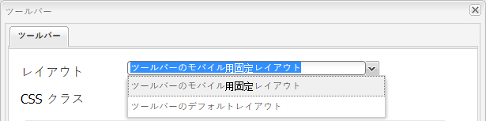
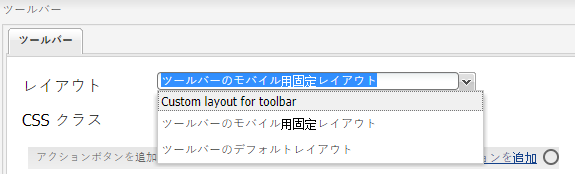
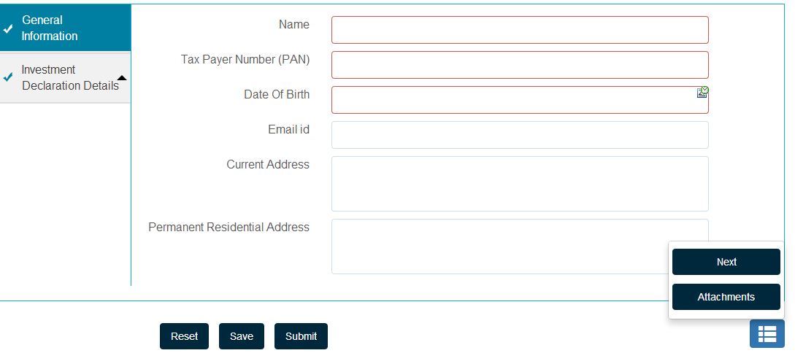

# カスタムツールバーレイアウトの作成 {#creating-custom-toolbar-layout}

## ツールバーレイアウト {#layout}

アダプティブフォームを作成する際に、フォームのツールバーレイアウトを指定できます。 ツールバーレイアウトは、フォーム上のツールバーのコマンドとレイアウトを定義します。

ツールバーレイアウトは、複雑な JavaScript や CSS コードを利用したクライアント側の処理に大きく依存しています。 このコードの提供を編成および最適化することが厄介な問題となることがあります。この問題への対処に役立つように、AEM では、クライアント側ライブラリフォルダーが提供されています。これにより、クライアント側コードをリポジトリに格納し、カテゴリ別に整理して、それぞれのコードカテゴリをクライアントに保存するタイミングと方法を定義することができます。その後、クライアント側ライブラリシステムにより、最終的な web ページで、正しいコードを読み込むための正しいリンクが作成されます。詳細については、[AEM におけるクライアントサイドライブラリの機能](/help/sites-developing/clientlibs.md)を参照してください。


**図：** *ツールバーのサンプルレイアウト*

アダプティブフォームには、次の一連の標準レイアウトが用意されています。


**図：** *すぐに使用できるツールバーレイアウト*

また、カスタムのツールバーレイアウトを作成できます。

次の手順では、3 つのアクションをツールバーに表示し、他のアクションをツールバーのドロップダウンリストに表示するカスタムツールバーを作成する手順を説明します。

添付されたコンテンツパッケージには、以下に説明するコード全体が含まれています。 コンテンツパッケージをインストールしたら、`/content/forms/af/CustomLayoutDemo.html` を開いてカスタムツールバーレイアウトのデモをご覧ください。

CustomToolbarLayoutDemo.zip

[ファイルの取得](assets/customtoolbarlayoutdemo.zip)
デモカスタムツールバーレイアウト

## カスタムツールバーレイアウトを作成するには {#layout-1}

1. カスタムツールバーレイアウトを維持するためのフォルダーを作成します。 例：

   `/apps/customlayout/toolbar`

   カスタムレイアウトを作成するには、次のフォルダーに用意されている既成のツールバーレイアウトの 1 つを使用（およびカスタマイズ）できます。

   `/libs/fd/af/layouts/toolbar`

   例えば、`mobileFixedToolbarLayout` ノードを `/libs/fd/af/layouts/toolbar` フォルダーから `/apps/customlayout/toolbar` フォルダーにコピーします。

   toolbarCommon.jsp も `/apps/customlayout/toolbar` フォルダーにコピーします。

   >[!NOTE]
   >
   >カスタムレイアウトを保存するために作成したフォルダーは、`apps` フォルダーで作成されたものでなければなりません。

1. コピーしたノード `mobileFixedToolbarLayout` の名前を `customToolbarLayout.` に変更します。

   また、ノードの関連する説明も入力します。 例えば、ノードの jcr:description をに変更します。 **ツールバーのカスタムレイアウト**.

   ノードの `guideComponentType` プロパティによりレイアウトタイプが決まります。この場合、レイアウトタイプはツールバーなので、ツールバーレイアウト選択ドロップダウンに表示されます。

   

   適切な説明を付けたノード

   新しいカスタムツールバーレイアウトは、**アダプティブフォームツールバー**&#x200B;ダイアログ設定に表示されます。

   

   使用可能なツールバーレイアウトのリスト

   >[!NOTE]
   >
   >前の手順で更新された説明が、レイアウトドロップダウンリストに表示されます。

1. このカスタムツールバーレイアウトを選択し、「OK」をクリックします。

   clientlib（javascript と css）を `/etc/customlayout` ノードに追加し、clientlib の参照を `customToolbarLayout.jsp` に含めます。

   

   customToolbarLayout.css ファイルのパス

   サンプル `customToolbarLayout.jsp`：

   ```php
   <%@include file="/libs/fd/af/components/guidesglobal.jsp" %>
   <cq:includeClientLib categories="customtoolbarlayout" />
   <c:if test="${isEditMode}">
           <cq:includeClientLib categories="customtoolbarlayoutauthor" />
   </c:if>
   <div class="guidetoolbar mobileToolbar mobilecustomToolbar" data-guide-position-class="guide-element-hide">
       <div data-guide-scroll-indicator="true"></div>            
       <%@include file="../toolbarCommon.jsp" %>
   </div>
   ```

   >[!NOTE]
   >
   >レイアウトの guidetoolbar クラスを追加します。 ツールバーの標準のスタイル設定は、guidetoolbar クラスに基づいて定義されます。

   サンプル `toolBarCommon.jsp`：

   ```php
   <%@taglib prefix="fn" uri="https://java.sun.com/jsp/jstl/functions"%>
   <%--------------------  
   This code iterates over all the tool bar items using the guideToolbar bean.
   If the number of toolbar items are more than 3, then we create a dropdown menu using bootstrap for other actions present in the toolbar.
   In both desktop and mobile devices, the layout is different.    
   ---------------------------------%>
   
   <c:forEach items="${guideToolbar.items}" var="toolbarItem" varStatus="loop">
       <c:choose>
         <c:when test="${loop.index gt 2}">
      <c:choose>
       <c:when test="${loop.index eq 3}">
                     <div class="btn-group dropdown">   
                       <button type="button" class="btn btn-primary dropdown-toggle label" data-toggle="dropdown">Actions <span class="caret"></span></button>
                       <button type="button" class="btn btn-primary dropdown-toggle icon" data-toggle="dropdown"><span class="glyphicon glyphicon-th-list"></span></button>
             <ul class="dropdown-menu" role="menu">
                           <li>
                               <div id="${toolbarItem.id}_guide-item">
                                 <sling:include path="${toolbarItem.path}" resourceType="${toolbarItem.resourceType}"/>
                              </div>
                           </li>
                           <c:if test="${loop.index eq (fn:length(guideToolbar.items)-1)}">
                                </ul>
                                </div>
                           </c:if>
       </c:when>
       <c:when test="${loop.index eq (fn:length(guideToolbar.items)-1)}">
                          <li>
                                     <div id="${toolbarItem.id}_guide-item">
                                         <sling:include path="${toolbarItem.path}" resourceType="${toolbarItem.resourceType}"/>
                                     </div>
                           </li>
                       </ul>
                     </div>
   
       </c:when>
       <c:otherwise>
         <li>
          <div id="${toolbarItem.id}_guide-item">
           <sling:include path="${toolbarItem.path}" resourceType="${toolbarItem.resourceType}"/>
          </div>
         </li>
       </c:otherwise>
      </c:choose>
         </c:when>
         <c:otherwise>         
     <div id="${toolbarItem.id}_guide-item">
           <sling:include path="${toolbarItem.path}" resourceType="${toolbarItem.resourceType}"/>
        </div>
         </c:otherwise>
    </c:choose>   
   </c:forEach>
   ```

   CSS は clientlib ノード内に存在します。

   ```css
   .mobilecustomToolbar .dropdown {
       display: inline-block;    
   }
   
   .mobilecustomToolbar .dropdown {
       float: right;   
   }
   
   .mobilecustomToolbar .dropdown > button {
      padding: 6px 12px;  
   }         
   
   .mobilecustomToolbar .dropdown .guideFieldWidget, .mobilecustomToolbar .dropdown .guideFieldWidget button {
       width: 100%;   
   }         
   
   .mobilecustomToolbar .dropdown .caret{
       border-bottom: 6px solid;
       border-right: 6px solid transparent;
       border-left: 6px solid transparent;
    border-top: transparent;                                     
   }
   
   .mobilecustomToolbar .dropdown-menu{
    top: auto;
    bottom: 100%;                            
   }
   
   .mobilecustomToolbar .btn-group {            
    vertical-align: super;            
   }
   
   .mobilecustomToolbar .glyphicon {
    font-size: 24px;
   }
   
   @media (max-width: 767px){                                       
   
    .mobilecustomToolbar .dropdown .guideButton .iconButton-icon {
      display: none;
       }  
   
       .mobilecustomToolbar .dropdown .guideButton .iconButton-label {
      display: inline-block;
       } 
   
       .mobilecustomToolbar .dropdown .guideButton button {
      background-color: #013853;
       }
   
    .mobilecustomToolbar .btn-group {            
     vertical-align: top;            
    }    
   
   }
   ```

>[!NOTE]
>
>前の手順で更新された説明が、レイアウトドロップダウンリストに表示されます。


**図：** *カスタムレイアウトツールバーのデスクトップ表示*
