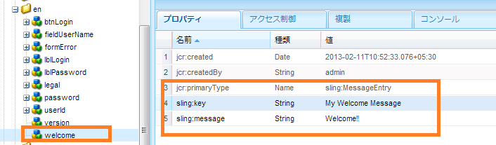

# 新規ログイン画面の作成 {#creating-a-new-login-screen}

AEM Forms ログイン画面を使用するすべての AEM Forms モジュールのログイン画面を変更することができます。例えば、変更すると Forms Manager および AEM Forms Workspace の両方のログイン画面に影響が及びます。

## 前提条件 {#prerequisite}

1. Log in at `/lc/crx/de` with Administrator permissions.
1. 次のアクションを実行します。

   1. 階層構造を複製します。 の `/libs/livecycle/core/content` 場所 `/apps/livecycle/core/content`。 同じ（ノード/フォルダー）プロパティおよびアクセス制御を保持します。
   1. Copy the content folder: from `/libs/livecycle/core` to `/apps/livecycle/core`.
   1. Delete the contents of `/apps/livecycle/core` folder.

1. 次の操作を実行します。

   1. 階層構造を複製します。 の `/libs/livecycle/core/components/login` 場所 `/apps/livecycle/core/components/login`。 同じ（ノード/フォルダー）プロパティおよびアクセス制御を保持します。
   1. Copy the components folder: from `/libs/livecycle/core` to `/apps/livecycle/core`.
   1. Delete the contents of the folder: `/apps/livecycle/core/components/login`.

## 新しいロケールの追加 {#adding-a-new-locale}

1. フォルダーをコピーし `i18n` ます。

   * `/libs/livecycle/core/components/login` から
   * を `/apps/livecycle/core/components/login`

1. Delete all the folders inside `i18n` except one, say `en`.
1. フォルダー `en` で、以下のアクションを実行します。

   1. フォルダーの名前をサポートするロケール名に変更します。例： `ar`
   1. Change the property `jcr:language` value to `ar`(for the `ar` folder).

   >[!NOTE]
   >
   >`ar-DZ` のようにロケールが言語と国コードの組み合わせである場合は、フォルダー名とプロパティ値を `ar-DZ` に変更します。

1. コピー `login.jsp`:

   * `/libs/livecycle/core/components/login` から
   * を `/apps/livecycle/core/components/login`

1. Modify the following snippet of code for `/apps/livecycle/core/components/login/login.jsp`:

   ***ロケールが言語コードである場合***

   ```
   String browserLocale = "en";
       for(int i=0; i<locales.length; i++)
       {
           String prioperty = locales[i];
           if(prioperty.trim().startsWith("en")) {
               browserLocale = "en";
               break;
           }
           if(prioperty.trim().startsWith("de")){
               browserLocale = "de";
               break;
           }
           if(prioperty.trim().startsWith("ja")){
               browserLocale = "ja";
               break;
           }
           if(prioperty.trim().startsWith("fr")){
               browserLocale = "fr";
               break;
           }
       }
   
   To
   
   String browserLocale = "en";
       for(int i=0; i<locales.length; i++)
       {
           String prioperty = locales[i];
           if(prioperty.trim().startsWith("ar")) {
               browserLocale = "ar";
               break;
           }
           if(prioperty.trim().startsWith("en")) {
               browserLocale = "en";
               break;
           }
           if(prioperty.trim().startsWith("de")){
               browserLocale = "de";
               break;
           }
           if(prioperty.trim().startsWith("ja")){
               browserLocale = "ja";
               break;
           }
           if(prioperty.trim().startsWith("fr")){
               browserLocale = "fr";
               break;
           }
       }
   ```

   ***ロケールが言語-国コードである場合***

   ```
   String browserLocale = "en";
       for(int i=0; i<locales.length; i++)
       {
           String prioperty = locales[i];
           if(prioperty.trim().startsWith("en")) {
               browserLocale = "en";
               break;
           }
           if(prioperty.trim().startsWith("de")){
               browserLocale = "de";
               break;
           }
           if(prioperty.trim().startsWith("ja")){
               browserLocale = "ja";
               break;
           }
           if(prioperty.trim().startsWith("fr")){
               browserLocale = "fr";
               break;
           }
       }
   
   To
   
   String browserLocale = "en";
       for(int i=0; i<locales.length; i++)
       {
           String prioperty = locales[i];
           if(prioperty.trim().equalsIgnoreCase("ar-DZ")) {
               browserLocale = "ar-DZ";
               break;
           }
           if(prioperty.trim().startsWith("en")) {
               browserLocale = "en";
               break;
           }
           if(prioperty.trim().startsWith("de")){
               browserLocale = "de";
               break;
           }
           if(prioperty.trim().startsWith("ja")){
               browserLocale = "ja";
               break;
           }
           if(prioperty.trim().startsWith("fr")){
               browserLocale = "fr";
               break;
           }
       }
   ```

   ***デフォルトのロケールを変更するには***

   ```
   String browserLocale = "en";
   for(int i=0; i<locales.length; i++)
   
   To
   
   String browserLocale = "ar";
   for(int i=0; i<locales.length; i++)
   ```

## 新しいテキストの追加、または既存のテキストの変更 {#adding-new-text-or-modifying-existing-text}

1. コピー `i18n` フォルダ：

   * `/libs/livecycle/core/components/login` から
   * を `/apps/livecycle/core/components/login`

1. ここで、テキストを変更するノード（該当するロケールコードフォルダの下）のプロパティ `sling:message` の値を変更します。翻訳は、ノードのプロパティ `sling:key` の値に示されているキーを介して行われます。
1. 新しいキーと値のペアを追加するには、次のアクションを実行します。次に続くスクリーンショットの例を確認してください。

   1. `sling:MessageEntry` タイプのノードを作成するか、またはすべてのロケールフォルダーの下で既存のノードをコピーして名前を変更します。
   1. コピー `login.jsp` :

      * `/libs/livecycle/core/components/login` から
      * を `/apps/livecycle/core/components/login`
   1. Modify `/apps/livecycle/core/components/login/login.jsp` to incorporate the newly added text.

   

   ```
   div class="loginContent">
                       <span class="loginFlow"></span>
                       <span class="loginVersion"><%= i18n.get("Version: 11.0.0") %></span>
                       <span class="loginTitle"><%= i18n.get("Login") %></span>
                       <% if (loginFailed) {%>
   
   To
   
   div class="loginContent">
                       <span class="loginFlow"></span>
                       <span class="loginVersion"><%= i18n.get("My Welcome Message") %></span>
                       <span class="loginVersion"><%= i18n.get("Version: 11.0.0") %></span>
                       <span class="loginTitle"><%= i18n.get("Login") %></span>
                       <% if (loginFailed) {%>
   ```

## 新しいスタイルの追加、または既存のスタイルの変更 {#adding-new-style-or-modifying-existing-style}

1. Copy `login` node:

   * `/libs/livecycle/core/content` から
   * を `/apps/livecycle/core/content`

1. ファイル `login.js` を削除 `jquery-1.8.0.min.js`し、ノードから `/apps/livecycle/core/content/login.`
1. CSS ファイルのスタイルを変更します。
1. 新しいスタイルを追加するには：

   1. 新追加しいスタイル `/apps/livecycle/core/content/login/login.css`
   1. コピー `login.jsp`

      * `/libs/livecycle/core/components/login` から
      * を `/apps/livecycle/core/components/login`
   1. Modify `/apps/livecycle/core/components/login/login.jsp` to incorporate the newly added styles.


1. 次に例を示します。

   * Add the following to `/apps/livecycle/core/content/login/login.css`.

   ```css
   .newLoginContentArea {
    width: 700px;
    padding: 100px 0px 0px 100px;
   }
   ```

   * /apps/livecycle/core/components/login.jsp で次を変更します。

   ```
   <div class="loginContentArea">
   
   To
   
   <div class="newLoginContentArea">
   ```

>[!NOTE]
>
>If the existing images in `/apps/livecycle/core/content/login` (copied from `/libs/livecycle/core/content/login`) are removed, then remove the corresponding references in CSS.

## 新しい画像の追加 {#add-new-images}

1. 上記の「新しいスタイルの追加、または既存のスタイルの変更」の手順に従います。
1. Add new images in `/apps/livecycle/core/content/login`. 画像を追加するには：

   1. WebDAV クライアントをインストールします。
   1. Navigate to `/apps/livecycle/core/content/login` folder, using webDAV client. For more information, see: [https://dev.day.com/docs/en/crx/current/how_to/webdav_access.html](https://docs.adobe.com/docs/en/crx/current/how_to/webdav_access.html).
   1. 新しい画像を追加します。

1. に追加追加された新しい画像に `/apps/livecycle/core/content/login/login.css,` 対応するの新しいスタイル `/apps/livecycle/core/content/login`。
1. Use the new styles in `login.jsp` at `/apps/livecycle/core/components`.
1. 以下に例を示します。

   * Add the following to `/apps/livecycle/core/content/login/login.css`

   ```css
   .newLoginContainerBkg {
    background-image: url(my_Bg.gif);
    background-repeat: no-repeat;
    background-position: left top;
    width: 727px;
   }
   ```

   * /apps/livecycle/core/components/login.jsp で次を変更します。

   ```
   <div class="loginContainerBkg">
   
   To
   
   <div class="newLginContainerBkg">
   ```
