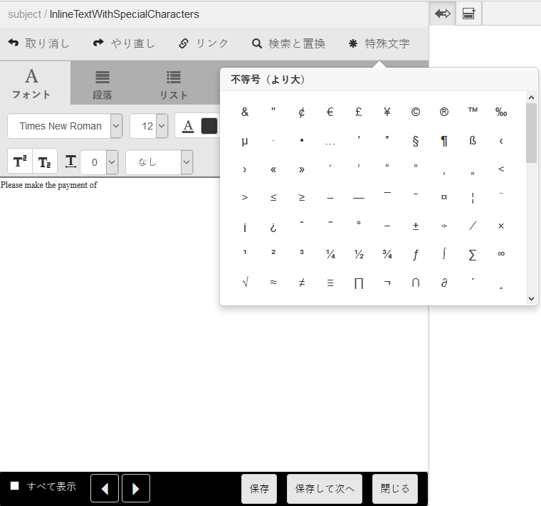

# Correspondence Management でカスタム特殊文字を使用する {#custom-special-characters-in-correspondence-management}

## 概要 {#overview}

Correspondence Managementhas では210 種類の特殊文字に初期状態から対応しており、レターに簡単に挿入できます。

たとえば、次の特殊文字を挿入できます。

* 通貨記号 (€、¥、£など )
* 数学記号 (∑、√、∂、^など )
* 句読点記号（「 」と「 」）

レターでは、次の場所で特殊文字を挿入することができます。

* 内 [テキストエディター](/help/forms/using/document-fragments.md#createtext)
* 内 [編集可能な、通信内のインラインモジュール](/help/forms/using/create-correspondence.md#managecontent)

管理者は、カスタマイズすることで特殊文字を増やしたり、カスタムの特殊文字を追加したりすることができます。この記事では、カスタムの特殊文字を対以下する方法について説明します。

## Correspondence Management でカスタム特殊文字を追加・編集する {#creatingfolderstructure}

カスタム特殊文字の追加手順は次のとおりです。

1. に移動します。 `https://[server]:[port]/[ContextPath]/crx/de` 管理者としてログインします。
1. apps フォルダーに、 **[!UICONTROL 特殊文字]** specialcharacters フォルダー（「libs」の下の textEditorConfig フォルダーにある）に似たパス/構造を持ちます。

   1. を右クリックします。 **特殊文字** 次のパスにあるフォルダーを選択し、 **ノードをオーバーレイ**:

      `/libs/fd/cm/ma/gui/configuration/textEditorConfig/specialcharacters`

   1. ノードをオーバーレイダイアログに次の値が表示されていることを確認します。

      **パス：** /libs/fd/cm/ma/gui/configuration/textEditorConfig/specialcharacters

      **オーバーレイの場所：** /apps/

      **ノードタイプを一致させる：** 確認済み

      >[!NOTE]
      >
      >/libs ブランチでは変更を加えないでください。 次の操作を行った場合はこのブランチが変更されるため、各自で加えた変更はすべて失われます。
      >
      >* インスタンス上でのアップグレード
      >* ホットフィックスの適用
      >* 機能パックのインストール

   1. 「**OK**」をクリックし、「**すべて保存**」をクリックします。指定されたパスに「specialcharacters」フォルダが作成されます。

      オーバーレイを作成したら、ノード構造タグを確認します。オーバーレイを使用して/ apps 内に作成された各ノードは、そのノードの/libs 内で定義されているのと同じクラスとプロパティを持つ必要があります。/apps の下にあるノード構造にプロパティまたはタグがない場合は、タグを /libs 内の対応するノードと同期させます。

1. **[!UICONTROL textEditorConfig]** ノードには次のプロパティや値があることを確認してください。

   | 名前 | タイプ | 値 |
   |---|---|---|
   | cmConfigurationType | 文字列 | cmTextEditorConfiguration |
   | cssPath | 文字列 | /libs/fd/cm/ma/gui/components/admin/createasset/textcontrol/clientlibs/textcontrol |

1. を右クリックします。 **[!UICONTROL 特殊文字]** 次のパスにあるフォルダーを選択し、 **作成/子ノード** 次に、 **すべて保存**:

   /apps/fd/cm/ma/gui/configuration/textEditorConfig/specialcharacters/&lt;YourChildNode>

1. 「テキストエディタ\Correspondence UI の作成」ページを更新します。追加したノードは、UI 内の特殊文字リストで最後のノードです。
1. 「**すべて保存**」をクリックします。
1. 必要に応じて、次のように特殊文字を変更します。

<table> 
 <tbody> 
  <tr> 
   <td><strong>To...</strong></td> 
   <td><strong>次の手順を実行します。</strong></td> 
  </tr> 
  <tr> 
   <td>カスタマイズした特殊文字を追加する</td> 
   <td> 
    <ol> 
     <li>「/apps/fd/cm/ma/gui/configuration/textEditorConfig/specialcharacters」の下に、必須のプロパティを持つ子ノードを追加します。</li> 
     <li>「すべて保存」をクリックします。</li> 
     <li>変更を表示するには、「テキストエディタ\Correspondence UI の作成」ページを更新します。</li> 
    </ol> </td> 
  </tr> 
  <tr> 
   <td>既存の特殊文字プロパティを更新する</td> 
   <td> 
    <ol> 
     <li>更新するノードを上で説明したようにオーバーレイし、タグとクラスを検証します。</li> 
     <li>caption、value、end value、multipliCation などの値を変更します。 </li> 
     <li>「すべて保存」をクリックします。 </li> 
     <li>変更を表示するには、「テキストエディタ\Correspondence UI の作成」ページを更新します。</li> 
    </ol> </td> 
  </tr> 
  <tr> 
   <td>特殊文字を非表示にする</td> 
   <td> 
    <ol> 
     <li>「/apps/fd/cm/ma/gui/configuration/textEditorConfig/specialcharacters」の下に非表示にするノードをオーバーレイします。</li> 
     <li>非表示にするノード（apps の下）に sling:hideResource (Boolean) プロパティを追加します。 </li> 
     <li>「すべて保存」をクリックします。 </li> 
     <li>変更を表示するには、「テキストエディタ\Correspondence UI の作成」ページを更新します。  </li> 
    </ol> </td> 
  </tr> 
  <tr> 
   <td>複数の特殊文字を非表示にする</td> 
   <td> 
    <ol> 
     <li>「/apps/fd/cm/ma/gui/configuration/textEditorConfig/specialcharacters」にプロパティ「sling:hideChildren (String or String[])」を追加します。 </li> 
     <li>ノード名（非表示にする特殊文字）を「sling:hideChildren」プロパティの値として追加します。 </li> 
     <li>「すべて保存」をクリックします。 </li> 
     <li>変更を表示するには、「テキストエディタ\Correspondence UI の作成」ページを更新します。  </li> 
    </ol> </td> 
  </tr> 
  <tr> 
   <td>特殊文字の並び替え</td> 
   <td> 
    <ol> 
     <li>「/apps/fd/cm/ma/gui/configuration/textEditorConfig/specialcharacters」の下に、必須のプロパティを持つ子ノードを追加します。 </li> 
     <li>新しく作成された子ノードに sling:orderBefore (String) プロパティを追加します。 </li> 
     <li>新たに追加した特殊文字の前に、ノード名を値として追加します。 </li> 
     <li>「すべて保存」をクリックします。 </li> 
     <li>変更を表示するには、「テキストエディタ\Correspondence UI の作成」ページを更新します。  </li> 
    </ol> </td> 
  </tr> 
 </tbody> 
</table>
