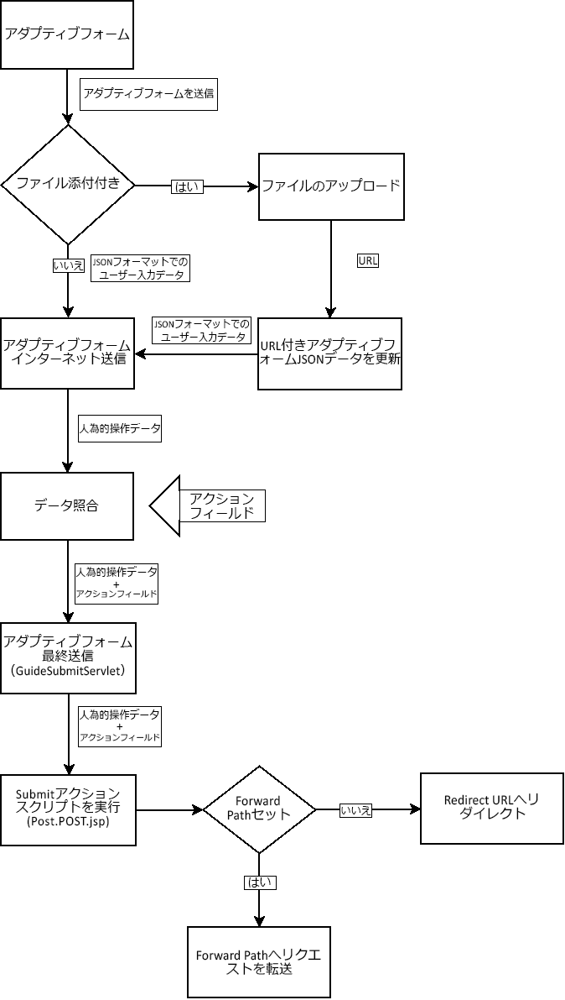
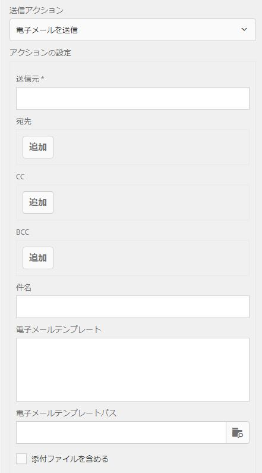

# アダプティブフォーム向けのカスタム送信アクションの作成 {#writing-custom-submit-action-for-adaptive-forms}

Adaptive forms では、ユーザー指定のデータを処理するために、送信アクションが必要となります。送信アクションは、アダプティブフォームを使用して送信するデータに対して実行されるタスクを決定します。 Adobe Experience Manager (AEM) の [OOTB 送信アクション](/help/forms/using/configuring-submit-actions.md) ユーザーが送信したデータを使用して実行できるカスタムタスクを示す 例えば、電子メールの送信やデータの保存などのタスクを実行できます。

## 送信アクションのワークフロー {#workflow-for-a-submit-action}

フローチャートは、 **[!UICONTROL 送信]** ボタンを使用して、アダプティブフォーム内で設定できます。 File Attachment コンポーネントのファイルはサーバーにアップロードされ、フォームデータはアップロードされたファイルの URL で更新されます。クライアント内で、データは JSON 形式で格納されます。クライアントは、指定したデータをメッセージして XML 形式で返信する内部サーブレットに Ajax リクエストを送信します。クライアントは、このデータをアクションフィールドと照合します。フォーム送信アクションを通じて、データを最終サーブレット（Guide Submit サーブレット）に送信します。 次に、サーブレットが送信アクションにコントロールを転送します。送信アクションは、リクエストを別の Sling リソースに転送したり、ブラウザーを別の URL にリダイレクトしたりできます。



### XML データ形式 {#xml-data-format}

XML データは、**`jcr:data`** リクエストパラメーターを使ってサーブレットへと送信されます。送信アクションは、データを処理するためにパラメーターにアクセスすることができます。次のコードは、XML データの形式を説明しています。フォームモデルにバインドされているフィールドは、**`afBoundData`** セクションに表示されます。バインドされていないフィールドは、`afUnoundData` セクションに表示されます。の形式に関する詳細 `data.xml` ファイル： [アダプティブフォームフィールドの事前入力の概要](/help/forms/using/prepopulate-adaptive-form-fields.md).

```xml
<?xml ?>
<afData>
<afUnboundData>
<data>
<field1>value</field2>
<repeatablePanel>
    <field2>value</field2>
</repeatablePanel>
<repeatablePanel>
    <field2>value</field2>
</repeatablePanel>
</data>
</afUnboundData>
<afBoundData>
<!-- xml corresponding to the Form Model /XML Schema -->
</afBoundData>
</afData>
```

### アクションフィールド {#action-fields}

送信アクションは、非表示の入力フィールドを追加できます (HTML [入力](https://developer.mozilla.org/ja/docs/Web/HTML/Element/Input) タグ ) をレンダリング後のフォームHTMLに追加します。 これらの非表示のフィールドには、フォーム送信の処理中に必要な値を含めることができます。フォームの送信時に、これらのフィールド値は、送信アクションが送信処理中に使用できるリクエストパラメーターとしてポストバックされます。 この入力フィールドは、アクションフィールドと呼ばれます。

例えば、フォームの記入に要した時間も取り込む送信アクションでは、非表示の入力フィールドを追加できます `startTime` および `endTime`.

スクリプトを使って、フォームがレンダリングされた時間ならびにフォーム送信前の時間を、それぞれ `startTime` および `endTime` フィールドの値として指定することができます。その後、送信アクションのスクリプト `post.jsp` が、リクエストパラメーターを使ってこれらのフィールドにアクセスし、フォームの記入にかかった合計時間を計算することができます。

### 添付ファイル {#file-attachments}

送信アクションでは、添付ファイルコンポーネントを使用してアップロードした添付ファイルを使用することもできます。 送信アクションスクリプトは、スリング [RequestParameter API](https://sling.apache.org/apidocs/sling5/org/apache/sling/api/request/RequestParameter.html) を使ってこれらのファイルにアクセスすることができます。API の [isFormField](https://sling.apache.org/apidocs/sling5/org/apache/sling/api/request/RequestParameter.html#isFormField()) メソッドは、リクエストパラメーターがファイルであるかフォームフィールドであるかを特定するのに役立ちます。送信アクション内のリクエストパラメーターを反復することで、File Attachment パラメーターを特定することができます。

次のサンプルコードは、まず、リクエスト内の添付ファイルを特定します。続いて、このコードは、[Get API](https://sling.apache.org/apidocs/sling5/org/apache/sling/api/request/RequestParameter.html#get()) を使ってファイルにデータを読み込みます。最後に、データを使用してドキュメントオブジェクトを作成し、それをリストに追加します。

```java
RequestParameterMap requestParameterMap = slingRequest.getRequestParameterMap();
for (Map.Entry<String, RequestParameter[]> param : requestParameterMap.entrySet()) {
    RequestParameter rpm = param.getValue()[0];
    if(!rpm.isFormField()) {
        fileAttachments.add(new Document(rpm.get()));
    }
}
```

### 転送パスおよびリダイレクト URL {#forward-path-and-redirect-url}

要求されたアクションを実行した後、送信サーブレットは、リクエストを転送パスに転送します。アクションが、setForwardPath API を使って Guide Submit サーブレットに転送パスを作成します。

アクションによって転送パスが指定されない場合、送信サーブレットは、リダイレクト URL を使ってブラウザーをリダイレクトします。作成者は、アダプティブフォーム編集ダイアログの「ありがとうございます」ページ設定を使って、リダイレクト URL を設定します。また、Guide Submit の送信アクションまたは setRedirectUrl API を使用して、リダイレクト URL を設定することもできます。 また、Guide Submit サーブレット内の setRedirectParameters API を使って、リダイレクト URL に送られるリクエストパラメーターを設定することもできます。

>[!NOTE]
>
>リダイレクト URL は、「ありがとうございます」ページ設定を使って作成者が指定します。[OOTB 送信アクション](/help/forms/using/configuring-submit-actions.md)は、リダイレクト URL を使って、転送パスによって参照されるリソースからブラウザーをリダイレクトします。
>
>リソースまたはサーブレットに要求を転送するカスタム送信アクションを作成できます。 転送パスのリソース処理を実行するスクリプトによるリダイレクト URL へのリクエストのリダイレクトは、処理が完了したときに実行するように設定することをお勧めします。

## 送信アクション {#submit-action}

送信アクションは、次の要素を含む sling:Folder です。

* **addfields.jsp**：このスクリプトは、レンディション中に HTML ファイルに追加されるアクションフィールドを指定します。post.POST.jsp スクリプトでの送信中に必要な非表示の入力パラメーターの追加には、このスクリプトを使用します。
* **dialog.xml**：このスクリプトは、CQ Component ダイアログに似ています。作成者がカスタマイズする設定情報を提供します。このフィールドは、送信アクションを選択すると、アダプティブフォーム編集ダイアログの「送信アクション」タブに表示されます。
* **post.POST.jsp**：送信サーブレットは、送信されたデータおよび前のセクションからの追加データで、このスクリプトを呼び出します。このページで言及されるアクションの実行は、post.POST.jsp スクリプトの実行を意味します。送信アクションをアダプティブフォームに登録して、アダプティブフォーム編集ダイアログに表示するには、次のプロパティをスリングに追加します:Folder:

   * 文字列型の **guideComponentType** および値 **fd/af/components/guidesubmittype**
   * **guideDataModel** 送信アクションを適用できるアダプティブフォームのタイプを指定する String 型の。 **xfa** は、 **xsd** は、XSD ベースのアダプティブフォームでサポートされています。 **基本** は、XDP または XSD を使用しないアダプティブフォームでサポートされています。 複数のタイプのアダプティブフォームでのアクションを表示するには、対応する文字列を追加します。各文字列はカンマで区切ります。例えば、XFA および XSD ベースのアダプティブフォームにアクションを表示するには、次の値を指定します **xfa** および **xsd** それぞれ
   * 文字列型の **jcr:description**。このプロパティの値は、アダプティブフォーム編集ダイアログの「送信アクション」タブにある「送信アクション」リストに表示されます。 OOTB アクションは、**/libs/fd/af/components/guidesubmittype** の場所にある CRX リポジトリーに存在します。

## カスタム送信アクションの作成 {#creating-a-custom-submit-action}

次の手順を実行し、CRX リポジトリにデータを保存した後、メール送信を行うカスタム送信アクションを作成します。アダプティブフォームには、CRX リポジトリにデータを保存する OOTB 送信アクション Store Content（非推奨）が含まれています。 さらに、CQ には、メール送信に使用される [Mail](https://experienceleague.adobe.com/docs/experience-manager-release-information/aem-release-updates/previous-updates/aem-previous-versions.html?lang=ja) API が含まれています。Mail API を使用する前に、 [設定](https://docs.adobe.com/docs/en/cq/current/administering/notification.html?#Configuring Mail Service) システムコンソールを通じて Day CQ Mail サービスを使用します。 リポジトリーにデータを保存するには、コンテンツを格納アクション（非推奨）を再利用できます。コンテンツを格納アクション（非推奨）は、CRX リポジトリーの /libs/fd/af/components/guidesubmittype/store にあります。

1. URL https://&lt;server>:&lt;port>/crx/de/index.jspから、CRXDE Lite にログインします。/apps/custom_submit_action フォルダー内に sling:Folder プロパティを持つノードを作成し、名前を store_and_mail に設定します。custom_submit_action フォルダーが存在しない場合は作成します。

   

1. **必須の設定フィールドを指定します。**

   格納アクションに必要な設定を追加します。/libs/fd/af/components/guidesubmittype/store から、格納アクションの **cq:dialog** ノードを、/apps/custom_submit_action/store_and_email のアクションフォルダーにコピーします。

   

1. **作成者にメール設定を促す設定フィールドを指定します。**

   アダプティブフォームには、ユーザーに電子メールを送信する Email アクションもあります。要件に応じて、このアクションをカスタマイズします。/libs/fd/af/components/guidesubmittype/email/dialog に移動します。cq:dialog ノード内のノードを、送信アクションの cq:dialog ノード (/apps/custom_submit_action/store_and_email/dialog) にコピーします。

   

1. **アクションをアダプティブフォーム編集ダイアログで使用できるようにします。**

   次のプロパティを store_and_email ノードに追加します。

   * **文字列**&#x200B;型の **guideComponentType** および値 **fd/af/components/guidesubmittype**
   * **guideDataModel** タイプ **文字列** および値 **xfa, xsd, basic**
   * **文字列**&#x200B;型の **jcr:description**&#x200B;および値 **Store and Email Action**

1. 任意のアダプティブフォームを開きます&#x200B;**Start** の隣にある「**Edit**」ボタンをクリックし、アダプティブフォームコンテナの **Edit** ダイアログを開きます。新しいアクションが、「**送信アクション**」タブに表示されます。**格納およびメール送信アクション**&#x200B;を選択すると、ダイアログノードに追加された設定が表示されます。

   

1. **アクションを使用してタスクを完了します。**

   post.POST.jsp スクリプトをアクションに追加します（/apps/custom_submit_action/store_and_mail/）。

   OOTB の格納アクション（post.POST.jsp スクリプト）を実行します。以下を使用： [FormsHelper.runAction](https://docs.adobe.com/docs/en/cq/current/javadoc/com/day/cq/wcm/foundation/forms/FormsHelper.html#runAction(java.lang.String, java.lang.String, org.apache.sling.api.resource.Resource, org.apache.sling.api.SlingHttpServletRequest, org.apache.sling.api.SlingHttpServletResponse) CQ が Store アクションを実行するためのコード内で提供する API。 次のコードを JSP ファイルに追加します。

   `FormsHelper.runAction("/libs/fd/af/components/guidesubmittype/store", "post", resource, slingRequest, slingResponse);`

   メールを送信するために、コードが受信者のメールアドレスを設定から読み取ります。アクションのスクリプトに設定値を取り込むには、次のコードを使って現在のリソースのプロパティを読み込みます。同じく、その他の設定ファイルを読み込むこともできます。

   `ValueMap properties = ResourceUtil.getValueMap(resource);`

   `String mailTo = properties.get("mailTo");`

   最後に、CQ Mail API を使用してメールを送信します。[SimpleEmail](https://commons.apache.org/proper/commons-email/apidocs/org/apache/commons/mail/SimpleEmail.html) クラスを使って、次に示すとおりに Email Object を作成します。

   >[!NOTE]
   >
   >JSP ファイルの名前が post.POST.jsp になっていることを確認してください。

   ```java
   <%@include file="/libs/fd/af/components/guidesglobal.jsp" %>
   <%@page import="com.day.cq.wcm.foundation.forms.FormsHelper,
          org.apache.sling.api.resource.ResourceUtil,
          org.apache.sling.api.resource.ValueMap,
                   com.day.cq.mailer.MessageGatewayService,
     com.day.cq.mailer.MessageGateway,
     org.apache.commons.mail.Email,
                   org.apache.commons.mail.SimpleEmail" %>
   <%@taglib prefix="sling" 
                   uri="https://sling.apache.org/taglibs/sling/1.0" %>
   <%@taglib prefix="cq" 
                   uri="https://www.day.com/taglibs/cq/1.0" 
   %>
   <cq:defineObjects/>
   <sling:defineObjects/>
   <%
           String storeContent = 
                       "/libs/fd/af/components/guidesubmittype/store";
           FormsHelper.runAction(storeContent, "post", resource, 
                                   slingRequest, slingResponse);
    ValueMap props = ResourceUtil.getValueMap(resource);
    Email email = new SimpleEmail();
    String[] mailTo = props.get("mailto", new String[0]);
    email.setFrom((String)props.get("from"));
           for (String toAddr : mailTo) {
               email.addTo(toAddr);
      }
    email.setMsg((String)props.get("template"));
    email.setSubject((String)props.get("subject"));
    MessageGatewayService messageGatewayService = 
                       sling.getService(MessageGatewayService.class);
    MessageGateway messageGateway = 
                   messageGatewayService.getGateway(SimpleEmail.class);
    messageGateway.send(email);
   %>
   ```

   アダプティブフォームでアクションを選択します。アクションによりメールが送信され、データが保存されます。
