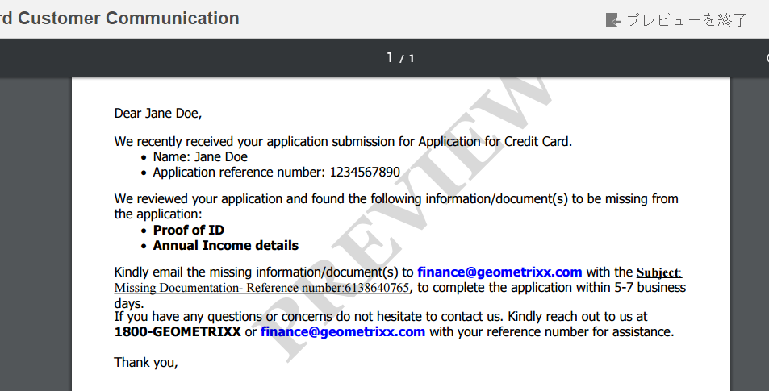

# レター PDF プレビューのカスタム透かし {#custom-watermark-in-letter-pdf-preview}

## 概要 {#overview}

通信を作成 UI では、エージェントユーザーは、電子メールや印刷などの後処理に送信される最終形状の通信をプレビューします。

このデータの不正使用を防ぐために、組織はプレビューPDFに透かしを付けることができます。 デフォルトの透かしは「プレビュー」で、PDF 全体に表示されます。

プレビューの透かしを有効にするには、「PDF」で **[!UICONTROL 透かしを適用]** の「プレビュー中」オプション **[!UICONTROL Correspondence Management 設定]** 時刻 `https://[server]:[port]/system/console/configMgr`.



透かしのテキストと外観をカスタマイズするには、次の手順を実行します。

## 通信を作成 UI でのPDFプレビューで透かしをカスタマイズする {#customizewatermark-}

1. `https://[server]:[port]/[ContextPath]/crx/de` にアクセスし、管理者としてログインします。
1. apps フォルダーで **[!UICONTROL previewwatermark]** という名前のフォルダーを作成します。パスや構造は libs フォルダー内の previewwatermark フォルダーと同様です。

   1. 次のパスにある**previewwatermark **フォルダを右クリックし、「 **ノードをオーバーレイ**:

      `/libs/fd/cm/configFiles/previewwatermark`

   1. オーバーレイノードダイアログに次の値が表示されていることを確認します。

      **パス：** /libs/fd/cm/configFiles/previewwatermark

      **オーバーレイの場所：** /apps/

      **ノードタイプを一致させる：**&#x200B;オン

      >[!NOTE]
      >
      >/libs 分岐は変更しないでください。このブランチは、次の操作を行うたびに変更される可能性が高いので、加えた変更はすべて失われる可能性があります。
      >
      >* インスタンスでのアップグレード
      >* ホットフィックスの適用
      >* 機能パックのインストール


   1. 「**OK**」をクリックし、「**すべて保存**」をクリックします。指定されたパスに、**[!UICONTROL previewwatermark]** フォルダーが作成されます。

1. 「/libs/fd/cm/configFiles/previewwatermark」フォルダーから DDX ファイルをコピーして「/apps/fd/cm/configFiles/previewwatermark」フォルダーに貼り付け、「**[!UICONTROL すべて保存]**」をクリックします。
1. DDX ファイルは /apps/fd/cm/configFiles/previewwatermark/ から必要に応じて変更します。

   ```
   <DDX xmlns="https://ns.adobe.com/DDX/1.0/">
    <PDF result="output.pdf">
     <PDF source="input.pdf"/>
           <Watermark opacity="15%" rotation="45">
            <StyledText>
                     <p font-family="Georgia" font-size="70pt" color="black" font-weight="bold">
                         PREVIEW
                    </p>
            </StyledText>
           </Watermark>
    </PDF>
   </DDX>
   ```

   透かしの外観、テキスト、揃えのカスタマイズについては、[Assembler サービスと DDX リファレンス](https://help.adobe.com/jp_ja/livecycle/11.0/ddxRef.pdf)ドキュメントから、透かしと背景の追加と削除を参照してください。

   >[!NOTE]
   >
   >ddx ファイルでは、結果とソースへの参照を output.pdf および input.pdf に変更しないでください。 ddx ファイルの名前も変更しないでください。

1. 「**すべて保存**」をクリックします。
