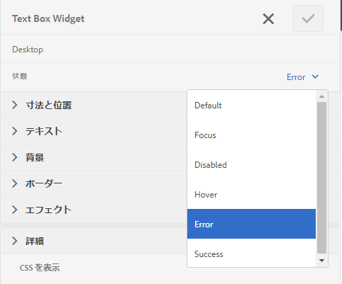

# アダプティブフォームのエラーメッセージのレイアウトと位置のカスタマイズ {#customize-layout-and-positioning-of-error-messages-of-an-adaptive-form}

アダプティブフォームのエラーメッセージのレイアウトと位置をカスタマイズできます。 次のカスタマイズを実行できます。

* 対応の CSS プロパティに変更を加えないでフィールドのキャプションの位置とレイアウトをカスタマイズ
* インラインエラーメッセージの位置をカスタマイズ
* 動的ヘルプインジケーターの内容をカスタマイズ
* 対応する CSS プロパティを変更せずに、フィールドコンポーネント（キャプション、ウィジェット、短い説明、長い説明、ヘルプインジケーターのコンポーネント）の位置をカスタマイズする

## フィールドのレイアウトをカスタマイズ {#customize-layout-of-fields}

キャプションやエラーメッセージの位置を変更するには、1 つのフィールドまたはすべてのフィールドのレイアウトをカスタマイズします。 カスタムレイアウトをフィールドに適用するには、次の手順を実行します。

### 単一フィールドのレイアウトをカスタマイズする {#customize-layout-of-a-single-field}

カスタムレイアウトを単一のフィールドに適用するには、次の手順を実行します。

1. でフォームを開きます。 **スタイル** モード。 スタイルモードでフォームを開くには、ページツールバーで ／**スタイル**&#x200B;をタップしてください。
1. **フォームオブジェクト**&#x200B;の下のサイドバーで、フィールドを選択し、編集ボタン  をタップしてください。
1. カスタマイズするフィールドの状態を選択し、その状態のスタイル設定を指定します。

   

### フォームのすべてのフィールドのレイアウトをカスタマイズする {#customize-layout-of-all-the-fields-of-a-form}

AEM Formsを使用すると、テーマを作成してフォームに適用できます。 テーマエディターを使用すると、1 か所でフォームコンポーネントのスタイルを設定できます。 テーマを作成する場合は、コンポーネントレベルでスタイルを指定します。 テーマについて詳しくは、 [AEM Formsのテーマ](/help/forms/using/themes.md).

テーマエディターを使用してテーマを作成し、フォーム内のすべてのフィールドのレイアウトをカスタマイズします。 テーマを作成した後、次の手順を実行して、テーマをフォームに適用します。

1. フォームを編集モードで開きます。

1. 編集モードで、コンポーネントを選択し、／**アダプティブフォームコンテナ**&#x200B;をタップしてから、  をタップします。
1. アダプティブフォームテーマのサイドバーで、テーマエディターを使用して作成したテーマを選択します。

## カスタムフィールドレイアウトの作成 {#create-a-custom-field-layout}

1. CRXDE Lite を開きます。デフォルトの URL は `https://[Server]:[Port]/crx/de` です。
1. /libs/fd/af/layouts/field ノード（例えば、defaultFieldLayout）から/apps ノード（例えば、/apps/af-field-layout）にフィールドレイアウトをコピーします。
1. コピーしたノードと defaultFieldLayout.jsp ファイルの名前を変更します。 例えば、errorOnRight.jsp。 

1. コピーしたノードの qtip および jcr:description プロパティの値を変更します。例えば、プロパティの値を「Error On Right」に変更します。

1. 新しいスタイルや動作を追加するには、/etc ノードにクライアントライブラリを作成します。

   例えば、/etc/af-field-layout-clientlib の場所で、ノード client-library を作成します。 値 af.field.errorOnRight を持つカテゴリプロパティと次のコードを持つ style.less ファイルを追加します。 

   ```css
   .widgetErrorWrapper {
   
    height: 38px;
    margin: 5px;
   
    .guideFieldWidget{
    width: 60%;
    float: left; 
    }
   
    .guideFieldError{
    overflow:hidden;
    width:40%; 
    }
   
   }
   ```

1. 外観と動作を向上するには、レイアウトファイル内で作成したクライアントライブラリを含めます（errorOnRight.jsp）。
1. フィールドの編集ダイアログを開き、「**スタイル**」タブを選択します。内 **フィールドレイアウトの設定** ドロップダウンボックスで、新しく作成したレイアウトを選択し、 **OK**.

ErrorOnRight.zip パッケージには、フィールドの右側にエラーメッセージを表示するコードが含まれています。

[ファイルを入手](assets/erroronright.zip)
