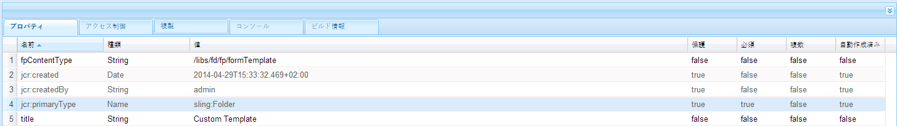

# フォームポータルコンポーネントのテンプレートをカスタマイズする {#customizing-templates-for-forms-portal-components}

## 前提条件 {#prerequisites}

[フォームメタデータの管理](/help/forms/using/manage-form-metadata.md)

HTMLと CSS の実務知識

## 概要 {#overview}

AEM Formsユーザーインターフェイスを使用すると、任意のフォームにメタデータを追加できます。 カスタムメタデータは、組織のフォームをリストおよび検索する際のユーザーエクスペリエンスを強化します。

Forms Portal では、フォームリストにカスタムメタデータを使用できます。 アセットのカスタムテンプレートを作成する際に、レイアウトを変更し、CSS スタイルセットでカスタムメタデータを使用することができます。

様々なForms Portal コンポーネントのカスタムテンプレートを作成するには、次の手順を実行します。

## カスタムテンプレートの作成 {#creating-a-nbsp-custom-template}

1. */apps *の下に sling:Folder ノードを作成します。

   &quot;fpContentType&quot; プロパティを追加カスタムテンプレートを設定しようとしているコンポーネントに応じてプロパティの適切な値を指定します。

   * Search &amp; Lister コンポーネント：&quot;/libs/fd/fp/formTemplate&quot;
   * ドラフト／送信コンポーネント：

      * ドラフトセクション：/libs/fd/fp/draftsTemplate
      * 送信セクション：/libs/fd/fp/submissionsTemplate
   * Link コンポーネント：&quot;/libs/fd/fp/linkTemplate&quot;

   レイアウトテンプレートの選択時に表示するタイトルを追加します。

   *注意：タイトルは、作成した sling:Folder のノード名とは異なる名前にすることができます。 *
   *次の画像は、Search &amp; Listerコンポーネントの構成を示します。* 

1. このフォルダー内に template.html ファイルを作成して、カスタムテンプレートとして使用します。
1. 以下の説明に従って、カスタムテンプレートを記述し、カスタムメタデータを使用します。

## 作業例 {#working-example}

以下は、Forms Portal が Search &amp; Lister コンポーネントのカスタムGeometrixxGov カードレイアウトを取得したカスタムテンプレートの実装例です。

```mxml
<div class="__FP_boxes-container __FP_single-color">
    <div class="boxes __FP_boxes __FP_single-color" data-repeatable="true">
 <div class="__FP_boxes-thumbnail">
     
        </div>
        <h3 class="__FP_single-color" title="${name}" tabindex="0">${name}</h3>
        <p>${description}</p>
        <div class="boxes-icon-cont __FP_boxes-icon-cont">
            <div class="op-dow">
                <a href="${formUrl}" target="_blank" class="__FP_button ${htmlStyle}" title="${config-htmlLinkText}">${localize-Apply}</a>
                <a href="${pdfUrl}" class="__FP_button ${pdfStyle}" title="${config-pdfLinkText}">${localize-Download}</a>
            </div>
        </div>
    </div>
</div>
```

## カスタムテンプレートの技術仕様 {#technical-specifications-for-custom-templates}

すべてのフォームポータルコンポーネントのカスタムテンプレートには、繰り返し可能なエントリと繰り返し不可能なエントリが含まれています。繰り返し可能なエントリは、リスト表示の基本エンティティです。 繰り返し可能なエントリの例としては、Search &amp; Lister、ドラフト&amp;送信、Link コンポーネントがあります。

Forms Portal には、プレースホルダがカスタム/OOTB メタデータを表示するための構文が用意されています。 プレースホルダは、フォーム、ドラフト、または送信の結果を表示した後に入力されます。

繰り返し可能なエントリを含めるには、**data-repeatable** の属性の値を **true** に設定します。

*この例では、2 つの Div 要素がカスタムテンプレートの一番上に存在します。 1 つ目は、「__FP_boxes-container」CSS クラスで、リストされるフォームのコンテナ要素として機能します。 2 つ目は、&quot;__FP_boxes&quot; CSS クラスで、基本エンティティのテンプレートです。この場合はフォームです。 Div 要素に存在する **data-repeatable** の属性の値は **true**&#x200B;です。

それぞれのプレースホルダーには 1 つずつ OOTB メタデータセットがあります. フォーム上の特定の場所にカスタムメタデータを表示するには、 **$metadata_prop プロパティ** その場所に

*この例では、メタデータプロパティは複数のインスタンスで使用されています。例えば、**description**、**name**、**formUrl**、**htmlStyle**、**pdfUrl**、**pdfStyle**、および&#x200B;**path**で所定の方法で使用されます。*

## 標準提供のメタデータ {#out-of-the-box-metadata}

様々なForms Portal コンポーネントは、リスト表示に使用できる排他的な OOTB メタデータのセットを提供します。

### Search &amp; Lister コンポーネント {#search-amp-lister-component}

* **タイトル：**&#x200B;フォームのタイトル
* **名前**:フォームの名前（ほとんどの場合、タイトルと同じです）
* **説明**:フォームの説明
* **formUrl**：フォームを HTML としてレンダリングする URL
* **pdfUrl**：フォームを PDF としてレンダリングする URL
* **アセットタイプ**：アセットの種類有効な値には、**フォーム**、**PDF フォーム**、**印刷フォーム**、および&#x200B;**アダプティブフォーム** などがあります。
* **htmlStyle**&amp; **pdfStyle**：HTML の表示スタイルと PDF アイコンはそれぞれレンダリングに使用されています。有効な値は、「**__FP_display_none**&quot;または&quot; **空白**

   *注意：カスタムスタイルシートで__FP_display_none クラスを必ず使用してください*

* **downloadUrl**：アセットをダウンロードする URL です。

ローカリゼーション、ソート、ユーザーインターフェイス上での設定プロパティ使用のサポート（Search &amp; Lister のみ）:

1. **ローカリゼーションサポート**:静的テキストをローカライズするには、属性を使用します **${localize-***YOUR_TEXT***}** ローカライズされた値が存在しない場合は、その値を使用可能にします。

   *説明した例では、属性${localize-Apply} と${localize-Download} を使用して、「適用」と「ダウンロード」のテキストをローカライズします。*

1. **並べ替えのサポート**:検索結果を並べ替えるには、HTML要素をクリックします。 テーブルレイアウトでの並べ替えを実装するには、特定のテーブルヘッダーに「data-sortKey」属性を追加します。 さらに、ソートしたいメタデータとしてその値を加えます。

   例えば、グリッド表示の「タイトル」ヘッダーでは、「data-sortKey」ヘッダーの値が「タイトル」 です。見出しをクリックして特定の列の値を並べ替えます。

1. **設定プロパティの使用**：Search &amp; Listerコンポーネントには、ユーザーインターフェイスに使える設定がいくつかあります。例えば、編集ダイアログで保存したHTMLツールチップテキストを表示するには、 **${config-htmlLinkText} 属性。**&#x200B;同様に、PDFのツールチップテキストにも&#x200B;**${config-pdfLinkText}** 属性。

### リンクコンポーネント {#link-component}

* **タイトル：**&#x200B;フォームのタイトル
* **formUrl**：フォームを HTML としてレンダリングする URL
* **ターゲット**：リンクのターゲット属性有効な値は、「_blank」および「_self」です。
* **linkText**:リンクのキャプション

### ドラフトと送信コンポーネント {#drafts-amp-submissions-component}

* **パス**:ドラフト/送信メタデータノードのパス。 ドラフトまたは送信を開くには、URL として HTML 拡張子と一緒に使用してください。
* **contextPath**:AEMインスタンスのコンテキストパス
* **firstLetter**:ドラフトとして保存または送信されたアダプティブフォームのタイトルの最初の文字（大文字）
* **formName**:ドラフトとして保存または送信されたアダプティブフォームのタイトル。
* **draftID**:リストされたドラフトの ID（ドラフトセクションのテンプレートでのみ使用）。
* **submitID**:リストに表示される送信の ID（送信セクションのテンプレートでのみ使用）
* **ステータス**:送信されたフォームのステータス。 （「送信」セクションのテンプレートでのみ使用）。
* **説明**:ドラフトまたは送信に関連付けられているアダプティブフォームの説明。
* **diffTime**:現在の時刻とドラフトの最後の保存アクションの差。 または、現在の時刻と送信の最後の送信アクションの差を指定します。
* **iconClass**:ドラフト/送信の最初の文字を表示するために使用される CSS クラス。 Forms Portal には、様々な色の背景を提供する、次のクラスが含まれています。
* **所有者**:ドラフト/送信を作成したユーザー。
* **Today**：DD:MM:YYYY 形式のドラフト作成日または送信日。
* **TimeNow**：HH:MM:SS 24 時間形式のドラフト作成日または送信日

*注意：*

1. ドラフト&amp;送信コンポーネントの下のドラフトセクションにある削除のオプションについては、CSS クラスを &quot;__FP_deleteDraft&quot; と名付けます。さらに、対応するドラフトのドラフト ID である値 **${draftID}** を持つ属性 &quot;draftID&quot; を含めます。

1. ドラフトと送信を開くためのリンクを作成する際に、次の項目を指定できます。 **$path.html** を **href** 属性を設定します。


**A**. コンテナの要素

**B.** 固定階層のある「path」メタデータで、各フォームに保存されたサムネールを取得します。

**C.** 各フォームのテンプレートセクションに使用する Data-repeatable 属性

**D.** 「Apply」文字列をローカライズする

**E.** pdfLink テキストの設定プロパティを使用する

**F.** 「pdfUrl」メタデータを使用する

## ヒント、テクニックおよび既知の問題 {#tips-tricks-and-known-issues}

1. カスタムテンプレートでは一重引用符 (&#39;) を使用しないでください。
1. カスタムメタデータでは、このプロパティは **jcr:content/metadata** ノードにのみ保存してください。他の場所に保存した場合、フォームポータルがメタデータを表示することができません。
1. すべてのカスタムメタデータまたは既存のメタデータの名前にコロン（:）が含まれていないことを確認してください。含まれている場合、ユーザーインターフェイスに表示することができません。
1. **data-repeatable** は、**リンク**&#x200B;コンポーネントにとっては意味はありません。アドビシステムズ社は、お客様がこのプロパティのリンクコンポーネントのテンプレートにおける使用を避けることを推奨します。

## 関連記事

* [フォームポータルコンポーネントの有効化](/help/forms/using/enabling-forms-portal-components.md)
* [フォームポータルページの作成 ](/help/forms/using/creating-form-portal-page.md)
* [API を使用した Web ページ上のフォームの一覧表示](/help/forms/using/listing-forms-webpage-using-apis.md)
* [ドラフトと送信コンポーネントの使用](/help/forms/using/draft-submission-component.md)
* [ドラフトと送信済みフォームのストレージのカスタマイズ](/help/forms/using/draft-submission-component.md)
* [ドラフトと送信コンポーネントとデータベースの統合のサンプル](/help/forms/using/integrate-draft-submission-database.md)
* [フォームポータルコンポーネントのテンプレートをカスタマイズする](/help/forms/using/customizing-templates-forms-portal-components.md)
* [ポータル上のフォーム発行の概要](/help/forms/using/introduction-publishing-forms.md)
