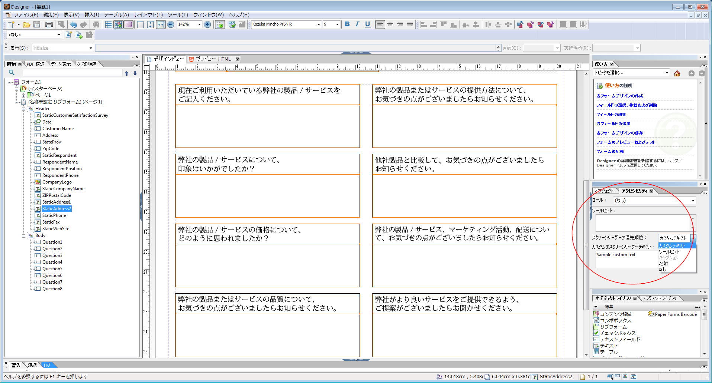

# アクセス可能な HTML5 フォームの設計 {#designing-accessible-html-forms}

HTML5 フォームは ARIA HTML5 アクセシビリティ標準を基に、アクセシビリティを備えた HTML フォームを生成します。これらのフォームは、タブナビゲーション（Mozilla FireFox を除く）をサポートし、一般的な画面読み上げアプリケーションと互換性があります。優れたアクセシビリティ機能を持つHTML5フォームを生成するには、[基本的なデザインガイドライン](/help/forms/using/best-practices-for-html5-forms.md)に基づいてXFAフォームテンプレートをデザインします。 デザインガイドラインには正しいタブ順序の設定、および各フォームコントロールのために読み上げテキストコンテンツの提供などが含まれます。AEM Formsデザイナーでは、アクセシブルなPDFフォームとHTML5フォームを生成するために、これらのフォームコントロール属性の設定をサポートしています。

*注意：タブナビゲーションは、値の合計を表示する計算フィールドなどの保護付きフィールドには適用されません。スクリーンリーダーが保護フィールドの値を読み取れるようにするには、空の読み取り専用フィールドを保護フィールドの上、または横のいずれかに配置します。保護フィールドの値を新しい読み取り専用フィールドに割り当てます。スクリーンリーダーやタブナビゲーションはこの読み取り専用フィールドを選択し、保護フィールドの値として読み上げることができます。*

AEM Forms Designer にはスクリーンリーダーに渡すことが可能な多数の読み上げテキストオプションが含まれています。フォーム内の各オブジェクトごとに、スクリーンリーダーテキストに関する次のいずれかの設定を選択できます。

* カスタムスクリーンリーダーテキスト（アクセシビリティパレットの使用で設定可能）。作成者はボタンとフィールドの名前に加え、その目的について注釈を付けることができます。
* ツールヒント（アクセシビリティパレットで設定可能）。
* フォーム上のフィールドのキャプション。
* オブジェクトの名前（「連結」タブの「名前」オプションで指定）。

ツールヒント、スクリーンリーダーテキスト、およびキャプションなど、複数のオプションがフォームコントロールで使用可能なとき、スクリーンリーダーはこれらのプロパティを 1 つだけ使用します。デフォルト順序はカスタムスクリーンリーダーテキスト、ツールヒント、キャプション、名前です。デフォルト順序はアクセシビリティパレットにある「**スクリーンリーダーの優先順位**」オプションを使用してオーバーライドできます。
