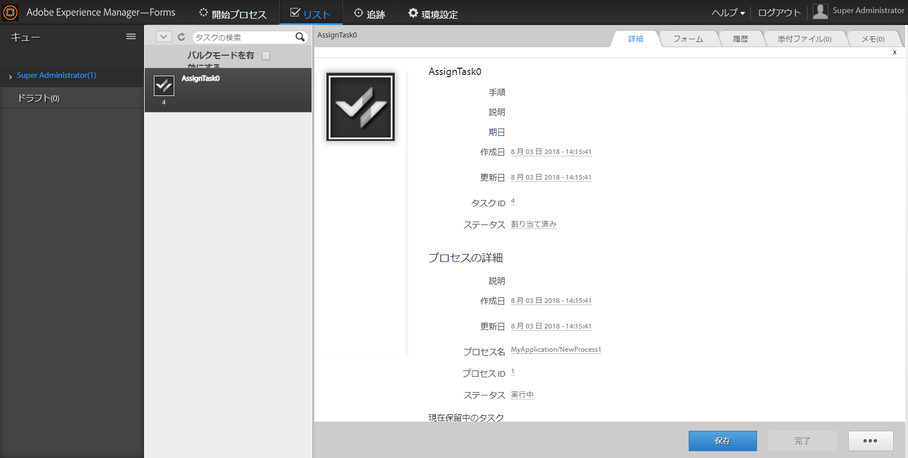

# To Do リストでの追加データの表示 {#displaying-additional-data-in-todo-list}

>[!CAUTION]
>
>AEM 6.4 の拡張サポートは終了し、このドキュメントは更新されなくなりました。 詳細は、 [技術サポート期間](https://helpx.adobe.com/jp/support/programs/eol-matrix.html). サポートされているバージョンを見つける [ここ](https://experienceleague.adobe.com/docs/?lang=ja).

デフォルトでは、AEM Forms Workspace の TODO リストにタスクの表示名と説明が表示されます。 ただし、作成日や期限日など、他の情報を追加することもできます。 また、アイコンを追加して、表示のスタイルを変更することもできます。



この記事では、TODO リストの各タスクに表示する情報を追加する手順について詳しく説明します。

## 追加できる情報 {#what-can-be-added}

サーバーによって送信された `task.json` にある情報を追加することができます。この情報は、プレーンテキストとして追加することも、スタイルを使用して情報を書式設定することもできます。

JSON オブジェクトの説明について詳しくは、 [この](/help/forms/using/html-workspace-json-object-description.md) 記事。

## タスクに関する情報の表示 {#displaying-information-on-a-task}

1. 「[AEM Forms Workspace のカスタマイズの一般的な手順](/help/forms/using/generic-steps-html-workspace-customization.md)」に従います。
1. タスクに追加の情報を表示するには、対応するキーと値のペアを `translation.json` のタスクブロック内に追加する必要があります。

   例えば、`/apps/ws/locales/en-US/translation.json` （英語）に変更します。

   ```
   "task" : {
           "reminder" : {
               "value" : "Reminder",
               "tooltip" : "This is reminder __reminderCount__, for this task."
           },
           "deadlined" : {
               "value" : "Deadlined",
               "tooltip" : "This task has deadlined"
           },
           "save" : {
               "message" : "Task has been saved successfully"
           },
           "status" : {
               "deadlined" : "Deadlined",
               "created" : "Created",
               "assignedsaved" : "Draft from assigned task",
               "terminated" : "Terminated",
               "assigned" : "Assigned",
               "unknown" : "Unknown",
               "createdsaved" : "Draft from created task",
               "completed" : "Completed"
           },
           "draft" : {
               "value" : "Saved",
               "tooltip" : "This task is marked as a draft"
           },
           "escalated" : {
               "value" : "Escalated",
               "tooltip" : "This task has been escalated"
           },
           "forward" : {
               "value" : "Forwarded",
               "tooltip" : "This task was forwarded"
           },
           "priority" : {
               "highest" : "Highest priority",
               "normal" : "Normal priority",
               "high" : "High priority",
               "low" : "Low priority",
               "lowest" : "Lowest priority"
           },
           "claimed" : {
               "value" : "Claimed",
               "tooltip" : "This task has been claimed"
           },
           "locked" : {
               "value" : "Locked",
               "tooltip" : "This task is locked"
           },
           "consulted" : {
               "value" : "Consulted",
               "tooltip" : "This task has been consulted"
           },
           "returned" : {
               "value" : "Returned",
               "tooltip" : "This task was returned back"
           },
           "multiplesubmitbuttons" : {
               "message" : "The form associated with this task has multiple submit buttons so the Workspace Complete button will be disabled. Click the appropriate button on the form to submit it."
           },
           "nosubmitbutton" : {
               "message" : "The form associated with this task does not appear to have submit buttons. You may need to upgrade your Adobe Reader version to 9.1 or greater and enable the Reader Submit option in your process."
           },
           "icon" : {
               "tooltip" : "open the task __taskName__"
           }
       }
   ```

   >[!NOTE]
   >
   >対応するキーと値のペアを、サポートされるすべての言語に追加します。

1. 例えば、次のように、タスクブロック内に情報を追加します。

   ```
   "stepname" : {
               "value" : "Step Name",
               "tooltip" : "This task belongs to __stepName__ step"
   }
   ```

## 新しいプロパティの CSS の定義 {#defining-css-for-the-new-property}

1. タスクに追加された情報（プロパティ）にスタイルを適用できます。 これを行うには、`/apps/ws/css/newStyle.css` に追加された新規プロパティにスタイル情報を追加する必要があります。

   例えば、次を追加します。

   ```css
   .task .taskProperties .stepname{
       width: 25px;
       background: url(../images/stepname.png) no-repeat; /*-------- Or just reuse background image / image-sprite defined .task .taskProperties span of style.css---------------------*/
       background-position: 0px 0px; /*-------- Dummy values, need to be configured as per user background image / image-sprite ---------------------*/
   }
   ```

## エントリテンプレートへのHTMLの追加 {#adding-entry-in-the-html-template}

最後に、タスクに追加する各プロパティの開発パッケージにエントリを含める必要があります。 作成するには、 AEM Forms Workspace コードの構築を参照してください。

1. `task.html` をコピーします：

   * コピー元：`/libs/ws/js/runtime/templates/`
   * コピー先：`/apps/ws/js/runtime/templates/`

1. 新しい情報を `/apps/ws/js/runtime/templates/task.html` に追加します。

   例えば、`div class="taskProperties"` の下に追加します。

   ```
   <span class="stepname" alt="<%= $.t('task.stepname.value')%>" title = '<%= $.t("task.stepname.tooltip",{stepName:stepName})%>'/>
   ```
