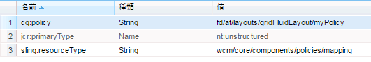

# 使用するテンプレートに基づいたコンポーネントの表示 {#displaying-components-based-on-the-template-used}

フォーム作成者は、[テンプレート](/help/forms/using/template-editor.md)を使用してアダプティブフォームを作成する際、テンプレートポリシーに基づいて、特定のコンポーネントを表示して使用できます。テンプレートコンテンツポリシーを指定することにより、フォームの作成中にフォーム作成者に表示されるコンポーネントのグループを選択できます。

## テンプレートのコンテンツポリシーの変更 {#changing-the-content-policy-of-a-template}

テンプレートを作成すると、そのテンプレートはの下に作成されます。 `/conf` をコンテンツリポジトリに追加します。 で作成したフォルダーに基づいて `/conf` ディレクトリ、テンプレートのパス： `/conf/<your-folder>/settings/wcm/templates/<your-template>`.

テンプレートのコンテンツポリシーに基づいてサイドバーにコンポーネントを表示するには、次の手順を実行します。

1. CRXDE Lite を開きます。

   URL：`https://<server>:<port>/crx/de/index.jsp`

1. CRXDE で、テンプレートを作成したフォルダーに移動します。

   例：`/conf/<your-folder>/`

1. CRXDE で、次の場所に移動します。 `/conf/<your-folder>/settings/wcm/policies/fd/af/layouts/gridFluidLayout/`

   コンポーネントのグループを選択するためには、新しいコンテンツポリシーが必要です。新しいポリシーを作成するには、デフォルトのポリシーをコピーして貼り付け、名前を変更します。

   デフォルトコンテンツポリシーのパス： `/conf/<your-folder>/settings/wcm/policies/fd/af/layouts/gridFluidLayout/default`

   `gridFluidLayout` フォルダーで、デフォルトのポリシーをコピーして貼り付け、名前を変更します。（例：`myPolicy`）。

   

1. 作成する新しいポリシーを選択し、 **コンポーネント** プロパティを右側のパネルにタイプ `string[]`.

   components プロパティを選択して開くと、components を編集ダイアログが表示されます。components を編集ダイアログでは、「**+**」および「**-**」ボタンを使用して、コンポーネントグループを追加または削除できます。作成者が使用するコンポーネントを含むコンポーネントグループを追加できます。

   

   コンポーネントグループを追加した後、 **OK** 一覧を更新するには、次に **すべて保存** をクリックし、CRXDE アドレスバーの上に表示されます。

1. テンプレートで、コンテンツポリシーをデフォルトから、作成した新しいポリシーに変更します。( `myPolicy` （この例では）。

   ポリシーを変更するには、CRXDE でに移動します。 `/conf/<your-folder>/settings/wcm/templates/<your-template>/policies/jcr:content/guideContainer/rootPanel/items`.

   内 `cq:policy` プロパティ、変更 `default` を新しいポリシー名 ( `myPolicy`) をクリックします。

   

   テンプレートを使用して作成したフォームを使用すると、追加したコンポーネントがサイドバーに表示されます。
