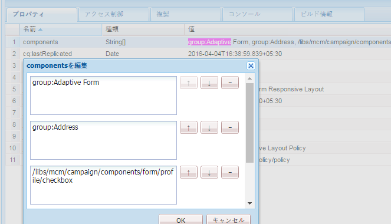

# 使用するテンプレートに基づいたコンポーネントの表示 {#displaying-components-based-on-the-template-used}

>[!CAUTION]
>
>AEM 6.4 の拡張サポートは終了し、このドキュメントは更新されなくなりました。 詳細は、 [技術サポート期間](https://helpx.adobe.com/jp/support/programs/eol-matrix.html). サポートされているバージョンを見つける [ここ](https://experienceleague.adobe.com/docs/?lang=ja).

フォーム作成者が [テンプレート](/help/forms/using/template-editor.md)を使用すると、フォーム作成者は、テンプレートポリシーに基づいて特定のコンポーネントを表示し、使用することができます。 テンプレートコンテンツポリシーを指定して、フォーム作成者がフォームの作成時に表示するコンポーネントのグループを選択できます。

## テンプレートのコンテンツポリシーの変更 {#changing-the-content-policy-of-a-template}

作成したテンプレートは、コンテンツリポジトリの `/conf` に保存されます。テンプレートのパスは、`/conf` ディレクトリに作成したフォルダーに基づいて、`/conf/<your-folder>/settings/wcm/templates/<your-template>` になります。

テンプレートのコンテンツポリシーに基づいてサイドバーにコンポーネントを表示するには、次の手順を実行します。

1. CRXDE Lite を開きます。

   URL：`https://<server>:<port>/crx/de/index.jsp`

1. CRXDE で、テンプレートを作成したフォルダーに移動します。

   例：`/conf/<your-folder>/`

1. CRXDE で、`/conf/<your-folder>/settings/wcm/policies/fd/af/layouts/gridFluidLayout/` に移動します。

   コンポーネントのグループを選択するには、新しいコンテンツポリシーが必要です。 新しいポリシーを作成するには、デフォルトのポリシーをコピー&amp;ペーストし、名前を変更します。

   デフォルトコンテンツポリシーのパス： `/conf/<your-folder>/settings/wcm/policies/fd/af/layouts/gridFluidLayout/default`

   `gridFluidLayout` フォルダーで、デフォルトのポリシーをコピーして貼り付け、名前を変更します。（例：`myPolicy`）。

   

1. 作成した新しいポリシーを選択し、右側のパネルにあるタイプが `string[]` の **components** プロパティを選択します。

   コンポーネントプロパティを選択して開くと、コンポーネントを編集ダイアログが表示されます。 コンポーネントを編集ダイアログでは、 **+** および **-** ボタン 作成者が使用するコンポーネントのフォームを含むコンポーネントグループを追加できます。

   

   コンポーネントグループを追加した後、「**OK**」をクリックしてリストを更新し、CRXDE アドレスバーの上にある「**すべて保存**」をクリックして更新します。

1. テンプレートで、コンテンツポリシーをデフォルトから、作成した新しいポリシーに変更します。（この例では `myPolicy` です。）

   ポリシーを変更するには、CRXDE で `/conf/<your-folder>/settings/wcm/templates/<your-template>/policies/jcr:content/guideContainer/rootPanel/items` に移動します。

   `cq:policy` プロパティで、`default` を新しいポリシー名（`myPolicy`）に変更します。

   

   テンプレートを使用して作成したフォームを使用すると、追加したコンポーネントがサイドバーに表示されます。
