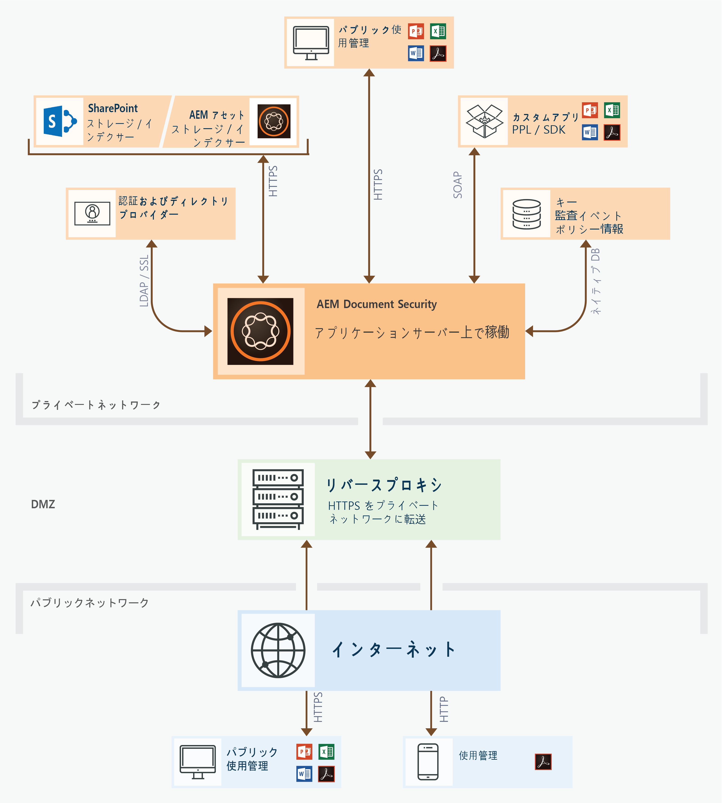
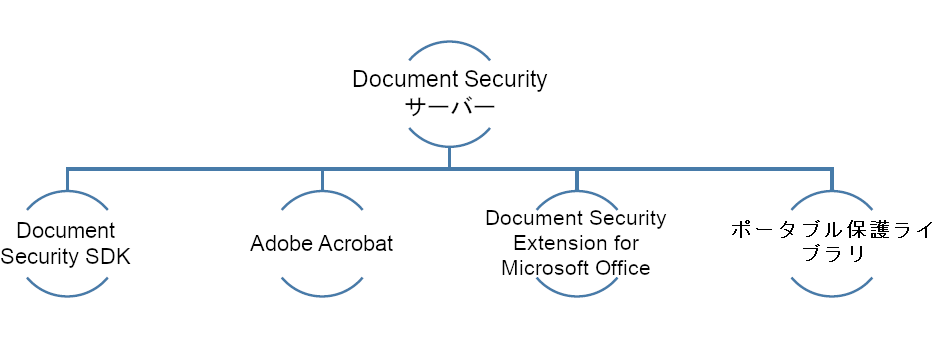

# Document Security の機能 {#document-security-offerings}

Adobe Experience Manager Forms Document Security を使用すると、許可されたユーザーのみがドキュメントを使用できるようになります。 Document Security を使用すると、サポートされている形式で保存した情報を安全に配布できます。 サポートされるファイル形式には、Adobeポータブルドキュメント形式 (PDF) ファイル、Microsoft Word、Excel、PowerPoint ファイルなどがあります。

ポリシーを使用してドキュメントを保護できます。 ポリシーで指定する機密設定によって、ポリシーを適用したドキュメントを受信者が使用する方法が決まります。 例えば、受信者がテキストの印刷やコピー、テキストの編集、または保護されたドキュメントへの署名やコメントの追加を行えるかどうかを指定できます。

ポリシーは Document Security サーバーに保存されます。クライアントアプリケーションを使用してドキュメントにポリシーを適用します。 ドキュメントにポリシーを適用すると、ポリシーで指定された機密設定によって、ドキュメントに含まれる情報が保護されます。 ポリシーで保護されたドキュメントは、ポリシーで承認された受信者に配布できます。

次の図は、AEM Forms Document Security の一般的なアーキテクチャを示しています。

## Document Security クライアント {#document-security-clients}

Document Security は、ドキュメントの保護、保護されたドキュメントの表示と編集、およびインデクサーを提供する様々なクライアントを提供し、保護されたドキュメントに対する全文検索を有効にします。 要件とクライアントの機能に基づいてクライアントを選択できます。

Document Security Server は、Document Security がユーザー認証、ポリシーのリアルタイム管理、機密性の適用などのトランザクションを実行する中央コンポーネントです。 また、サーバーは、ポリシー、監査レコード、その他の関連情報の中央リポジトリも提供します。

Document Security サーバーは、Web ベースのインターフェイス（Web ページ）を提供し、ポリシーの作成、ポリシーで保護されたドキュメントの管理、およびポリシーで保護されたドキュメントに関連するイベントの監視をおこないます。 また、管理者は、招待ユーザーに対するユーザー認証、監査、メッセージングなどのグローバルオプションを設定したり、招待ユーザーアカウントを管理したりできます。

サーバーは、AEM Forms Document Security アドオンの機能に含まれています。 AEM Forms [営業チーム](https://www.adobe.com/jp/products/request-consultation/marketing-cloud.html?s_osc=70114000002JNwKAAW&amp;s_iid=70114000002JHs3AAG) をクリックして、Document Security アドオンを購入します。

### Protectドキュメント {#protect-documents}

AEM Forms Document Security には、セキュリティポリシーを適用するための様々なツールが用意されています。 要件と仕様に応じて、ツールを選択できます。

Document Security SDK、Adobe Acrobat、Document Security Extension for Microsoft Office、またはポータブル保護ライブラリを使用して、セキュリティポリシーを適用、トラッキングすることができます。

* **Document Security SDK:** SDK は、機能豊富なクライアントです。 ドキュメントセキュリティ SDK を使用して Document Server の機能にアクセスしたり、ポリシーで保護されたドキュメントを開いたり、カスタム拡張機能やプラグイン、またはアプリケーションを開発したりすることができます。例えば、カスタムのファイル形式を保護する拡張機能を開発したり、SDK とデータ損失防止 (DLP) ソリューションを統合したりできます。 Document Security SDK を使用して開発された拡張機能、アプリケーション、プラグインは、指定されたAEM Formsサーバーにドキュメントを送信し、ポリシーをサーバーに適用します。 また、AEM Forms Document Security Client SDK(CSDK) は、ポータブル保護ライブラリ (PPL) を使用して保護されたドキュメントの保護を解除することはできません。また、その逆もできません。

   Document Security SDK は Java と C++ の両方で利用することができます。Java SDK は、AEM Forms Document Security の機能に含まれており、JEE 上のAEM forms のデプロイ時にインストールされます。 次の連絡先に： [AEMサポートチーム](https://helpx.adobe.com/jp/marketing-cloud/contact-support.html) C++ SDK を入手する場合。 C++ SDK は、Microsoft Visual Studio 2013 を使用してコンパイルすることができます。 SDK の機能とその使用方法については、[Document Security API のドキュメント](https://help.adobe.com/ja_JP/livecycle/11.0/Services/WS92d06802c76abadb76c48dfe12dbeb3e281-7ff0.2.html)のサイトを参照してください。 

* **Adobe Acrobat：** Adobe Acrobat を使用して、Microsoft Office、ウェブブラウザー、またはその他の PDF 形式の印刷に対応しているアプリケーションなど、一般的なデスクトップアプリケーションで作成された PDF ドキュメントにセキュリティポリシーを適用することができます。

   Adobe Acrobat は、[アドビ システムズ社の Web サイト](https://acrobat.adobe.com/us/en/free-trial-download.html)で購入、ダウンロードできます。Adobe Acrobat の記事「[PDF のセキュリティポリシーの設定](https://helpx.adobe.com/acrobat/using/setting-security-policies-pdfs.html)」には、Adobe Acrobat を使用したポリシーの作成や適用についての詳細が掲載されています。 

* **Microsoft Office 用 Document Security Extension**:Document Security Extension for Microsoft Office を使用すると、Microsoft Office プログラム内から定義済みのポリシーをMicrosoft Office ファイルに適用できます。 この拡張機能を使用すると、許可されたユーザーのみがポリシーで保護されたMicrosoft Word、Excel、PowerPoint ファイルを使用できるようになります。 ポリシーで保護されたファイルを使用できるのは、このプラグインをインストールしている権限を持つユーザーだけです。

   この Document Security の拡張機能は Microsoft Office プラグインととして使用できます。拡張機能は、 [AdobeWeb サイト](https://helpx.adobe.com/jp/aem-forms/aem-document-security/aem-document-security-extension-help.html). その後、[Document Security Extension for Microsoft Office](https://helpx.adobe.com/aem-forms/aem-document-security/aem-document-security-extension-help.html)のヘルプを参照することで、インストール方法、設定方法、拡張機能の使用方法を確認できます。

* **ポータブル保護ライブラリ：**&#x200B;ポータブル保護ライブラリ（PPL）は、ドキュメントを AEM Forms サーバーに送ることなく、ローカルにドキュメントを保護します。ネットワークを経由するのは、セキュリティ資格情報とポリシーの詳細のみです。 PPL を使用して、ログインしているユーザーに対してのみ、ポリシーへのアクセスとポリシーの取得を許可することができます。AEM にログインしているユーザーについて、ポリシーを取得することができます。

   上記に加えて、ポータブル保護ライブラリには Document Security SDK のすべての機能が搭載されています。ドキュメントセキュリティ SDK を使用して Document Server の機能にアクセスしたり、ポリシーで保護されたドキュメントを開いたり、カスタム拡張機能やプラグイン、またはアプリケーションを開発したりすることができます。ポータブル保護ライブラリ（PPL）で、AEM Forms Document Security クライアント SDK（CSDK）を使用して保護されているドキュメントの保護を解除することはできません（その逆の動作もできません）。

   ポータブル保護ライブラリは、32 ビットおよび 64 ビットバージョンの Java、または C++ 言語で使用できます。また、OSGi 上の AEM Forms に対する OSGi バンドルとして使用することもできます。C++ PPL は、Microsoft Visual Studio 2013 を使用してコンパイルすることができます。AEM Forms Document Security アドオンのライセンスをお持ちの場合は、 [AEM Forms Document Security](https://helpx.adobe.com/jp/marketing-cloud/contact-support.html) サポートチームがポータブル保護ライブラリを調達する。 後から、ポータブル保護ライブラリのヘルプ（ライブラリに付属）を使用して、ポータブル保護ライブラリを設定し、使用することができます。

### 保護されたドキュメントの表示または編集 {#view-or-edit-protected-documents}

* の場合 **PDF文書**&#x200B;を使用すると、Adobe Acrobat DC、Acrobat ReaderおよびAcrobat Reader Mobile を使用して、保護されたPDFドキュメントを表示できます。 ほとんどのユーザーは既にAcrobat Readerをデバイスにインストールしているので、保護されたドキュメントを表示するために追加のソフトウェアを入手したり、学習したりする必要はありません。 また、次の場所からAcrobat Readerをダウンロードできます： [Acrobat Readerダウンロード web サイト](https://get.adobe.com/jp/reader/).

* の場合 **Microsoft Office ドキュメント** Microsoft Office 用のMicrosoft Office およびAEM Forms Document Security 拡張機能が必要です。 この Document Security の拡張機能は Microsoft Office プラグインととして使用できます。この拡張機能は、AdobeWeb サイトからダウンロードできます。

### 保護されたドキュメントのインデックス作成 {#index-protected-documents}

Microsoft Windows の全文検索エンジン (SharePoint Index server) とAdobe Experience Manager(AEM) は、一般的に使用されるドキュメント形式 ( プレーンテキストファイル、Microsoft Office ドキュメント、PDFドキュメントなど ) で全文検索を実行できます。 Document Security インデクサーを使用して、全文検索エンジンを有効にし、保護されたPDFドキュメントを検索できます。

* **iFilter インデクサー：** iFilter インデクサーを使用することで、保護された PDF ドキュメントのインデックスを作成し、Microsoft Windows の全文検索エンジン（デスクトップインデックスサービスとSharePoint インデックスサーバー）を有効にします。これにより、保護された PDF ドキュメントを検索することができます。詳しくは、「[保護済みドキュメントに対する AEM SharePoint IFilter の使用](assets/sharepoint-ifilter-doc-security.pdf)」を参照してください。 

* **AEM Forms ドキュメントセキュリティインデクサー：** AEM Forms ドキュメントセキュリティインデクサーを使用することで、保護された PDF ドキュメントのインデックスを作成し、Adobe Experience Manager での保護された PDF ドキュメントの検索を有効にします。このインデクサーは、AEM Forms ドキュメントセキュリティのサービスの一部です。これらは、JEE 上の AEM Forms インストーラーに含まれています。
