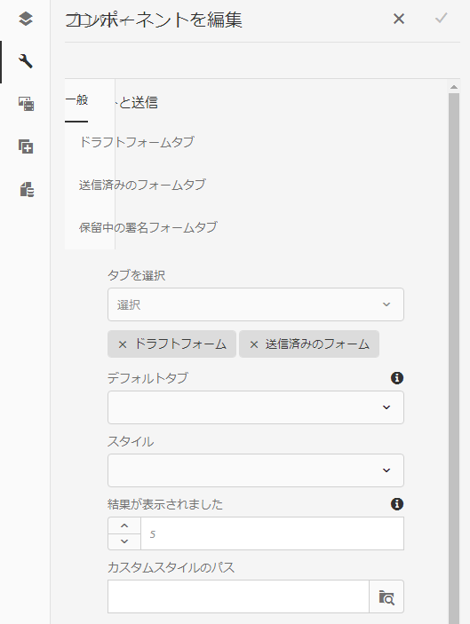

# ドラフトと送信コンポーネント {#drafts-and-submissions-component}

ドラフトと送信コンポーネントは、ドラフト状態のすべてのフォームと、既に送信済みのフォームを一覧表示します。コンポーネントには、ドラフトのフォームと送信済みのフォームで別々のセクション（タブ）があります。ユーザーに表示されるのは、ユーザーのドラフトフォームと送信済みのフォームのみです。

## コンポーネントの設定 {#configuring-the-component}

ドラフトと送信コンポーネントには、「ドラフト」および「送信」の 2 つのタブがあります。

アダプティブフォームの送信を有効にして「送信」タブに表示するには、 **送信アクション** から **[Forms Portal 送信アクション](/help/forms/using/configuring-submit-actions.md).** または、「 Forms Portal 送信」オプションを有効にします。 ユーザーがフォームを送信するたびに、フォームが「送信」タブに追加されます。

ドラフト機能は初期設定で有効になっています。ユーザーがアダプティブフォームで「**保存**」をクリックすると、フォームが「ドラフト」タブに追加されます。

次の手順に従って、ドラフトと送信コンポーネントを追加して設定します。

1. コンポーネントブラウザー内の Document Services カテゴリー下にある&#x200B;**ドラフトと送信**&#x200B;コンポーネントをページにドラッグアンドドロップします。
1. コンポーネントをタップし、  をクリックして、コンポーネントの編集ダイアログを開きます。

   

1. 編集ダイアログで以下の内容を指定し、「**完了**」をタップして設定を保存します。

<table>
 <tbody>
  <tr>
   <th>タブ</th>
   <th>設定</th>
   <th>説明</th>
  </tr>
  <tr>
   <td>一般</td>
   <td>合計結果数</td>
   <td>表示する結果の最大数を指定します。結果数が合計結果数の制限を超えると、「<strong>さらに表示</strong>」というリンクがコンポーネントの下部に表示されます。クリック <strong>詳細 </strong>すべてのフォームを表示します。 </td>
  </tr>
  <tr>
   <td> </td>
   <td>スタイルタイプ</td>
   <td>コンポーネントのスタイルを指定します。次を指定できます。 <strong>スタイルなし</strong>, <strong>デフォルトのスタイル</strong>または <strong>カスタムスタイル</strong> フォームを一覧表示するために使用します。 「カスタムスタイル」オプションの場合、「<strong>カスタムスタイルパス</strong>」フィールドでカスタム CSS ファイルのパスを指定できます<strong>。</strong></td>
  </tr>
  <tr>
   <td> </td>
   <td>カスタムスタイルパス</td>
   <td>次を選択した場合： <strong>カスタムスタイル</strong> オプション <strong>スタイルの種類</strong> フィールドには、 <strong>カスタムスタイルパス</strong> フィールドにカスタム CSS ファイルのパスを指定します。 </td>
  </tr>
  <tr>
   <td> </td>
   <td>表示オプション</td>
   <td>
表示するタブを指定します。「ドラフトフォーム」、「送信済みのフォーム」または「両方」のうちどれを表示するかを選択できます。 
 
<strong>注意</strong>：<em><strong>「表示」オプション</strong>で、「<strong>両方</strong>」以外のオプションを選択する場合、「<strong>デフォルトタブ</strong>」フィールドのオプションは使用されません。</em>
 </td>
  </tr>
  <tr>
   <td> </td>
   <td>デフォルトタブ</td>
   <td>フォームポータルページを読み込むときに表示するタブを指定します。<strong>「ドラフトフォーム」タブ</strong>または<strong>「送信済みのフォーム」タブ</strong>のいずれかを選択します。</td>
  </tr>
  <tr>
   <td>ドラフトフォームタブ設定</td>
   <td>カスタムタイトル</td>
   <td>「<strong>ドラフトフォーム</strong>」タブのタイトルを指定します。デフォルト値は<strong>Draft Forms</strong>です。</td>
  </tr>
  <tr>
   <td> </td>
   <td>テンプレートのレイアウト</td>
   <td>
ドラフトフォームリストに使用するレイアウトを指定します。
 
<strong>注意：</strong>デフォルト（非推奨）オプションは使用しないようにしてください。  
 </td>
  </tr>
  <tr>
   <td>送信済みのフォームタブの設定</td>
   <td>カスタムタイトル </td>
   <td>「<strong>送信済みのフォーム</strong>」タブのタイトルを指定します。デフォルト値は<strong>Submitted Forms</strong>です。</td>
  </tr>
  <tr>
   <td> </td>
   <td>テンプレートのレイアウト</td>
   <td>送信済みのFormsに使用するレイアウトを指定します<strong> </strong>リスト。 </td>
  </tr>
 </tbody>
</table>

## ストレージのカスタマイズ {#customizing-the-storage}

「フォームポータル」送信アクションを使用したり、アダプティブフォームでフォームポータルにデータを保存するオプションを有効にしたりすると、フォームデータは AEM リポジトリに保存されます。実稼働環境では、ドラフトまたは送信されたフォームデータを AEM リポジトリに保存しないことをお勧めします。代わりに、ドラフトと送信コンポーネントをエンタープライズデータベースなどの安全なストレージに統合して、ドラフトと送信済みのフォームデータを保存する必要があります。

Forms portal では、データをローカルAEMリポジトリ、リモートAEMリポジトリ、またはデータベースに保存できます。 AEM Formsでは、ドラフトと送信に関するユーザーデータの保存の実装をカスタマイズできます。 デフォルトの方法を上書きして、ドラフトおよび送信データを任意のストレージに保存する方法を指定できます。 例えば、組織に現在実装されているデータストアにデータを保存することができます。

Forms portal には、ローカルおよびリモートAEM Formsパブリッシュインスタンスの crx-repository にデータを保存するための、標準のサービス (API) が用意されています。 デフォルトの実装を置き換えることができます。 [ドラフトと送信のストレージサービスの設定](/help/forms/using/configuring-draft-submission-storage.md) 記事のデフォルト機能を置き換えるカスタム実装を使用する方法について説明します。 安全な場所にコンテンツを保存するためにカスタム実装で必要な方法について詳しくは、 [ドラフトおよび送信データサービスのカスタマイズ](/help/forms/using/custom-draft-submission-data-services.md) および [ドラフトと送信コンポーネントのカスタムストレージ。](/help/forms/using/adding-custom-storage-provider-forms.md)

AEM Formsのドキュメント [ドラフトと送信コンポーネントをデータベースに統合する場合のサンプル](https://helpx.adobe.com/in/experience-manager/6-4/forms/using/integrate-draft-submission-database.html). サンプル実装を使用して、独自のカスタム実装を開発できます。

## 関連記事

* [フォームポータルコンポーネントの有効化](/help/forms/using/enabling-forms-portal-components.md)
* [フォームポータルページの作成](/help/forms/using/creating-form-portal-page.md)
* [API を使用した Web ページ上のフォームの一覧表示](/help/forms/using/listing-forms-webpage-using-apis.md)
* [ドラフトと送信コンポーネントの使用](/help/forms/using/draft-submission-component.md)
* [ドラフトと送信済みフォームのストレージのカスタマイズ](/help/forms/using/draft-submission-component.md)
* [ドラフトと送信コンポーネントとデータベースの統合のサンプル](/help/forms/using/integrate-draft-submission-database.md)
* [フォームポータルコンポーネントのテンプレートをカスタマイズする](/help/forms/using/customizing-templates-forms-portal-components.md)
* [ポータル上のフォーム発行の概要](/help/forms/using/introduction-publishing-forms.md)
