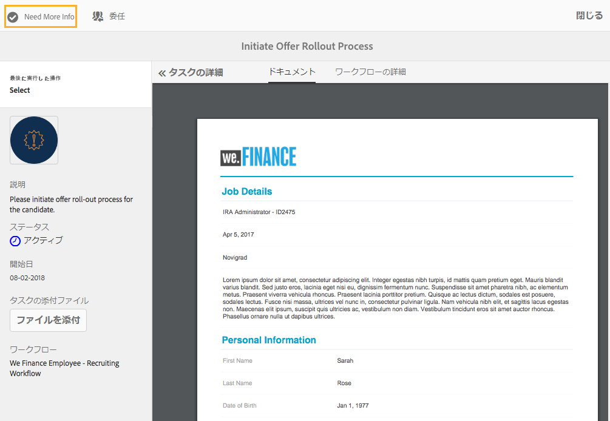
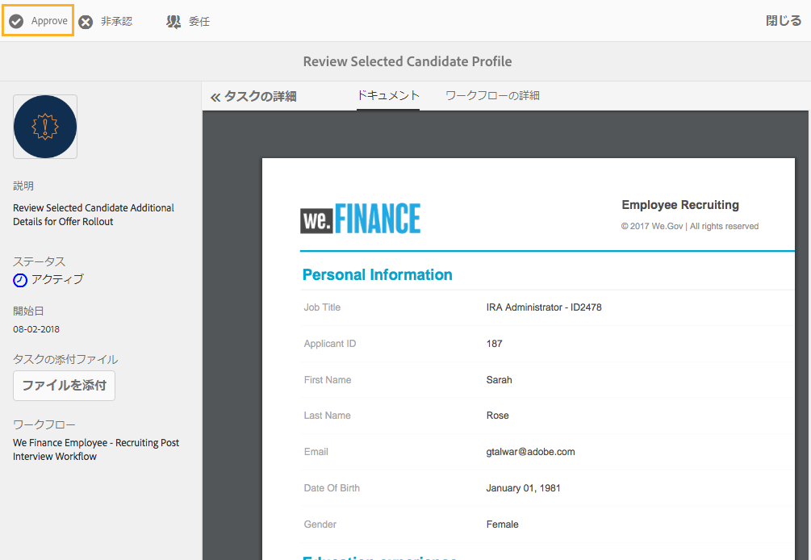
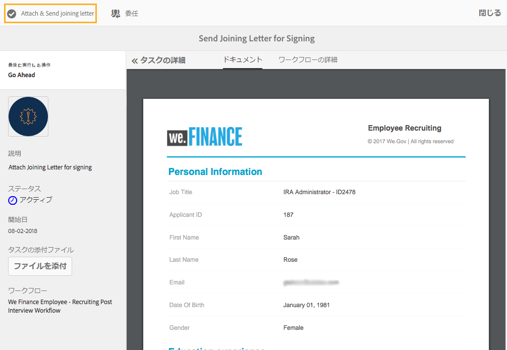
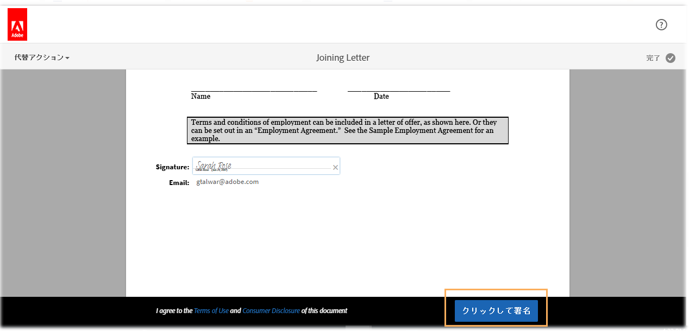

# 従業員採用リファレンスサイトのチュートリアル {#employee-recruitment-reference-site-walkthrough}

## 前提条件 {#prerequisite}

リファレンスサイトを設定します ( [AEM Formsリファレンスサイトのセットアップと設定](/help/forms/using/setup-reference-sites.md).

## 概要 {#overview}

We.Finance 社は、候補者がリファレンスサイトのポータルを通じて求人を申し込める組織です。 この組織では、ポータルを面接スケジュール、最終候補者名簿、社内コミュニケーションの管理にも使用しています。このサイトでは、以下を管理します。

* 求人の検索と申請
* 候補者の審査と短縮
* 面接プロセス
* 候補の詳細のコレクション
* 候補のバックグラウンドチェック
* 選択した候補へのオファーのロールアウト

>[!NOTE]
>
>従業員採用の使用例は、We.Finance と We.Gov の両方のリファレンスサイトで利用できます。 このチュートリアルで使用する例、画像、説明では、 We.Finance リファレンスサイトを使用します。 ただし、We.Gov を使用して、これらのユースケースを実行したり、アーティファクトをレビューしたりすることもできます。 これを行うには、 **we-finance** と **we-gov** 」と入力します。

### 関連するワークフローモデル {#workflow-models-involved}

従業員採用の使用例には、次の 2 つのワークフローが含まれます。

* 面接前 - We Finance 従業員採用ワークフロー
* 面接後 - We Finance 従業員採用面接後ワークフロー

これらのワークフローは、AEM で作成され、次の場所で見つかります。

`https://[authorHost]:[authorPort]/libs/cq/workflow/admin/console/content/models.html/etc/workflow/models/`

#### We Finance 社員採用ワークフロー {#we-finance-employee-recruiting-workflow}

このドキュメントで従う We Finance 社員採用ワークフローのモデルを次に示します。

#### We Finance 社員採用面接後ワークフロー {#we-finance-employee-recruiting-post-interview-workflow}

このドキュメントで従う We Finance 社員採用後面接ワークフローのモデルを次に示します。

### ペルソナ {#personas}

このシナリオでは、次の人物が登場します。

* Sarah Rose（組織の求人に応募する候補者）
* John Jacobs（採用担当者）
* Gloria Rios（採用マネージャー）
* John Doe（人事担当者）

## Sarah が求人を申し込む {#sarah-applies-for-a-job}

Sarah Rose は、組織内の求人機会を探しています。 Web ポータルを訪問し、Career ページに記載されている求人情報を調べます。 一致する求人リストを見つけて、それに応募します。

We.Finance ホームページ

We.Finance のキャリアページ

Sarah は、ジョブの投稿で「 Apply 」をクリックします。 ジョブ申し込みフォームが開きます。 Sarah は申込書のすべての詳細を入力し、送信します。

### 仕組み {#how-it-works}

We.Finance のホームページとキャリアページはAEM Sitesのページです。 キャリアページにはアダプティブフォームが埋め込まれ、繰り返し可能なパネルを使用してサービスを使用して求人情報を取得し、ページに一覧表示します。 アダプティブフォームは `https://[authorHost]:[authorPort]/editor.html/content/forms/af/we-finance/employee/recruitment/jobs.html` で確認できます。

### 実際の動作確認 {#see-it-yourself}

`https://[publishHost]:[publishPort]/content/we-finance/global/en.html` に移動して、「**[!UICONTROL キャリア]**」をクリックします。クリック **[!UICONTROL 検索]** ジョブリストにデータを入力し、「 **[!UICONTROL 適用]** （ジョブ）。 フォームの詳細を入力し、申込書を送信します。

このチュートリアルを通じての通信は、指定した電子メール ID に送信されるので、アプリケーションで有効な電子メール ID を指定してください。

## John Jacobs は、採用マネージャーの審査に関する Sarah Rose のプロフィールを短縮します {#john-jacobs-shortlists-sarah-rose-s-profile-for-the-hiring-manager-s-screening}

組織が Sarah が送信した求人申込書を受信します。 採用担当者の John Jacobs は、Sarah のプロファイルをレビューするタスクを割り当てます。 AEM Inbox でタスクを確認し、ジョブ要件に一致するプロファイルを見つけて、「Shortlist」をクリックします。 Sarah のプロファイルは、採用マネージャーの Gloria Rios に転送され、承認を得ることができます。

John の AEM インボックス

John Jacobs は、採用マネージャーの審査に関する Sarah Rose のプロフィールを短縮します

**仕組み**

「ジョブの申請」フォーム内の送信アクションは、John Jacob のインボックスにタスクを作成して申請をスクリーニングするワークフローをトリガーします。 John が申込書をレビューし、ショートリストに登録すると、ワークフローは Gloria のインボックスで採用担当マネージャーにタスクを作成します。

### 実際の動作確認 {#see-it-yourself-1}

`https://[publishHost]:[publishPort]/content/we-finance/global/en/login.html?resource=/aem/inbox.html` に移動し、John Jacobs のユーザー名とパスワード（jjacobs／password）を使用してログインします。候補者のプロファイルをレビューするタスクと最終候補者名簿を開きます。

## Gloria は申込書をレビューし、申込者に面接を承認します {#gloria-reviews-the-application-and-approves-the-applicant-for-an-interview}

採用マネージャーの Gloria は、AEM Inbox のタスクとして、短く記載されたプロファイルを受け取ります。 Sarah Rose は、これをレビューし、候補者の Sarah Rose にインタビューを承認します。

Gloria の AEM インボックス

Gloria は Sarah Rose の面接を承認

**仕組み**

Gloria が面接の候補者を承認すると、ワークフローは We.Finance の採用担当者である John Doe のAEM Inbox にタスクを作成します。

### 実際の動作確認 {#see-it-yourself-2}

`https://[publishHost]:[publishPort]/content/we-finance/global/en/login.html?resource=/aem/inbox.html` に移動し、John Jacobs のユーザー名とパスワード（jjacobs／password）を使用してログインします。候補者のプロファイルをレビューするタスクと最終候補者名簿を開きます。

`https://[publishHost]:[publishPort]/content/we-finance/global/en/login.html?resource=/aem/inbox.html` に移動し、Gloria Rios のユーザー名とパスワード（grios／password）を使用してログインします。「候補者プロファイル・レビュー」タスクを開き、「面接の予定」をクリックします。

## John Doe が面接を予定 {#john-doe-schedules-an-interview}

John Doe は、自分のインボックスで面接をスケジュールするタスクを受け取ります。 John Doe は、タスクを選択して開き、面接日時、場所、および面接担当の人事担当者を John Jacob として修正します。 John Doe は「招待メールの送信」をクリックします。 電子メールが Sarah に送信され、Sarah に面接するために、採用マネージャーの Gloria にタスクが割り当てられます。

John Doe の AEM インボックス

John Doe は面接のスケジュールを設定し、詳細を Sarah Rose に送信します。

## Sarah Rose が面接スケジュールを記載した電子メールを受信 {#sarah-rose-receives-the-email-with-interview-schedule}

Sarah Rose が、面接スケジュール、会場、その他の詳細を記載した電子メールを受信します。 「Accept」をクリックし、面接日程と会場に問題がないことを示します。 Sarah は、正確な情報に導かれ、面接に対して行います。

Sarah Rose が面接スケジュールを受信

## 面接後、採用マネージャは Sarah Rose を短縮します {#after-the-interviews-the-hiring-manager-shortlists-sarah-rose}

Sarah Rose が面接を調べて消去した後、採用マネージャーの Gloria Rios が自分のインボックスから候補者選択タスクを開き、「選択」をクリックします。 Gloria Rios の決定は、さらに処理をおこなうために HR 担当者の John Doe に伝えられます。

Gloria の AEM インボックス

面接後、Gloria Rios が Sarah Rose を選択

## John Doe が詳細情報をリクエスト {#john-doe-requests-more-information}

組織に参加する候補者に依頼する前に、その候補の背景を確認する必要があります。 John Doe は、選択した申込者の詳細を開き、レビューし、その雇用と教育の詳細の一部がまだ入力されていないことを見つけます。 John Doe が「Need More Information」（詳細情報が必要）をクリックします。

 

John Doe は、Sarah Rose に対し、教育と職場での経験に関する詳細情報を要求します

## Sarah Rose は詳細情報を求める電子メールを受信 {#sarah-rose-receives-an-email-requesting-further-information}

Sarah Rose は、雇用申請の処理に追加情報が必要であることを知らせる電子メールを受信します。 電子メールには、必要な情報を入力するためのフォームへのリンクが含まれています。

Sarah Rose は、求人申し込みの処理にさらに詳しい情報が必要であることを通知する電子メールを受信します

Sarah は電子メール内の「 Provide Details 」リンクをクリックします。 フォームが表示されます。 Sarah は John Doe の要求に応じて、必要な教育および雇用の詳細を入力し、「Submit」（送信）をクリックします。

Sarah がメール内のリンクをクリックし、追加情報フォームを開く

Sarah は John Doe の要求に応じて追加情報を入力し、「Submit」（送信）をクリックします

## John Doe は、選択した候補プロファイルをレビューして、提供された追加情報を確認します {#john-doe-reviews-the-selected-candidate-profile-for-the-additional-information-provided}

John Doe は候補レビューリクエストを選択して開きます。 John Doe は、Sarah が必要に応じてすべての情報を入力したことを確認します。 John Doe は、申込書を確認した後、「Approve」をクリックします。 John Doe の承認を得ると、Sarah Rose に対するバックグラウンドチェックの実行要求が John Jacobs に転送されます。

John Doe の AEM インボックス

John Doe は Sarah から提供された追加情報を確認し、承認します

## John Jacobs がバックグラウンドチェックリクエストを受信 {#john-jacobs-receives-a-background-check-request}

John Jacobs は自分のインボックスにバックグラウンドチェックリクエストを表示します。 John Jacobs がタスクを開き、Sarah Rose から提供された情報を確認します。 バックグラウンドチェックを実行した後、John Jacobs は「Go Ahead」をクリックし、バックグラウンドチェックが成功したことを示します。

John Jacobs の AEM インボックス

バックグラウンドチェックを実行した後、John Jacobs は「Go Ahead」をクリックします

## John Doe は採用通知を Sarah Rose に送信 {#john-doe-sends-out-the-joining-letter-to-sarah-rose}

John Doe は、AEMインボックスに、採用通知の送信要求を受け取ります。 John はリクエストを開き、詳細を表示します。 John Doe は採用通知PDFを添付し、[ 採用通知の添付と送信 ] をクリックします。

John Doe の AEM インボックス

John Doe は署名用に採用通知を送信します

## Sarah Rose が採用通知を受信し、署名します {#sarah-rose-receives-and-signs-the-joining-letter}

Sarah Rose が署名を求める採用通知を受信します。Sarah が「Click Here To Review And Sign Joining Letter」（採用通知を確認して署名）をクリックします。署名するフィールドのある採用通知の PDF が開きます。

Sarah Rose が署名用の採用通知を受信

Sarah は、入力、描画を使用して手書き、署名の画像の挿入、または携帯電話のタッチスクリーンを使用して署名を描画のいずれかを選択できます。 Sarah は名前を入力し、「クリックして署名」をクリックし、採用通知の署名済みコピーをダウンロードします。

Sarah は自分の名前を入力し、採用通知に署名します。

Sarah は「Click To Sign」（クリックして署名）をクリックし、採用通知への署名を完了します。
