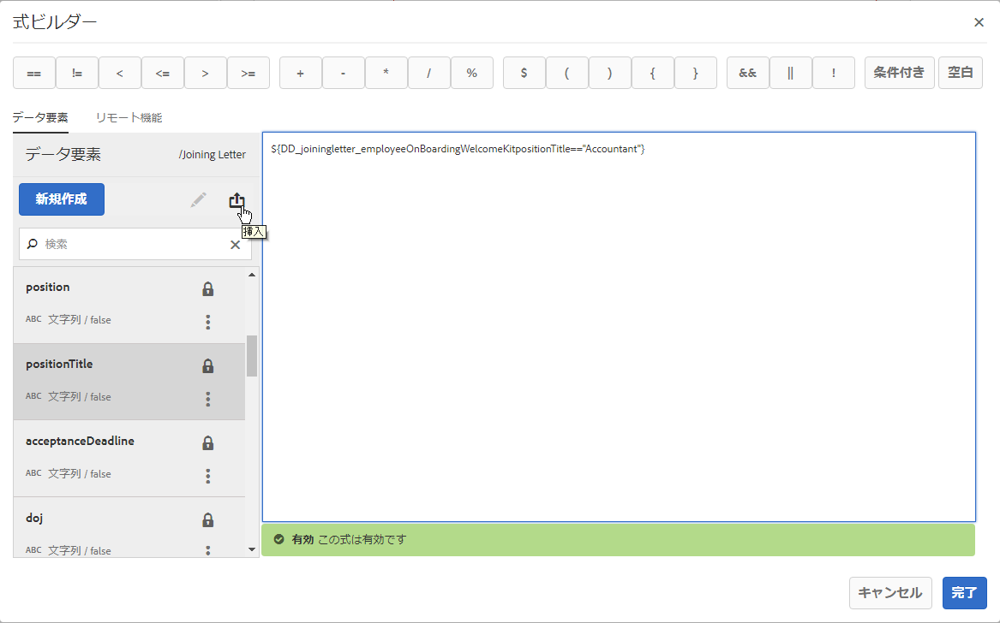
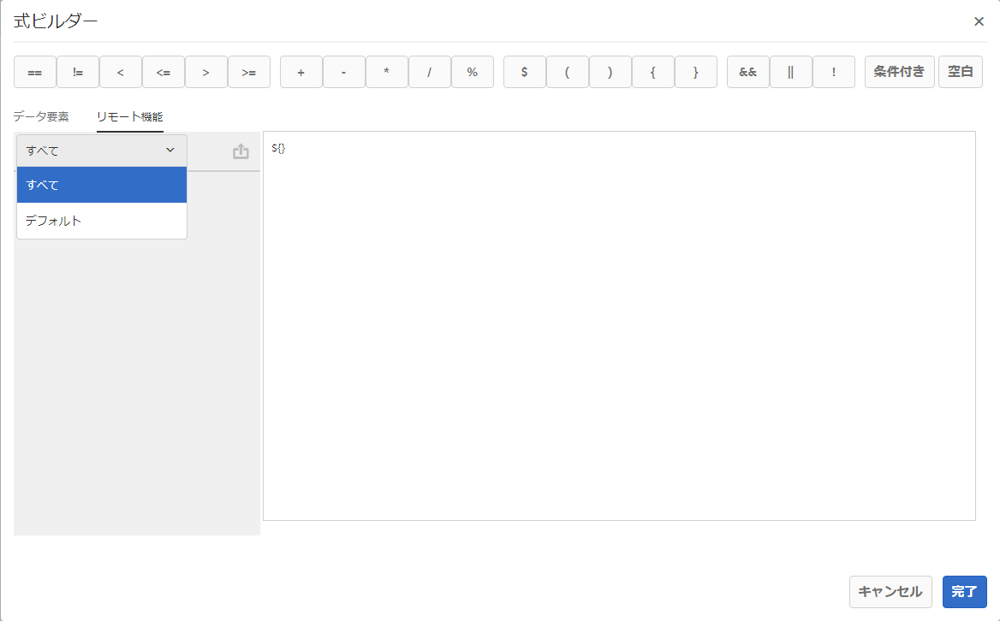

# 式ビルダーのリモート関数 {#remote-functions-in-expression-builder}

>[!CAUTION]
>
>AEM 6.4 の拡張サポートは終了し、このドキュメントは更新されなくなりました。 詳細は、 [技術サポート期間](https://helpx.adobe.com/jp/support/programs/eol-matrix.html). サポートされているバージョンを見つける [ここ](https://experienceleague.adobe.com/docs/?lang=ja).

式ビルダーを使用して、データ辞書またはエンドユーザーによって提供されたデータ値に対して計算を実行する式または条件を作成できます。Correspondence Management は式の評価の結果を使用して、アセット（テキスト、画像、リスト、条件など）を選択し、それらを必要に応じて通信に挿入することができます。

## 式ビルダーによる式およびリモート関数の作成 {#creating-expressions-and-remote-functions-with-expression-builder}

式ビルダーは内部的には JSP EL ライブラリを使用しているため、式は JSPEL 構文に従います。詳しくは、「[サンプル式](#exampleexpressions)」を参照してください。



### 演算子 {#operators}

式で使用できる演算子は、式ビルダーの上部のバーで使用できます。

### 式の例 {#exampleexpressions}

Correspondence Management ソリューションで使用できる一般的な JSP EL の例を以下に示します。

* 2 つの数値の追加： ${number1 + number2}
* 2 つの文字列の連結： ${str1} ${str2}
* 2 つの数値の比較： ${age &lt; 18}

詳細な情報は、「[JSP EL 仕様](https://download.oracle.com/otn-pub/jcp/jsp-2.1-fr-spec-oth-JSpec/jsp-2_1-fr-spec-el.pdf)」で確認できます。クライアント側の Expression Manager は、JSP EL 仕様の特定の変数や関数をサポートしていません。以下に例を示します。

* コレクションのインデックスとマップのキー（[] 表記を使用）は、クライアント側で評価される式の変数名には対応していません。
* 式に使用する関数のパラメーターの型や戻り値の型を以下に示しています。

   * java.lang.String
   * java.lang.Character
   * Char
   * java.lang.Boolean
   * ブール値
   * java.lang.Integer
   * 整数
   * java.util.list
   * java.lang.Short
   * Short
   * java.lang.Byte
   * バイト
   * java.lang.Double
   * 倍精度浮動小数点
   * java.lang.Long
   * Long
   * java.lang.Float
   * 浮動小数
   * java.util.Calendar
   * java.util.Date
   * java.util.List

### リモート関数 {#remote-function}

リモート関数は、式でカスタムロジックを使用する機能を提供します。 Java のメソッドとして式で使用するカスタムロジックを記述でき、式内で同じ関数を使用できます。 使用可能なリモート関数は、式エディターの左側にある「リモート関数」タブに一覧表示されます。



#### カスタムリモート関数の追加 {#adding-custom-remote-functions}

式の中で使用する独自のリモート関数を書き出すカスタムバンドルを作成できます。 独自のリモート関数を書き出すカスタムバンドルを作成するには、次のタスクを実行します。 入力文字列を大文字に変換するカスタム関数の作成方法を示します。

1. Expression Manager で使用するために書き出されるメソッドを含む OSGi サービスのインターフェイスを定義します。
1. インターフェイス A のメソッドを宣言し、@ServiceMethod 注釈を設定します（com.adobe.exm.expeval.ServiceMethod）。Expression Manager では、注釈が付いていないメソッドはすべて無視されます。ServiceMethod 注釈には次のオプション属性があり、必要に応じて指定することができます。

   1. **有効**:このメソッドが有効かどうかを判断します。 Expression Manager は無効なメソッドを無視します。
   1. **familyId**:メソッドのファミリ（グループ）を指定します。 空の場合、Expression Manager はメソッドがデフォルトのファミリーに属していると見なします。 関数が選択されるファミリのレジストリ（既定のファミリを除く）はありません。 Expression Manager は、様々なバンドルで書き出されたすべての関数で指定されたすべてのファミリ ID の和集合を取得することで、レジストリを動的に作成します。 ここで指定した ID が合理的に読み取り可能であることを確認します。式オーサリングユーザーインターフェイスにも表示されるからです。
   1. **displayName**:人間が読み取り可能な関数の名前。 この名前は、オーサリングユーザーインターフェイスでの表示に使用されます。 空の場合、Expression Manager は関数のプレフィックスとローカル名を使用してデフォルトの名前を作成します。
   1. **説明**:関数の詳細な説明。 この説明は、オーサリングユーザーインターフェイスでの表示用に使用されます。 空の場合、Expression Manager は関数のプレフィックスとローカル名を使用してデフォルトの説明を作成します。

   ```java
   package mergeandfuse.com;
   import com.adobe.exm.expeval.ServiceMethod;
   
   public interface RemoteFunction {
    @ServiceMethod(enabled=true,displayName="Returns_all_caps",description="Function to convert to all CAPS", familyId="remote")
    public String toAllCaps(String name);
   
   }
   ```

   メソッドのパラメーターには、必要に応じて @ServiceMethodParameter 注釈（com.adobe.exm.expeval.ServiceMethodParameter）を使用し、注釈を設定することもできます。この注釈は、オーサリングユーザーインターフェイスで使用するメソッドパラメーターの名前と説明を人間が読み取り可能に指定する場合にのみ使用されます。 インターフェイスメソッドのパラメーターと戻り値が、次のタイプのいずれかに属していることを確認します。

   * java.lang.String
   * java.lang.Character
   * Char
   * java.lang.Boolean
   * ブール値
   * java.lang.Integer
   * 整数
   * java.lang.Short
   * Short
   * java.lang.Byte
   * バイト
   * java.lang.Double
   * 倍精度浮動小数点
   * java.lang.Long
   * Long
   * java.lang.Float
   * 浮動小数
   * java.util.Calendar
   * java.util.Date
   * java.util.List


1. インターフェイスの実装を定義し、それを OSGi サービスとして設定して、次のサービスプロパティを定義します。

```
@org.apache.felix.scr.annotations.Properties({
  @org.apache.felix.scr.annotations.Property(name = "connectors.jsoninvoker", boolValue = true),
  @org.apache.felix.scr.annotations.Property(name = "connectors.jsoninvoker.alias", value = "<service_id>"),
  @org.apache.felix.scr.annotations.Property(name = "exm.service", boolValue = true)})
```

exm.service=true エントリは、式マネージャに対して、式での使用に適したリモート関数をサービスに含めるよう指示します。 この &lt;service_id> の値は、有効な Java 識別子である必要があります（英数字、$、_、その他の特殊文字は含まれません）。 この値に REMOTE_キーワードのプレフィックスが付き、式内で使用されるプレフィックスが形成されます。 例えば、サービスプロパティ内の注釈付きメソッド bar() とサービス ID foo とのインターフェイスは、REMOTE_foo:bar() を使用して式内で参照できます。

```
package mergeandfuse.com;

import org.apache.felix.scr.annotations.Component;
import org.apache.felix.scr.annotations.Service;

@Component(metatype = true, immediate = true, label = "RemoteFunctionImpl")
@Service(value = RemoteFunction.class)
@org.apache.felix.scr.annotations.Properties({
  @org.apache.felix.scr.annotations.Property(name = "connectors.jsoninvoker", boolValue = true),
  @org.apache.felix.scr.annotations.Property(name = "connectors.jsoninvoker.alias", value = "test1"),
  @org.apache.felix.scr.annotations.Property(name = "exm.service", boolValue = true)})
public class RemoteFuntionImpl implements RemoteFunction {

 @Override
 public String toAllCaps(String name) {
  System.out.println("######Got######"+name);
  
  return name.toUpperCase();
 }
 
}
```

使用するサンプルアーカイブを以下に示します。

* **GoodFunctions.jar.zip** はサンプルのリモート関数の定義を含むバンドルを持っている jar ファイルです。GoodFunctions.jar.zip ファイルをダウンロードし、それを展開して jar ファイルを取得します。
* **GoodFunctions.zip **&#x200B;は、カスタムのリモート関数を定義しそれに対するバンドルを作成するためのソースコードのパッケージです。

GoodFunctions.jar.zip

[ファイルを入手](assets/goodfunctions.jar.zip)
