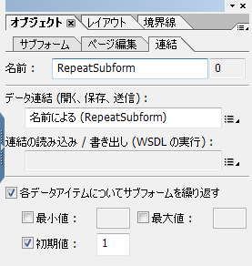

# HTML5 フォームに関するよくある質問（FAQ） {#frequently-asked-questions-faq-for-html-forms}

>[!CAUTION]
>
>AEM 6.4 の拡張サポートは終了し、このドキュメントは更新されなくなりました。 詳細は、 [技術サポート期間](https://helpx.adobe.com/jp/support/programs/eol-matrix.html). サポートされているバージョンを見つける [ここ](https://experienceleague.adobe.com/docs/?lang=ja).

レイアウト、スクリプティングのサポート、およびHTML5 フォームの範囲に関するよくある質問 (FAQ) がいくつかあります。

## レイアウト {#layout}

1. バーコードフィールドと署名フィールドがフォームに表示されないのはなぜですか？

   回答：バーコードフィールドと署名フィールドは HTML やモバイルのシナリオに関係していません。これらのフィールドは、インタラクティブではない領域として表示されます。ただし、AEM Forms Designer では、署名フィールドの代わりに使用できる新しい署名手書きフィールドを提供します。また、バーコードの[カスタムウィジェット](/help/forms/using/custom-widgets.md)を追加し、それを統合することもできます。

1. XFA テキストフィールドでリッチテキストがサポートされていますか？

   回答：AEM Forms Designer でリッチコンテンツを許可する XFA フィールドはサポートされておらず、ユーザーインターフェイスからのテキストのスタイル設定をサポートしていない場合、通常のテキストとしてレンダリングされます。 また、comb の桁の値に基づいて許可される文字数にはまだ制限がありますが、comb プロパティを持つ XFA フィールドは通常のフィールドとして表示されます。

1. 繰り返し可能なサブフォームの使用に関して制限はありますか？

   回答：繰り返し可能なサブフォームの初期値は 1 以上にする必要があります。 初期値が 0 の繰り返し可能なサブフォームはサポートされていません。 繰り返し可能なサブフォームを使用して、フォームの読み込み時に表示しないように選択することもできます。 その場合は、以下の手順を実行します。

   1. 繰り返し可能な Subform の初期カウントとして「1」を設定します。

      

   1. フォームの initialize イベントを使用して、サブフォームのプライマリインスタンスを非表示にします。 例えば、以下のコードでは、フォーム初期化時にサブフォームのプライマリインスタンスを非表示にします。 また、アプリの種類を確認して、スクリプトがクライアントサイドでのみ実行されるようにします。

      ```
      if ((xfa.host.appType == "HTML 5" || xfa.host.appType == "Exchange-Pro" || xfa.host.appType == "Reader")&&(_RepeatSubform.count == 1)&&(form1.Page1.Subform1.RepeatSubform.Key.rawValue == null)) {
      RepeatSubform.presence = "hidden";
      }  
      ```

   1. サブフォームのインスタンスを編集用に追加するスクリプトを開きます。 次のようなコードを追加して、サブフォームスクリプトのインスタンスを追加します。

      以下のコードは、サブフォームの非表示のインスタンスを確認します。 サブフォームの非表示のインスタンスが見つかった場合は、サブフォームの非表示のインスタンスを削除し、サブフォームの新しいインスタンスを挿入します。 サブフォームの非表示のインスタンスが見つからない場合は、サブフォームの新しいインスタンスを挿入するだけです。

      ```
      if (RepeatSubform.presence == "hidden")
      { 
      RepeatSubform.instanceManager.insertInstance(0);
      RepeatSubform.instanceManager.removeInstance(1);
      }
      else
      {
      RepeatSubform.instanceManager.addInstance(1);
      }
      ```

   1. 編集用 Subform のインスタンスを削除するためのスクリプトを開きます。Subform スクリプトのインスタンスを削除するには、以下のようなコードを追加します。

      このコードは、サブフォームの数を確認します。 サブフォームの数が 1 に達した場合、コードによってサブフォームが非表示になり、サブフォームが削除されるのではなくなります。

      ```
      if (RepeatSubform.instanceManager.count == 1) {
      RepeatSubform.presence = "hidden";
      } else {
      RepeatSubform.instanceManager.removeInstance(RepeatSubform.instanceManager.count - 1);
      }
      ```

   1. フォームの presubmit イベントを編集用に開きます。 次のスクリプトをイベントに追加して、編集前にスクリプトの非表示のインスタンスを削除します。 非表示のサブフォームのデータが送信時に送信されるのを防ぎます。

      ```
      if(RepeatSubform.instanceManager.count == 1 && RepeatSubform.presence == "hidden") {
      RepeatSubform.instanceManager.removeInstance(0);
      }
      ```

1. 非表示の Subform の使用に関して制限事項はありますか？

   回答：複数のページにまたがる複雑な階層の非表示 Subform は、レイアウトに問題を引き起こします。この問題を回避するには、最初はサブフォームを表示するようにマークを付けておき、後で特定のロジックまたはデータに基づいた初期設定スクリプトで非表示にします。

1. HTML5 で一部のテキストが切り捨てられたり、正しく表示されないのはなぜですか？

   回答：コンテンツを表示するためのスペースが Draw または Caption のテキスト要素に十分に与えられていないとき、モバイルフォームのレンダリングでテキストが切り捨てられて表示されます。この切り捨ては AEM Forms Designer のデザインビューでも見られます。この切り捨てはPDFで処理できますが、HTML5 フォームでは処理できません。 この問題を回避するには、AEM Forms Designer のデザインモードで切り捨てが発生しないように、描画テキストやキャプションテキストに十分なスペースを用意します。

1. コンテンツの欠落や重複に関連するレイアウトの問題が見つかります。 理由は？

   回答：Draw Text 要素や Draw Image 要素と同じ位置に重なり合う他の要素（Rectangle など）がある場合、Draw Text のコンテンツが（AEM Forms Designer 階層ビューで）ドキュメント順序の後の方にあると、Draw Text のコンテンツが表示されません。PDF は透明レイヤーをサポートしていますが、HTML／ブラウザーは透明レイヤーをサポートしていません。

1. HTML フォームで表示されるフォントの一部が、フォームをデザインしているときに使用されるものと違う理由は？

   回答：HTML5 のフォームは ( フォーム内にフォントが埋め込まれるPDF formsとは異なり ) フォントを埋め込みません。 フォームのHTMLバージョンが期待どおりにレンダリングされるようにするには、XDP で指定したフォントがサーバー上およびクライアントマシン上で使用できることを確認します。 必要なフォントがサーバー上で使用できない場合は、フォールバックフォントが使用されます。 さらに、クライアントデバイスで使用できない、Form Template のフォントを使用すると、テキストの表示にはブラウザーのデフォルトのフォントが使用されます。

1. vAlign と hAlign の属性は HTML フォームでサポートされていますか？

   はい、vAlign 属性と hAlign 属性はサポートされています。vAlign 属性は、Internet Explorer の場合とマルチラインフィールドの場合はサポートされていません。

1. HTML5 フォームはヘブライ語の文字をサポートしていますか？

   HTML5 フォームは、Microsoft Internet Explorer 以外のすべてのブラウザーでヘブライ語の文字をサポートしています。

1. HTML5 フォームは数値フィールドに対して何らかの制限がありますか？

   回答：はい、HTML5 フォームにはいくつか制限があります。桁数が、picture 句で指定されたカウントよりも多い場合は、数字はローカライズされずに英語ロケールで表示されます。

1. HTML フォームのサイズが PDF フォームのサイズより大きいのはなぜですか？

   XDP を HTML フォームにレンダリングするには、多くの中間データ構造とフォーム DOM、データ DOM、レイアウト DOM などのオブジェクトが必要になります。

   PDF formsの場合、Adobe Acrobatには、中間データ構造およびオブジェクトを作成するための組み込みの XTG エンジンがあります。 Acrobatは、レイアウトとスクリプトも扱います。

   HTML5 フォームの場合、ブラウザーには、生の XDP バイトから中間データ構造とオブジェクトを作成するための組み込みの XTG エンジンはありません。 そのため、HTML5 フォームの場合、中間構造はサーバー上で生成され、クライアントに送信されます。 クライアントでは、JavaScript ベースのスクリプトとレイアウトエンジンがこれらの中間構造を使用します。

   中間構造のサイズは、元の XDP のサイズと XDP にマージされたデータによって異なります。

1. xdp でのテーブルの使用に関して制限事項はありますか？

   回答：複雑なテーブルはレンダリングで問題を引き起こします。

   * テーブル内のセクション (SubformSet) はサポートされていません。
   * 一部のテーブルのヘッダー行またはフッター行は繰り返し用にマークされます。 このようなテーブルを複数のページに分割すると、いくつかの問題が発生する場合があります。

1. アクセス可能なテーブルには制限事項がありますか？

   回答：はい。アクセス可能なテーブルには次の制限事項があります。

   * 階層化テーブルとテーブル内のサブフォームはサポートされていません。
   * ヘッダーは、テーブルの上の行または左の列に対してのみサポートされます。 中間テーブル要素では、ヘッダーはサポートされていません。 複数行にヘッダーを適用することができます。そのような行および列がすべてテーブルの一番上の行または一番左の列に連動している場合、列ヘッダーがサポートされます。
   * テーブル内のランダムな場所の `Rowspan` および `colspan` はサポートされません。
   * 1 より大きい rowspan 値を持つ要素を含む行のインスタンスは、動的に追加または削除することはできません。

1. スクリーンリーダーのツールヒントとキャプションの読み取り順序はどうなっていますか？

   * キャプションとツールヒントの両方が存在する場合、キャプションのみが読み取られます。 キャプションが使用できない場合は、ツールヒントが読み取られます。 XDP での読み取りの優先順位をフォームデザイナーを使用して指定することもできます
   * 要素にマウスポインターを置くと、ツールヒントが表示されます。 ツールチップが使用できない音声テキストが表示される場合。 音声テキストが使用できない場合は、フィールド名が表示されます。

1. フィールドにマウスポインターを置くと、ツールヒントが表示されます。 無効にする方法は？

   カーソルを合わせたときにツールヒントを無効にするには、Designer のアクセシビリティパネルで「なし」を選択します。

1. Designer では、ラジオボタンとチェックボックスのカスタムの外観プロパティを設定できます。フォームのレンダリング中、HTML5 フォームはこれらのカスタム Appearanceプロパティを考慮しますか？

   回答：HTML5 フォームは、ラジオボタンとチェックボックスのカスタム外観プロパティを無視します。 ラジオボタンとチェックボックスは、基になるブラウザの仕様に従って表示されます。

1. サポートされているブラウザーでHTML5 フォームを開くと、隣接して配置されたフィールドの境界線が正しく配置されないか、サブフォームが重なって表示されます。 同じHTML5 のフォームをForms Designer でプレビューすると、フィールドとレイアウトの表示が乱れ、サブフォームが正しい位置に表示されます。 問題の修正方法は？

   サブフォームがコンテンツをフローするように設定され、サブフォームに非表示の境界線要素が設定されている場合、隣接して配置されたフィールドの境界線が適切に整列されないか、サブフォームが重なって表示されます。 この問題を解決するには、対応する XDP から非表示の &lt;border> 要素を削除するか、コメントを指定します。例えば、次の &lt;border> 要素はコメントとしてマークされます。

   ```xml
               <!--<border>
                  <edge presence="hidden"/>
                  <corner thickness="0.175mm" presence="hidden"/>
               </border> -->
   ```

## スクリプト {#scripting}

1. HTMLFormsの JavaScript 実装に制限はありますか。

   回答：

   * xfa.connectionSet スクリプトのサポートは制限されています。 connectionSet の場合、web サービスの server-side 起動のみがサポートされています。詳しくは、[スクリプティングのサポート](/help/forms/using/scripting-support.md)を参照してください。
   * クライアント側スクリプトでは $record および $data のサポートはありません。ただし、スクリプトが formReady、layoutReady ブロックで記述されている場合は、これらのイベントはサーバー側で発生するため、スクリプトは機能します。
   * Draw テキスト（またはフィールドの場合は Caption テキスト）の変更など、XFA Draw 要素固有のスクリプトはサポートされていません。

1. formCalc の使用に関して制限事項はありますか？

   回答：現在、formCalc スクリプトのサブセットのみが実装されています。 詳しくは、[スクリプティングのサポート](/help/forms/using/scripting-support.md)を参照してください。

1. 推奨される命名規則はありますか？また、避けるべき予約済みのキーワードはありますか？

   * AEM Forms Designer では、オブジェクト（サブフォーム、テキストフィールドなど）の名前を、アンダースコア（_）で始めないことをお勧めします。名前の先頭にアンダースコアを使用するには、アンダースコアの後にプレフィックスを追加します。*_&lt;prefix>&lt;objectname>.*
   * すべての HTML5 Forms API は予約済みのキーワードです。カスタムの APIや機能については、[HTML5 Forms API](/help/forms/using/scripting-support.md) と異なる名前を使用します。

1. HTML5 フォームはフローティングフィールドをサポートしていますか？

   はい、HTML5 Formsはフローティングフィールドをサポートします。 フローティングフィールドを有効にするには、次のプロパティをレンダリングプロファイルに追加します。

   >[!NOTE]
   >
   >デフォルトでは、これらのフィールドはフローティングに対して有効になっていません。 Forms Designer を使用して、フィールドのフローティングプロパティを設定できます。

   1. CRXde lite を開き、`/content/xfaforms/profiles/default` ノードに移動します。
   1. プロパティを追加する `mfDataDependentFloatingField` の型が文字列で、プロパティの値をに設定します。 `true`**.**
   1. 「**すべて保存**」をクリックします。更新されたレンダリングプロファイルを使用して、HTML フォームでフローティングフィールドが有効になりました。

      >[!NOTE]
      >
      >レンダリングプロファイルを更新することなく、特定のフォームでフローティングフィールドを有効にするには、mfDataDependentFloatingField=true プロパティを URL パラメーターとして渡します。

1. HTML5 フォームは、初期化スクリプトと form ready イベントを複数回実行しますか？

   はい。初期化スクリプトと form ready イベントは、少なくとも 1 回はサーバー上で、1 回はクライアント側で、複数回実行されます。 initialize イベントや form:ready イベントなどのスクリプトを何らかのビジネスロジック（フォームデータ、フィールドデータなど）に基づいて作成し、データの状態やべき等（データが同じ場合）に基づいてアクションが実行されるようにすることをお勧めします。

## XDP のデザイン {#designing-xdp}

1. 予約済みのキーワードはHTML5 フォームにありますか？

   回答：すべてのHTML5 フォーム API は予約済みのキーワードです。 カスタムの APIや機能については、[HTML5 Forms API](/help/forms/using/scripting-support.md) と異なる名前を使用します。予約済みのキーワード以外で、アンダースコア（_）で始まるオブジェクト名を使用する場合、アンダースコアの後に一意の接頭辞を追加することをお勧めします。接頭辞を追加することで、HTML5 フォームの内部 API との競合を回避しやすくなります。例：`_fpField1`
