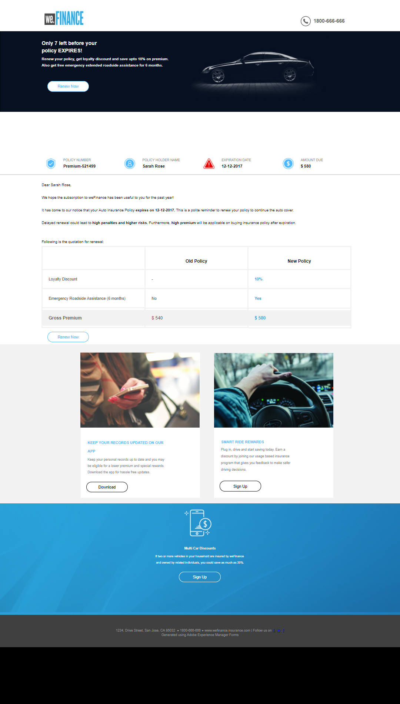

# We.Finance 自動保険更新リファレンスサイトのチュートリアル {#we-finance-auto-insurance-renewal-reference-site-walkthrough}

>[!CAUTION]
>
>AEM 6.4 の拡張サポートは終了し、このドキュメントは更新されなくなりました。 詳細は、 [技術サポート期間](https://helpx.adobe.com/jp/support/programs/eol-matrix.html). サポートされているバージョンを見つける [ここ](https://experienceleague.adobe.com/docs/?lang=ja).

## 前提条件 {#pre-requisites}

リファレンスサイトを設定します ( [AEM 6.4 Formsリファレンスサイトのセットアップと設定](/help/forms/using/setup-reference-sites.md).

## We.Finance リファレンスサイトのシナリオ  {#we-finance-reference-site-scenario}

We.Finance サイトは、AEM Forms のインタラクティブ通信機能の学習に役立つ金融サービスのサイトです。

We.Finance の自動保険ユースケースについて詳しくは、チュートリアルをお読みください。AEM Forms、および AEM Forms と Microsoft Dynamics との統合により、金融サービス会社で顧客体験をパーソナライズする方法をご理解いただけます。このインタラクティブなチュートリアルは、金融会社における複雑なデジタルトランザクションや、顧客とのコミュニケーションの実装を容易にすることを目的としています。

**まず、ユースケースをご覧ください。**

Sarah Rose は We.Finance 社の既存の顧客で、自動保険ポリシーを購入しています。現在、彼女は保険ポリシーの更新時期を迎えています。We.Finance 社の保険代理店である Gloria Rios が、Sarah に対し、保険契約の更新に関するリマインダーを送信します。 Sarah は電子メールに記載された指示に従い、処理を正常に完了します。

## 自動保険申し込みのチュートリアル {#auto-insurance-application-walkthrough}

We.Finance 社の自動保険申し込みのシナリオでは、次の 2 人の人物を使用して視覚的に説明します。

* Sarah Rose（We.Finance 社の顧客）
* Gloria Rios（We.Finance 社の保険代理店）

### Gloria が We.Finance 社から保険契約の更新に関する連絡を送信 {#gloria-sends-an-insurance-policy-renewal-communication-from-we-finance}

Gloria は AEM インスタンスにログインし、「 **自動保険更新**」をクリックしてから「**エージェント UI を開く**」をクリックします。クリックすると、Sarah Rose のポリシーの詳細が保険関連ドキュメントに表示されます。Gloria が「**送信**」をクリックすると、画面に「送信開始」メッセージが表示されたあと、数秒後に「送信完了」と表示されます。

Sarah は「自動保険更新」という件名のメールを受信します。

#### 実際の動作確認 {#see-it-yourself}

**Adobe Experience Manager** ／**フォーム** ／ **フォームとドキュメント** ／**We.Finance**／**自動保険**&#x200B;に移動します。を選択します。 **自動保険の更新** インタラクティブ通信とクリック **エージェント UI を開く**. エージェント UI でインタラクティブ通信が開きます。ポリシードキュメントが添付されたメールを受信するには、有効なメールアドレスを入力して「送信」をクリックします。

`https://[authorHost]: authorPort]/aem/formdetails.html/content/dam/formsanddocuments/we-finance/autoinsurance/auto-insurance-renewal.` から自動保険更新インタラクティブ通信に直接アクセスして確認することができます。

### Sarah は We.Finance 社から保険ポリシーの更新通知を受信し、更新を決めます {#sarah-receives-an-insurance-policy-renewal-communication-from-we-finance-and-decides-to-renew}

Sarah は、We.Finance 社のファイルが添付されたメールを受信します。このメールには、自動保険ポリシーの期限が近づいていることが記載されています。添付ファイルは、印刷用の自動保険レターです。

Sarah が「 **今すぐ更新する**」をクリックすると、自動保険レターの Web 版にリダイレクトされます。このレターの上部には、ポリシーの期限までの残り日数が表示されます。Sarah は、保険番号、支払い金額、割引キャンペーン、ロイヤルティ報酬など、保険ポリシーの詳細情報の概要をこのページで確認できます。Sarah はポリシーの下部の&#x200B;**今すぐ更新する**&#x200B;を再度クリックします。

#### 仕組み {#how-it-works}

自動保険レターの Web 版と印刷版は、インタラクティブ通信のマルチチャンネル機能を使用して作成されます。

電子メール内の「今すぐ更新する」ボタンは、Auto Insurance Renew アプリケーションにリンクされています。これは、パブリッシュインスタンス上のインタラクティブ通信です。

#### 実際の動作確認 {#see-it-yourself-1}

添付のPDF。 PDF は自動保険レターの印刷版です。「**今すぐ更新する**」をクリックしてポリシーの Web 版にアクセスします。自分の個人情報やポリシーの詳細を確認し、**今すぐ更新する**&#x200B;をクリックすると、別のインタラクティブ通信が表示されます。

メールの「**今すぐ更新する**」ボタンをクリックすると、Sarah はポリシーの Web 版にリダイレクトされます。次の URL にアクセスできます。

`https://[authorServer]:[authorPort]/content/document.html?schema=fdm&documentId=/content/forms/af/we-finance/autoinsurance/auto-insurance-renewal/channels/web.html&customerId=1`

自動保険更新の詳細な概要を確認してからページ下部の&#x200B;**今すぐ更新する**&#x200B;をクリックします。

### Sarah は支払いページを表示します {#sarah-reaches-the-payment-page}

We.Finance 社の支払いページが表示されます。Sarah は、自分の記録と照らし合わせて、ポリシー番号と有効期限を再確認します。ページの右側で契約更新の支払いの概要を確認します。合計金額からプレミアム割引として 10％ 差し引かれていることがわかります。

#### 仕組み {#how-it-works-1}

「今すぐ更新」ボタンをクリックすると、支払いページが表示されます。支払いページはアダプティブフォームです。

#### 実際の動作確認 {#see-it-yourself-2}

「**今すぐ更新する**」をクリックして支払いページにアクセスします。クレジットカード情報を入力し、 **支払いを行う。**

以下のオーサリングインスタンスから支払いページにアクセスすることができます。

`https://[authorServer]:[authorPort]/content/document.html?documentId=/content/forms/af/we-finance/credit-card/ccbillpayment.html&schema=fdm&customerId=1`

### Sarah は支払いを行ってプロセスを完了します {#sarah-makes-the-payment-and-completes-the-process}

Sarah はクレジットカードの詳細を入力し、**支払う**&#x200B;をクリックします。

#### 仕組み {#how-it-works-2}

Sarah がクレジットカードの詳細を入力して「送信」をクリックすると、クレジットカードの支払いが処理され、アダプティブフォームで設定した「ありがとうございます」メッセージが画面に表示されます。

#### 実際の動作確認 {#see-it-yourself-3}

「支払う」をクリックすると、確認メッセージが以下の URL に表示されます。

`https://[authorServer]:[authorPort]/content/forms/af/we-finance/credit-card/ccbillpayment/jcr:content/guideContainer.guideThankYouPage.html?owner=admin&status=Submitted`
