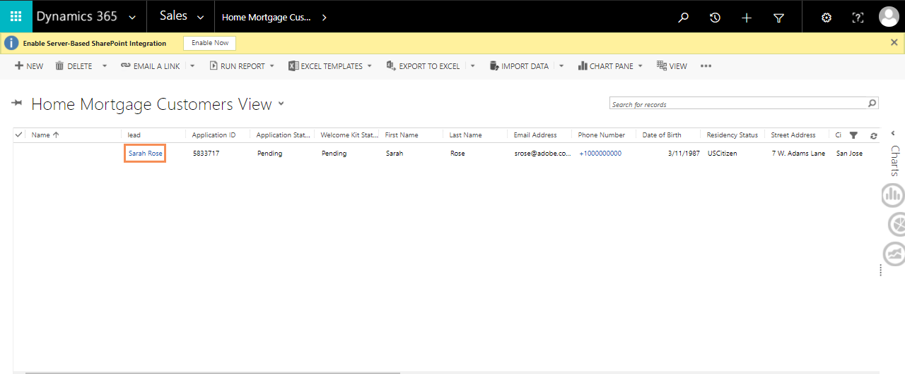

# We.Finance リファレンスサイトのチュートリアル {#we-finance-reference-site-walkthrough}

## 前提条件 {#pre-requisites}

「[AEM Forms リファレンスサイトのセットアップおよび設定](/help/forms/using/setup-reference-sites.md)」を参照してリファレンスサイトをセットアップします。

## We.Finance リファレンスサイトのシナリオ {#we-finance-reference-site-scenarios}

金融業界をリードする We.Finance 社は、幅広い顧客プロフィール要件に合わせてパーソナライズされた包括的な金融ソリューションを提供しています。クレジットカード、住宅ローンおよび住宅保険のサービスを提供しています。

その目的は、既存のお客様や見込み客に対し、好みのデバイスで連絡を取り、サービスの利点を説明し、サービスへの登録を支援することです。 さらに同社は、アドオンのカードなど、顧客が興味を抱きそうな金融商品を宣伝していきたいと考えています。

We.Finance 社のユースケースの詳細なチュートリアルをお読みいただき、金融機関が目標を達成するのに AEM Forms がどのように貢献しているかご確認ください。次の手順を説明します。

* [クレジットカードの申し込みのチュートリアル](#credit-card-application-walkthrough)
* [住宅ローン申し込みのチュートリアル](#home-mortgage-application-walkthrough)
* [Microsoft Dynamics を使用した住宅ローンの申し込みのチュートリアル](#home-mortgage-application-walkthrough-with-microsoft-dynamics)
* [住宅保険申し込みのチュートリアル](#home-insurance-application-walkthrough)
* [アセットマネジメントのチュートリアル](#wealthmanagementwalkthrough)
* [自動保険申し込みのチュートリアル](#autoinsuranceapplicationwalkthrough)

## クレジットカードの申し込みのチュートリアル {#credit-card-application-walkthrough}

We.Finance 社のクレジットカード申し込みのシナリオでは、以下の人物が登場します。

* Sarah Rose（We.Finance 社の顧客）
* Gloria Rios（We.Finance 社のクレジットカードおよび住宅ローンの責任者）

以下の解説図は、クレジットカードの申し込みのワークフローを図式化したものです。

リファレンスサイトの詳細なシナリオをお読みいただき、We.Finance 社が目標を達成するのに AEM Forms がどのように貢献しているかご確認ください。

### Sarah は We.Finance 社からニュースレターを受信し、クレジットカードを申し込む {#sarah-receives-a-newsletter-from-we-finance-and-applies-for-a-credit-card}

Sarah Rose は We.Finance 社の既存の顧客です。Sarah は We.Finance 社から新しいクレジットカードのキャンペーンについてのニュースレターを受信します。Sarah はそのキャンペーンに興味を持ち、クレジットカードを申し込むことに決めます。Sarah はニュースレターに表示されている「Apply Now」ボタンをクリックします。これにより、We.Finance 社のポータルサイトにあるクレジットカード申込フォームが表示されます。

#### 仕組み {#how-it-works}

Sarah に送信されたニュースレターは、特定の電子メール ID への電子メールをトリガーするカスタム実装です。電子メールに記載された「今すぐ申し込む」ボタンはクレジットカードの申込フォームにリンクされます。これはパブリッシュインスタンス上のアダプティブフォームです。

#### 実際の動作確認 {#see-it-yourself}

パブリッシュインスタンスで次の URL を開き、ニュースレターの電子メールをトリガーにします。 次を置き換えます。 `[emailID]` と有効な電子メールアカウントでニュースレターを受け取ります。 ニュースレターを開き、「**[!UICONTROL Apply Now]**」をクリックして、クレジットカードの申込フォームに移動します。

`https://[publishServer]:[publsihPort]/content/campaigns/we-finance/start.html?app=cc&email=[emailID]&givenName=Sarah&familyName=Rose`

### Sarah がキャンペーンに関心を抱き、申し込みを決意 {#sarah-finds-the-offer-interesting-and-chooses-to-apply}

Sarah がクレジットカードの申し込みを決め、タップします **[!UICONTROL 今すぐ適用]** ボタンをクリックします。 We.Finance 社のポータルサイトにあるクレジットカードの申込フォームが表示されます。申込フォームはカードレイアウトを使用してセクションごとに構成されています。

Sarah は利用可能なオプションからクレジットカードを選択して、「**[!UICONTROL Continue]**」をクリックします。

個人情報のページで社会保険番号を入力すると、使用している資格情報でログインするようにプロンプトが表示されます。

Sarah は We.Finance 社の既存の顧客です。Sarah が We.Finance 社のアカウントの資格情報でログインすると、個人情報の詳細がフォームに自動で入力されます。Sarah は申込フォームに入力を続けます。このとき、出席が必要な会議のリマインダーがポップアップ表示されます。 Sarah はクリックします **[!UICONTROL 作業内容を保存する]** を選択します。 このボタンをクリックすると、その時点までに入力されたすべての情報が保存されます。さらに、ダイアログポップアップが表示され、途中まで入力していたドラフトの内容を後で完成するために申込フォームへのリンクを電子メールで受け取ることを希望するかどうか尋ねられます。

Sarah は「**[!UICONTROL Send mail]**」をクリックします。彼女はクレジットカードの申込フォームを再開するためのリンクが表示された電子メールを受け取ります。

<!--Theses sections used to be an accordion until converted to straight Markdown. When accordions are enabled, revert-->

### Sarah がモバイルデバイスからクレジットカード申し込みにアクセスする {#a-sarah-access}

Sarah がモバイルデバイスからクレジットカードの申込フォームにアクセスした場合、申込フォームはモバイルデバイス用に最適化されて表示されます。このビューでは、申込フォームは一度に 1 つずつのセクションでレンダリングされます。そのため、Sarah は申込フォームを移動するたびに、順を追って情報の表示および入力を行うことができます。

### 仕組み {#a-how-it-works}

「**[!UICONTROL Apply Now]**」ボタンから、Sarah は直接クレジットカードの申込フォームにアクセスできます。アプリケーションはアダプティブフォームです。このフォームは、オーサリングインスタンスで `https://[host]:[Port]/editor.html/content/forms/af/we-finance/cc-app.html`.

アダプティブフォームで確認できるいくつかの主な機能は、次のとおりです。

* XSD スキーマに基づいている。
* スタイル設定は We Finance Theme A を使用し、レイアウトは We.Finance テンプレートを使用して構築されている。また、フォームのヘッダー部分にはモバイルナビゲーション用のパネルタイトルが表示されないレイアウトが採用されています。モバイルデバイスから開くと、プログレッシブモバイルレイアウトが表示されます。 このテンプレートは、 `https://[host]:[Port]/libs/wcm/core/content/sites/templates.html/conf/we-finance` テーマは `https://[host]:[Port]/editor.html/content/dam/formsanddocuments-themes/we-finance/we-finance-theme-a/jcr:content`.
* フォームデータモデルサービスを呼び出すためのアダプティブフォームルールが含まれ、ログインしたユーザーのユーザー詳細を事前入力する。また、サービスを呼び出す際は、フォームに入力した社会保険番号や電子メールアドレスにより、情報が事前入力されます。フォームデータモデルとそのサービスは、次の場所で確認できます。 `https://[host]:[Port]/aem/forms.html/content/dam/formsanddocuments-fdm`.
* さまざまなアダプティブフォームコンポーネントを使用して入力内容を取得し、ユーザーレスポンスに適合する。HTML5 入力タイプをサポートする電子メールなどのコンポーネントも使用します。
* 署名ステップコンポーネントを使用して、入力が完了したフォームを表示し、フォーム上で電子署名を行うことができる。
* 「Save my progress」ボタンをクリックすると、ユーザーに対して一意の ID が生成され、AEM リポジトリのノード内に一部入力済みの申込フォームが下書きとして保存される。また、同じアクションによって、申込フォームの下書きを含むノードへのリンクを電子メールで送信する許可を求めるダイアログが表示されます。確認ダイアログの「Send mail」ボタンをクリックすると、下書きを含むノードへのリンクを持つ電子メールが自動送信されます。
* AEM ワークフローを起動する送信アクションを使用して、クレジットカードの承認ワークフローをトリガーする。このフォームで使用されるワークフローは、次の場所で確認できます。 `https://[host]:[Port]/editor.html/conf/global/settings/workflow/models/we-finance-credit-card-workflow.html`

フォームを確認して、フォームの作成に使用したスキーマ、コンポーネント、ルール、フォームデータモデル、Forms ワークフロー、送信アクションを理解することをお勧めします。

また、クレジットカード申し込みのアダプティブフォームで使用した機能の詳細については、次のドキュメントを参照してください。

* [アダプティブフォームのオーサリングの概要](/help/forms/using/introduction-forms-authoring.md)
* [XML スキーマを使ったアダプティブフォームの作成](/help/forms/using/adaptive-form-xml-schema-form-model.md)
* [ルールエディター](/help/forms/using/rule-editor.md)
* [テーマ](/help/forms/using/themes.md)
* [データ統合](/help/forms/using/data-integration.md)
* [アダプティブフォームで Adobe Sign を使用する](/help/forms/using/working-with-adobe-sign.md)
* [OSGi 上の Forms 中心のワークフロー](/help/forms/using/aem-forms-workflow.md)

### 実際の動作確認 {#a-see-it-yourself}

Sarah Rose でログインし、クレジットカードの申込フォームで「**[!UICONTROL Apply now]**」ボタンをクリックします。詳細を一部入力し、様々なアダプティブフォームコンポーネントを確認して「**[!UICONTROL Save my progress]**」をクリックすると、途中まで入力した下書きの申込フォームにリンクする「**[!UICONTROL Resume]**」ボタンが表示された電子メールを受信します。申込フォームで電子メール ID を指定し、電子メールを受け取ることを確認します。

We.Finance のテーマは、次の場所で確認できます。

`https://<host>:<AuthorPort>/editor.html/content/dam/formsanddocuments-themes/we-Finance/we-Finance-Theme-A/jcr:content`

We.Finance のテンプレートは、次の場所で確認できます。

`https://<host>:<AuthorPort>/editor.html/conf/we-finance/settings/wcm/templates/we-finance-template/structure.html`

### Sarah が申込書の入力を再開し、送信 {#sarah-resumes-and-submits-the-application}

Sarah は会議から戻り、We.Finance 社からの電子メールを見つけます。電子メールに表示された「**[!UICONTROL Resume]**」ボタンをクリックすると、入力が途中のクレジットカードの申込フォームにアクセスできます。先ほど記入した情報はすでに入力された状態で表示されます。Sarah は申込フォームの残りの項目に記入し、申し込みに署名して送信します。

この方法以外にも、We.Finance 社のホームページにある「**[!UICONTROL My Forms]**」から、下書きした申込フォームにアクセスできます。

#### 仕組み {#how-it-works-1}

電子メールの「Resume」ボタンは、申込書の下書きを含むノードへリダイレクトします。

#### 実際の動作確認 {#see-it-yourself-1}

申込フォームの入力時に指定した電子メール ID で、申込フォームの下書きへのリンクが表示された電子メールを受信します。先へ進み、申込フォームの中の残りのセクションに必要な情報を入力し、送信します。

### We.Finance 社が申込書を受信および承認 {#approving-the-application}

Sarah によって送信されたクレジットカード申込書を、We.Finance 社が受信します。タスクは Gloria Rios に割り当てられます。Gloria は AEM インボックスでタスクを確認し、これを承認します。

#### 仕組み {#how-it-works-2}

Sarah がクレジットカードの申込フォームにすべて記入して送信すると、Forms ワークフローがトリガーされ、Gloria の AEM インボックスにタスクが作成されます。

OSGi 上の AEM Forms によって Forms 中心のワークフローが提供され、アダプティブフォームに基づいたワークフローを構築できます。これらのワークフローをレビューや承認、ビジネスプロセスフローに使用して、ドキュメントサービスを開始したり、Adobe Sign 署名ワークフローと統合したりすることができます。詳しくは、[OSGi での Forms 中心のワークフローを参照してください](/help/forms/using/aem-forms-workflow.md)。

次の画像では、クレジットカード申込書を処理してその PDF 出力を生成する AEM ワークフローを図式化して説明しています。

#### 実際の動作確認 {#see-it-yourself-2}

we.finance サイトのAEMインボックス (https://&lt;) にアクセスできます。*hostname*>:&lt;*PublishPort*>/content/we-finance/global/en.html. ページで、をタップします。 **[!UICONTROL ログイン]**&#x200B;を選択し、 **[!UICONTROL 担当者としてログイン]** チェックボックスに移動し、次を使用してAEMインボックスにログインします。 `grios/password` を Gloria Rios のユーザー名/パスワードとして設定し、クレジットカードの申し込みを承認します。 Forms 中心のワークフロータスクにAEM Inbox を使用する方法については、 [AEM Inbox でのFormsアプリケーションとタスクの管理](/help/forms/using/manage-applications-inbox.md).

申し込みを承認すると、Sarah は電子メールでウェルカムキットを受け取ります。

### Sarah がウェルカムキットを受信し、アドオンカードに適用 {#sarah-receives-the-welcome-kit-and-applies-for-an-add-on-card}

Sarah のクレジットカード申し込みが承認されると、彼女はウェルカムキットへのリンクを含む電子メールを受信します。ウェルカムキットには彼女のクレジットカードアカウントの詳細情報が記載されています。ウェルカムキットには、Sarah 向けにパーソナライズされたプロモーションキャンペーンも表示されます。 スクロールダウンすると、埋め込みフォームからアドオンカードへの申し込みができるようになっています。Sarah はウェルカムキットの中から必要事項をすばやく入力し、アドオンカードの申し込みを行います。 アドオンカード申込の確認ダイアログが表示されます。

ウェルカムキットは Sarah に合わせてパーソナライズされており、彼女に関わる情報を表示します。ウェルカムキットの PDF バージョンをダウンロードするオプションを彼女に提供します。

ウェルカムキットにはもうひとつの申込フォームが含まれています。Sarah がこれに入力して送信すると、We.Finance 社のポータルサイトを訪れることなく、ウェルカムキットの中からアドオンカードの申し込みを行うことができます。

#### 仕組み {#how-it-works-3}

ウェルカムキットは、 `cq-we-finance-content-pkg.zip` パッケージ。 デスクトップバージョンのウェルカムキットの中でクレジットカードのメリットを表示するインタラクティブカードは、ドキュメントフラグメントのデフォルトカードレイアウトを使用して作成されたカスタムレイアウトです。

アドオンカードの申し込みは、ウェルカムキットのインタラクティブ通信に埋め込まれたアダプティブフォームです。

#### 実際の動作確認 {#see-it-yourself-3}

次をクリック： **[!UICONTROL 再開]** 」ボタンをクリックします。 申込書の下書きが開きます。各項目に詳細を入力し、申込書を送信します。するとウェルカムキットを受信するので、その内容を確認します。

次の URL でもウェルカムキットが表示されます。

https://&lt;*ホスト*>:&lt;*ポート*>/content/aemforms-refsite/doclink.html?document=/content/forms/af/we-finance/credit-card/creditcardwelcomekit&amp;customerId=197&amp;channel=web

作成者インスタンスと発行インスタンスでアクセスできます。

### Sarah がクレジットカード明細を受信 {#sarah-receives-a-credit-card-statement}

Sarah は、クレジットカードの使用開始後に、自らのクレジットカード明細を含む別の電子メールを We.Finance 社から受信します。以下の画像では、クレジットカード明細へのリンクを含む電子メールのモバイルバージョンを紹介しています。

Sarah は「View Statement」（明細を表示）ボタンをクリックし、クレジットカード明細を確認します。文はインタラクティブ通信です。 Web 版と印刷版 (PDF) 版の両方があります。 この文は、Formsデータモデルと統合され、お客様固有のデータをデータベースから取得します。 この明細はインタラクティブステートメントであり、様々な要素から構成されています。

* 明細概要
* 支払細目レポート
* 支払分析のグラフィック表示
* 明細の中から支払合計額の支払方法を選択するオプション
* 支払受領書のダウンロード

Sarah は、ポータルに移動したり、電子メールで検索したりして、オフラインでのアーカイブ用にクレジットカード明細書のPDF版を検索する必要はありません。 「Download Statement」（文をダウンロード）をクリックするだけで、文のPDF版をダウンロードできます。

詳細な文は、レスポンシブテーブルにレイアウトされます。 また、明細の中から一部または全額を支払うオプションも提供されます。

Sarah は明細の中から支払いのスケジュールを設定します。 また、「フレックス支払」オプションを使用して、支払を同じ部分に分割することもできます。

#### 仕組み {#how-it-works-4}

クレジットカード明細は、インタラクティブな通信です。 明細中の支払細目一覧はレスポンシブテーブルです。費用分析のグラフィックはグラフコンポーネントで、費用テーブルを読み取り、円グラフを生成します。

#### 実際の動作確認 {#see-it-yourself-4}

インタラクティブなクレジットカード明細を確認するには、次の URL を参照します。

https://&lt;*hostname*>:&lt;*ポート*>/content/aemforms-refsite/doclink.html?document=/content/forms/af/we-finance/credit-card/credit-card-statement&amp;customerId=197&amp;channel=web

作成者インスタンスと発行インスタンスでアクセスできます。

クレジットカード明細書には、明細書の末尾に向けて、プロモーションのオファーが表示されます。 Adobe TargetをAEM Formsインタラクティブ通信と統合して、特定の顧客セグメントに基づくプロモーションをターゲットにしたオファーを提供できます。 Adobe Targetをカスタマイズおよびターゲット設定されたオファーに使用するようにインタラクティブ通信を設定するには、 [ターゲットを設定したエクスペリエンス](/help/forms/using/experience-targeting-forms.md).

### We.Finance 社がクレジットカード申込フォームのパフォーマンスを分析 {#we-finance-analyzes-the-performance-of-the-credit-card-application}

We.Finance 社は、時折、自社のクレジットカード申し込みを見直して、顧客が直面しうる問題についてチェックします。同社はこの分析を使用して、クレジットカード申込フォームの中で必要な変更について、情報に基づいた判断を行います。その目的は、ユーザーエクスペリエンスを強化し、申込希望者がフォームを途中で破棄する割合を低減し、カードの乗り換えをしやすくすることにあります。同社は、分析のために AEM Forms を Adobe Analytics と統合しています。以下の画像では、同社の Analytics ダッシュボードを紹介しています。

Analytics ダッシュボードの見方について詳しくは、「[AEM Forms の分析レポートの確認方法と詳細](/help/forms/using/view-understand-aem-forms-analytics-reports.md)」を参照してください。

#### 仕組み {#how-it-works-5}

クレジットカード申込フォームのパフォーマンス指標は、Adobe Analytics を使用して追跡されます。Adobe Analytics の設定とレポートの表示について詳しくは、「[フォームおよびドキュメント用の Analytics の設定](/help/forms/using/configure-analytics-forms-documents.md)」を参照してください。

#### 実際の動作確認 {#see-it-yourself-br}

Analytics レポートを閲覧および検討したい方のために、リファレンスサイトでクレジットカード申込フォームのシードデータが提供されています。シードデータを使用する前に、「[Analytics の設定](/help/forms/using/setup-reference-sites.md#configureanalytics)」を参照してください。シードデータを使用したレポートを閲覧するには、作成者インスタンスで以下の手順を実行します。

1. に移動します。 **[!UICONTROL Forms &amp; Documents]** UI(https://&lt;)*hostname*>:&lt;*AuthorPort*>/aem/forms.html/content/dam/formsanddocuments

1. **[!UICONTROL We.Finance]** フォルダーをクリックし、開きます。
1. 選択 **[!UICONTROL クレジットカードの申請]** アダプティブフォームを開き、ツールバーで **[!UICONTROL Analytics を有効にする]**.

1. アダプティブフォームを再度選択し、 **[!UICONTROL Analytics レポート]** をクリックして、レポートを生成します。 最初は空のレポートが表示されます。

シードデータを含む Analytics レポートを生成するには：

1. CRXDE lite のアドレスブラウザーで、次のように入力します。 `/apps/we-finance/demo-artifacts/analyticsTestData/Credit card Analytics Test Data`
1. 左側のディレクトリ構造でテストデータが選択されます。
1. 選択されたファイルをダブルクリックして、右側のパネルにファイルのコンテンツを開きます。
1. シードデータファイル内のすべてのコンテンツをコピーします。
1. CRXDE で、次の場所に移動します。 `/content/dam/formsanddocuments/we-finance/cc-app/jcr:content/analyticsdatanode/lastsevendays`
1. 内 **[!UICONTROL analyticsdata]** ～の下のフィールド **[!UICONTROL プロパティ]**」で、コピーしたシードデータファイルの内容を貼り付けます。

1. 選択 **クレジットカードの申請** アダプティブフォームを開き、 **[!UICONTROL Analytics レポート]** を使用して、シードデータを含むレポートを生成する必要があります。

**クレジットカード申込書の A/B テスト**

クレジットカード申込フォームのパフォーマンスを分析し継続的にその改善を図ることに加えて、We.Finance 社は、AEM Forms と Adobe Target を統合し、A/B テストを作成します。このテストにより、クレジットカード申込フォームの異なるエクスペリエンスを提供し、フォームの完成および送信という見地から乗り換えの促進につながるエクスペリエンスを突き止めることができます。

AEM Formsサーバーで Target を設定するには、 [AEM Formsでの Target の設定と統合](/help/forms/using/ab-testing-adaptive-forms.md#set%20up%20and%20integrate%20target%20in%20aem%20forms).

以下の手順を実行し、We.Finance 社クレジットカード申込フォームのための A/B テストを試作しましょう。

1. に移動します。 **[!UICONTROL Forms &amp; Documents]** https://&lt;*hostname*>:&lt;*AuthorPort*>/aem/forms.html/content/dam/formsanddocuments

1. **[!UICONTROL We.Finance]** フォルダーをクリックし、開きます。
1. 「**[!UICONTROL Application for Credit Card]**」アダプティブフォームを選択します。
1. ツールバーの「**[!UICONTROL その他]**」をクリックし、「**[!UICONTROL A/B テストを設定]**」を選択します。「A/B テストを設定」ページが開きます。

1. 「**[!UICONTROL アクティビティ名]**」を指定します。
1. オーディエンスドロップダウンリストから、そのフォームの異なるエクスペリエンスの提供対象オーディエンスを選択します。例えば、**Chrome を使用している訪問者**&#x200B;を選択します。
1. エクスペリエンス A および B に対する&#x200B;**[!UICONTROL エクスペリエンス配布]**&#x200B;フィールドで、パーセンテージの見地から配信内容を指定し、全オーディエンス間のエクスペリエンスの配信を決定します。例えば、エクスペリエンス A および B に対してそれぞれ 40、60 を指定すると、エクスペリエンス A はオーディエンスの 40 % に配布され、残りの 60 % にはエクスペリエンス B が表示されます。
1. 「**設定**」をクリックします。A/B テストの作成を確認するダイアログが表示されます。
1. 「**完了**」をクリックします。
1. を選択します。 **クレジットカードの申請** フォームとクリック **編集**. その後表示されるオプションにより、エクスペリエンスの一方を開くことができます。「**エクスペリエンス B**」をクリックします。フォームが編集モードで開きます。

1. 必要に応じてフォームを修正し、デフォルトのエクスペリエンス A とは異なるエクスペリエンスを作成します。
1. 「フォームとドキュメント」UI へ進み、フォームを選択し、「**その他**」をクリックし、「**A/B テストを開始**」をクリックします。

1. 次の URL を使用して、Chrome ブラウザーでフォームを数回開きます。

   `https://[hostname]:[port]/content/dam/formsanddocuments/we-finance/cc-app/jcr:content?wcmmode=disabled`

   >[!NOTE]
   >
   >次回以降、フォームを開く前に **mbox** という名前を持つ Cookie を、ブラウザーの Cookie パーシステンスから削除してください。そうすると、フォームのエクスペリエンス A および B をランダムに確認することになります。

1. フォームを選択し、「**その他**」をクリックし、「**A/B テストを開始**」をクリックします。テスト開始直後には、レポートに多くのデータが表示されることはありません。シードデータを使用して、A/B テストレポートがどのように表示されるか確認しましょう。

1. CRXDE Lite を開き、次のファイルのバックアップを作成します。 /libs/fd/fmaddon/gui/components/admin/targetreport/clientlibs/targetreport/js/targetreport.js
1. 関数の定義を置き換える `onReportLoadSuccess` 上記のファイルの、次のファイル内の関数定義を含むファイルの場合：/apps/we-finance/demo-artifacts/targetreport.js

   **注意：** これらの変更はデモ目的でのみおこなわれます。 この手順を完了した後、必ずファイルの中身を元に戻してください。

1. 生成したレポートを更新すると、以下のような画面が表示されます。レポートダッシュボードを確認します。

A/B テストを終了するには、レポートダッシュボードの「**A/B テストを終了**」ボタンをクリックします。ここで、一方のエクスペリエンスを公表するように求めるダイアログが表示されます。推奨結果を選択し、A/B テストの終了を確認します。

エクスペリエンス A を優れていると判断した場合は、A/B テストの終了後は、エクスペリエンス A のみが Chrome ユーザーを含むすべてのオーディエンスに配信されます。

## 住宅ローン申し込みのチュートリアル {#home-mortgage-application-walkthrough}

We.Finance 社の住宅ローンのシナリオでは、以下の人物が登場します。

* Sarah Rose（We.Finance 社の顧客）
* Gloria Rios（We.Finance 社のクレジットカードおよび住宅ローンの責任者）
* John Doe（We.Finance 社の顧客担当代表）

以下の解説図は、住宅ローン申し込みのワークフローを図式化したものです。

リファレンスサイトのシナリオを順に詳しく見ていきながら、AEM Forms が We.Finance 社の目標達成にどのように貢献しているか確認しましょう。

### Sarah は We.Finance 社の Web サイトにアクセスして住宅ローンを申し込む {#sarah-visits-we-finance-website-and-applies-for-home-mortgage}

Sarah Rose は家を購入する計画を立て、住宅ローンのプランを探しています。Sarah は We.Finance 社の顧客なので、We.Finance 社のポータルサイトにアクセスして住宅ローンのプランを探しています。住宅ローンのセクションに移動すると、ポータルサイトでローンの計算ができることが分かりました。Sarah が詳細を入力して「Calculate my mortgage」をクリックすると、住宅ローンのプランが表示されます。

 
**図：** *住宅ローン計算ツール*

**図：** *住宅ローン計算ツールの結果*

#### 仕組み {#how-it-works-6}

ローンページにある住宅ローン計算機は、AEM サイトページのアダプティブフォームに埋め込まれています。次の場所で編集モードでローンページを確認できます： `https://[authorHost]:[authorPort]/editor.html/content/we-finance/global/en/loan-landing-page.html`.

埋め込まれた住宅ローン計算機はアダプティブフォームです。これは、計算機フィールドに入力されたローンの詳細に基づいて、ルールを使用して EMI 総額を算出します。アダプティブフォームは次の場所で確認できます。 `https://[authorHost]:[authorPort]/editor.html/content/forms/af/we-finance/hm-calc.html`.

#### 実際の動作確認 {#see-it-yourself-5}

We.Finance ポータル ( ) に移動します。 `https://<publishHost>:<publishPort>/content/we-finance/global/en.html` をクリックし、 **[!UICONTROL 融資]**. 住宅ローン計算機に詳細を入力すると、その結果が表示されます。

### Sarah がキャンペーンに関心を抱き、申し込みを決意 {#sarah-finds-the-offer-interesting-and-chooses-to-apply-1}

Sarah は住宅ローンの申し込みとクリック **[!UICONTROL 今すぐ適用]** 住宅ローンの計算結果に関する 住宅ローンの申込フォームが開きます。

Sarah がモバイルデバイスから住宅ローンの申込フォームにアクセスした場合は、申込フォームはモバイルデバイスの表示用に最適化されたビューで開かれます。この表示では、アプリケーションフォームは一度に 1 つのセクションをレンダリングします。 そのため、Sarah は申込フォームを移動するたびに、順を追って情報の表示および入力を行うことができます。

以下の画像では、Sarah が住宅ローンの申し込み時にモバイルデバイス上で閲覧したワークフローを紹介します。

Sarah がデスクトップから「**Apply now**」をクリックすると、以下のように住宅ローン申込フォームが表示されます。Sarah が住宅ローン計算機に入力した情報は、申込フォームに事前入力されます。Sarah は残りの情報を入力し、「**Continue**」をクリックします。

Sarah が住宅ローン計算機に入力した情報に基づいて、いくつかの住宅ローンプランが提示されます。その中から自分の要件に適したプランを選択し、申込フォームへの入力を続けます。最後に署名を行い、申込書を送信します。

送信された申込書は、承認用に We.Finance 社に送られます。

#### 仕組み {#how-it-works-7}

「**Apply Now**」ボタンから、Sarah は直接住宅ローンの申込フォームにアクセスできます。アプリケーションはアダプティブフォームです。このフォームは、オーサリングインスタンスで `https://[host]:[Port]/editor.html/content/forms/af/we-finance/hm-app.html`.

アダプティブフォームで確認できるいくつかの主な機能は、次のとおりです。

* XSD スキーマ、`homeMortgageApplication.xsd` に基づいている。
* スタイル設定は We Finance Theme B を使用し、レイアウトは We.Finance テンプレートを使用して構築されている。また、フォームのヘッダー部分にはモバイルナビゲーション用のパネルタイトルが表示されないレイアウトが採用されています。モバイルデバイスから開くと、プログレッシブモバイルレイアウトが表示されます。 アダプティブフォームで使用されるテンプレートおよびテーマは、AEM オーサーインスタンスの次の場所で確認できます。

   * `https://[host]:[Port]/libs/wcm/core/content/sites/templates.html/conf/we-finance`
   * `https://[host]:[Port]/editor.html/content/dam/formsanddocuments-themes/we-finance/we-finance-theme-b/jcr:content`

* 申込フォームにある最初のタブの「Getting Started」は、動的な住宅ローン計算機で、ユーザーの選択内容に基づいてオプションを表示する。例えば、購入のオプションと借り換えのオプションではフィールドおよび値が異なります。この機能は、表示または非表示のルールを使用して実行されます。さらに、「Continue」をクリックして「Plans」タブを初期化すると、フォームデータモデルで設定された Web サービスが呼び出され、住宅ローンプランが取得されて表示されます。フォームデータモデルと設定済みサービスは、次の場所で確認できます。 `https://[host]:[Port]/aem/forms.html/content/dam/formsanddocuments-fdm`.
* さまざまなアダプティブフォームコンポーネントを使用して入力内容を取得し、ユーザーレスポンスに適合する。HTML5 入力タイプをサポートする電子メールなどのコンポーネントも使用します。
* 署名ステップコンポーネントを使用して、入力が完了したフォームを表示し、フォーム上で電子署名を行うことができる。
* AEM ワークフローを起動する送信アクションを使用して、We Finance 住宅ローン AEM ワークフローをトリガーする。このフォームで使用されるワークフローは、次の場所で確認できます。 `https://[host]:[Port]/editor.html/conf/global/settings/workflow/models/we-finance-home-mortgage-workflow.html`

フォームを確認して、フォームの作成に使用したスキーマ、コンポーネント、ルール、フォームデータモデル、Forms ワークフロー、送信アクションを理解することをお勧めします。

また、住宅ローン申し込みのアダプティブフォームで使用した機能の詳細については、次のドキュメントを参照してください。

* [アダプティブフォームのオーサリングの概要](/help/forms/using/introduction-forms-authoring.md)
* [XML スキーマを使ったアダプティブフォームの作成](/help/forms/using/adaptive-form-xml-schema-form-model.md)
* [ルールエディター](/help/forms/using/rule-editor.md)
* [テーマ](/help/forms/using/themes.md)
* [データ統合](/help/forms/using/data-integration.md)
* [アダプティブフォームで Adobe Sign を使用する](/help/forms/using/working-with-adobe-sign.md)
* [OSGi 上の Forms 中心のワークフロー](/help/forms/using/aem-forms-workflow.md)

#### 実際の動作確認 {#see-it-yourself-6}

に移動します。 `https://[server]:[port]/content/we-finance/global/en/all-forms.html` をクリックし、 **今すぐ適用** ボタンをクリックします。 「Getting Started」タブに詳細を入力し、さまざまなオプションを試して、申込書を送信します。

申込フォームで有効な電子メール ID を指定し、インボックスで確認のメールを受信します。

### We.Finance 社が申し込みを受信 {#approving_the_application-1}

Sarah によって送信された住宅ローン申込書を、We.Finance 社が受信します。申し込みの承認または拒否のタスクが Gloria Rios に割り当てられます。彼女は申し込みを確認し、行政 ID が入力されていないことに気付きます。

Gloria はタスクを開き、「Need More Info」をクリックして、行政 ID が入力されていないというコメントを入力します。

これにより、タスクは We.Finance 社の顧客担当代表の John Doe に割り当てられます。John はタスクを開き、Gloria のコメントを確認します。John は Sarah に連絡を取り、ID のコピーを送信してくれるように伝えます。Sarah の ID のコピーを受け取ったら、タスクに添付して再評価するために申込書を送信します。

タスクは Gloria に再度割り当てられます。添付された ID を確認し、申し込みを承認します。

#### 仕組み {#how-it-works-8}

Sarah が住宅ローンの申込フォームにすべて記入して送信すると、Forms ワークフローがトリガーされ、Gloria の AEM インボックスにタスクが作成されます。Gloria が申込書を確認して追加の情報をリクエストしたため、タスクは John Doe に割り当てられます。John Doe が ID を添付して申込書を再度送信すると、申込書は Gloria に割り当てられます。これは、住宅ローンの申し込みに関連する AEM ワークフローで定義されています。

OSGi 上の AEM Forms によって Forms 中心のワークフローが提供され、アダプティブフォームに基づいたワークフローを構築できます。これらのワークフローをレビューや承認、ビジネスプロセスフローに使用して、ドキュメントサービスを開始したり、Adobe Sign 署名ワークフローと統合したりすることができます。詳しくは、[OSGi での Forms 中心のワークフローを参照してください](/help/forms/using/aem-forms-workflow.md)。

以下の図は、住宅ローンの申し込みに関連する AEM ワークフローを図式化したものです。

#### 実際の動作確認 {#see-it-yourself-7}

AEMインボックスには、https://&lt; からアクセスできます。***hostname***>:&lt;***AuthorPort***>/content/we-finance/global/en/login.html?resource=/aem/inbox.html. Gloria Rios のユーザー名とパスワード（`grios/password`）と、John Doe のユーザー名とパスワード（`jdoe/jdoe`）をそれぞれ使用して AEM インボックスにログインし、住宅ローンの申し込みワークフローを参照します。

Forms 中心のワークフロータスクにAEM Inbox を使用する方法については、 [AEM Inbox でのFormsアプリケーションとタスクの管理](/help/forms/using/manage-applications-inbox.md).

### Sarah がウェルカムキットを受信 {#sarah-receives-the-welcome-kit}

Sarah の住宅ローン申込が承認されると、彼女はウェルカムキットへのリンクを含む電子メールを受信します。Sarah はウェルカムキットを開き、これにはカルーセルスライド式のディスプレイが含まれており、そこに Sarah 向けにカスタマイズされたプロモーションキャンペーン情報が表示されます。

ウェルカムキットは Sarah に合わせてパーソナライズされており、彼女に関わる情報を表示します。ウェルカムキットの PDF バージョンをダウンロードするオプションを彼女に提供します。画面下の矢印ボタンにより、Sarah は画面をスクロールダウンし、ウェルカムキットの他のセクションを次々に閲覧できます。

#### 仕組み {#how-it-works-9}

ウェルカムキットは、 `cq-we-finance-content-pkg.zip` パッケージ。 ウェルカムキットの中のプロモーションキャンペーン情報は、Adobe Target サーバーから配信されます。キャンペーン情報は個別の顧客セグメントを対象としてカスタマイズされます。ウェルカムキットは、前もって設定された Adobe Target サーバーから、女性利用客の閲覧者セグメントのためのキャンペーン情報を取得します。

デスクトップバージョンのウェルカムキットにあるインタラクティブカードは、ドキュメントフラグメントのデフォルトのカードのレイアウトを使用して作成されたカスタムレイアウトを使用します。

#### 実際の動作確認 {#see-it-yourself-8}

住宅ローンの申込フォームの入力時に電子メール ID を入力した場合、ウェルカムキットへのリンク先が表示された電子メールを受信します。インボックスをチェックしてウェルカムキットを確認します。

これは次の URL にある AEM パブリッシュインスタンスに表示されます。

`https://[host]:[port]/content/forms/af/we-finance/mortgage-loan-welcome-kit.html`

### Sarah が取引明細書を受信 {#sarah-receives-an-account-statement}

Sarah が住宅ローンの利用を開始し、賦払金の返済を開始すると、自らの毎月の取引明細を含む別の電子メールを We.Finance 社から受信します。

Sarah は「View Statement」（明細を表示）ボタンをクリックし、住宅ローン明細を確認します。この明細はインタラクティブステートメントであり、様々な要素から構成されています。

* 明細概要
* 明細詳細

以下の画像では、デスクトップバージョンの取引明細の別の部分を紹介しています。

細目が記載された明細はレスポンシブテーブルとしてレイアウトされており、明細の中で一部または全額を支払う選択を行うことができるようになっています。

#### 仕組み {#how-it-works-10}

住宅ローン明細書はインタラクティブなコミュニケーションです。 これは JSON バッチプロセスを使用して生成されます。明細中の支払細目一覧はレスポンシブテーブルです。

#### 実際の動作確認 {#see-it-yourself-9}

インタラクティブな住宅ローン明細を確認するには、次の URL を参照します。

https://&lt;*hostname*>:&lt;*ポート*>/content/forms/af/we-finance/mortgage-account-statement.html?wcmmode=disabled

作成者インスタンスと発行インスタンスでアクセスできます。

### We.Finance 社が住宅ローン申込フォームのパフォーマンスを分析 {#we-finance-analyzes-the-performance-of-the-mortgage-application}

We.Finance 社は、時折、自社の住宅ローン申し込みを見直して、顧客が直面しうる問題についてチェックします。同社はこの分析を使用して、住宅ローン申込フォームの中で必要な変更について、情報に基づいた判断を行います。その目的は、ユーザーエクスペリエンスを強化し、申込希望者がフォームを途中で破棄する割合を低減し、カードの乗り換えをしやすくすることにあります。同社は、分析のために AEM Forms を Adobe Analytics と統合しています。以下の画像では、同社の Analytics ダッシュボードを紹介しています。

Analytics ダッシュボードの見方について詳しくは、「[AEM Forms の分析レポートの確認方法と詳細](/help/forms/using/view-understand-aem-forms-analytics-reports.md)」を参照してください。

#### 仕組み {#how-it-works-11}

住宅ローン申込フォームのパフォーマンス指標は、Adobe Analytics を使用して追跡されます。Adobe Analytics の設定とレポートの表示について詳しくは、「[フォームおよびドキュメント用の Analytics の設定](/help/forms/using/configure-analytics-forms-documents.md)」を参照してください。

#### 実際の動作確認 {#see-it-yourself-br-1}

Analytics レポートを閲覧および検討したい方のために、リファレンスサイトで住宅ローン申込フォームのシードデータが提供されています。シードデータを使用する前に、「[Analytics の設定](/help/forms/using/setup-reference-sites.md#configureanalytics)」を参照してください。シードデータを使用したレポートを閲覧するには、作成者インスタンスで以下の手順を実行します。

1. に移動します。 **Forms &amp; Documents** UI(https://&lt;)*hostname*>:&lt;*AuthorPort*>/aem/forms.html/content/dam/formsanddocuments

1. **we-finance** フォルダーをクリックし、開きます。
1. 選択 **[!UICONTROL 住宅ローンの申請]** アダプティブフォームを開き、ツールバーで **[!UICONTROL Analytics を有効にする]**.

1. フォームを再度選択し、 **[!UICONTROL Analytics レポート]** をクリックして、レポートを生成します。 最初は空白のレポートが表示されます。

シードデータを含む Analytics レポートを生成するには：

1. CRXDE lite のアドレスブラウザーで、次のように入力します。 `/apps/we-finance/demo-artifacts/analyticsTestData/HomeMortgageAnalyticsTestData`
1. 左側のディレクトリ構造でテストデータが選択されます。
1. 選択されたファイルをダブルクリックして、右側のパネルでファイルのコンテンツを開きます。
1. シードデータファイル内のすべてのコンテンツをコピーします。
1. CRXDE で、次の場所に移動します。 `/content/dam/formsanddocuments/we-finance/hm-app/jcr:content/analyticsdatanode/lastsevendays`
1. 「プロパティ」の下の analyticsdata フィールドに、コピーしたシードデータファイルの内容を貼り付けます。
1. 住宅ローン申し込みフォームの分析レポートを再度生成します。 シードデータが含まれたレポートが表示されます。

**住宅ローン申込書の A/B テスト**

住宅ローン申込フォームのパフォーマンスを分析し継続的にその改善を図ることに加えて、We.Finance 社は、AEM Forms と Adobe Target を統合し、A/B テストを作成します。このテストにより、申込フォームの異なるエクスペリエンスを提供し、フォームの完成および送信という見地から乗り換えの促進につながるエクスペリエンスを突き止めることができます。

AEM Formsサーバーで Target を設定するには、 [AEM Formsでの Target の設定と統合](/help/forms/using/ab-testing-adaptive-forms.md#set%20up%20and%20integrate%20target%20in%20aem%20forms).

作成者インスタンスで以下の手順を実行して、We.Finance 社の住宅ローン申込フォームのための A/B テストを試作しましょう。

1. に移動します。 **Forms &amp; Documents** https://&lt;*hostname*>:&lt;*AuthorPort*>/aem/forms.html/content/dam/formsanddocuments

1. **We.Finance** フォルダーをクリックし、開きます。
1. 選択 **住宅ローンの申請** アダプティブフォーム。
1. ツールバーの「**その他**」をクリックし、「**A/B テストを設定**」を選択します。「A/B テストを設定」ページが開きます。

1. 「**アクティビティ名**」を指定します。
1. オーディエンスドロップダウンリストから、そのフォームの異なるエクスペリエンスの提供対象オーディエンスを選択します。例えば、**Chrome を使用している訪問者**&#x200B;を選択します。
1. エクスペリエンス A および B に対する&#x200B;**エクスペリエンス配布**&#x200B;フィールドで、パーセンテージの見地から配信内容を指定し、全オーディエンス間のエクスペリエンスの配信を決定します。例えば、エクスペリエンス A および B に対してそれぞれ 40、60 を指定すると、エクスペリエンス A はオーディエンスの 40 % に配布され、残りの 60 % にはエクスペリエンス B が表示されます。
1. 「**設定**」をクリックします。A/B テストの作成を確認するダイアログが表示されます。
1. 「**完了**」をクリックします。
1. を選択します。 **住宅ローンの申請** アダプティブフォームを開き、 **編集**. その後表示されるオプションにより、エクスペリエンスの一方を開くことができます。「**エクスペリエンス B**」をクリックします。フォームが編集モードで開きます。

1. 必要に応じてフォームを修正し、デフォルトのエクスペリエンス A とは異なるエクスペリエンスを作成します。
1. 「フォームとドキュメント」UI へ進み、フォームを選択し、「**その他**」をクリックし、「**A/B テストを開始**」をクリックします。

1. 次の URL を使用して、Chrome ブラウザーでフォームを数回開きます。

   `https://[hostname]:[port]/content/dam/formsanddocuments/we-finance/hm-app/jcr:content?wcmmode=disabled`

   >[!NOTE]
   >
   >次回以降、フォームを開く前に **mbox** という名前を持つ Cookie を、ブラウザーの Cookie パーシステンスから削除してください。そうすると、フォームのエクスペリエンス A および B をランダムに確認することになります。

1. フォームを選択し、「**その他**」をクリックし、「**A/B テストを開始**」をクリックします。テスト開始直後には、レポートに多くのデータが表示されることはありません。シードデータを使用して、A/B テストレポートがどのように表示されるか確認しましょう。

1. CRXDE Lite を開き、次のファイルのバックアップを作成します。 /libs/fd/fmaddon/gui/components/admin/targetreport/clientlibs/targetreport/js/targetreport.js
1. の定義を置き換える `onReportLoadSuccess` 関数の名前を指定し、次のファイルの関数定義を指定します。/apps/we-finance/demo-artifacts/targetreport.js

   >[!NOTE]
   >
   >これらの変更はデモのためだけに行われます。この手順を完了した後、必ずファイルの中身を元に戻してください。

1. 生成したレポートを更新すると、以下のような画面が表示されます。レポートダッシュボードを確認します。

A/B テストを終了するには、レポートダッシュボードの「**A/B テストを終了**」ボタンをクリックします。ここで、一方のエクスペリエンスを公表するように求めるダイアログが表示されます。推奨結果を選択し、A/B テストの終了を確認します。

エクスペリエンス A を優れていると判断した場合は、A/B テストの終了後は、エクスペリエンス A のみが Chrome ユーザーを含むすべてのオーディエンスに配信されます。

## Microsoft Dynamics を使用した住宅ローンの申し込みのチュートリアル {#home-mortgage-application-walkthrough-with-microsoft-dynamics}

Microsoft Dynamics を使用した We.Finance 社の住宅ローンのシナリオでは、以下の人物が登場します。

* Sarah Rose（We.Finance 社の顧客）
* We.Finance Microsoft Dynamics インスタンスの管理者

Microsoft Dynamics を使用した住宅ローン申し込みのチュートリアルでは、リファレンスサイトでMicrosoft Dynamics をデータ統合に使用する場合に、We.Finance 社のお客様がサイトを使用して住宅ローンの申し込みを行う方法を示しています。 このチュートリアルは、Microsoft Dynamics で受信されたユーザーがデータ入力を完了するところで終わります。このシナリオに進む前に、 [We.Finance リファレンスサイトの住宅ローンワークフロー用のMicrosoft Dynamics 365 設定](/help/forms/using/ms-dynamics-configuration-home-mortgage.md).

### Sarah は We.Finance 社の Web サイトにアクセスして住宅ローンを申し込む {#sarah-visits-we-finance-website-and-applies-for-home-mortgage-1}

Sarah Rose は家を購入する計画を立て、住宅ローンのプランを探しています。Sarah は We.Finance 社の顧客なので、We.Finance 社のポータルサイトにアクセスして住宅ローンのプランを探しています。住宅ローンのセクションに移動すると、ポータルサイトでローンの計算ができることが分かりました。Sarah が詳細を入力して「Calculate my mortgage」をクリックすると、住宅ローンのプランが表示されます。

 
**図：** *住宅ローン計算ツール*

**図：** *住宅ローン計算ツールの結果*

#### 仕組み {#how-it-works-12}

ローンページにある住宅ローン計算機は、AEM サイトページのアダプティブフォームに埋め込まれています。次の場所で編集モードでローンページを確認できます： `https://[authorHost]:[authorPort]/editor.html/content/we-finance/global/en/loan-landing-page.html`.

埋め込まれた住宅ローン計算機はアダプティブフォームです。これは、計算機フィールドに入力されたローンの詳細に基づいて、ルールを使用して EMI 総額を算出します。アダプティブフォームは次の場所で確認できます。 `https://[authorHost]:[authorPort]/editor.html/content/forms/af/we-finance/ms-dynamics/home-mortgage-calculator.html`.

#### 実際の動作確認 {#see-it-yourself-10}

We.Finance ポータル ( ) に移動します。 `https://<publishHost>:<publishPort>/content/we-finance/global/en.html` をクリックし、 **[!UICONTROL 融資]**. 住宅ローン計算機に詳細を入力すると、その結果が表示されます。

### Sarah がキャンペーンに関心を抱き、申し込みを決意 {#sarah-finds-the-offer-interesting-and-chooses-to-apply-2}

Sarah は住宅ローンの申し込みとクリック **[!UICONTROL 今すぐ適用]** 住宅ローンの計算結果に関する 住宅ローンの申込フォームが開きます。

Sarah がモバイルデバイスから住宅ローンの申込フォームにアクセスした場合は、申込フォームはモバイルデバイスの表示用に最適化されたビューで開かれます。この表示では、アプリケーションフォームは一度に 1 つのセクションをレンダリングします。 そのため、Sarah は申込フォームを移動するたびに、順を追って情報の表示および入力を行うことができます。

以下の画像では、Sarah が住宅ローンの申し込み時にモバイルデバイス上で閲覧したワークフローを紹介します。

Sarah がデスクトップから「**Apply now**」をクリックすると、以下のように住宅ローン申込フォームが表示されます。Sarah が住宅ローン計算機に入力した情報は、申込フォームに事前入力されます。Sarah は残りの情報を入力し、「**Continue**」をクリックします。

Sarah が住宅ローン計算機に入力した情報に基づいて、いくつかの住宅ローンプランが提示されます。その中から自分の要件に適したプランを選択し、申込フォームへの入力を続けます。最後に署名を行い、申込書を送信します。

送信された申込書は、承認用に We.Finance 社に送られます。

#### 仕組み {#how-it-works-13}

「**Apply Now**」ボタンから、Sarah は直接住宅ローンの申込フォームにアクセスできます。アプリケーションはアダプティブフォームです。このフォームは、オーサリングインスタンスで `https://[host]:[Port]/editor.html/content/forms/af/we-finance/ms-dynamics/application-for-home-mortgage.html`.

アダプティブフォームで確認できるいくつかの主な機能は、次のとおりです。

* XSD スキーマ、`homeMortgageApplication.xsd` に基づいている。
* スタイル設定は We Finance Theme B を使用し、レイアウトは We.Finance テンプレートを使用して構築されている。また、フォームのヘッダー部分にはモバイルナビゲーション用のパネルタイトルが表示されないレイアウトが採用されています。モバイルデバイスから開くと、プログレッシブモバイルレイアウトが表示されます。 アダプティブフォームで使用されるテンプレートおよびテーマは、AEM オーサーインスタンスの次の場所で確認できます。

   * `https://[host]:[Port]/libs/wcm/core/content/sites/templates.html/conf/we-finance`
   * `https://[host]:[Port]/editor.html/content/dam/formsanddocuments-themes/we-finance/we-finance-theme-b/jcr:content`

* 申込フォームにある最初のタブの「Getting Started」は、動的な住宅ローン計算機で、ユーザーの選択内容に基づいてオプションを表示する。例えば、購入のオプションと借り換えのオプションではフィールドおよび値が異なります。この機能は、表示または非表示のルールを使用して実行されます。さらに、「Continue」をクリックして「Plans」タブを初期化すると、フォームデータモデルで設定された Web サービスが呼び出され、住宅ローンプランが取得されて表示されます。フォームデータモデルと設定済みサービスは、次の場所で確認できます。 `https://[host]:[Port]/aem/forms.html/content/dam/formsanddocuments-fdm`.
* さまざまなアダプティブフォームコンポーネントを使用して入力内容を取得し、ユーザーレスポンスに適合する。HTML5 入力タイプをサポートする電子メールなどのコンポーネントも使用します。
* 署名ステップコンポーネントを使用して、入力が完了したフォームを表示し、フォーム上で電子署名を行うことができる。

フォームを確認して、フォームの作成に使用したスキーマ、コンポーネント、ルール、フォームデータモデル、Forms ワークフロー、送信アクションを理解することをお勧めします。

### 管理者は送信されたデータを Microsoft Dynamics インスタンスで表示する {#the-administrator-views-the-submitted-data-in-the-microsoft-dynamics-instance}

Microsoft Dynamics インスタンスで Sarah によって送信された住宅ローン申込書を、We.Finance 社が受信します。管理者は、潜在顧客の列のエントリをタップし、Sarah Rose 用に作成された潜在顧客のレコードに移動します。

## 住宅保険申し込みのチュートリアル {#home-insurance-application-walkthrough}

We.Finance 社の住宅保険のシナリオでは、以下の人物が登場します。

* Sarah Rose（We.Finance 社の顧客）
* Gloria Rios（We.Finance 社のクレジットカードおよび住宅ローンの責任者）
* Frank De Costa（We.Finance 社の保険代理店）

以下の解説図は、住宅保険の申し込みシナリオのワークフローを図式化したものです。

リファレンスサイトのシナリオを順に詳しく見ていきながら、AEM Forms が We.Finance 社の目標達成にどのように貢献しているか確認しましょう。

### Sarah は We.Finance 社からニュースレターを受信し、住宅保険を申し込む {#sarah-receives-a-newsletter-from-we-finance-and-applies-for-home-insurance}

Sarah Rose は We.Finance 社の住宅ローンの顧客で、住宅保険をいろいろと探しています。Sarah は We.Finance 社のポータルサイトにアクセスし、住宅保険のプランを探します。We.Finance 社は彼女が既存の顧客であることを特定し、対象となる内容のニュースレターを電子メールで送信します。このニュースレターには、お勧めの住宅保険のプランが含まれています。

#### 仕組み {#how-it-works-14}

Sarah に送信されたニュースレターは、特定の電子メール ID への電子メールをトリガーするカスタム実装です。ニュースレターに表示された「Apply Now」ボタンは住宅保険の申込フォームにリンクされます。これはパブリッシュインスタンス上のアダプティブフォームです。

#### 実際の動作確認 {#see-it-yourself-11}

次の URL を開くと、ニュースレターの電子メールがトリガーされます。次を置き換えます。 `[emailID]` と有効な電子メールアカウントでニュースレターを受け取ります。 ニュースレターを開き、 **[!UICONTROL 今すぐ適用]** 住宅保険の申し込みに行く

`https://[authorServer]:[authorPort]/content/campaigns/we-finance/start.html?app=ins&email=[emailID]&givenName=Sarah&familyName=Rose`

### Sarah がお勧めの住宅保険に関心を抱き、申し込みを決意 {#sarah-finds-the-home-insurance-offer-interesting-and-chooses-to-apply}

Sarah はニュースレターに載っていた住宅保険プランが気に入り、この保険を申し込むことに決めました。Sarah がニュースレターの「Apply Now」ボタンをクリックすると、We.Finance 社のポータルサイトの住宅保険の申込フォームが開きます。申込フォームはカードレイアウトを使用してセクションごとに構成されています。

個人情報のページで社会保険番号を入力すると、使用している資格情報でログインするようにプロンプトが表示されます。

Sarah は We.Finance 社の既存の顧客です。Sarah が We.Finance 社のアカウントの資格情報でログインすると、個人情報の詳細がフォームに自動で入力されます。彼女は引き続き申込書に記入して送信します。

Sarah がモバイルデバイスから申込書を送信した場合は、次の画面で順に進んで行きます。

#### 仕組み {#how-it-works-15}

ニュースレターの「**Apply Now**」をクリックすると、We.Finance 社のポータルサイトの住宅保険の申込フォームに移動します。申し込みフォームはアダプティブフォームです。このフォームは、オーサリングインスタンスで次の場所で確認できます。 `https://[host]:[Port]/editor.html/content/forms/af/we-finance/insurance/application-for-insurance.html`.

アダプティブフォームで確認できるいくつかの主な機能は、次のとおりです。

* XSD スキーマ、`insurance.xsd` に基づいている。
* スタイルに保険テーマを使用して構築されており、フォームのヘッダー部分にはモバイルナビゲーション用のパネルタイトルが表示されないレイアウトが採用されている。モバイルデバイスから開くと、プログレッシブモバイルレイアウトが表示されます。 このテンプレートは、 `https://[host]:[Port]/libs/wcm/core/content/sites/templates.html/conf/we-finance` テーマは `https://[host]:[Port]/editor.html/content/dam/formsanddocuments-themes/we-finance/insurance/jcr:content`.

* フォームデータモデルサービスを呼び出すためのアダプティブフォームルールが含まれ、ログインしたユーザーのユーザー詳細を事前入力する。また、サービスを呼び出す際は、フォームに入力した社会保険番号や電子メールアドレスにより、情報が事前入力されます。フォームデータモデルとそのサービスは、次の場所で確認できます。 `https://[host]:[Port]/aem/forms.html/content/dam/formsanddocuments-fdm`.
* さまざまなアダプティブフォームコンポーネントを使用して入力内容を取得し、ユーザーレスポンスに適合する。HTML5 入力タイプをサポートする電子メールなどのコンポーネントも使用します。
* 「Save my progress」ボタンをクリックすると、ユーザーに対して一意の ID が生成され、AEM リポジトリのノード内に一部入力済みの申込フォームが下書きとして保存される。また、同じアクションによって、申込フォームの下書きを含むノードへのリンクを電子メールで送信する許可を求めるダイアログが表示されます。確認ダイアログの「Send mail」ボタンをクリックすると、下書きを含むノードへのリンクを持つ電子メールが自動送信されます。
* AEM ワークフローを起動する送信アクションを使用して、住宅保険の承認ワークフローをトリガーする。このフォームで使用されるワークフローは、次の場所で確認できます。 `https://[host]:[Port]/editor.html/conf/global/settings/workflow/models/we-finance-insurance-workflow.html`

フォームを確認して、フォームの作成に使用したスキーマ、コンポーネント、ルール、フォームデータモデル、Forms ワークフロー、送信アクションを理解することをお勧めします。

また、住宅保険申し込みのアダプティブフォームで使用した機能の詳細については、次のドキュメントを参照してください。

* [アダプティブフォームのオーサリングの概要](/help/forms/using/introduction-forms-authoring.md)
* [XML スキーマを使ったアダプティブフォームの作成](/help/forms/using/adaptive-form-xml-schema-form-model.md)
* [ルールエディター](/help/forms/using/rule-editor.md)
* [テーマ](/help/forms/using/themes.md)
* [データ統合](/help/forms/using/data-integration.md)
* [アダプティブフォームで Adobe Sign を使用する](/help/forms/using/working-with-adobe-sign.md)
* [OSGi 上の Forms 中心のワークフロー](/help/forms/using/aem-forms-workflow.md)

#### 実際の動作確認 {#see-it-yourself-12}

電子メールで受信したニュースレターの「**Apply now**」ボタンをクリックします。または、に移動します。 `https://[publishHost]:[publishPort]/content/we-finance/global/en/all-forms.html` をクリックし、 **[!UICONTROL 適用]** 保険申し込みの。 「Social Security Number」フィールドで `123456789` を指定します。プロンプトが表示されたら、ユーザー名とパスワードに `srose/srose` と入力してログインします。

詳細を入力し、アダプティブフォームの各種コンポーネントを確認して、申込書を送信します。 アダプティブフォームは次の場所で確認できます。 `https://[authorHost]:[authorPort]/editor.html/content/forms/af/we-finance/insurance/application-for-insurance.html`.

### We.Finance 社が申し込みを承認し、Sarah が契約書に署名 {#we-finance-approves-the-application-and-a-contract-is-signed}

Sarah によって送信された住宅保険申込書を、We.Finance 社が受信します。タスクは Gloria Rios に割り当てられます。Gloria は AEM インボックスで申込書を確認し、これを承認します。

Gloria が Sarah の住宅保険の申し込みを承認すると、Frank De Costa の AEM インボックスにタスクが作成されます。Frank はタスクをレビューします。 Frank は Sarah 用に住宅保険の保険契約書を準備し、この契約書を Sarah の申込書に添付して彼女に送信して、契約書に署名をしてもらいます。エージェント UI の下に表示される契約は、インタラクティブ通信の印刷バージョンです。

Sarah は、署名を行う住宅保険の保険契約書へのリンクを含む電子メールを受信します。Sarah は契約書を確認して、署名します。

#### 仕組み {#how-it-works-16}

Sarah が住宅保険の申込フォームを送信すると、Forms ワークフローがトリガーされ、Gloria の AEM インボックスにタスクが作成されます。Gloria が申込書を確認して承認したため、タスクは Frank De Costa に割り当てられます。1 つのペルソナから別のペルソナへのタスクのフローは、保険申込に関連付けられたAEM Workflow で定義されます。 ワークフローについて詳しくは、 [OSGi 上のForms中心のワークフロー](/help/forms/using/aem-forms-workflow.md).

以下の図は、保険の申し込みに関連する AEM ワークフローを図式化したものです。

Frank は Correspondence Management を使用して、住宅保険の保険契約書を準備します。彼は契約書の PDF をダウンロードして Sarah の申込書に添付し、「Send Contract」をクリックします。このワークフローにより、署名を行う住宅保険の保険契約書を含む Sarah へのメールがトリガーされます。

#### 実際の動作確認 {#see-it-yourself-13}

以下の操作を実行します。

1. AEM Inbox に移動し、 `https://[publishHost]:[publishPort]/content/we-finance/global/en/login.html?resource=/aem/inbox.html`を使用して、にログインします。 `grios/grios` Gloria のペルソナのユーザー名パスワードとして。 Sarah の住宅保険の申し込みを承認します。

1. 次に、Frank のユーザー名とパスワード（`fdcosta/password`）を使用して AEM インボックスにログインします。タスクが表示されます。
1. 次に進みます。 `https://[authorHost]:[authorPort]/aem/forms.html/content/dam/formsanddocuments/we-finance/insurance` HomeInsuranceWelcomeKit のレターテンプレートをプレビューします。
1. 「Data」パネルで情報を指定します。「**[!UICONTROL Preview]**」をクリックして、PDF をローカルのファイルシステムにダウンロードします。この PDF ファイルは、contract.pdf filename という名前で保存するようにしてください。
1. Frank の AEM インボックスに移動してタスクを開き、ダウンロードした契約書の PDF を添付して「**[!UICONTROL Send Contract]**」をクリックします。
1. 契約書が含まれる電子メールを開き、ドキュメントに署名します。

### Sarah がウェルカムキットを受信 {#sarah-receives-a-welcome-kit}

Sarah が住宅保険の契約書に署名すると、保険契約の詳細が含まれる電子メールを受信します。

つまり、彼女は保険契約のウェルカムキットを使用して We.Finance 社から別の電子メールを受信します。ウェルカムキットから、Sarah は契約ドキュメントにアクセスしてステートメントを確認することができます。

#### 実際の動作確認 {#see-it-yourself-14}

申込フォームで電子メール ID を指定している場合は、ウェルカムキットへのリンクを含む電子メールを受信します。「**[!UICONTROL My Welcome Kit]**」をクリックしてウェルカムキットを開きます。

## アセットマネジメントの案内のチュートリアル {#wealth-management-prospectus-walkthrough}

We.Finance Welt Management シナリオには、次のペルソナが含まれます。

* Sarah Rose（We.Finance 社の顧客）

ウェルス・マネジメントのチュートリアルでは、We.Finance 社の顧客がこのサイトを使用して、投資信託である Blue Chip Growth Fund について学ぶ方法を示しています。 リファレンスサイトは、インタラクティブ通信を使用して、ファンドに関する情報を表示します。 この情報は、Web 形式とPDF形式の両方で利用できます。 このチュートリアルは、お客様がPDF版の情報を E メールで兄に送信することで終了します。

次の画像は、アセットマネジメントのチュートリアルのワークフローを示しています。

### Sarah は We.Finance 社の Web サイトを訪問し、Blue Chip Growth Fund の案内を開きます。 {#sarah-visits-we-finance-website-and-opens-the-blue-chip-growth-fund-prospectus}

サラ・ローズは、投資資金を投資する計画だ。 Sarah は既に We.Finance 社を利用しているので、We.Finance 社のポータルにアクセスして、利用可能なミューチュアルファンドを調査します。 We.Finance Blue Chip Growth Fund ページを開く。 このページには、現在および過去の価格、月次業績、セクター別多様化、費用、料金、税金、および資金に関する詳細を含む目論見書へのリンクが含まれています。

#### 仕組み {#how-it-works-17}

ブルーチップ成長基金案は、インタラクティブなコミュニケーションです。 テキスト、画像、グラフ、表コンポーネント（ドキュメントフラグメント）を使用して、製品概要、在庫スタイル、資金実績、資金詳細、その他の関連情報を表示します。 インタラクティブ通信は、編集モード ( https:// ) で確認できます。[authorHost]:[ authorPort]/editor.html/content/forms/af/we-finance/wealth-management/wealth-management/channels/web.html

グラフとテーブルは、フォームデータモデルからデータを取得します。 フォームデータモデルは、このチュートリアルのデータベースである設定済みデータソースに接続して、ファンド固有の情報を取得します。 フォームデータモデルは、 https://で確認できます。[authorHost]:[authorPort]/aem/fdm/editor.html/content/dam/formsanddocuments-fdm/we-finance/weth-management

#### 実際の動作確認  {#see-it-yourself-15}

We.Finance ポータル ( https:// ) に移動します。[publishHost]:[publishPort]/wefinance、「アセットマネジメント」、「アセットクラス別のファンド」の順に展開し、「We.Finance Blue Chip Growth Fund」をタップします。 We.Finance Blue Chips Growth Fund の案内が開かれます。

### Sarah は、Blue Chip Growth Fund の案内を調べて、ファンドについて学びます。 {#sarah-explores-the-blue-chip-growth-fund-prospectus-to-learn-about-the-fund}

Sarah は、見込み客の「概要」、「価格と実績」、「Portfolio管理」、「手数料と最小」、「税金と支払い」の各タブを調べて、現在と過去の価格、過去の成長、S&amp;P 500 指数との比較、部門ごとの多様化、資金を管理する人、資金に関連する費用を調べます。 関連情報は、異なるタブに分類されます。 目論見書はインタラクティブなコミュニケーションです インタラクティブ通信は、レスポンシブデザインを持ちます。 Sarah は任意の画面サイズのデバイスでインタラクティブ通信を開くことができ、インタラクティブ通信は、基になるデバイスに合わせてデザインをリフローします。

#### 仕組み {#how-it-works-18}

Blue Chip Growth Fund のインタラクティブ通信は、親パネルと子パネルを使用して、関連情報を異なるセクションに分離します。 親パネルでは、すべての子パネルがタブに編成されています。

すべての子パネルをタブに変換するには、親タブのレイアウトを上部のタブに設定します。 インタラクティブ通信のパネルは、編集モード ( https:// ) で確認できます。[authorHost]:[ authorPort]/editor.html/content/forms/af/we-finance/wealth-management/wealth-management/channels/web.html.

#### 実際の動作確認  {#see-it-yourself-16}

Blue Chip Growth Fund のインタラクティブ通信 ( https:// ) にアクセスします。[publishHost]:[ publishPort]/content/forms/af/we-finance/wealth-management/wealth-management/channels/web.html?wcmmode=disabled. すべてのタブを参照します。

### Sarah は Blue Chip Growth Fund ページのPDF版を閲覧し、電子メールで送信します。 {#sarah-views-and-emails-the-pdf-version-of-the-blue-chip-growth-fund-page}

サラは週末に田舎へ旅行している。 同氏は、同ファンドについて、兄と話し合う予定だ。 彼女の兄は銀行と働き、金融に関する決断を助ける。 Sarah は、オフラインでの閲覧用に、Blue Chip Growth Fund のPDF版のページをパソコンにダウンロードします。 彼女はまた、彼女の兄にPDF版のコピーをメールする。

#### 仕組み {#how-it-works-19}

ブルーチップ成長基金案は、インタラクティブなコミュニケーションです。 Web チャネルとPDFチャネル インタラクティブ通信はAEM Workflows と統合され、PDFのバージョンを E メールで送信します。 ワークフローモデルは、 https://で確認できます。[authorHost]:[ authorPort]/editor.html/conf/global/settings/workflow/models/wealthmanagement.html.

#### 実際の動作確認  {#see-it-yourself-17}

PDF版をダウンロードするには、 Blue Chip Growth Fund interactive communication https://に移動します。[publishHost]:[ publishPort]/content/forms/af/we-finance/wealth-management/wealth-management/channels/web.htmlに移動し、「ダウンロードPDF」をタップします。

電子メールでPDFを送信するには、 Blue Chip Growth Fund のインタラクティブ通信https://に移動します。[publishHost]:[ publishPort]/content/forms/af/we-finance/wealth-management/wealth-management/channels/web.html、「電子メールPDF」をタップします。 指定 **氏名** および **電子メールアドレス**. クリック **メールの送信**.

## 自動保険申し込みのチュートリアル {#auto-insurance-application-walkthrough}

We.Finance の自動保険申し込みシナリオには、次のペルソナが含まれます。

* Sarah Rose（We.Finance 社の顧客）
* We.Finance 社の保険代理店、Conrad Simms 氏

Sarah Rose は We.Finance 社の既存の顧客で、自動保険契約を購入しています。今は保険の更新の時期だ。 We.Finance 社の保険代理店である Conrad Simms 氏が、Sarah に対し、保険契約の更新に関するリマインダーを送信します。 リマインダーの E メールには、PDFの更新の詳細と、インタラクティブ通信の Web バージョンへのリンクが含まれています。 インタラクティブ通信は、モバイルに適したレスポンシブデザインを備えています。 Sarah は任意のデバイスでインタラクティブ通信を開くことができ、インタラクティブ通信は基になるデバイスの画面サイズに合わせてリフローします。 インタラクティブPDFのバージョン（E メールに添付）は、オフラインでの読み取りに役立ちます。

Sarah は電子メールに記載された指示に従い、プロセスを正常に更新します。 次の画像は、自動保険申し込みのチュートリアルのワークフローを示しています。  

### Conrad が We.Finance 社から保険証券の更新通信を送信 {#conrad-sends-an-insurance-policy-renewal-communication-from-we-finance}

Conrad を使用してAEMインスタンスにログインし、自動保険のダッシュボードを開いて Sarah の **顧客 ID**、およびクリック **ポリシーを更新**. この **エージェント UI** が開き、Sarah Rose のポリシーの詳細が既に入力されています。 指定した Sarah の電子メールアドレスを確認し、「 」をクリックします **送信**. Sarah が件名の電子メールを受信 **自動保険の更新**.

#### 仕組み {#how-it-works-20}

保険証券の更新コミュニケーションは、インタラクティブなコミュニケーションです。 Conrad Simms はエージェント UI を使用して、保険証券の更新に関する連絡を Sarah に送信します。 通信は、印刷 (PDF) と、インタラクティブ通信の Web チャネルへのリンクを含む。 インタラクティブ通信は、AEM Workflow を使用して電子メールを送信します。 ワークフローは、 https://で確認できます。[authorHost]:[ authorPort]/editor.html/conf/global/settings/workflow/models/we-finance-auto-insurance-renewal.html

#### 実際の動作確認  {#see-it-yourself-18}

にログインします。 **We.Finance 自動保険ダッシュボード** を Conrad Simms (csimms/password) として設定します。 URL はhttps://です。[publishhost]:[publishport]/content/we-finance/global/en/login.html?resource=/content/we-finance/ccdashboard.html. 次を指定： **顧客 ID**. Sarah Rose の顧客 ID は900001です。 クリック **ポリシーを更新**. エージェント UI でインタラクティブ通信が開きます。エージェント UI で、有効な電子メールアドレスを入力し、ポリシードキュメントが添付された電子メールを送信して、 **送信**. 画面に「送信開始」というメッセージが表示され、数秒後に「送信に成功しました」という別のメッセージが表示されます。 件名を含む電子メール **自動保険の更新** とは、指定した電子メールアドレスで送信されます。 Sarah Rose に提供されるポリシーはプレミアムポリシーです。

自動保険のチュートリアルには、別のお客様の Alison Jones も含まれています。 Alison Jones の顧客 ID は900002です。 インタラクティブ通信を Alison Jones に送信すると、標準ポリシーが送信されます。 標準ポリシーとプレミアムポリシーの違いは次のとおりです。

* プレミアムポリシーはバナー画像を持ち、標準ポリシーはアドレスブロックの下にテキストのみを持ちます。
* 標準ポリシーのコストはプレミアムポリシーよりも低くなります。
* プレミアムポリシーは盗難防止報酬を有し、標準ポリシーはスマートライド報酬を有する

両方のポリシーが同じインタラクティブ通信を使用します。 ポリシーのセクションは、ポリシータイプの条件に基づいて変更または非表示になります。 自動保険更新のインタラクティブ通信は、 `https://[authorHost]: [authorPort]/aem/formdetails.html/content/dam/formsanddocuments/we-finance/autoinsurance/auto-insurance-renewal`

**Microsoft Dynamics をデータソースとして使用する**

また、このリファレンスサイトでは、Microsoft Dynamics をフォームデータモデルのデータソースとして使用するインタラクティブ通信も提供します。 自動保険の案内用にインタラクティブ通信を設定するには、次の手順を実行します。

1. https://にログインします。[作成者]:[ポート]/crx/de を管理者として設定します。
1. を開きます。 `/apps/we-finance/components/ccrui/ccrui.jsp`ファイル。
1. 値を `FormFieldRequestParameter`から `/content/dam/formsanddocuments/we-finance/autoinsurance/auto-insurance-renewal-dynamics`
1. 「**すべて保存**」をタップします。リファレンスサイトは、MS Dynamics をデータソースとして使用するインタラクティブ通信を使用するように構成されます。

今すぐ、にログインします。 **We.Finance 自動保険ダッシュボード** を Conrad Simms (csimms/password) として設定します。 URL はhttps://です。[publishhost]:[publishport]/content/we-finance/global/en/login.html?resource=/content/we-finance/ccdashboard.html. 次を指定： **顧客 ID**. Sarah Rose の顧客 ID は900001です。 クリック **ポリシーを更新**. エージェント UI でインタラクティブ通信が開きます。エージェント UI で、有効な電子メールアドレスを入力し、ポリシードキュメントが添付された電子メールを送信して、 **送信**. 画面に「送信開始」というメッセージが表示され、数秒後に「送信に成功しました」という別のメッセージが表示されます。 件名を含む電子メール **自動保険の更新** は指定した電子メールアドレスで送信されます。

>[!NOTE]
>
>Microsoft Dynamics をデータソースとして使用するインタラクティブ通信を使用する場合、Sarah に送信される電子メール内のリンクは、Microsoft Dynamics を使用していないインタラクティブ通信を指します。 この問題を修正するには、電子メールテンプレート内のリンクを手動で変更します。

### Sarah は We.Finance 社から保険契約の更新通知を受信し、更新を決める {#sarah-receives-an-insurance-policy-renewal-communication-from-we-finance-and-decides-to-renew}

Sarah は、自動保険契約が期限切れになることを通知する We.Finance 社の添付ファイルを含む電子メールを受信します。 添付ファイルは、自動保険契約の更新の詳細を印刷したバージョンです。

Sarah がクリック **今すぐ更新** 自動保険レターの Web 版に転送されます。 この手紙の上に、Sarah はポリシーが期限切れになるまでの残り日数が見つかります。 このページでは、Sarah の保険契約の詳細（保険番号、支払額、割引オファーやロイヤルティ報酬など）の概要が表示されます。 Sarah が再度クリック **今すぐ更新** ポリシーの下に

#### 仕組み  {#how-it-works-21}

自動保険レターの Web および印刷出力は、インタラクティブ通信のマルチチャネル機能を使用して作成されます。 この **今すぐ更新** 電子メール内のボタンは、自動保険の更新申し込みにリンクされます。これは、パブリッシュインスタンス上のインタラクティブ通信です。

#### 実際の動作確認  {#see-it-yourself-19}

PDF が添付された電子メールを受信します。PDFは、自動保険レターの印刷版です。 クリック **今すぐ更新** をクリックして、ポリシーの web バージョンにアクセスします。 個人情報とポリシーの詳細を確認し、 **今すぐ更新**. 支払い用にアダプティブフォームが表示されます。

この **今すぐ更新** ボタンをクリックすると、Sarah はポリシーの web バージョンに移動します。 次の URL にアクセスできます。

https://[publishServer]:[publishPort]/content/document.html?schema=fdm&amp;documentId=/content/forms/af/we-finance/autoinsurance/auto-insurance-renewal/channels/web.html&amp;customerId=900001

自動保険更新の詳細な概要を確認し、 **今すぐ更新** をクリックします。

### Sarah が支払いページを開き、支払いを行い、処理を完了します {#sarah-opens-the-payment-page-and-makes-the-payment-and-completes-the-process}

Sarah が「 **今すぐ更新** インタラクティブ通信の web バージョンで、支払いページが開きます。 Sarah は、自分のレコードと共に、ポリシー番号と有効期限を再確認します。 ページの右側で、Sarah は、合計金額に対して 10%のプレミアム割引を使用して、更新の支払いの概要を確認します。 Sarah がクレジットカードの詳細を入力し、クリックします **支払いを行う**.

#### 仕組み  {#how-it-works-22}

「今すぐ更新」ボタンをクリックすると、支払いページに移動します。 支払いページはアダプティブフォームです。 Sarah はクレジットカードの詳細を入力し、クリックします **送信**. クレジットカードでの支払い処理が完了し、アダプティブフォームに設定された「ありがとうございます」メッセージが画面に表示されます。

#### 実際の動作確認  {#see-it-yourself-20}

「**今すぐ更新する**」をクリックして支払いページにアクセスします。クレジットカード情報を入力し、 **支払いを行う。** オーサリングインスタンスの支払いページには、次の場所でアクセスできます。

https://[authorServer]:[authorPort]/content/document.html?documentId=/content/forms/af/we-finance/credit-card/ccbillpayment.html&amp;schema=fdm&amp;customerId=900001

「お支払いを行う」ボタンをクリックすると、「ありがとうございます」メッセージが表示されます。
