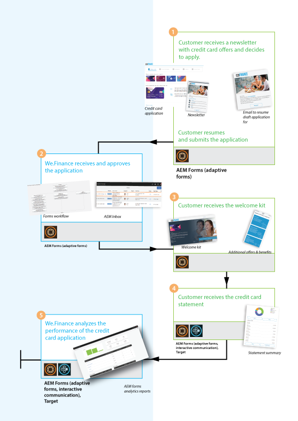
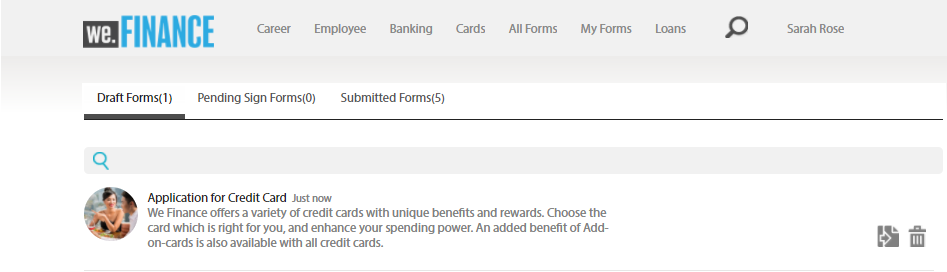
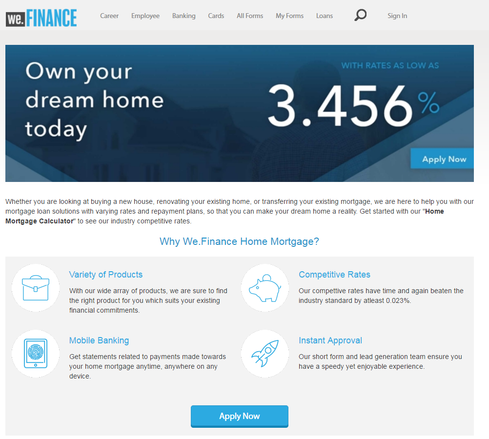
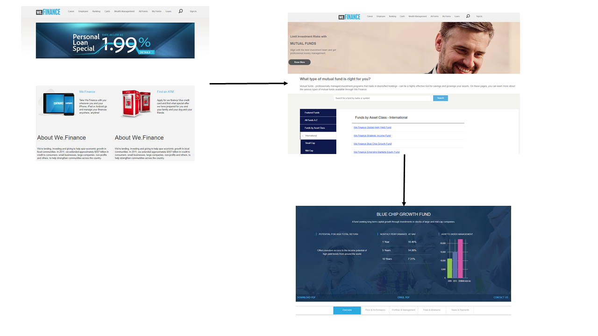
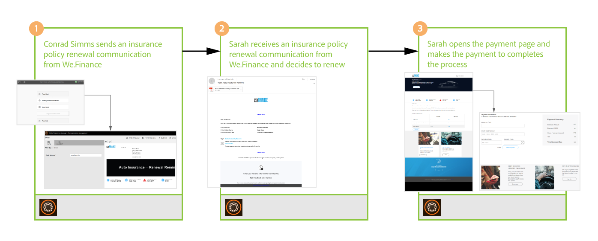

# We.Finance リファレンスサイトのチュートリアル {#we-finance-reference-site-walkthrough}

>[!CAUTION]
>
>AEM 6.4 の拡張サポートは終了し、このドキュメントは更新されなくなりました。 詳細は、 [技術サポート期間](https://helpx.adobe.com/jp/support/programs/eol-matrix.html). サポートされているバージョンを見つける [ここ](https://experienceleague.adobe.com/docs/?lang=ja).

## 前提条件 {#pre-requisites}

リファレンスサイトを設定します ( [AEM Formsリファレンスサイトのセットアップと設定](/help/forms/using/setup-reference-sites.md).

## We.Finance リファレンスサイトのシナリオ {#we-finance-reference-site-scenarios}

We.Finance 社は、金融サービス分野のリーディング組織で、多様な顧客プロファイルの要件に合わせて包括的でパーソナライズされた金融ソリューションを提供します。 クレジットカード、住宅ローン、住宅保険サービスを提供しています。

その目的は、既存のお客様や見込み客に対し、好みのデバイスで連絡を取り、サービスの利点を説明し、サービスへの登録を支援することです。 また、顧客が興味を持つ可能性のあるアドオンカードなど、より多くの金融製品を宣伝したいと考えています。

We.Finance の使用例の詳細な手順と、AEM Formsが金融組織の目標達成にどのように役立つかを説明します。 次の手順を説明します。

* [クレジットカード申し込みのチュートリアル](#credit-card-application-walkthrough)
* [住宅ローン申し込みのチュートリアル](#home-mortgage-application-walkthrough)
* [Microsoft Dynamics を使用した住宅ローン申し込みのチュートリアル](#home-mortgage-application-walkthrough-with-microsoft-dynamics)
* [住宅保険申し込みのチュートリアル](#home-insurance-application-walkthrough)
* [アセットマネジメントのチュートリアル](#wealthmanagementwalkthrough)
* [自動保険申し込みのチュートリアル](#autoinsuranceapplicationwalkthrough)

## クレジットカード申し込みのチュートリアル {#credit-card-application-walkthrough}

We.Finance クレジットカードの申し込みシナリオには、次のペルソナが含まれます。

* Sarah Rose（We.Finance 社の顧客）
* Gloria Rios（We.Finance 社クレジットカードおよび住宅ローン部門責任者）

以下の解説図は、クレジットカード申し込みのワークフローを順を追って示したものです。

リファレンスサイトのシナリオを詳しく見てみましょう。AEM Formsが We.Finance 社の目標達成にどのように役立っているかを理解できます。

### Sarah は We.Finance 社からニュースレターを受信し、クレジットカードを申し込みます {#sarah-receives-a-newsletter-from-we-finance-and-applies-for-a-credit-card}

Sarah Rose は We.Finance 社の既存顧客です。 Sarah は、We.Finance 社から、提供する新しいクレジットカードに関するニュースレターを受け取ります。 Sarah はオファーが面白いと感じ、クレジットカードの申し込みを決めます。 ニュースレターの「 Apply Now 」ボタンをクリックすると、We.Finance ポータルのクレジットカード申込フォームに移動します。

#### 仕組み {#how-it-works}

Sarah に送信されるニュースレターは、指定した電子メール ID に電子メールをトリガーするカスタム実装です。 電子メール内の「 Apply Now 」ボタンは、クレジットカード申込フォームにリンクされています。クレジットカード申込フォームは、パブリッシュインスタンス上のアダプティブフォームです。

#### 実際の動作確認 {#see-it-yourself}

パブリッシュインスタンスで次の URL を開き、ニュースレターの電子メールをトリガーにします。 次を置き換えます。 `[emailID]` と有効な電子メールアカウントでニュースレターを受け取ります。 ニュースレターを開き、 **[!UICONTROL 今すぐ適用]** をクリックして、クレジットカード申込書に移動します。

`https://[publishServer]:[publsihPort]/content/campaigns/we-finance/start.html?app=cc&email=[emailID]&givenName=Sarah&familyName=Rose`

### Sarah がこのオファーに興味を持ち、申し込むことを選択 {#sarah-finds-the-offer-interesting-and-chooses-to-apply}

Sarah がクレジットカードの申し込みを決め、タップします **[!UICONTROL 今すぐ適用]** ボタンをクリックします。 We.Finance ポータルのクレジットカード申込フォームに Sarah が移動します。 申込フォームは、カードレイアウトを使用してセクションに整理されます。

Sarah は利用可能なオプションからクレジットカードを選択し、「 」をクリックします **[!UICONTROL 続行]**.

個人情報ページで、Sarah が「Social Security Number」（社会保障番号）を入力すると、資格情報を使用してログインするよう求めるプロンプトが表示されます。

Sarah は We.Finance 社の既存の顧客です。 Sarah は We.Finance アカウントの資格情報を使用してログインし、個人の詳細情報はフォームに自動入力されます。 Sarah は申込フォームに入力を続けます。このとき、出席が必要な会議のリマインダーがポップアップ表示されます。 Sarah はクリックします **[!UICONTROL 作業内容を保存する]** を選択します。 これまでに入力したすべての情報を保存し、後で完了するために、下書き申込書へのリンクを含む電子メールを受信するかどうかを確認するダイアログが表示されます。

Sarah がクリック **[!UICONTROL メールを送信]**. Sarah は、クレジットカードの申し込みを再開するためのリンクが記載された電子メールを受信します。

<!--Theses sections used to be an accordion until converted to straight Markdown. When accordions are enabled, revert-->

### Sarah がモバイルデバイスからクレジットカード申し込みにアクセスする {#a-sarah-access}

Sarah がモバイルデバイスからクレジットカード申込フォームにアクセスしている場合、レスポンシブ申込フォームはモバイルデバイス向けに最適化されたビューで開きます。 この表示では、申込フォームは一度に 1 つのセクションとしてレンダリングされます。 これにより、Sarah は申込フォームを移動するたびに、順を追って情報の表示と入力を行うことができます。

### 仕組み {#a-how-it-works}

この **[!UICONTROL 今すぐ適用]** ボタンを押すと、Sarah はクレジットカードの申し込みに移動します。 アプリケーションはアダプティブフォームです。このフォームは、オーサリングインスタンスで `https://[host]:[Port]/editor.html/content/forms/af/we-finance/cc-app.html`.

アダプティブフォームで確認できる主な機能の一部を次に示します。

* XSD スキーマに基づいています。
* これは、スタイル設定には We Finance テーマ A を、レイアウトには We.Finance テンプレートを使用して構築されます。 また、モバイルナビゲーション用のフォームヘッダーレイアウトで、パネルタイトルのないレイアウトを使用します。 モバイルデバイスから開くと、プログレッシブモバイルレイアウトが表示されます。 このテンプレートは、 `https://[host]:[Port]/libs/wcm/core/content/sites/templates.html/conf/we-finance` テーマは `https://[host]:[Port]/editor.html/content/dam/formsanddocuments-themes/we-finance/we-finance-theme-a/jcr:content`.
* フォームデータモデルサービスを呼び出してログインユーザーの詳細を事前に入力するためのアダプティブフォームのルールが含まれています。 また、フォーム内で提供された社会保障番号や電子メールアドレスで情報を事前入力するサービスも呼び出します。 フォームデータモデルとそのサービスは、次の場所で確認できます。 `https://[host]:[Port]/aem/forms.html/content/dam/formsanddocuments-fdm`.
* アダプティブフォームの様々なコンポーネントを使用して入力を取得し、ユーザーの応答に適応します。 また、E メールなどの入力タイプをサポートするコンポーネントもHTML5 を使用します。
* 署名ステップコンポーネントを使用して、入力済みのフォームを表示し、フォーム上で電子署名を行うことができます。
* 「進行状況を保存」ボタンをクリックすると、ユーザーに一意の ID が生成され、部分的に入力されたアプリケーションがドラフトとしてAEMリポジトリのノードに保存されます。 また、下書きアプリケーションを含むノードへのリンクを含む電子メールを送信する権限を求めるダイアログが表示されます。 確認ダイアログの「メールを送信」ボタンをクリックすると、下書きを含むノードへのリンクが記載された E メールがトリガーされます。
* このワークフローは、「AEM Workflow を起動」送信アクションを使用して、クレジットカード承認ワークフローをトリガーにします。 このフォームで使用されるワークフローは、次の場所で確認できます。 `https://[host]:[Port]/editor.html/conf/global/settings/workflow/models/we-finance-credit-card-workflow.html`

フォームのレビューを行って、フォームの構築に使用するスキーマ、コンポーネント、ルール、フォームデータモデル、フォームワークフロー、送信アクションを理解することをお勧めします。

また、クレジットカード申し込みアダプティブフォームで使用される機能の詳細については、次のドキュメントも参照してください。

* [アダプティブフォームのオーサリングの概要](/help/forms/using/introduction-forms-authoring.md)
* [XML スキーマを使ったアダプティブフォームの作成](/help/forms/using/adaptive-form-xml-schema-form-model.md)
* [ルールエディター](/help/forms/using/rule-editor.md)
* [テーマ](/help/forms/using/themes.md)
* [データ統合](/help/forms/using/data-integration.md)
* [アダプティブフォームでのAcrobat Signの使用](/help/forms/using/working-with-adobe-sign.md)
* [OSGi 上の Forms 中心のワークフロー](/help/forms/using/aem-forms-workflow.md)

### 実際の動作確認 {#a-see-it-yourself}

Sarah Rose としてログインし、 **[!UICONTROL 今すぐ適用]** 」ボタンをクリックします。 詳細を入力し、アダプティブフォームの各種コンポーネントを参照して、 **[!UICONTROL 作業内容を保存する]** 電子メールを受け取る **[!UICONTROL 再開]** ボタンをクリックします。 電子メールを受け取るには、アプリケーションフォームで電子メール ID を必ず指定してください。

次の場所で We.Finance のテーマを確認します。

`https://<host>:<AuthorPort>/editor.html/content/dam/formsanddocuments-themes/we-Finance/we-Finance-Theme-A/jcr:content`

We.Finance テンプレートは次の場所で確認できます。

`https://<host>:<AuthorPort>/editor.html/conf/we-finance/settings/wcm/templates/we-finance-template/structure.html`

### Sarah が申込書を再開して送信します {#sarah-resumes-and-submits-the-application}

後で Sarah が戻ってきて、We.Finance 社からの電子メールを見つけます。 Sarah が **[!UICONTROL 再開]** 」ボタンをクリックします。 先ほど入力した情報は、事前入力済みです。 残りの申込フォームに入力し、申込書に署名して送信します。

または、下の下書き申込書にアクセスできます。 **[!UICONTROL マイForms]** をクリックします。

#### 仕組み {#how-it-works-1}

電子メールの「Resume」ボタンは、申込書の下書きを含むノードに Sarah をリダイレクトします。

#### 実際の動作確認 {#see-it-yourself-1}

申し込みフォームの入力時に指定した電子メール ID に、下書き申し込みフォームへのリンクが記載された電子メールが届いている必要があります。 先に進み、申込書の残りのセクションに入力し、送信します。

### We.Finance 社が申込書を受信し承認 {#approving-the-application}

Sarah が送信したクレジットカード申込書を We.Finance 社が受信します。 タスクが Gloria Rios に割り当てられます。 AEM Inbox でタスクをレビューし、承認します。

#### 仕組み {#how-it-works-2}

Sarah がクレジットカードの申し込みを入力して送信すると、Gloria のAEMインボックスにForms Workflowトリガーとタスクが作成されます。

OSGi 上のAEM Formsは、アダプティブフォームベースのワークフローを構築できる、フォーム中心のワークフローを提供します。 これらのワークフローは、レビューと承認、ビジネスプロセスフロー、ドキュメントサービスの開始、Acrobat Sign署名ワークフローとの統合などに使用できます。 詳しくは、[OSGi での Forms 中心のワークフローを参照してください](/help/forms/using/aem-forms-workflow.md)。

次の画像は、クレジットカードの申し込みを処理し、申し込みのPDF出力を生成するAEMワークフローを示しています。

#### 実際の動作確認 {#see-it-yourself-2}

we.finance サイトのAEMインボックス (https://&lt;) にアクセスできます。*hostname*>:&lt;*PublishPort*>/content/we-finance/global/en.html. ページで、をタップします。 **[!UICONTROL ログイン]**&#x200B;を選択し、 **[!UICONTROL 担当者としてログイン]** チェックボックスに移動し、次を使用してAEMインボックスにログインします。 `grios/password` を Gloria Rios のユーザー名/パスワードとして設定し、クレジットカードの申し込みを承認します。 Forms 中心のワークフロータスクで AEM インボックスを使用する方法について詳しくは、「[AEM インボックスでの Forms アプリケーションとタスクの管理](/help/forms/using/manage-applications-inbox.md)」を参照してください。

申込を承認すると、Sarah はウェルカムキットと共に電子メールを受信します。

### Sarah がウェルカムキットを受信し、アドオンカードを申し込む {#sarah-receives-the-welcome-kit-and-applies-for-an-add-on-card}

Sarah のクレジットカード申し込みが承認されると、Sarah はウェルカムキットへのリンクを含む電子メールを受信します。 ウェルカムキットには、クレジットカードのアカウントの詳細が記載されています。 ウェルカムキットには、Sarah 向けにパーソナライズされたプロモーションキャンペーンも表示されます。 スクロールダウンすると、Welcome キットには、アドオンカードに申し込むフォームが組み込まれています。 Sarah はウェルカムキットの中から必要事項をすばやく入力し、アドオンカードの申し込みを行います。 アドオンカード申し込みの確認ダイアログが表示されます。

ウェルカムキットは Sarah 向けにパーソナライズされており、彼女に関連する情報を表示します。 ウェルカムキットのPDF版をダウンロードするオプションを提供します。

ウェルカムキットには、Sarah が記入して送信し、We.Finance ポータルにアクセスすることなく、ウェルカムキットの中からアドオンカードの申し込みを行うことのできる別の申し込みフォームが含まれています。

#### 仕組み {#how-it-works-3}

ウェルカムキットは、 `cq-we-finance-content-pkg.zip` パッケージ。 ウェルカムキットにクレジットカードの利点を紹介するデスクトップバージョンのインタラクティブカードは、ドキュメントフラグメントのデフォルトのカードレイアウトを使用して作成されたカスタムレイアウトです。

アドオンカードの申し込みは、ウェルカムキットのインタラクティブ通信に埋め込まれたアダプティブフォームです。

#### 実際の動作確認 {#see-it-yourself-3}

次をクリック： **[!UICONTROL 再開]** 」ボタンをクリックします。 下書き申込書が開きます。 すべての詳細を入力し、申込書を送信します。 その後、ウェルカムキットが届きます。 ウェルカムキットを確認します。

ウェルカムキットは、次の URL からもご覧いただけます。

https://&lt;*ホスト*>:&lt;*ポート*>/content/aemforms-refsite/doclink.html?document=/content/forms/af/we-finance/credit-card/creditcardwelcomekit&amp;customerId=197&amp;channel=web

オーサーインスタンスとパブリッシュインスタンスでアクセスできます。

### Sarah がクレジットカード明細を受信 {#sarah-receives-a-credit-card-statement}

Sarah は、クレジットカードの使用を開始すると、自分のクレジットカード明細を含む別の電子メールを We.Finance 社から受け取ります。 以下の画像では、クレジットカード明細へのリンクを含む電子メールをモバイル上で表示しています。

Sarah は電子メールの「 View Statement 」（明細を表示）をクリックし、クレジットカード明細を表示します。 文はインタラクティブ通信です。 Web 版と印刷版 (PDF) 版の両方があります。 この文は、Formsデータモデルと統合され、お客様固有のデータをデータベースから取得します。 インタラクティブステートメントは、次の様々な要素を構成します。

* 文の概要
* 詳細な経費報告書
* 経費分析のグラフ
* 明細書内から支払期限の支払を行うオプション
* 支払受領書をダウンロード

Sarah は、ポータルに移動したり、電子メールで検索したりして、オフラインでのアーカイブ用にクレジットカード明細書のPDF版を検索する必要はありません。 「Download Statement」（文をダウンロード）をクリックするだけで、文のPDF版をダウンロードできます。

詳細な文は、レスポンシブテーブルにレイアウトされます。 また、明細の中から一部または全額を支払うオプションも提供されます。

Sarah は明細の中から支払いのスケジュールを設定します。 また、「フレックス支払」オプションを使用して、支払を同じ部分に分割することもできます。

#### 仕組み {#how-it-works-4}

クレジットカード明細は、インタラクティブな通信です。 明細の詳細な経費表は、応答表です。 費用分析のグラフィックはグラフコンポーネントで、費用テーブルを読み取り、円グラフを生成します。

#### 実際の動作確認 {#see-it-yourself-4}

次の URL で、インタラクティブなクレジットカード明細を確認できます。

https://&lt;*hostname*>:&lt;*ポート*>/content/aemforms-refsite/doclink.html?document=/content/forms/af/we-finance/credit-card/credit-card-statement&amp;customerId=197&amp;channel=web

オーサーインスタンスとパブリッシュインスタンスでアクセスできます。

クレジットカード明細書には、明細書の末尾に向けて、プロモーションのオファーが表示されます。 Adobe TargetをAEM Formsインタラクティブ通信と統合して、特定の顧客セグメントに基づくプロモーションをターゲットにしたオファーを提供できます。 Adobe Targetをカスタマイズおよびターゲット設定されたオファーに使用するようにインタラクティブ通信を設定するには、 [ターゲットを設定したエクスペリエンス](/help/forms/using/experience-targeting-forms.md).

### We.Finance 社はクレジットカード申し込みのパフォーマンスを分析 {#we-finance-analyzes-the-performance-of-the-credit-card-application}

We.Finance 社は、時折、クレジットカード申し込みのパフォーマンスをレビューし、お客様が直面する可能性のある問題を確認します。 この分析を使用すると、ユーザーエクスペリエンスを向上させ、フォームの放棄率を減らし、コンバージョンを改善するために、クレジットカード申し込みに必要な変更に関する十分な情報に基づいた決定を下すことができます。 分析にAEM FormsとAdobe Analyticsの統合を活用します。 以下の画像は、同社の分析ダッシュボードを示しています。

Analytics ダッシュボードの見方について詳しくは、 [AEM Forms Analytics レポートの表示と理解](/help/forms/using/view-understand-aem-forms-analytics-reports.md).

#### 仕組み {#how-it-works-5}

クレジットカード申し込みフォームのパフォーマンス指標は、Adobe Analyticsを使用して追跡されます。 Adobe Analyticsの設定とレポートの表示について詳しくは、 [フォームとドキュメント用の Analytics の設定](/help/forms/using/configure-analytics-forms-documents.md).

#### 実際の動作確認 {#see-it-yourself-br}

分析レポートの表示や参照をおこなうために、リファレンスサイトでクレジットカード申し込みのシードデータを提供しています。 シードデータを使用する前に、 [Analytics の設定](/help/forms/using/setup-reference-sites.md#configureanalytics). オーサーインスタンスで次の手順を実行し、シードデータを含むレポートを表示します。

1. に移動します。 **[!UICONTROL Forms &amp; Documents]** UI(https://&lt;)*hostname*>:&lt;*AuthorPort*>/aem/forms.html/content/dam/formsanddocuments

1. クリックして **[!UICONTROL We.Finance]** フォルダー。
1. 選択 **[!UICONTROL クレジットカードの申請]** アダプティブフォームを開き、ツールバーで **[!UICONTROL Analytics を有効にする]**.

1. アダプティブフォームを再度選択し、 **[!UICONTROL Analytics レポート]** をクリックして、レポートを生成します。 最初は空のレポートが表示されます。

シードデータを含む Analytics レポートを生成するには：

1. CRXDE lite のアドレスブラウザーで、次のように入力します。 `/apps/we-finance/demo-artifacts/analyticsTestData/Credit card Analytics Test Data`
1. テストデータは、左側のディレクトリ構造で選択されます。
1. 選択したファイルをダブルクリックして、その内容を右側のパネルで開きます。
1. シードデータファイル内のすべてのコンテンツをコピーします。
1. CRXDE で、`/content/dam/formsanddocuments/we-finance/cc-app/jcr:content/analyticsdatanode/lastsevendays` に移動します。
1. 内 **[!UICONTROL analyticsdata]** ～の下のフィールド **[!UICONTROL プロパティ]**」で、コピーしたシードデータファイルの内容を貼り付けます。

1. 選択 **クレジットカードの申請** アダプティブフォームを開き、 **[!UICONTROL Analytics レポート]** を使用して、シードデータを含むレポートを生成する必要があります。

**クレジットカード申し込みの A/B テスト**

We.Finance 社は、クレジットカード申し込みのパフォーマンスを分析し、継続的にその改善を図るだけでなく、AEM Formsと Target の統合を活用して A/B テストを作成します。 これにより、クレジットカード申し込みフォームの様々なエクスペリエンスを提供し、フォームの完成と送信の観点から、コンバージョン率の向上につながるエクスペリエンスを特定できます。

AEM Formsサーバーで Target を設定するには、 [AEM Formsでの Target の設定と統合](/help/forms/using/ab-testing-adaptive-forms.md#set%20up%20and%20integrate%20target%20in%20aem%20forms).

We.Finance 社のクレジットカード申し込みフォームの A/B テストを体験するには、次の手順を実行します。

1. に移動します。 **[!UICONTROL Forms &amp; Documents]** https://&lt;*hostname*>:&lt;*AuthorPort*>/aem/forms.html/content/dam/formsanddocuments

1. クリックして **[!UICONTROL We.Finance]** フォルダー。
1. 選択 **[!UICONTROL クレジットカードの申請]** アダプティブフォーム。
1. クリック **[!UICONTROL 詳細]** ツールバーで、「 **[!UICONTROL A/B テストの設定]**. 「A/B テストを設定」ページが開きます。

1. 次を指定： **[!UICONTROL アクティビティ名]**.
1. 「オーディエンス」ドロップダウンリストから、フォームの異なるエクスペリエンスを提供するオーディエンスを選択します。 例： **Chrome を使用している訪問者**.
1. 内 **[!UICONTROL エクスペリエンス配布]** エクスペリエンス A と B のフィールドには、割合で配分を指定して、オーディエンス全体でのエクスペリエンスの配分を指定します。 例えば、エクスペリエンス A と B にそれぞれ 40、60 を指定した場合、エクスペリエンス A はオーディエンスの 40%に配信され、残りの 60%にはエクスペリエンス B が表示されます。
1. クリック **設定**. A/B テストの作成を確認するダイアログが表示されます。
1. 「**完了**」をクリックします。
1. を選択します。 **クレジットカードの申請** フォームとクリック **編集**. エクスペリエンスの 1 つを開くオプションが用意されています。 クリック **エクスペリエンス B**. フォームが編集モードで開きます。

1. 必要に応じてフォームを変更し、デフォルトのエクスペリエンス A とは異なるエクスペリエンスを作成します。
1. Formsとドキュメント UI に移動し、フォームを選択して、 **詳細**&#x200B;を選択し、 **A/B テストを開始**.

1. 次の URL を使用して、Chrome ブラウザーでフォームを数回開きます。

   `https://[hostname]:[port]/content/dam/formsanddocuments/we-finance/cc-app/jcr:content?wcmmode=disabled`

   >[!NOTE]
   >
   >次の名前の Cookie を削除します。 **mbox** ブラウザーの cookie 永続性を使用してから、次回フォームを開く前に。 フォームのエクスペリエンス A と B がランダムに表示されます。

1. フォームを選択し、 **詳細**&#x200B;をクリックし、 **A/B テストレポート**. テストを開始したばかりなので、レポートには多くのデータが表示されません。 次に、シードデータを使用して、A/B テストレポートがどのように表示されるかを確認します。

1. CRXDE Liteを開き、次のファイルのバックアップを作成します。/libs/fd/fmaddon/gui/components/admin/targetreport/clientlibs/targetreport/js/targetreport.js
1. 関数の定義を置き換える `onReportLoadSuccess` 上記のファイルの、次のファイル内の関数定義を含むファイルの場合：/apps/we-finance/demo-artifacts/targetreport.js

   **注意：** これらの変更はデモ目的でのみおこなわれます。 この手順を完了した後、必ずファイルの内容を復元してください。

1. 生成したレポートを更新すると、次のように表示されます。 レポートダッシュボードを確認します。

A/B テストを終了するには、 **A/B テストを終了** 」ボタンをクリックします。 この時点で、エクスペリエンスの宣言を求めるダイアログが表示されます。 推奨結果を選択し、A/B テストの終了を確認します。

エクスペリエンス A を推奨結果として選択した場合、A/B テストは終了し、今後は、エクスペリエンス A のみが Chrome 上のオーディエンスを含むすべてのオーディエンスに提供されます。

## 住宅ローン申し込みのチュートリアル {#home-mortgage-application-walkthrough}

We.Finance 社の住宅ローンのシナリオには、次の人物が含まれます。

* Sarah Rose（We.Finance 社の顧客）
* Gloria Rios（We.Finance 社クレジットカードおよび住宅ローン部門責任者）
* John Doe（We.Finance 社、カスタマーケア担当者）

以下の解説図は、住宅ローン申し込みのワークフローを順を追って示したものです。

リファレンスサイトのシナリオの手順を詳しく見て、AEM Formsが We.Finance 社の目標達成にどのように役立っているかを確認しましょう。

### Sarah が We.Finance 社の Web サイトを訪問し、住宅ローンの申し込みを行います {#sarah-visits-we-finance-website-and-applies-for-home-mortgage}

Sarah Rose は住宅を購入し、住宅ローンの計画を探す計画です。 Sarah は We.Finance 社の顧客なので、We.Finance 社のポータルにアクセスし、住宅ローンのオファーを探索します。 ローンセクションに行き、ポータルで住宅ローン計算機を見つけます。 Sarah は詳細を入力し、「 Calculate my mortgage 」（私の住宅ローンを計算）をクリックし、住宅ローンプランを返します。

 
**図：** *住宅ローン計算ツール*

**図：** *住宅ローン計算ツールの結果*

#### 仕組み {#how-it-works-6}

ローンページの住宅ローン計算ツールは、AEM Sitesページに埋め込まれたアダプティブフォームです。 次の場所で編集モードでローンページを確認できます： `https://[authorHost]:[authorPort]/editor.html/content/we-finance/global/en/loan-landing-page.html`.

アダプティブフォームの埋め込み住宅ローン計算ツールでは、計算ツールフィールドに指定されたローンの詳細に基づいて、ルールを使用して EMI 金額を計算します。 アダプティブフォームは `https://[authorHost]:[authorPort]/editor.html/content/forms/af/we-finance/hm-calc.html` で確認できます。

#### 実際の動作確認 {#see-it-yourself-5}

We.Finance ポータル ( ) に移動します。 `https://<publishHost>:<publishPort>/content/we-finance/global/en.html` をクリックし、 **[!UICONTROL 融資]**. 住宅ローン計算ツールに詳細を入力し、結果を確認します。

### Sarah がこのオファーに興味を持ち、申し込むことを選択 {#sarah-finds-the-offer-interesting-and-chooses-to-apply-1}

Sarah は住宅ローンの申し込みとクリック **[!UICONTROL 今すぐ適用]** 住宅ローンの計算結果に関する 住宅ローンの申し込みが開きます。

Sarah がモバイルデバイスから住宅ローン申し込みにアクセスする場合、申し込みフォームはモバイルデバイスでの表示用に最適化された表示で開かれます。 この表示では、アプリケーションフォームは一度に 1 つのセクションをレンダリングします。 これにより、Sarah は申込フォーム内を移動しながら、順を追って情報の表示と入力を行うことができます。

以下の画像では、Sarah がモバイルデバイスで住宅ローン申し込みを進める際のワークフローを示しています。

Sarah が「 **今すぐ適用** デスクトップから、住宅ローン申し込みフォームが次のように開きます。 住宅ローン計算機に入力された Sarah の情報は、申込フォームに事前に入力されています。 Sarah は残りの詳細を入力し、「 」をクリックします **続行**.

Sarah が住宅ローン計算機に入力した情報に基づいて、Sarah はいくつかの住宅ローンプランを提示されます。 Sarah は要件に合ったプランを選択し、引き続き申し込みを行います。 彼女は最終的に署名し、申込書を送信します。

送信された申し込みは We.Finance 社に承認を受けます。

#### 仕組み {#how-it-works-7}

この **今すぐ適用** ボタンを押すと、Sarah は住宅ローン申し込みに移動します。 アプリケーションはアダプティブフォームです。このフォームは、オーサリングインスタンスで `https://[host]:[Port]/editor.html/content/forms/af/we-finance/hm-app.html`.

アダプティブフォームで確認できる主な機能の一部を次に示します。

* XSD スキーマに基づいている。 `homeMortgageApplication.xsd`.
* これは、スタイル設定に We Finance のテーマ B を使用し、レイアウトに We.Finance のテンプレートを使用して構築されます。 また、モバイルナビゲーション用のフォームヘッダーレイアウトで、パネルタイトルのないレイアウトを使用します。 モバイルデバイスから開くと、プログレッシブモバイルレイアウトが表示されます。 アダプティブフォーム内で使用されているテンプレートおよびテーマは、AEMオーサーインスタンス上の以下の場所で確認できます。

   * `https://[host]:[Port]/libs/wcm/core/content/sites/templates.html/conf/we-finance`
   * `https://[host]:[Port]/editor.html/content/dam/formsanddocuments-themes/we-finance/we-finance-theme-b/jcr:content`

* 最初のタブの「はじめに」は、ユーザーの選択に基づいてオプションを表示する動的な住宅ローン計算ツールです。 例えば、「購入」オプションと「絞り込み条件」オプションでは、フィールドと値が異なります。 この機能は、表示/非表示のルールを使用して実現します。 さらに、「続行」をクリックし、「プラン」タブが初期化されると、フォームデータモデルで設定された Web サービスが呼び出され、住宅ローンプランが取得および表示されます。 フォームデータモデルと設定済みサービスは、次の場所で確認できます。 `https://[host]:[Port]/aem/forms.html/content/dam/formsanddocuments-fdm`.
* アダプティブフォームの様々なコンポーネントを使用して入力を取得し、ユーザーの応答に適応します。 また、E メールなどの入力タイプをサポートするコンポーネントもHTML5 を使用します。
* 署名ステップコンポーネントを使用して、入力済みのフォームを表示し、フォーム上で電子署名を行うことができます。
* AEM Workflow を起動送信アクションを使用して、We Finance Home Mortgage AEMワークフローをトリガー化します。 このフォームで使用されるワークフローは、次の場所で確認できます。 `https://[host]:[Port]/editor.html/conf/global/settings/workflow/models/we-finance-home-mortgage-workflow.html`

フォームのレビューを行って、フォームの構築に使用するスキーマ、コンポーネント、ルール、フォームデータモデル、フォームワークフロー、送信アクションを理解することをお勧めします。

また、住宅ローン申し込みアダプティブフォームで使用される機能の詳細については、次のドキュメントも参照してください。

* [アダプティブフォームのオーサリングの概要](/help/forms/using/introduction-forms-authoring.md)
* [XML スキーマを使ったアダプティブフォームの作成](/help/forms/using/adaptive-form-xml-schema-form-model.md)
* [ルールエディター](/help/forms/using/rule-editor.md)
* [テーマ](/help/forms/using/themes.md)
* [データ統合](/help/forms/using/data-integration.md)
* [アダプティブフォームでのAcrobat Signの使用](/help/forms/using/working-with-adobe-sign.md)
* [OSGi 上の Forms 中心のワークフロー](/help/forms/using/aem-forms-workflow.md)

#### 実際の動作確認 {#see-it-yourself-6}

に移動します。 `https://[server]:[port]/content/we-finance/global/en/all-forms.html` をクリックし、 **今すぐ適用** ボタンをクリックします。 「はじめに」タブの詳細を入力し、別のオプションを試して、申込書を送信します。

受信トレイに確認メールを受信するには、アプリケーションで有効な電子メール ID を指定してください。

### We.Finance 社が申し込みを受信 {#approving_the_application-1}

Sarah が送信した住宅ローン申し込みを We.Finance 社が受信します。 申し込みを承認または却下するタスクは Gloria Rios に割り当てられます。 Sarah は申込書を確認し、Sarah の政府 ID が見つからないことに気が付きます。

Gloria はタスクを開き、「Need More Info」をクリックし、見つからない政府 ID に関するコメントを入力します。

このタスクは、We.Finance 社のカスタマーケア担当者である John Doe に割り当てられます。 タスクを開き、Gloria のコメントを確認します。 彼は Sarah に連絡し、ID のコピーを送信するように求めます。 Sarah の ID のコピーを受け取った後、タスクに添付し、再評価用に申込書を送信します。

タスクが Gloria に再割り当てされます。 添付された ID を確認し、申込を承認します。

#### 仕組み {#how-it-works-8}

Sarah が住宅ローン申込書に入力して送信すると、Gloria のAEMインボックスにForms Workflowトリガーとタスクが作成されます。 Gloria が申込書を確認し、詳細をリクエストすると、タスクが John Doe に割り当てられます。 John Doe が ID を添付して申込書を再送信すると、その申込書は Gloria に割り当てられます。 これは、住宅ローン申し込みに関連付けられたAEM Workflow で定義されます。

OSGi 上のAEM Formsは、アダプティブフォームベースのワークフローを構築できる、フォーム中心のワークフローを提供します。 これらのワークフローは、レビューと承認、ビジネスプロセスフロー、ドキュメントサービスの開始、Acrobat Sign署名ワークフローとの統合などに使用できます。 詳しくは、[OSGi での Forms 中心のワークフローを参照してください](/help/forms/using/aem-forms-workflow.md)。

以下の画像は、住宅ローン申し込みに関連付けられたAEMワークフローを示しています。

#### 実際の動作確認 {#see-it-yourself-7}

AEMインボックスには、https://&lt; からアクセスできます。***hostname***>:&lt;***AuthorPort***>/content/we-finance/global/en/login.html?resource=/aem/inbox.html. 次を使用してAEMインボックスにログインします。 `grios/password` を Gloria Rios のユーザー名/パスワードとして設定し、 `jdoe/jdoe` John Doe の場合は、住宅ローン申し込みワークフローを参照してください。

Forms 中心のワークフロータスクで AEM インボックスを使用する方法について詳しくは、「[AEM インボックスでの Forms アプリケーションとタスクの管理](/help/forms/using/manage-applications-inbox.md)」を参照してください。

### Sarah がウェルカムキットを受信 {#sarah-receives-the-welcome-kit}

Sarah の住宅ローン申し込みが承認されると、Sarah はウェルカムキットへのリンクを含む電子メールを受信します。 Sarah 向けにパーソナライズされたプロモーションオファーを表示するカルーセルが含まれたウェルカムキットを開きます。

ウェルカムキットは Sarah 向けにパーソナライズされており、彼女に関連する情報を表示します。 ウェルカムキットのPDF版をダウンロードするオプションを提供します。 下部の矢印ボタンをクリックすると、Sarah は下にスクロールして、ウェルカムキットの他のセクションをナビゲートできます。

#### 仕組み {#how-it-works-9}

ウェルカムキットは、 `cq-we-finance-content-pkg.zip` パッケージ。 ウェルカムキットに含まれるプロモーションオファーは、Adobe Targetサーバーから提供されます。 オファーは、特定の顧客セグメント向けにカスタマイズされ、ターゲット設定されています。 ウェルカムキットは、事前設定済みのAdobe Targetサーバーから、女性客のオーディエンスセグメント用のオファーを取得します。

デスクトップバージョンのウェルカムキットに含まれるインタラクティブカードは、ドキュメントフラグメントのデフォルトのカードレイアウトを使用して作成されたカスタムレイアウトを使用します。

#### 実際の動作確認 {#see-it-yourself-8}

住宅ローン申込書の入力時に電子メール ID を入力した場合は、ウェルカムキットへのリンクを含む電子メールを受け取っているはずです。 受信トレイを確認し、ウェルカムキットを確認します。

次の URL で、AEMパブリッシュインスタンスで表示できます。

`https://[host]:[port]/content/forms/af/we-finance/mortgage-loan-welcome-kit.html`

### Sarah が取引明細書を受信 {#sarah-receives-an-account-statement}

Sarah がローンを利用し、賦払金の支払いを開始すると、We.Finance 社から、月次決算を含む別の電子メールを受け取ります。

Sarah は電子メールの「 View Statement 」（明細を表示）をクリックし、住宅ローン明細を表示します。 インタラクティブステートメントは、次の様々な要素を構成します。

* 文の概要
* 文の詳細

次の図は、デスクトップ上のアカウント明細の様々な部分を示しています。

詳細な文は、レスポンシブテーブルにレイアウトされ、文内から一部または全期限を支払うオプションを提供します。

#### 仕組み {#how-it-works-10}

住宅ローン明細書はインタラクティブなコミュニケーションです。 JSON バッチ処理を使用して生成されます。 明細の詳細な経費表は、応答表です。

#### 実際の動作確認 {#see-it-yourself-9}

インタラクティブな住宅ローン明細を確認するには、次の URL を使用します。

https://&lt;*hostname*>:&lt;*ポート*>/content/forms/af/we-finance/mortgage-account-statement.html?wcmmode=disabled

オーサーインスタンスとパブリッシュインスタンスでアクセスできます。

### We.Finance 社が住宅ローン申し込みのパフォーマンスを分析 {#we-finance-analyzes-the-performance-of-the-mortgage-application}

We.Finance 社は、時折、自社の住宅ローン申し込みのパフォーマンスをレビューし、顧客が直面する可能性のある問題をチェックします。 この分析を使用して、住宅ローン申し込みで必要な変更に関する十分な情報に基づく意思決定を行い、ユーザーエクスペリエンスを向上させ、フォームの放棄率を減らし、コンバージョンを改善します。 分析にAEM FormsとAdobe Analyticsの統合を活用します。 以下の画像は、同社の分析ダッシュボードを示しています。

Analytics ダッシュボードの見方について詳しくは、 [AEM Forms Analytics レポートの表示と理解](/help/forms/using/view-understand-aem-forms-analytics-reports.md).

#### 仕組み {#how-it-works-11}

住宅ローン申し込みフォームのパフォーマンス指標は、Adobe Analyticsを使用して追跡されます。 Adobe Analyticsの設定とレポートの表示について詳しくは、 [フォームとドキュメント用の Analytics の設定](/help/forms/using/configure-analytics-forms-documents.md).

#### 実際の動作確認 {#see-it-yourself-br-1}

分析レポートの表示や参照をおこなうために、リファレンスサイトで住宅ローン申し込みのシードデータが提供されます。 シードデータを使用する前に、 [Analytics の設定](/help/forms/using/setup-reference-sites.md#configureanalytics). オーサーインスタンスで次の手順を実行し、シードデータを含むレポートを表示します。

1. に移動します。 **Forms &amp; Documents** UI(https://&lt;)*hostname*>:&lt;*AuthorPort*>/aem/forms.html/content/dam/formsanddocuments

1. クリックして **we-finance** フォルダー。
1. 選択 **[!UICONTROL 住宅ローンの申請]** アダプティブフォームを開き、ツールバーで **[!UICONTROL Analytics を有効にする]**.

1. フォームを再度選択し、 **[!UICONTROL Analytics レポート]** をクリックして、レポートを生成します。 最初は空白のレポートが表示されます。

シードデータを含む Analytics レポートを生成するには：

1. CRXDE lite のアドレスブラウザーで、次のように入力します。 `/apps/we-finance/demo-artifacts/analyticsTestData/HomeMortgageAnalyticsTestData`
1. テストデータは、左側のディレクトリ構造で選択されます。
1. 選択したファイルをダブルクリックして、その内容を右側のパネルで開きます。
1. シードデータファイル内のすべてのコンテンツをコピーします。
1. CRXDE で、`/content/dam/formsanddocuments/we-finance/hm-app/jcr:content/analyticsdatanode/lastsevendays` に移動します。
1. 「プロパティ」の下の analyticsdata フィールドに、コピーしたシードデータファイルの内容を貼り付けます。
1. 住宅ローン申し込みフォームの分析レポートを再度生成します。 シードデータが含まれたレポートが表示されます。

**住宅ローン申し込みの A/B テスト**

住宅ローン申し込みのパフォーマンスを分析し、継続的にその改善を図ることに加えて、We.Finance はAEM Formsと Target の統合を活用して A/B テストを作成します。 これにより、申込フォームの様々なエクスペリエンスを提供し、フォームの完成と送信の点で、より高いコンバージョン率を引き起こすエクスペリエンスを特定できます。

AEM Formsサーバーで Target を設定するには、 [AEM Formsでの Target の設定と統合](/help/forms/using/ab-testing-adaptive-forms.md#set%20up%20and%20integrate%20target%20in%20aem%20forms).

オーサーインスタンスで次の手順を実行して、We.Finance 社の住宅ローン申し込みフォームの A/B テストを体験してください。

1. に移動します。 **Forms &amp; Documents** https://&lt;*hostname*>:&lt;*AuthorPort*>/aem/forms.html/content/dam/formsanddocuments

1. クリックして **We.Finance** フォルダー。
1. 選択 **住宅ローンの申請** アダプティブフォーム。
1. クリック **詳細** ツールバーで、「 **A/B テストの設定**. 「A/B テストを設定」ページが開きます。

1. 次を指定： **アクティビティ名**.
1. 「オーディエンス」ドロップダウンリストから、フォームの異なるエクスペリエンスを提供するオーディエンスを選択します。 例： **Chrome を使用している訪問者**.
1. 内 **エクスペリエンス配布** エクスペリエンス A と B のフィールドには、割合で配分を指定して、オーディエンス全体でのエクスペリエンスの配分を指定します。 例えば、エクスペリエンス A と B にそれぞれ 40、60 を指定した場合、エクスペリエンス A はオーディエンスの 40%に配信され、残りの 60%にはエクスペリエンス B が表示されます。
1. クリック **設定**. A/B テストの作成を確認するダイアログが表示されます。
1. 「**完了**」をクリックします。
1. を選択します。 **住宅ローンの申請** アダプティブフォームを開き、 **編集**. エクスペリエンスの 1 つを開くオプションが用意されています。 クリック **エクスペリエンス B**. フォームが編集モードで開きます。

1. 必要に応じてフォームを変更し、デフォルトのエクスペリエンス A とは異なるエクスペリエンスを作成します。
1. Formsとドキュメント UI に移動し、フォームを選択して、 **詳細**&#x200B;を選択し、 **A/B テストを開始**.

1. 次の URL を使用して、Chrome ブラウザーでフォームを数回開きます。

   `https://[hostname]:[port]/content/dam/formsanddocuments/we-finance/hm-app/jcr:content?wcmmode=disabled`

   >[!NOTE]
   >
   >次の名前の Cookie を削除します。 **mbox** ブラウザーの cookie 永続性を使用してから、次回フォームを開く前に。 フォームのエクスペリエンス A と B がランダムに表示されます。

1. フォームを選択し、 **詳細**&#x200B;をクリックし、 **A/B テストレポート**. テストを開始したばかりなので、レポートには多くのデータが表示されません。 次に、シードデータを使用して、A/B テストレポートがどのように表示されるかを確認します。

1. CRXDE Liteを開き、次のファイルのバックアップを作成します。/libs/fd/fmaddon/gui/components/admin/targetreport/clientlibs/targetreport/js/targetreport.js
1. の定義を置き換える `onReportLoadSuccess` 関数の名前を指定し、次のファイルの関数定義を指定します。/apps/we-finance/demo-artifacts/targetreport.js

   >[!NOTE]
   >
   >これらの変更はデモ目的でのみおこなわれます。 この手順を完了した後、必ずファイルの内容を復元してください。

1. 生成したレポートを更新すると、次のように表示されます。 レポートダッシュボードを確認します。

A/B テストを終了するには、 **A/B テストを終了** 」ボタンをクリックします。 この時点で、エクスペリエンスの宣言を求めるダイアログが表示されます。 推奨結果を選択し、A/B テストの終了を確認します。

エクスペリエンス A を推奨結果として選択した場合、A/B テストは終了し、今後は、エクスペリエンス A のみが Chrome 上のオーディエンスを含むすべてのオーディエンスに提供されます。

## Microsoft Dynamics を使用した住宅ローン申し込みのチュートリアル {#home-mortgage-application-walkthrough-with-microsoft-dynamics}

Microsoft Dynamics を使用した We.Finance 社の住宅ローンのシナリオには、以下の人物が含まれます。

* Sarah Rose（We.Finance 社の顧客）
* We.Finance Microsoft Dynamics インスタンスの管理者

Microsoft Dynamics を使用した住宅ローン申し込みのチュートリアルでは、リファレンスサイトでMicrosoft Dynamics をデータ統合に使用する場合に、We.Finance 社のお客様がサイトを使用して住宅ローンの申し込みを行う方法を示しています。 このチュートリアルは、Microsoft Dynamics が受け取ったユーザーが入力したデータで終わります。 このシナリオに進む前に、 [We.Finance リファレンスサイトの住宅ローンワークフロー用のMicrosoft Dynamics 365 設定](/help/forms/using/ms-dynamics-configuration-home-mortgage.md).

### Sarah が We.Finance 社の Web サイトを訪問し、住宅ローンの申し込みを行います {#sarah-visits-we-finance-website-and-applies-for-home-mortgage-1}

Sarah Rose は住宅を購入し、住宅ローンの計画を探す計画です。 Sarah は We.Finance 社の顧客なので、We.Finance 社のポータルにアクセスし、住宅ローンのオファーを探索します。 ローンセクションに行き、ポータルで住宅ローン計算機を見つけます。 Sarah は詳細を入力し、「 Calculate my mortgage 」（私の住宅ローンを計算）をクリックし、住宅ローンプランを返します。

 
**図：** *住宅ローン計算ツール*

**図：** *住宅ローン計算ツールの結果*

#### 仕組み {#how-it-works-12}

ローンページの住宅ローン計算ツールは、AEM Sitesページに埋め込まれたアダプティブフォームです。 次の場所で編集モードでローンページを確認できます： `https://[authorHost]:[authorPort]/editor.html/content/we-finance/global/en/loan-landing-page.html`.

アダプティブフォームの埋め込み住宅ローン計算ツールでは、計算ツールフィールドに指定されたローンの詳細に基づいて、ルールを使用して EMI 金額を計算します。 アダプティブフォームは `https://[authorHost]:[authorPort]/editor.html/content/forms/af/we-finance/ms-dynamics/home-mortgage-calculator.html` で確認できます。

#### 実際の動作確認 {#see-it-yourself-10}

We.Finance ポータル ( ) に移動します。 `https://<publishHost>:<publishPort>/content/we-finance/global/en.html` をクリックし、 **[!UICONTROL 融資]**. 住宅ローン計算ツールに詳細を入力し、結果を確認します。

### Sarah がこのオファーに興味を持ち、申し込むことを選択 {#sarah-finds-the-offer-interesting-and-chooses-to-apply-2}

Sarah は住宅ローンの申し込みとクリック **[!UICONTROL 今すぐ適用]** 住宅ローンの計算結果に関する 住宅ローンの申し込みが開きます。

Sarah がモバイルデバイスから住宅ローン申し込みにアクセスする場合、申し込みフォームはモバイルデバイスでの表示用に最適化された表示で開かれます。 この表示では、アプリケーションフォームは一度に 1 つのセクションをレンダリングします。 これにより、Sarah は申込フォーム内を移動しながら、順を追って情報の表示と入力を行うことができます。

以下の画像では、Sarah がモバイルデバイスで住宅ローン申し込みを進める際のワークフローを示しています。

Sarah が「 **今すぐ適用** デスクトップから、住宅ローン申し込みフォームが次のように開きます。 住宅ローン計算機に入力された Sarah の情報は、申込フォームに事前に入力されています。 Sarah は残りの詳細を入力し、「 」をクリックします **続行**.

Sarah が住宅ローン計算機に入力した情報に基づいて、Sarah はいくつかの住宅ローンプランを提示されます。 Sarah は要件に合ったプランを選択し、引き続き申し込みを行います。 彼女は最終的に署名し、申込書を送信します。

送信された申し込みは We.Finance 社に承認を受けます。

#### 仕組み {#how-it-works-13}

この **今すぐ適用** ボタンを押すと、Sarah は住宅ローン申し込みに移動します。 アプリケーションはアダプティブフォームです。このフォームは、オーサリングインスタンスで `https://[host]:[Port]/editor.html/content/forms/af/we-finance/ms-dynamics/application-for-home-mortgage.html`.

アダプティブフォームで確認できる主な機能の一部を次に示します。

* XSD スキーマに基づいている。 `homeMortgageApplication.xsd`.
* これは、スタイル設定に We Finance のテーマ B を使用し、レイアウトに We.Finance のテンプレートを使用して構築されます。 また、モバイルナビゲーション用のフォームヘッダーレイアウトで、パネルタイトルのないレイアウトを使用します。 モバイルデバイスから開くと、プログレッシブモバイルレイアウトが表示されます。 アダプティブフォーム内で使用されているテンプレートおよびテーマは、AEMオーサーインスタンス上の以下の場所で確認できます。

   * `https://[host]:[Port]/libs/wcm/core/content/sites/templates.html/conf/we-finance`
   * `https://[host]:[Port]/editor.html/content/dam/formsanddocuments-themes/we-finance/we-finance-theme-b/jcr:content`

* 最初のタブの「はじめに」は、ユーザーの選択に基づいてオプションを表示する動的な住宅ローン計算ツールです。 例えば、「購入」オプションと「絞り込み条件」オプションでは、フィールドと値が異なります。 この機能は、表示/非表示のルールを使用して実現します。 さらに、「続行」をクリックし、「プラン」タブが初期化されると、フォームデータモデルで設定された Web サービスが呼び出され、住宅ローンプランが取得および表示されます。 フォームデータモデルと設定済みサービスは、次の場所で確認できます。 `https://[host]:[Port]/aem/forms.html/content/dam/formsanddocuments-fdm`.
* アダプティブフォームの様々なコンポーネントを使用して入力を取得し、ユーザーの応答に適応します。 また、E メールなどの入力タイプをサポートするコンポーネントもHTML5 を使用します。
* 署名ステップコンポーネントを使用して、入力済みのフォームを表示し、フォーム上で電子署名を行うことができます。

フォームのレビューを行って、フォームの構築に使用するスキーマ、コンポーネント、ルール、フォームデータモデル、フォームワークフロー、送信アクションを理解することをお勧めします。

### 管理者は、Microsoft Dynamics インスタンスで送信されたデータを表示します {#the-administrator-views-the-submitted-data-in-the-microsoft-dynamics-instance}

We.Finance 社がMicrosoft Dynamics インスタンスで Sarah によって送信された住宅ローン申し込みを受信します。 管理者が「リード」列のエントリをタップすると、Sarah Rose 用に作成されたリードレコードに移動します。

## 住宅保険申し込みのチュートリアル {#home-insurance-application-walkthrough}

We.Finance 社の住宅保険のシナリオには、次の人物が含まれます。

* Sarah Rose（We.Finance 社の顧客）
* Gloria Rios（We.Finance 社クレジットカードおよび住宅ローン部門責任者）
* Frank De Costa、We.Finance 社保険代理店

以下の解説図は、住宅保険申し込みシナリオのワークフローを順を追って示したものです。

リファレンスサイトのシナリオの手順を詳しく見て、AEM Formsが We.Finance 社の目標達成にどのように役立っているかを確認しましょう。

### Sarah は We.Finance 社からニュースレターを受信し、住宅保険を申し込みます {#sarah-receives-a-newsletter-from-we-finance-and-applies-for-home-insurance}

Sarah Rose は We.Finance 社の住宅ローンの顧客で、住宅保険に関する多くの情報を探しています。 We.Finance 社のポータルにアクセスし、住宅保険のプランを調べます。 We.Finance 社は、既存のお客様として特定し、対象を絞ったニュースレターを電子メールで送信しています。 ニュースレターには住宅保険のオファーが含まれています。

#### 仕組み {#how-it-works-14}

Sarah に送信されるニュースレターは、指定した電子メール ID に電子メールをトリガーするカスタム実装です。 ニュースレター内の「今すぐ適用」ボタンは、発行インスタンス上のアダプティブフォームである住宅保険の申し込みにリンクされています。

#### 実際の動作確認 {#see-it-yourself-11}

次の URL を開いて、ニュースレターの電子メールをトリガーにします。 次を置き換えます。 `[emailID]` と有効な電子メールアカウントでニュースレターを受け取ります。 ニュースレターを開き、 **[!UICONTROL 今すぐ適用]** 住宅保険の申し込みに行く

`https://[authorServer]:[authorPort]/content/campaigns/we-finance/start.html?app=ins&email=[emailID]&givenName=Sarah&familyName=Rose`

### Sarah が住宅保険の申し込みを興味深く見つけ、申し込みを選択 {#sarah-finds-the-home-insurance-offer-interesting-and-chooses-to-apply}

Sarah はニュースレターに記載された住宅保険プランが気に入り、その申し込みを決定します。 ニュースレターで「 Apply Now 」をクリックすると、We.Finance ポータルで住宅保険の申し込みが開きます。 申込フォームは、カードレイアウトを使用してセクションに整理されます。

個人情報ページで、Sarah が「Social Security Number」（社会保障番号）を入力すると、資格情報を使用してログインするよう求めるプロンプトが表示されます。

Sarah は We.Finance 社の既存の顧客です。 Sarah は We.Finance アカウントの資格情報を使用してログインし、個人の詳細情報はフォームに自動入力されます。 彼女は引き続き申込書に記入して送信します。

モバイルデバイスで申込を送信した場合、Sarah は次の画面を閲覧します。

#### 仕組み {#how-it-works-15}

この **今すぐ適用** ボタンをクリックすると、Sarah は We.Finance ポータルの住宅保険申込フォームに移動します。 申し込みフォームはアダプティブフォームです。このフォームは、オーサリングインスタンスで次の場所で確認できます。 `https://[host]:[Port]/editor.html/content/forms/af/we-finance/insurance/application-for-insurance.html`.

アダプティブフォームで確認できる主な機能の一部を次に示します。

* XSD スキーマに基づいている。 `insurance.xsd`.
* これは、スタイル設定に保険テーマを使用して構築され、モバイルナビゲーション用のフォームヘッダーレイアウトのパネルタイトルなしのレイアウトを使用します。 モバイルデバイスから開くと、プログレッシブモバイルレイアウトが表示されます。 このテンプレートは、 `https://[host]:[Port]/libs/wcm/core/content/sites/templates.html/conf/we-finance` テーマは `https://[host]:[Port]/editor.html/content/dam/formsanddocuments-themes/we-finance/insurance/jcr:content`.

* フォームデータモデルサービスを呼び出してログインユーザーの詳細を事前に入力するためのアダプティブフォームのルールが含まれています。 また、フォーム内で提供された社会保障番号や電子メールアドレスで情報を事前入力するサービスも呼び出します。 フォームデータモデルとそのサービスは、次の場所で確認できます。 `https://[host]:[Port]/aem/forms.html/content/dam/formsanddocuments-fdm`.
* アダプティブフォームの様々なコンポーネントを使用して入力を取得し、ユーザーの応答に適応します。 また、E メールなどの入力タイプをサポートするコンポーネントもHTML5 を使用します。
* 「進行状況を保存」ボタンをクリックすると、ユーザーに一意の ID が生成され、部分的に入力されたアプリケーションがドラフトとしてAEMリポジトリのノードに保存されます。 また、下書きアプリケーションを含むノードへのリンクを含む電子メールを送信する権限を求めるダイアログが表示されます。 確認ダイアログの「メールを送信」ボタンをクリックすると、下書きを含むノードへのリンクが記載された E メールがトリガーされます。
* このワークフローは、「AEM Workflow を起動」送信アクションを使用して、住宅保険の承認ワークフローをトリガー化します。 このフォームで使用されるワークフローは、次の場所で確認できます。 `https://[host]:[Port]/editor.html/conf/global/settings/workflow/models/we-finance-insurance-workflow.html`

フォームのレビューを行って、フォームの構築に使用するスキーマ、コンポーネント、ルール、フォームデータモデル、フォームワークフロー、送信アクションを理解することをお勧めします。

また、住宅保険申し込みアダプティブフォームで使用される機能の詳細については、次のドキュメントも参照してください。

* [アダプティブフォームのオーサリングの概要](/help/forms/using/introduction-forms-authoring.md)
* [XML スキーマを使ったアダプティブフォームの作成](/help/forms/using/adaptive-form-xml-schema-form-model.md)
* [ルールエディター](/help/forms/using/rule-editor.md)
* [テーマ](/help/forms/using/themes.md)
* [データ統合](/help/forms/using/data-integration.md)
* [アダプティブフォームでのAcrobat Signの使用](/help/forms/using/working-with-adobe-sign.md)
* [OSGi 上の Forms 中心のワークフロー](/help/forms/using/aem-forms-workflow.md)

#### 実際の動作確認 {#see-it-yourself-12}

クリック **今すぐ適用** ボタンをクリックします。 または、に移動します。 `https://[publishHost]:[publishPort]/content/we-finance/global/en/all-forms.html` をクリックし、 **[!UICONTROL 適用]** 保険申し込みの。 指定 `123456789` 」と入力します。 プロンプトが表示されたら、次を使用してログインします。 `srose/srose` ユーザー名/パスワード。

詳細を入力し、アダプティブフォームの各種コンポーネントを確認して、申込書を送信します。 アダプティブフォームは `https://[authorHost]:[authorPort]/editor.html/content/forms/af/we-finance/insurance/application-for-insurance.html` で確認できます。

### We.Finance 社が申込を承認し、契約が署名されます {#we-finance-approves-the-application-and-a-contract-is-signed}

Sarah が送信した住宅保険の申し込みを We.Finance 社が受信します。 タスクが Gloria Rios に割り当てられます。 Sarah はAEM Inbox で申込書を確認し、承認します。

Gloria が Sarah の住宅保険の申し込みを承認すると、Frank De Costa のAEM Inbox にタスクが作成されます。 Frank はタスクをレビューします。 彼は Sarah の住宅保険契約を準備し、契約を申し込みに添付し、契約に署名するために Sarah に送信します。 エージェント UI の下に表示される契約は、インタラクティブ通信の印刷バージョンです。

Sarah は、住宅保険契約に署名するためのリンクが記載された電子メールを受信します。 Sarah は契約を確認し、署名します。

#### 仕組み {#how-it-works-16}

Sarah が住宅保険の申込書を送信すると、Gloria のAEMインボックスにForms Workflowトリガーとタスクが作成されます。 Gloria が申込書を確認して承認すると、タスクは Frank De Costa に割り当てられます。 1 つのペルソナから別のペルソナへのタスクのフローは、保険申込に関連付けられたAEM Workflow で定義されます。 ワークフローについて詳しくは、 [OSGi 上のForms中心のワークフロー](/help/forms/using/aem-forms-workflow.md).

次の画像は、保険申込に関連付けられているAEMワークフローを示しています。

Frank は、通信管理を使用して住宅保険の契約を作成します。 契約PDFをダウンロードし、Sarah の申込書に添付して、「Send Contract」（契約を送信）をクリックします。 ワークフローは、トリガーに対し、署名に関する住宅保険の契約を記載したメールを Sarah に送信します。

#### 実際の動作確認 {#see-it-yourself-13}

次の手順を実行します。

1. AEM Inbox に移動し、 `https://[publishHost]:[publishPort]/content/we-finance/global/en/login.html?resource=/aem/inbox.html`を使用して、にログインします。 `grios/grios` Gloria のペルソナのユーザー名パスワードとして。 Sarah の住宅保険申し込みのタスクを承認します。

1. 次に、次を使用してAEM Inbox にログインします。 `fdcosta/password` Frank のペルソナのユーザー名パスワードとして。 タスクを表示します。
1. 次に進みます。 `https://[authorHost]:[authorPort]/aem/forms.html/content/dam/formsanddocuments/we-finance/insurance` HomeInsuranceWelcomeKit のレターテンプレートをプレビューします。
1. データパネルで情報を指定します。 クリック **[!UICONTROL プレビュー]** 次に、ローカルファイルシステムにPDFをダウンロードします。 PDFファイルが contract.pdf ファイル名と共に保存されていることを確認します。
1. Frank のAEM Inbox に移動し、タスクを開き、ダウンロードした契約PDFを添付して、 **[!UICONTROL 契約の送信]**.
1. 契約の電子メールを開き、ドキュメントに署名します。

### Sarah がウェルカムキットを受信 {#sarah-receives-a-welcome-kit}

Sarah が住宅保険契約に署名すると、Sarah は保険契約の詳細を記載した電子メールを受け取ります。

まもなく、We.Finance 社から別のメールを受け取り、保険証券のウェルカムキットを受け取ります。 ウェルカムキットから、Sarah は自分のポリシードキュメントにアクセスし、明細を表示できます。

#### 実際の動作確認 {#see-it-yourself-14}

アプリケーションで電子メール ID を指定した場合は、ウェルカムキットへのリンクが記載された電子メールを受け取っています。 クリック **[!UICONTROL ウェルカムキット]** ウェルカムキットを開く。

## アセットマネジメントの案内のチュートリアル {#wealth-management-prospectus-walkthrough}

We.Finance Welt Management シナリオには、次のペルソナが含まれます。

* Sarah Rose（We.Finance 社の顧客）

ウェルス・マネジメントのチュートリアルでは、We.Finance 社の顧客がこのサイトを使用して、投資信託である Blue Chip Growth Fund について学ぶ方法を示しています。 リファレンスサイトは、インタラクティブ通信を使用して、ファンドに関する情報を表示します。 この情報は、Web 形式とPDF形式の両方で利用できます。 このチュートリアルは、お客様がPDF版の情報を E メールで兄に送信することで終了します。

次の画像は、アセットマネジメントのチュートリアルのワークフローを示しています。

### Sarah は We.Finance 社の Web サイトを訪問し、Blue Chip Growth Fund の案内を開きます。 {#sarah-visits-we-finance-website-and-opens-the-blue-chip-growth-fund-prospectus}

サラ・ローズは、投資資金を投資する計画だ。 Sarah は既に We.Finance 社を利用しているので、We.Finance 社のポータルにアクセスして、利用可能なミューチュアルファンドを調査します。 We.Finance Blue Chip Growth Fund ページを開く。 このページには、現在および過去の価格、月次業績、セクター別多様化、費用、料金、税金、および資金に関する詳細を含む目論見書へのリンクが含まれています。

#### 仕組み {#how-it-works-17}

ブルーチップ成長基金案は、インタラクティブなコミュニケーションです。 テキスト、画像、グラフ、表コンポーネント（ドキュメントフラグメント）を使用して、製品概要、在庫スタイル、資金実績、資金詳細、その他の関連情報を表示します。 インタラクティブ通信は、編集モード ( https:// ) で確認できます。[authorHost]:[ authorPort]/editor.html/content/forms/af/we-finance/wealth-management/wealth-management/channels/web.html

グラフとテーブルは、フォームデータモデルからデータを取得します。 フォームデータモデルは、このチュートリアルのデータベースである設定済みデータソースに接続して、ファンド固有の情報を取得します。 フォームデータモデルは、 https://で確認できます。[authorHost]:[authorPort]/aem/fdm/editor.html/content/dam/formsanddocuments-fdm/we-finance/weth-management

#### 実際の動作確認  {#see-it-yourself-15}

We.Finance ポータル ( https:// ) に移動します。[publishHost]:[publishPort]/wefinance、「アセットマネジメント」、「アセットクラス別のファンド」の順に展開し、「We.Finance Blue Chip Growth Fund」をタップします。 We.Finance Blue Chips Growth Fund の案内が開かれます。

### Sarah は、Blue Chip Growth Fund の案内を調べて、ファンドについて学びます。 {#sarah-explores-the-blue-chip-growth-fund-prospectus-to-learn-about-the-fund}

Sarah は、見込み客の「概要」、「価格と実績」、「Portfolio管理」、「手数料と最小」、「税金と支払い」の各タブを調べて、現在と過去の価格、過去の成長、S&amp;P 500 指数との比較、部門ごとの多様化、資金を管理する人、資金に関連する費用を調べます。 関連情報は、異なるタブに分類されます。 目論見書はインタラクティブなコミュニケーションです インタラクティブ通信は、レスポンシブデザインを持ちます。 Sarah は任意の画面サイズのデバイスでインタラクティブ通信を開くことができ、インタラクティブ通信は、基になるデバイスに合わせてデザインをリフローします。

#### 仕組み {#how-it-works-18}

Blue Chip Growth Fund のインタラクティブ通信は、親パネルと子パネルを使用して、関連情報を異なるセクションに分離します。 親パネルでは、すべての子パネルがタブに編成されています。

すべての子パネルをタブに変換するには、親タブのレイアウトを上部のタブに設定します。 インタラクティブ通信のパネルは、編集モード ( https:// ) で確認できます。[authorHost]:[ authorPort]/editor.html/content/forms/af/we-finance/wealth-management/wealth-management/channels/web.html.

#### 実際の動作確認  {#see-it-yourself-16}

Blue Chip Growth Fund のインタラクティブ通信 ( https:// ) にアクセスします。[publishHost]:[ publishPort]/content/forms/af/we-finance/wealth-management/wealth-management/channels/web.html?wcmmode=disabled. すべてのタブを参照します。

### Sarah は Blue Chip Growth Fund ページのPDF版を閲覧し、電子メールで送信します。 {#sarah-views-and-emails-the-pdf-version-of-the-blue-chip-growth-fund-page}

サラは週末に田舎へ旅行している。 同氏は、同ファンドについて、兄と話し合う予定だ。 彼女の兄は銀行と働き、金融に関する決断を助ける。 Sarah は、オフラインでの閲覧用に、Blue Chip Growth Fund のPDF版のページをパソコンにダウンロードします。 彼女はまた、彼女の兄にPDF版のコピーをメールする。

#### 仕組み {#how-it-works-19}

ブルーチップ成長基金案は、インタラクティブなコミュニケーションです。 Web チャネルとPDFチャネル インタラクティブ通信はAEM Workflows と統合され、PDFのバージョンを E メールで送信します。 ワークフローモデルは、 https://で確認できます。[authorHost]:[ authorPort]/editor.html/conf/global/settings/workflow/models/wealthmanagement.html.

#### 実際の動作確認  {#see-it-yourself-17}

PDF版をダウンロードするには、 Blue Chip Growth Fund interactive communication https://に移動します。[publishHost]:[ publishPort]/content/forms/af/we-finance/wealth-management/wealth-management/channels/web.htmlに移動し、「ダウンロードPDF」をタップします。

電子メールでPDFを送信するには、 Blue Chip Growth Fund のインタラクティブ通信https://に移動します。[publishHost]:[ publishPort]/content/forms/af/we-finance/wealth-management/wealth-management/channels/web.html、「電子メールPDF」をタップします。 指定 **氏名** および **電子メールアドレス**. クリック **メールの送信**.

## 自動保険申し込みのチュートリアル {#auto-insurance-application-walkthrough}

We.Finance の自動保険申し込みシナリオには、次のペルソナが含まれます。

* Sarah Rose（We.Finance 社の顧客）
* We.Finance 社の保険代理店、Conrad Simms 氏

Sarah Rose は We.Finance 社の既存の顧客で、自動保険ポリシーを購入しています。現在、彼女は保険ポリシーの更新時期を迎えています。We.Finance 社の保険代理店である Conrad Simms 氏が、Sarah に対し、保険契約の更新に関するリマインダーを送信します。 リマインダーの E メールには、PDFの更新の詳細と、インタラクティブ通信の Web バージョンへのリンクが含まれています。 インタラクティブ通信は、モバイルに適したレスポンシブデザインを備えています。 Sarah は任意のデバイスでインタラクティブ通信を開くことができ、インタラクティブ通信は基になるデバイスの画面サイズに合わせてリフローします。 インタラクティブPDFのバージョン（E メールに添付）は、オフラインでの読み取りに役立ちます。

Sarah は電子メールに記載された指示に従い、プロセスを正常に更新します。 次の画像は、自動保険申し込みのチュートリアルのワークフローを示しています。  

### Conrad が We.Finance 社から保険証券の更新通信を送信 {#conrad-sends-an-insurance-policy-renewal-communication-from-we-finance}

Conrad を使用してAEMインスタンスにログインし、自動保険のダッシュボードを開いて Sarah の **顧客 ID**、およびクリック **ポリシーを更新**. この **エージェント UI** が開き、Sarah Rose のポリシーの詳細が既に入力されています。 指定した Sarah の電子メールアドレスを確認し、「 」をクリックします **送信**. Sarah が件名の電子メールを受信 **自動保険の更新**.

#### 仕組み {#how-it-works-20}

保険証券の更新コミュニケーションは、インタラクティブなコミュニケーションです。 Conrad Simms はエージェント UI を使用して、保険証券の更新に関する連絡を Sarah に送信します。 通信は、印刷 (PDF) と、インタラクティブ通信の Web チャネルへのリンクを含む。 インタラクティブ通信は、AEM Workflow を使用して電子メールを送信します。 ワークフローは、 https://で確認できます。[authorHost]:[ authorPort]/editor.html/conf/global/settings/workflow/models/we-finance-auto-insurance-renewal.html

#### 実際の動作確認  {#see-it-yourself-18}

にログインします。 **We.Finance 自動保険ダッシュボード** を Conrad Simms (csimms/password) として設定します。 URL はhttps://です。[publishhost]:[publishport]/content/we-finance/global/en/login.html?resource=/content/we-finance/ccdashboard.html. 次を指定： **顧客 ID**. Sarah Rose の顧客 ID は900001です。 クリック **ポリシーを更新**. エージェント UI でインタラクティブ通信が開きます。エージェント UI で、有効な電子メールアドレスを入力し、ポリシードキュメントが添付された電子メールを送信して、 **送信**. 画面に「送信開始」というメッセージが表示され、数秒後に「送信に成功しました」という別のメッセージが表示されます。 件名を含む電子メール **自動保険の更新** とは、指定した電子メールアドレスで送信されます。 Sarah Rose に提供されるポリシーはプレミアムポリシーです。

自動保険のチュートリアルには、別のお客様の Alison Jones も含まれています。 Alison Jones の顧客 ID は900002です。 インタラクティブ通信を Alison Jones に送信すると、標準ポリシーが送信されます。 標準ポリシーとプレミアムポリシーの違いは次のとおりです。

* プレミアムポリシーはバナー画像を持ち、標準ポリシーはアドレスブロックの下にテキストのみを持ちます。
* 標準ポリシーのコストはプレミアムポリシーよりも低くなります。
* プレミアムポリシーは盗難防止報酬を有し、標準ポリシーはスマートライド報酬を有する

両方のポリシーが同じインタラクティブ通信を使用します。 ポリシーのセクションは、ポリシータイプの条件に基づいて変更または非表示になります。 自動保険更新のインタラクティブ通信は、 `https://[authorHost]: [authorPort]/aem/formdetails.html/content/dam/formsanddocuments/we-finance/autoinsurance/auto-insurance-renewal`

**Microsoft Dynamics をデータソースとして使用する**

また、このリファレンスサイトでは、Microsoft Dynamics をフォームデータモデルのデータソースとして使用するインタラクティブ通信も提供します。 自動保険の案内用にインタラクティブ通信を設定するには、次の手順を実行します。

1. https://にログインします。[作成者]:[ポート]/crx/de を管理者として設定します。
1. `/apps/we-finance/components/ccrui/ccrui.jsp` ファイルを開きます。
1. 値を `FormFieldRequestParameter`から `/content/dam/formsanddocuments/we-finance/autoinsurance/auto-insurance-renewal-dynamics`
1. 「**すべて保存**」をタップします。リファレンスサイトは、MS Dynamics をデータソースとして使用するインタラクティブ通信を使用するように構成されます。

今すぐ、にログインします。 **We.Finance 自動保険ダッシュボード** を Conrad Simms (csimms/password) として設定します。 URL はhttps://です。[publishhost]:[publishport]/content/we-finance/global/en/login.html?resource=/content/we-finance/ccdashboard.html. 次を指定： **顧客 ID**. Sarah Rose の顧客 ID は900001です。 クリック **ポリシーを更新**. エージェント UI でインタラクティブ通信が開きます。エージェント UI で、有効な電子メールアドレスを入力し、ポリシードキュメントが添付された電子メールを送信して、 **送信**. 画面に「送信開始」というメッセージが表示され、数秒後に「送信に成功しました」という別のメッセージが表示されます。 件名を含む電子メール **自動保険の更新** は指定した電子メールアドレスで送信されます。

>[!NOTE]
>
>Microsoft Dynamics をデータソースとして使用するインタラクティブ通信を使用する場合、Sarah に送信される電子メール内のリンクは、Microsoft Dynamics を使用していないインタラクティブ通信を指します。 この問題を修正するには、電子メールテンプレート内のリンクを手動で変更します。

### Sarah は We.Finance 社から保険ポリシーの更新通知を受信し、更新を決めます {#sarah-receives-an-insurance-policy-renewal-communication-from-we-finance-and-decides-to-renew}

Sarah は、自動保険契約が期限切れになることを通知する We.Finance 社の添付ファイルを含む電子メールを受信します。 添付ファイルは、自動保険契約の更新の詳細を印刷したバージョンです。

Sarah がクリック **今すぐ更新** 自動保険レターの Web 版に転送されます。 この手紙の上に、Sarah はポリシーが期限切れになるまでの残り日数が見つかります。 このページでは、Sarah の保険契約の詳細（保険番号、支払額、割引オファーやロイヤルティ報酬など）の概要が表示されます。 Sarah はポリシーの下部の&#x200B;**今すぐ更新する**&#x200B;を再度クリックします。

#### 仕組み  {#how-it-works-21}

自動保険レターの Web および印刷出力は、インタラクティブ通信のマルチチャネル機能を使用して作成されます。 この **今すぐ更新** 電子メール内のボタンは、自動保険の更新申し込みにリンクされます。これは、パブリッシュインスタンス上のインタラクティブ通信です。

#### 実際の動作確認  {#see-it-yourself-19}

添付のPDF。 PDFは、自動保険レターの印刷版です。 「**今すぐ更新する**」をクリックしてポリシーの Web 版にアクセスします。個人情報とポリシーの詳細を確認し、 **今すぐ更新**. 支払い用にアダプティブフォームが表示されます。

メールの「**今すぐ更新する**」ボタンをクリックすると、Sarah はポリシーの Web 版にリダイレクトされます。次の URL にアクセスできます。

https://[publishServer]:[publishPort]/content/document.html?schema=fdm&amp;documentId=/content/forms/af/we-finance/autoinsurance/auto-insurance-renewal/channels/web.html&amp;customerId=900001

自動保険更新の詳細な概要を確認し、 **今すぐ更新** をクリックします。

### Sarah が支払いページを開き、支払いを行い、処理を完了します {#sarah-opens-the-payment-page-and-makes-the-payment-and-completes-the-process}

Sarah が「 **今すぐ更新** インタラクティブ通信の web バージョンで、支払いページが開きます。 Sarah は、自分の記録と照らし合わせて、ポリシー番号と有効期限を再確認します。ページの右側で契約更新の支払いの概要を確認します。合計金額からプレミアム割引として 10％ 差し引かれていることがわかります。Sarah はクレジットカードの詳細を入力し、**支払う**&#x200B;をクリックします。

#### 仕組み  {#how-it-works-22}

「今すぐ更新」ボタンをクリックすると、支払いページが表示されます。支払いページはアダプティブフォームです。Sarah はクレジットカードの詳細を入力し、クリックします **送信**. クレジットカードでの支払い処理が完了し、アダプティブフォームに設定された「ありがとうございます」メッセージが画面に表示されます。

#### 実際の動作確認  {#see-it-yourself-20}

「**今すぐ更新する**」をクリックして支払いページにアクセスします。クレジットカード情報を入力し、「**支払う」をクリックします。** オーサリングインスタンスの支払いページには、次の場所でアクセスできます。

https://[authorServer]:[authorPort]/content/document.html?documentId=/content/forms/af/we-finance/credit-card/ccbillpayment.html&amp;schema=fdm&amp;customerId=900001

「お支払いを行う」ボタンをクリックすると、「ありがとうございます」メッセージが表示されます。
