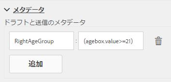
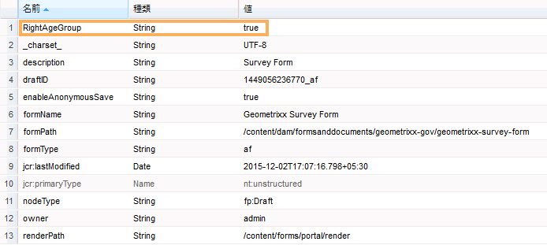
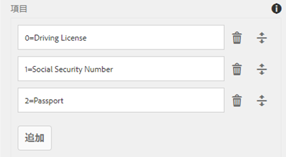
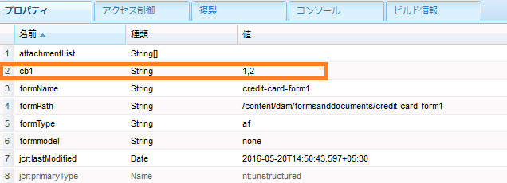

# ユーザーデータからフォーム送信メタデータへの情報の追加 {#adding-information-from-user-data-to-form-submission-metadata}

フォームの要素に入力された値を使用して、ドラフトまたはフォーム送信のメタデータフィールドを計算できます。メタデータを使用すると、ユーザーデータに基づいてコンテンツをフィルターできます。例えば、ユーザーがフォームの名前フィールドに John Doe と入力するとします。この情報を使用してメタデータを計算することにより、この送信をイニシャル JD の下に分類できます。

ユーザーが入力した値を使用してメタデータフィールドを計算するには、フォームの要素をメタデータに追加します。この要素にユーザーが値を入力すると、スクリプトはその値を使用して情報を計算します。この情報はメタデータに追加されます。要素をメタデータフィールドとして追加する際は、メタデータフィールドのキーを指定します。キーはメタデータのフィールドとして追加され、計算された情報はこのフィールドに対して記録されます。

例えば、健康保険会社がフォームを公開するとします。このフォームのフィールドで、エンドユーザーの年齢を取得します。この会社では、多数のユーザーからフォームが送信された後、特定の年齢範囲に当てはまる送信をすべて確認したいと考えています。しかしそのままでは相応の手間がかかります。なぜならフォームの数が増加するほどデータは複雑化するからです。メタデータを追加すると、手間を軽減することができます。フォーム作成者はエンドユーザーが入力したプロパティやデータのうちどれを最上位レベルに保存するかを設定できるため、検索が容易になります。追加メタデータはユーザーによって入力される情報であり、作成者の設定に基づいてメタデータノードの最上位レベルに保存されます。

電子メール ID と電話番号を取得するフォームの例を考えてみましょう。ユーザーがフォームに匿名でアクセスしてからフォームを破棄した場合、電子メール ID と電話番号が自動保存されるようにフォームを設定できます。このフォームは自動保存され、電話番号と電子メール ID は、ドラフトのメタデータノードに保存されます。この設定のユースケースとしては、リード管理ダッシュボードが挙げられます。

## メタデータへのフォーム要素の追加 {#adding-form-elements-to-metadata}

フォーム要素をメタデータに追加するには、次の手順を実行します。

1. アダプティブフォームを編集モードで開きます。

   フォームを編集モードで開くには、Forms Manager でフォームを選択して、「**開く**」をタップします。

1. 編集モードで、コンポーネントを選択し、  > **アダプティブフォームコンテナ**&#x200B;次に、 .
1. サイドバーで、「**メタデータ**」をクリックします。
1. 「メタデータ」セクションで、「**追加**」をクリックします。
1. 「メタデータ」タブの「値」フィールドを使用して、スクリプトを追加します。追加したスクリプトは、フォームの要素からデータを収集し、メタデータに追加された値を計算します。

   例： **true** がメタデータにログインしている（入力された年齢が 21 歳以上の場合）、 **false** が 21 未満の場合はログに記録されます。 「メタデータ」タブで次のスクリプトを入力します。

   `(agebox.value >= 21) ? true : false`

   
   **図：** *「メタデータ」タブで入力したスクリプト*

1. 「**OK**」をクリックします。

メタデータフィールドとして選択された要素にユーザーがデータを入力した後、計算された情報はメタデータに記録されます。メタデータは、メタデータを保存するように設定したリポジトリーで表示できます。

## フォーム送信メタデータの表示：  {#seeing-updated-form-nbsp-submission-metadata}

上記の例では、メタデータは CRX リポジトリーに保存されます。メタデータは次のように表示されます。

メタデータにチェックボックス要素を追加すると、選択された値がコンマで区切られた文字列として保存されます。例えば、フォームにチェックボックスコンポーネントを追加し、その名前を `checkbox1` として指定します。チェックボックスコンポーネントのプロパティで、値 0、1、および 2 に対して、運転免許、社会保障番号、パスポートの各項目を追加します。

アダプティブフォームコンテナを選択し、フォームのプロパティで `cb1` を保存するメタデータキー `checkbox1.value` を追加して、フォームを発行します。顧客がフォームへの記入時に、チェックボックスフィールドで「パスポート」オプションと「社会保障番号」オプションを選択します。値 1 と 2 が送信メタデータの cb1 フィールドに「1, 2」として保存されます。

>[!NOTE]
>
>上記の例は学習目的のみで紹介しています。メタデータの検索は、AEM Forms 実装で設定した適切な場所で行ってください。
