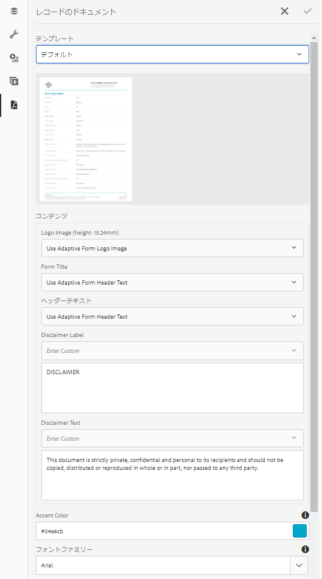

# アダプティブフォームにおけるレコードのドキュメント生成 {#generate-document-of-record-for-adaptive-forms}

## 概要 {#overview}

フォームを送信した後、顧客は通常、印刷するかまたはドキュメント形式で保存するかのどちらかで、フォームに記入した情報を今後の参考のために記録しておきたいと考えます。これを、レコードのドキュメントといいます。

この記事では、アダプティブフォームでレコードのドキュメントを生成する方法について説明します。

>[!NOTE]
>
>レコードのドキュメントの自動生成は、XFA ベースのアダプティブフォームではサポートされていません。ただし、アダプティブフォームの作成に使用した XDP をレコードのドキュメントとして使用することはできます。

## アダプティブフォームのタイプとレコードのドキュメント {#adaptive-form-types-and-their-documents-of-record}

アダプティブフォームを作成する際に、フォームモデルを選択することができます。 以下のオプションがあります。

* [フォームテンプレート](/help/forms/using/creating-adaptive-form.md#p-create-an-adaptive-form-based-on-an-xfa-form-template-p)

   アダプティブフォームの XFA テンプレートを選択できます。 XFA テンプレートを選択した場合は、上記のように、レコードのドキュメントに関連付けられている XDP ファイルを使用することができます。

* [XML スキーマ](/help/forms/using/creating-adaptive-form.md#p-create-an-adaptive-form-based-on-xml-or-json-schema-p)

   アダプティブフォームの XML スキーマ定義を選択できます。 アダプティブフォームの XML スキーマを選択すると、次のことが可能になります。

   * レコードのドキュメントに XFA テンプレートを関連付けます。 関連する XFA テンプレートで、アダプティブフォームと同じ XML スキーマが使用されていることを確認します。
   * レコードのドキュメントの自動生成

* なし

   フォームモデルを使用せずにアダプティブフォームを作成できます。 レコードのドキュメントは、アダプティブフォーム用に自動的に生成されます。

フォームモデルを選択する場合は、「レコードのドキュメントテンプレート設定」で使用可能なオプションを使用してレコードのドキュメントを設定します。[レコードのドキュメントのテンプレート設定](#document-of-record-template-configuration)を参照してください。

## 自動的に生成されたレコードのドキュメント {#automatically-generated-document-of-record}

レコードのドキュメントを使用すると、顧客は送信したフォームのコピーを印刷目的で保持できます。 レコードのドキュメントを自動的に生成すると、フォームを変更するたびに、そのレコードのドキュメントもすぐに更新されます。例えば、居住国に米国を選択した顧客のレコードでは、年齢のフィールドを削除したとします。このような顧客がレコードのドキュメントを生成する場合、レコードのドキュメント内の年齢フィールドは表示されません。

自動生成されたレコードのドキュメントには、次のような利点があります。

* データ連結が処理されます。
* 送信時にレコードのドキュメントから除外されるとマークされたフィールドについて、自動的に非表示にします。余分な労力が不要になります。
* レコードのドキュメントテンプレートの設計時間を節約できます。
* 様々な基本テンプレートを使用しながら様々なスタイリングと外観を試すことで、レコードのドキュメントにとって最良のスタイルと外観を選択できます。スタイリングを設定することはオプションです。スタイルを指定しない場合は、システムスタイルがデフォルトとして設定されます。
* これにより、フォーム内のすべての変更が確実にレコードのドキュメントに即座に反映されます。

## レコードのドキュメントを自動的に生成するコンポーネント {#components-to-automatically-generate-a-document-of-record}

アダプティブフォーム用のレコードのドキュメントを生成するには、次のコンポーネントが必要です。

**アダプティブフォーム**&#x200B;レコードのドキュメントを生成するアダプティブフォーム。

**基本テンプレート（推奨）** AEM Designer で作成された XFA テンプレート（XDP ファイル）。基本テンプレートは、レコードのドキュメントテンプレートのスタイリングとブランディング情報を指定するために使用されます。

[レコードのドキュメントの基本テンプレート](#base-template-of-a-dor)を参照してください

>[!NOTE]
>
>レコードのドキュメントの基本テンプレートは、レコードのドキュメントのメタテンプレートとも呼ばれます。

**レコードのドキュメントのテンプレート**&#x200B;アダプティブフォームから生成された XFA テンプレート（XDP ファイル）。

[レコードのドキュメントのテンプレート設定](#document-of-record-template-configuration)を参照してください。

**フォームデータ**&#x200B;ユーザーがアダプティブフォームに入力した情報。これは、レコードのドキュメントを生成するため、レコードのドキュメントテンプレートと結合されます。

## アダプティブフォームエレメントのマッピング {#mapping-of-adaptive-form-elements}

次のセクションでは、アダプティブフォームの要素がレコードのドキュメント内でどのように表示されるかについて説明します。

### フィールド {#fields}

<table> 
 <tbody> 
  <tr> 
   <th>アダプティブフォームコンポーネント</th> 
   <th>対応する XFA コンポーネント</th> 
   <th>レコードのドキュメントテンプレートにデフォルトで含まれるか。</th> 
   <th>備考</th> 
  </tr> 
  <tr> 
   <td>ボタン</td> 
   <td>ボタン</td> 
   <td>false</td> 
   <td> </td> 
  </tr> 
  <tr> 
   <td>チェックボックス</td> 
   <td>チェックボックス</td> 
   <td>true</td> 
   <td> </td> 
  </tr> 
  <tr> 
   <td>日付選択</td> 
   <td>日付／時間フィールド</td> 
   <td>true</td> 
   <td> </td> 
  </tr> 
  <tr> 
   <td>ドロップダウンリスト</td> 
   <td>ドロップダウンリスト</td> 
   <td>true</td> 
   <td> </td> 
  </tr> 
  <tr> 
   <td>手書き署名</td> 
   <td>手書き署名</td> 
   <td>true</td> 
   <td> </td> 
  </tr> 
  <tr> 
   <td>数値ボックス</td> 
   <td>数値フィールド</td> 
   <td>true</td> 
   <td> </td> 
  </tr> 
  <tr> 
   <td>パスワードボックス</td> 
   <td>パスワードフィールド</td> 
   <td>false</td> 
   <td> </td> 
  </tr> 
  <tr> 
   <td>ラジオボタン</td> 
   <td>ラジオボタン</td> 
   <td>true</td> 
   <td> </td> 
  </tr> 
  <tr> 
   <td>テキストボックス</td> 
   <td>テキストフィールド</td> 
   <td>true</td> 
   <td> </td> 
  </tr> 
  <tr> 
   <td>リセットボタン</td> 
   <td>リセットボタン</td> 
   <td>false</td> 
   <td> </td> 
  </tr> 
  <tr> 
   <td>送信ボタン</td> 
   <td><p>メール送信ボタン</p> <p>HTTP 送信ボタン</p> </td> 
   <td>false</td> 
   <td> </td> 
  </tr> 
  <tr> 
   <td>利用条件</td> 
   <td> </td> 
   <td>true</td> 
   <td> </td> 
  </tr> 
  <tr> 
   <td>ファイル添付</td> 
   <td> </td> 
   <td>false</td> 
   <td>レコードのドキュメントテンプレートでは使用できません。添付ファイルを介した場合のみレコードのドキュメントで使用できます。</td> 
  </tr> 
 </tbody> 
</table>

### コンテナ {#containers}

<table> 
 <tbody> 
  <tr> 
   <th>アダプティブフォームコンポーネント</th> 
   <th>対応する XFA コンポーネント</th> 
   <th>備考</th> 
  </tr> 
  <tr> 
   <td>パネル<br /> </td> 
   <td>サブフォーム<br /> </td> 
   <td>繰り返し可能なパネルは、繰り返し可能なサブフォームにマッピングされます。</td> 
  </tr> 
 </tbody> 
</table>

### 静的コンポーネント {#static-components}

| アダプティブフォームコンポーネント | 対応する XFA コンポーネント | 備考 |
|---|---|---|
| 画像 | 画像 | レコードのドキュメントの設定を使用して除外しない限り、TextDraw と Image の各コンポーネントは、連結されているかどうかを問わず、XSD ベースのアダプティブフォーム用のレコードのドキュメントに常に表示されます。 |
| テキスト | テキスト |

>[!NOTE]
>
>クラシック UI では、フィールドプロパティを編集するために異なるタブが表示されます。

### テーブル {#tables}

ヘッダー、フッター、行などのアダプティブフォームのテーブルコンポーネントは、対応する XFA コンポーネントにマッピングされます。 反復パネルをレコードのドキュメントのテーブルにマッピングできます。

## レコードのドキュメントの基本テンプレート {#base-template-of-a-document-of-record}

基本テンプレートは、レコードのドキュメントにスタイルと外観の情報を提供します。 自動生成されたレコードのドキュメントのデフォルトの外観をカスタマイズできます。 例えば、レコードのドキュメントのヘッダーに会社のロゴを追加し、フッターに著作権情報を追加するとします。 基本テンプレートのマスターページは、レコードのドキュメントテンプレートのマスターページとして使用されます。 マスターページには、レコードのドキュメントに適用できるページヘッダー、ページフッター、ページ番号などの情報を含めることができます。 レコードのドキュメント自動生成用の基本テンプレートを使用することで、この情報をレコードのドキュメントに適用できます。基本テンプレートを使用すると、フィールドのデフォルトプロパティを変更することができます。

後に続いてください [基本テンプレートの規則](#base-template-conventions) 基本テンプレートを設計する場合。

## 基本テンプレートの規則 {#base-template-conventions}

基本テンプレートは、レコードのドキュメントのヘッダー、フッター、スタイル、外観を定義するために使用します。 ヘッダーとフッターには、会社のロゴや著作権テキストなどの情報を含めることができます。基本テンプレートの最初のマスターページはコピーされ、レコードのドキュメント用のマスターページとして使用されます。この中には、ヘッダー、フッター、ページ番号、またはレコードのドキュメント内のすべてのページに表示される他の情報が含まれています。基本テンプレートの規則に準拠していない基本テンプレートを使用している場合、その最初のマスターページは依然としてレコードのドキュメントテンプレートで使用されます。基本テンプレートは、規則に従って設計し、レコードのドキュメントの自動生成に使用することを強くお勧めします。

**マスターページの規則**

* 基本テンプレートでは、ルートサブフォームに `AF_METATEMPLATE`、およびマスターページに `AF_MASTERPAGE` の名前を付ける必要があります。

* ルートサブフォームの `AF_MASTERPAGE` 下に位置する `AF_METATEMPLATE` という名前のマスターページには、ヘッダー、フッター、およびスタイル情報を抽出するための優先順位が与えられています。

* `AF_MASTERPAGE` が存在しない場合は、基本テンプレート中に存在する最初のマスターページが使用されます。

**フィールドのスタイリング規則**

* レコードのドキュメント内のフィールドにスタイルを適用するため、基本テンプレートは`AF_METATEMPLATE`ルートサブフォーム内の`AF_FIELDSSUBFORM`サブフォームにフィールドを作成します。

* これらのフィールドのプロパティは、レコードのドキュメント内のフィールドに適用されます。これらのフィールドは、`AF_<name of field in all caps>_XFO` の命名規則に従う必要があります。例えば、チェックボックスのフィールド名は `AF_CHECKBOX_XFO` とする必要があります。

基本テンプレートを作成するには、AEM Designer で次の手順を実行します。

1. **ファイル／新規**&#x200B;をクリックします。
1. 「**テンプレートに基づく**」のオプションを選択します。

1. 「**Forms - レコードのドキュメント**」のカテゴリを選択します。
1. 「**DoR 基本テンプレート**」を選択します。
1. 「**次へ**」をクリックし、必要な情報を入力します。

1. （オプション）レコードのドキュメント内のフィールドに適用するフィールドのスタイルと外観を変更します。
1. フォームを保存します。

これで、保存されたフォームをレコードのドキュメント用基本テンプレートとして使用できます。\
基本テンプレート中に存在するスクリプトについて、いずれも変更したり、削除したりしないでください。

**基本テンプレートの変更**

* 基本テンプレート内のフィールドに対していずれのスタイルも適用していない場合は、基本テンプレートからそれらのフィールドを削除することをお勧めします。これにより、基本テンプレートのアップグレードを自動的に適用することができます。
* 基本テンプレートを変更するときは、スクリプトを削除、追加、変更しないでください。

>[!NOTE]
>
>基本テンプレート規則を使用し、上記の手順を正確に実行してください。

## レコードのドキュメントのテンプレート設定 {#document-of-record-template-configuration}

フォームのレコードのドキュメントテンプレートを設定して、顧客が送信したフォームを印刷用ファイルとしてダウンロードできるようにします。XDP ファイルは、レコードのドキュメントテンプレートとして機能します。顧客がダウンロードしたレコードのドキュメントは、XDP ファイルで指定されたレイアウトに従ってフォーマットされます。

次の手順を実行し、アダプティブフォーム向けレコードのドキュメントを設定します。

1. AEM オーサーインスタンスで、**フォーム／フォームとドキュメント**&#x200B;をクリックします。
1. フォームを選択し、「**プロパティの表示**」をクリックします。
1. 「プロパティ」ウィンドウで、「**フォームモデル**」をタップします。

   フォームモデルの選択は、フォームの作成時にも行うことができます。

   >[!NOTE]
   >
   >「フォームモデル」のタブで、必ず「**次から選択**」ドロップダウンから「**スキーマ**」または「**なし**」を選択します。**[!UICONTROL レコードのドキュメントは、XFA ベースのフォームや、フォームテンプレートがフォームモデルとして使用されたアダプティブフォームではサポートされません。]**

1. 「フォームモデル」タブの「レコードのドキュメントのテンプレート設定」セクションで、次のいずれかのオプションを選択します。

   **なし**&#x200B;フォーム用のレコードのドキュメントを設定しない場合は、このオプションを選択します。

   **フォームテンプレートをレコードのドキュメントとして関連付ける**&#x200B;レコードのドキュメント用のテンプレートとして使用する XDP ファイルがある場合は、このオプションを選択します。このオプションを選択すると、AEM Formsリポジトリで使用可能なすべての XDP ファイルが表示されます。 適切なファイルを選択します。

   選択された XDP ファイルは、アダプティブフォームに関連付けられます。

   **レコードのドキュメントの生成**&#x200B;レコードのドキュメントのスタイルと外観が定義された基本テンプレートとして XDP ファイルを使用するには、このオプションを選択します。このオプションを選択すると、AEM Formsリポジトリで使用可能なすべての XDP ファイルが表示されます。 適切なファイルを選択します。

   **[!UICONTROL レコードのドキュメントのスタイルと外観を定義する基本テンプレートとして XDP ファイルを使用する場合は、このオプションを選択します。 このオプションを選択すると、AEM Formsリポジトリで使用可能なすべての XDP ファイルが表示されます。 適切なファイルを選択します。]**

   **レコードのドキュメントを生成する基本テンプレートとしてFormsテンプレートを選択** レコードのドキュメントのスタイルと外観を定義する基本テンプレートとして XDP ファイルを使用する場合は、このオプションを選択します。 このオプションを選択すると、AEM Formsリポジトリで使用可能なすべての XDP ファイルが表示されます。 適切なファイルを選択します。

   >[!NOTE]
   >
   >アダプティブフォームの作成に使用するスキーマと、XFA フォームのスキーマ（データスキーマ）が同じであることを確認します。
   >
   >* アダプティブフォームはスキーマベースです
   >* レコードのドキュメント用の「**フォームテンプレートをレコードのドキュメントテンプレートとして関連付ける**」オプションを使用している場合


1. 「**完了**」をクリックします。

## レコードのドキュメント内のブランディング情報のカスタマイズ {#customize-the-branding-information-in-document-of-record}

レコードのドキュメントを生成する際に、「レコードのドキュメント」タブでレコードのドキュメントのブランディング情報を変更できます。 「レコードのドキュメント」タブには、ロゴ、外観、レイアウト、ヘッダー、フッター、免責事項などのオプションや、選択されていないチェックボックスやラジオボタンを含めるかどうかのオプションが含まれています。

「レコードのドキュメント」タブに入力したブランディング情報をローカライズするには、ブラウザーのロケールが適切に設定されていることを確認する必要があります。 レコードのドキュメントのブランディング情報をカスタマイズするには、次の手順を実行します。

1. レコードのドキュメント内でパネル（ルートパネル）を選択して、「」をタップします。
1.  をタップします。「レコードのドキュメント」タブが表示されます。
1. レコードのドキュメントをレンダリングするためのデフォルトのテンプレートまたはカスタムのテンプレートを選択します。 デフォルトのテンプレートを選択すると、レコードのドキュメントのサムネールプレビューが「テンプレート」ドロップダウンの下に表示されます。

   

   カスタムテンプレートを選択する場合は、AEM Formsサーバーで XDP を参照して選択します。 まだAEM Formsサーバー上にないテンプレートを使用する場合は、まず XDP をAEM Formsサーバーにアップロードする必要があります。

1. デフォルトのテンプレートとカスタムのテンプレートのどちらを選択したかに基づいて、次のプロパティの一部またはすべてが「レコードのドキュメント」タブに表示されます。 これらを正しく設定します。

   * **ロゴ画像**：アダプティブフォームのロゴ画像を使用するか、DAM から選択するか、コンピューターからアップロードすることができます。
   * **フォームタイトル**
   * **ヘッダーテキスト**
   * **免責事項ラベル**
   * **免責事項**
   * **免責事項テキスト**
   * **アクセントの色**：ヘッダーテキストおよび区切り線の色は、レコードのドキュメントの PDF でレンダリングされます
   * **フォントファミリー**：レコードのドキュメント PDF にあるテキストフォントファミリー
   * **チェックボックスおよびラジオボタンのコンポーネントには、選択した値のみが表示されます**
   * **複数選択されている値のセパレーター**
   * **データモデルにバインドされていないフォームオブジェクトを含める**
   * **レコードのドキュメントから非表示のフィールドを除外**
   * **パネルの説明を非表示**

   >[!NOTE]
   >
   >6.3 より前のバージョンの Designer で作成されたアダプティブフォームテンプレートを使用している場合、Accent Color プロパティと Font Family プロパティを機能させるには、ルートサブフォームの下のアダプティブフォームテンプレートに次の内容が存在することを確認します。

   ```xml
   <proto>
   <font typeface="Arial"/>
   <fill>
   <color value="4,166,203"/>
   </fill>
   <edge>
   <color value="4,166,203"/>
   </edge>
   </proto>
   ```

1. ブランディングの変更内容を保存するには、「完了」をタップします。

## レコードのドキュメントのパネルに表示される表と列のレイアウト {#table-and-column-layouts-for-panels-in-document-of-record}

いくつかのフォームフィールドを使用すると、アダプティブフォームのサイズが大きくなる場合があります。レコードのドキュメントをアダプティブフォームの正確なコピーとして保存しないこともできます。 レコードのドキュメントPDFで 1 つ以上のアダプティブフォームパネルを保存するためのテーブルレイアウトまたは列レイアウトを選択できるようになりました。

レコードのドキュメントを生成する前に、パネルの設定で、そのパネルのレコードのドキュメントのレイアウトをテーブルまたは列として選択します。 パネル内のフィールドは、レコードのドキュメント内で適宜整理されます。


レコードのドキュメントのテーブルレイアウト内でレンダリングされたパネルのフィールド


レコードのドキュメントの列レイアウト内でレンダリングされたパネルのフィールド

## レコードのドキュメントの設定 {#document-of-record-settings}

レコードのドキュメント設定では、レコードのドキュメントに含めるオプションを選択できます。例えば、銀行では、名前、年齢、社会保障番号、電話番号などをフォームから受け取ります。フォームは銀行口座番号と支店の詳細を生成します。 レコードのドキュメントには、名前、社会保障番号、銀行口座、支店の詳細のみを表示するよう選択できます。

コンポーネントのレコードのドキュメント設定は、そのプロパティ内で使用できます。コンポーネントのプロパティにアクセスするには、コンポーネントを選択し、オーバーレイ内の  をクリックします。プロパティはサイドバーにリスト表示され、その中で次の設定を検索できます。

**フィールドレベルの設定**

* **レコードのドキュメントから除外**:プロパティを true に設定すると、レコードのドキュメントからフィールドが除外されます。 これは `excludeFromDoR` という名前のスクリプト可能プロパティです。その動作は、**非表示の場合はレコードのドキュメントからフィールドを除外**&#x200B;フォームレベルプロパティに依存します。

* **パネルをテーブルとして表示：**&#x200B;パネルに含まれるフィールドの数が 6 個未満の場合、このプロパティを設定することでパネルがテーブルとしてレコードのドキュメントに表示されます。この設定は、パネルにのみ適用されます。
* **レコードのドキュメントからタイトルを除外：**&#x200B;このプロパティを設定すると、レコードのドキュメントからパネルやテーブルのタイトルが除外されます。パネルおよびテーブルに対してのみ適用できます。
* **レコードのドキュメントから説明を除外：**&#x200B;このプロパティを設定すると、レコードのドキュメントからパネルやテーブルの説明が除外されます。パネルおよびテーブルに対してのみ適用できます。

**フォームレベルの設定**

* **バインドされていないフィールドをレコードのドキュメントに含める：**&#x200B;このプロパティを設定すると、スキーマベースのアダプティブフォームのバインドされていないフィールドが、レコードのドキュメントに追加されます。デフォルトでは true になっています。
* **非表示の場合はレコードのドキュメントからフィールドを除外**：このプロパティを設定すると、「レコードのドキュメントから除外」フィールドレベルプロパティが true でないときにその動作が上書きされます。フォームの送信時にフィールドが非表示の場合、これらのフィールドは、プロパティが true に設定されているとレコードのドキュメントから除外されます（ただし「レコードのドキュメントから除外」プロパティが設定されていない場合）。

## レコードのドキュメントで作業する場合の主な注意点 {#key-considerations-when-working-with-document-of-record}

アダプティブフォーム用のレコードのドキュメントで作業する際は、以下の点に注意してください。

* レコードのドキュメントのテンプレートは、リッチテキストをサポートしていません。したがって、静的アダプティブフォーム内またはエンドユーザーが入力した情報内のリッチテキストは、レコードのドキュメント内ではプレーンテキストとして表示されます。
* アダプティブフォーム内のドキュメントフラグメントは、レコードのドキュメントには表示されません。 ただし、アダプティブフォームフラグメントはサポートされています。
* レコードのドキュメントは、印刷目的でのみ使用されます。
* XML スキーマベースのアダプティブフォームは、レコードの生成されたドキュメント内でのコンテンツのバインドに対応していません。
* XML スキーマベースのアダプティブフォームは、レコードの生成されたドキュメント内でのコンテンツのバインドに対応していません。
* レコードのドキュメントのレンダリングをユーザーが要求すると、ロケールに対してオンデマンドでレコードのドキュメントのローカライズバージョンが作成されます。 レコードのドキュメントのローカライゼーションは、アダプティブフォームのローカライゼーションと共に行われます。 レコードのドキュメントおよびアダプティブフォームのローカライゼーションの詳細については、「[AEM 翻訳ワークフローを使用したアダプティブフォールおよびレコードのドキュメントのローカライズ](/help/forms/using/using-aem-translation-workflow-to-localize-adaptive-forms.md)」を参照してください。
