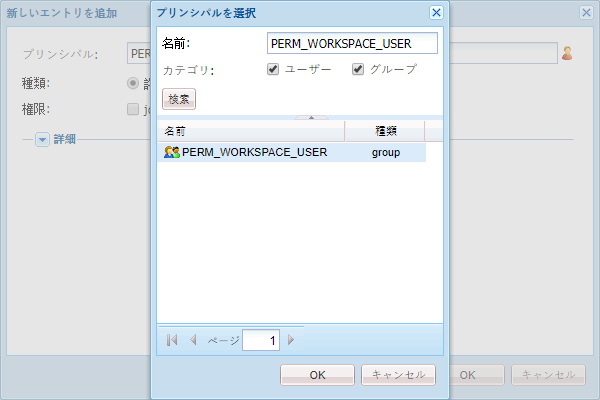

# AEM Forms Workspace のカスタマイズの一般的な手順 {#generic-steps-for-aem-forms-workspace-customization}

カスタマイズを実行する一般的な手順は次のとおりです。

1. `https://[server]:[port]/lc/crx/de/index.jsp` にアクセスして CRXDE Lite にログインします。
1. `ws` に `/apps` という名前の  フォルダーが存在しない場合は、作成します。「**[!UICONTROL すべて保存]**」をクリックします。
1. `/apps/ws` を参照して「**[!UICONTROL アクセス制御]**」タブに移動します。
1. **[!UICONTROL アクセス制御]**&#x200B;リストで「**[!UICONTROL +]**」 をクリックして、新しいエントリを追加します。もう一度「**[!UICONTROL +]**」をクリックします。
1. **[!UICONTROL PERM_WORKSPACE_USER]** プリンシパルを検索して選択します。

   

1. `jcr:read` 権限をプリンシパルに付与します。
1. 「**[!UICONTROL すべて保存]**」をクリックします。
1. を `GET.jsp` および `html.jsp`ファイル `/libs/ws`フォルダーを `/apps/ws` フォルダー。
1. `/libs/ws/locales` フォルダーを `/apps/ws` フォルダーにコピーします。「**[!UICONTROL すべて保存]**」をクリックします。
1. 以下に示すように、`GET.jsp` ファイルの参照および相対パスを更新し、「**[!UICONTROL すべて保存]**」をクリックします。

   ```
   <meta http-equiv="refresh" content="0;URL='/lc/apps/ws/index.html'" />
   ```

1. CSS のカスタマイズは以下のようにして実行します。

   1. `/apps/ws` フォルダーに移動して `css` という名前の新しいフォルダーを作成します。
   1. 内 `css`フォルダフォルダ、新しいファイルを作成します。 `newStyle.css`.
   1. `/apps/ws/html`.jsp を開いて次のように変更します。変更元：

   ```css
   <link lang="en" rel="stylesheet" type="text/css" href="css/style.css" />
   <link lang="en" rel="stylesheet" type="text/css" href="css/jquery-ui.css"/>
   ```

   コピー先：

   ```css
   <link lang="en" rel="stylesheet" type="text/css" href="../../libs/ws/css/style.css" />
   <link lang="en" rel="stylesheet" type="text/css" href="css/newStyle.css" />
   <link lang="en" rel="stylesheet" type="text/css" href="../../libs/ws/css/jquery-ui.css"/>
   ```

   >[!NOTE]
   >
   >上記のように、newStyle.css のエントリの後に、ユーザ定義 CSS ファイルのエントリを配置します。

1. /apps/ws/html.jspファイルで、

   ```css
   <script data-main="js/main" src="js/libs/require/require.js"></script>
   ```

   コピー先：

   ```css
   <script data-main="js/main" src="../../libs/ws/js/libs/require/require.js"></script>
   ```

1. 以下の操作を実行します。

   1. `js` に `/apps/ws` という名前のフォルダーを作成します。「**[!UICONTROL すべて保存]**」をクリックします。
   1. `libs` に `/apps/ws/js` という名前のフォルダーを作成します。「**[!UICONTROL すべて保存]**」をクリックします。
   1. `jqueryui` に `/apps/ws/js/libs` という名前のフォルダーを作成します。「**[!UICONTROL すべて保存]**」をクリックします。
   1. `/libs/ws/js/libs/jqueryui/jquery.ui.datepicker-ja.js` を `/apps/ws/js/libs/jqueryui` にコピーします。「**[!UICONTROL すべて保存]**」をクリックします。

1. HTMLのカスタマイズの場合は、次の操作を行います。

   1. `/apps/ws/js` の下に `runtime` という名前のフォルダーを作成します。「**[!UICONTROL すべて保存]**」をクリックします。
   1. `/apps/ws/js/runtime` の下に `templates` という名前のフォルダーを作成します。「**[!UICONTROL すべて保存]**」をクリックします。
   1. `/libs/ws/js/main.js` を `/apps/ws/js/main.js` にコピーします。
   1. /libs/ws/js/registry.js を `/apps/ws/js/registry.js` にコピーします。

1. 「**[!UICONTROL Save All]**」をクリックし、キャッシュをクリアして AEM Forms Workspace を更新します。

   URL `https://[server]:[port]/lc/ws` にアクセスして、管理者とパスワードの資格情報を使用してログインします。ブラウザーが `https://[server]:[port]/lc/apps/ws/index.html` にリダイレクトします。
