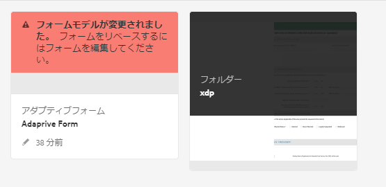
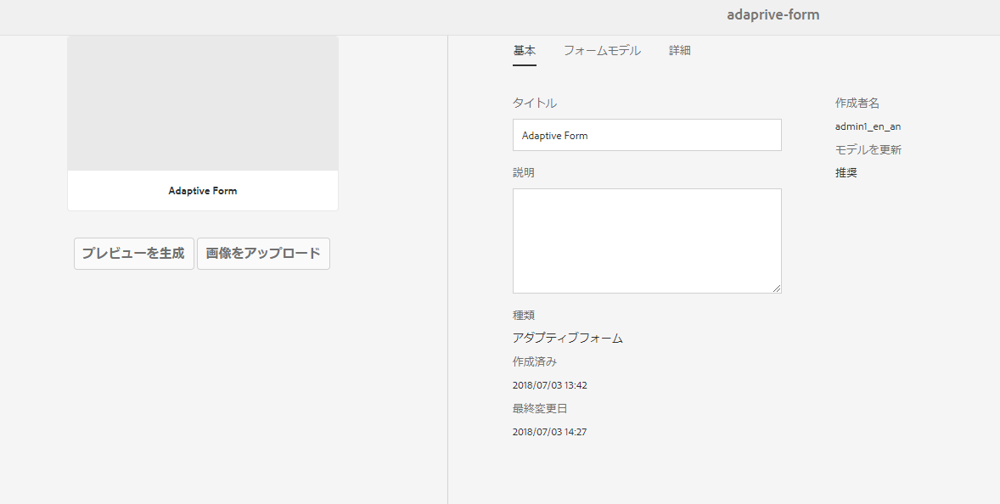

# AEM Forms での XDP および PDF ドキュメントの取得 {#getting-xdp-and-pdf-documents-in-aem-forms}

>[!CAUTION]
>
>AEM 6.4 の拡張サポートは終了し、このドキュメントは更新されなくなりました。 詳細は、 [技術サポート期間](https://helpx.adobe.com/jp/support/programs/eol-matrix.html). サポートされているバージョンを見つける [ここ](https://experienceleague.adobe.com/docs/?lang=ja).

## 概要 {#overview}

AEM Formsにアップロードすることで、ローカルファイルシステムから CRX リポジトリにフォームを読み込むことができます。 アップロード操作は、次のアセットタイプでサポートされています。

* フォームテンプレート（XFA フォーム）
* PDF のフォーム
* ドキュメント ( フラットPDFドキュメント )

サポートされているアセットタイプを個別にまたは ZIP アーカイブとしてアップロードできます。`Resource` タイプのアセットは、XFA フォームと一緒に ZIP アーカイブでのみアップロードできます。

>[!NOTE]
>
>XDP ファイルをアップロードすることができる `form-power-users` グループのメンバーであることを確認してください。管理者に問い合わせて、グループのメンバーになります。

## フォームのアップロード {#uploading-forms}

1. `https://[server]:[port]/aem/forms.html` にアクセスして AEM Forms ユーザーインターフェイスにログインします。
1. フォームをアップロードするフォルダー、またはフォームを含むフォルダーに移動します。
1. アクションツールバーで、 **作成/ファイルのアップロード**.

   

1. フォームまたはパッケージをアップロードダイアログでは、アップロードするファイルを参照および選択できます。 ファイルブラウザーには、サポートされているファイル形式 (ZIP、XDP、およびPDF) のみが表示されます。

   >[!NOTE]
   >
   >ファイル名には、英数字、ハイフン、アンダースコアのみを含めることができます。

1. ファイルをアップロードするには、ファイル選択後に「アップロード」をクリックし、アップロードをキャンセルするには、「キャンセル」をクリックします。 追加されたアセットと、現在の場所で更新されたアセットがポップアップに表示されます。

   >[!NOTE]
   >
   >ZIP ファイルの場合は、サポートされているすべてのアセットの相対パスが表示されます。ZIP 内の未サポートアセットは無視され、一覧には表示されません。ただし、ZIP アーカイブに未サポートアセットのみが含まれている場合は、エラーメッセージが表示され、ポップアップダイアログは表示されません。

   

1. アセットに無効のファイル名がある場合は、エラーが表示されます。赤で強調表示されているファイル名を修正し、再びアップロードしてください。

   

アップロードが完了すると、バックグラウンドワークフローで、アセットのプレビューに基づいて、各アセットのサムネールが生成されます。 新しいバージョンのアセットがアップロードされた場合は、既存のアセットを上書きします。

### 保護モード {#protected-mode}

AEM Formsサーバーを使用すると、JavaScript コードを実行できます。 悪意のある JavaScript コードは、AEM Forms環境に害を与える可能性があります。 保護モードでは、AEM Formsが信頼できるアセットや場所からのみ XDP ファイルを実行するように制限されます。 AEM Forms UI で使用できる XDP はすべて、信頼できるアセットと見なされます。

保護モードは、デフォルトでオンです。 必要に応じて、保護モードを無効にできます。

1. 管理者として AEM Web コンソールにログインします。URL は `https://[server]:[port]/system/console/configMgr` です。
1. モバイルForms設定を編集用に開きます。
1. 「保護モード」オプションの選択を解除し、 **保存**. 保護モードが無効になります。

## 参照先 XFA フォームの更新 {#updating-referenced-xfa-forms}

AEM Formsでは、XFA フォームテンプレートは、アダプティブフォームまたは別の XFA フォームテンプレートによって参照することができます。 また、テンプレートは、リソースまたは別の XFA テンプレートを参照することもできます。

XFA を参照しているアダプティブフォームのフィールドは、XFA で使用可能なフィールドと連結されています。 フォームテンプレートを更新すると、関連付けられたアダプティブフォームは XFA との同期を試みます。 詳しくは、 [アダプティブフォームと関連 XFA との同期](/help/forms/using/synchronizing-adaptive-forms-xfa.md).

フォームテンプレートを削除すると、依存アダプティブフォームまたはフォームテンプレートが破損します。 このようなアダプティブフォームは、非公式にダーティフォームと呼ばれる場合があります。 AEM Formsのユーザーインターフェイスでは、次の 2 つの方法で dirty フォームを見つけることができます。

* アセットリスト内のアダプティブフォームのサムネールに警告アイコンが表示され、警告アイコンの上にマウスポインターを置くと次のメッセージが表示されます。

   `Schema/Form Template for this adaptive form has been updated so please go to Authoring mode and rebase it with new version.`

アダプティブフォームがダーティかどうかを示すフラグが保持されます。 この情報は、フォームメタデータと共に、フォームプロパティページで利用できます。 dirty アダプティブフォームの場合のみ、メタデータプロパティ `Model Refresh` は `Recommended` 値を表示します。

