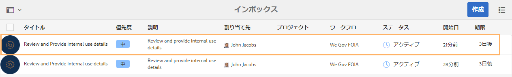
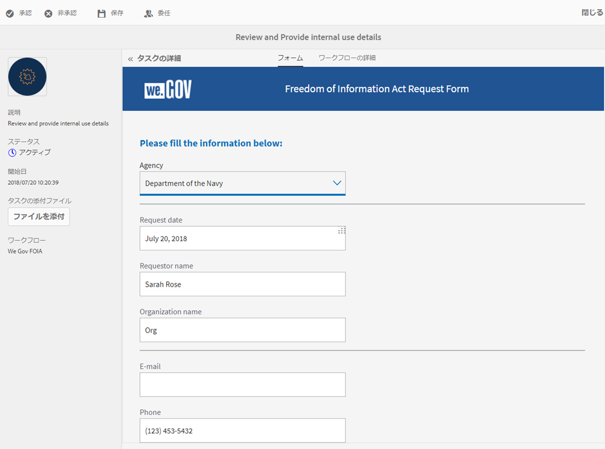
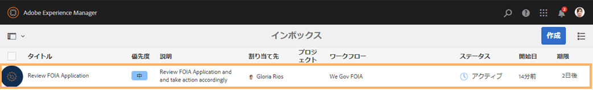
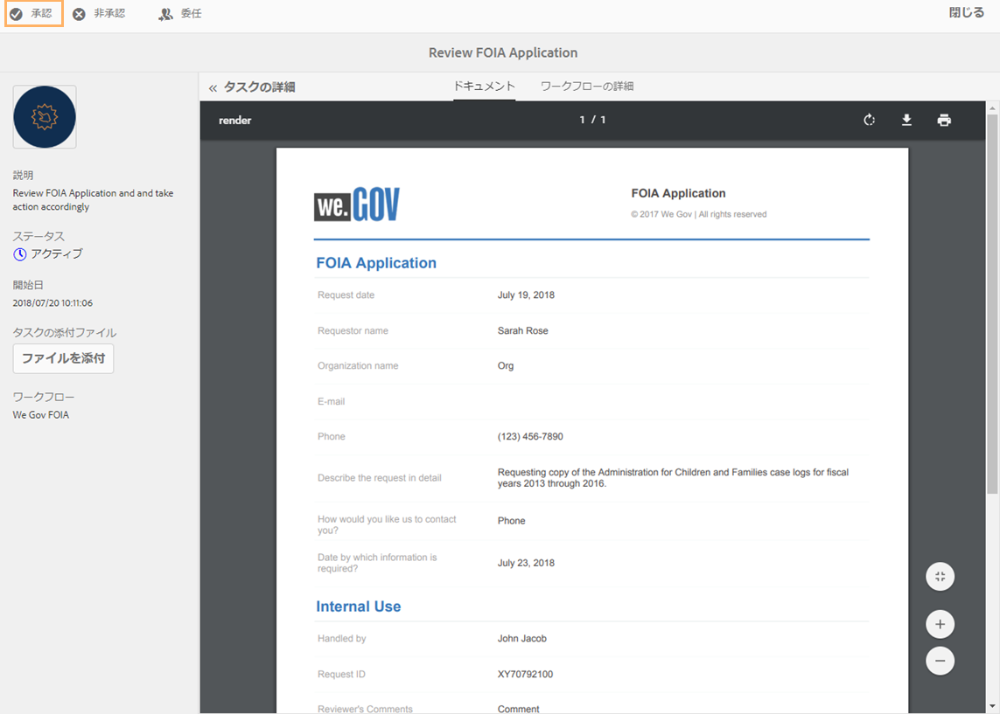

# We.Gov リファレンスサイトの情報公開法ウォークスルー {#we-gov-reference-site-foia-walkthrough}

>[!CAUTION]
>
>AEM 6.4 の拡張サポートは終了し、このドキュメントは更新されなくなりました。 詳細は、 [技術サポート期間](https://helpx.adobe.com/jp/support/programs/eol-matrix.html). サポートされているバージョンを見つける [ここ](https://experienceleague.adobe.com/docs/?lang=ja).

## 前提条件 {#pre-requisite}

We.Gov リファレンスサイトを [AEM Formsリファレンスサイトのセットアップと設定](/help/forms/using/setup-reference-sites.md).

## リファレンスサイト情報の自由法のシナリオ {#reference-site-freedom-of-information-act-scenario}

We.Gov は、養子を養子にした場合に養親が子供のサポートを受けるために登録できる国営組織です。 また、We.Gov は、情報の自由法に基づき、次の政府部門から情報を要求することも可能です。

* 防衛物流庁
* 検査官総監国防総省
* 司法省 — 情報政策局
* 海軍省
* 環境保護庁

情報公開法について詳しくは、[www.foia.gov](https://www.foia.gov) を参照してください。

このシナリオでは、次の人物が登場します。

* Sarah Rose（情報の請求者）
* John Jacobs（リクエストを処理する人物）は、リクエストを適切な部門に転送します。
* Gloria Rios（要求に応じて情報を提供する政府職員）

## Sarah が FOIA の下で情報の要求を開始 {#sarah-initiates-request-for-information-under-foia}

情報公開法に基づいて、Sarah は児童・家庭援護庁の 2013 年度から 2016 年度までの訴訟の記録の写しを請求します。Sarah はこの申請を司法省 — 情報政策局に送信し、印刷費と郵送料の額を最大 100 米ドルまで支払う意思を示します。

### 仕組み {#how-it-works}

### 実際の動作確認 {#see-it-yourself}

ブラウザーで、`https://<hostname>:<PublishPort>/wegov` を開きます。We.Gov サイトで、「申請」／「すべての申請」をタップします。「すべての申請」ページの「情報公開法の請求申請」で「申請」をタップします。

## Sarah が情報公開法に基づいて申請を開始 {#sarah-starts-her-application-for-information-under-foia}

Sarah は「**申請**」をクリックし、「情報公開法請求フォーム」ページで次を含む情報を入力します。

* **機関**：Sarah は、請求先の機関として「司法省 - 情報政策局」を指定します。

* **最大支払額**：Sarah は、印刷と郵送の費用として最大 100 米ドルを支払う意思があることを記入します。
* **請求内容の詳細**：Sarah は「児童・家庭援護庁の 2013 年度から 2016 年度までの訴訟の記録の写しの請求」と記入します。

児童・家庭援護庁の 2013 年度から 2016 年度までの訴訟の記録の写しの請求

Sarah はいつでも「保存」をタップしてフォームのドラフトを保存し、後で戻ってフォームに入力して送信することができます。 Sarah はフォームを送信します。

>[!NOTE]
>
>電子メールからの再開ワークフローは、ログインしたユーザーに対してのみ機能します。 リファレンスサイトのシナリオで、Sarah Rose というユーザーが追加されていることを確認します。 Sarah のログイン資格情報は `srose/password` です。

## John Jacobs が申込書を受信し承認します {#john-jacobs-receives-and-approves-the-application}

John Jacobs がリクエストを受け取り、適切な人にルーティングします。 AEM Inbox を使用すると、送信されたすべてのアプリを 1 か所で表示できます。

### 仕組み {#how-it-works-1}

Sarah が FOIA 申込書に記入して送信すると、申込書のレコードが John Jacobs のインボックスに送信されます。 John Jacobs は、送信された申込書を表示し、承認または拒否できます。

### 動作を確認 {#see-it-yourself-1}

次の場所にある AEM インボックスにアクセスします。https://&lt;***ホスト名***>:&lt;***公開ポート***>/content/we-finance/global/en/login.html?resource=/aem/inbox.htmlJohn Jacobs のユーザー名とパスワード（jjacobs／password）を使用して AEM インボックスにログインし、情報公開法の申請を確認します。Forms 中心のワークフロータスクで AEM インボックスを使用する方法について詳しくは、「[AEM インボックスでの Forms アプリケーションとタスクの管理](/help/forms/using/manage-applications-inbox.md)」を参照してください。

John Jacobs は、申し込みダッシュボードから申し込みを表示、承認または拒否できます。 John Jacobs はリクエストの詳細を選択して開き、リクエストをレビューした後、承認します。

### <strong>Sarah が確認の電子メールを受信</strong> {#strong-sarah-receives-an-acknowledgement-email-strong}

John Jacobs が申込を承認した後、Sarah は We.Gov サイトから確認の電子メールを受信します。 Sarah は、申し込みの処理に必要な料金と時間を通知されます。 また、電子メールには、Sarah が申込書の更新情報を問い合わせる電子メールと電話の詳細も含まれます。

## Gloria は第 2 レベルの承認を求める FOIA のリクエストを受け取ります {#gloria-receives-the-foia-request-for-second-level-approval}

John Jacobs が必要な情報を入力し、Sarah の要求を承認すると、要求は Gloria Rios に送信され、最終的な承認が求められます。 Gloria は添付のレコードのドキュメントをレビューし、リクエストを承認します。

### 仕組み {#how-it-works-2}

John Jacobs が FOIA 要求を承認すると、申込書のPDFまたはレコードのドキュメントが作成され、Gloria Rios の受信ボックスに送信されます。 Gloria は提出された請求を確認し、請求を承諾または却下することができます。

### 動作を確認 {#see-for-yourself}

次の場所で AEM インボックスにアクセスできます。https://&lt;***ホスト名***>:&lt;***公開ポート***>/content/we-finance/global/en/login.html?resource=/aem/inbox.htmlGloria Rios のユーザー名とパスワード（grios／password）を使用して AEM インボックスにログインし、情報公開法の請求を確認します。

Gloria はリクエストを開き、FOIA リクエストの詳細を調べます。 要求の詳細を確認し、必要なドキュメントを提供する実行可能性を確認した後、Gloria は要求を承認します。

## Sarah は、要求が承認されたという通知を受け取ります {#sarah-receives-notification-that-her-request-is-approved}

Gloria が FOIA の申請を承認した後、Sarah は申請が承認されたことを知らせる電子メールを受信します。 また、電子メールには、ドキュメントを提供するための暫定的なタイムラインに関する情報と、リクエストのフォローアップに関する連絡先の詳細も含まれています。

