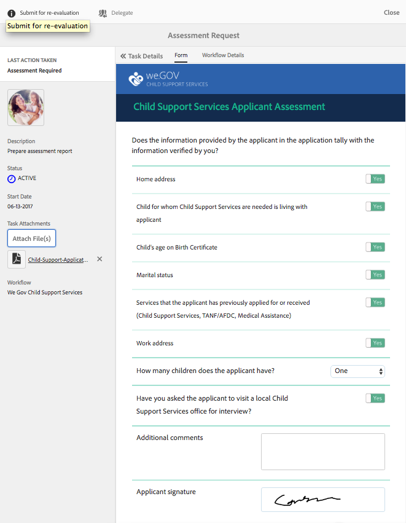

# We.Gov リファレンスサイトの チュートリアル {#we-gov-reference-site-walkthrough}

>[!CAUTION]
>
>AEM 6.4 の拡張サポートは終了し、このドキュメントは更新されなくなりました。 詳細は、 [技術サポート期間](https://helpx.adobe.com/jp/support/programs/eol-matrix.html). サポートされているバージョンを見つける [ここ](https://experienceleague.adobe.com/docs/?lang=ja).

## 前提条件 {#pre-requisite}

We.Gov リファレンスサイトを [AEM Formsリファレンスサイトのセットアップと設定](/help/forms/using/setup-reference-sites.md).

## リファレンスサイトのシナリオ {#reference-site-scenario}

We.Gov は、養子を養子にした場合に養親が子供のサポートを受けるために登録できる国営組織です。 このサイトでは、以下を管理します。

* 申込者（養親）の適格要件
* 申込者の個人および職業の詳細（申込者がチャイルドサポートを受ける資格がある場合）
* 養子の個人的な詳細

   申込者は複数の子の詳細を入力できます
* チャイルドサポート給付を受けることができる申込者の銀行口座の詳細
* 出願料の回収
* 出願の査定
* 申請の承認
* 申込者への自動コミュニケーション

申込が送信され、手数料が支払われると、申込者は送信された申込の確認を含む電子メールを組織から受け取ります。

We.Gov 組織が申込を受け取ります。 組織は申込書を評価し、本物の申込書を承認します。

申込が承認されると、申込者は We.Gov サイトから電子メールを受け取ります。 この **ドキュメントを表示** オプションを選択すると、申込者の登録詳細を含むドキュメントにリンクされます。

以下の解説図は、 We.Gov リファレンスサイトシナリオのワークフローを順を追って示しています。

このシナリオでは、次の人物が登場します。

* Sarah Rose（チャイルドサポートを申し込む養親）
* 養子ジョー
* Gloria Rios（We.Gov の承認部門責任者）
* Conard Simms（申込査定を担当するフィールドエージェント）

## Sarah が適格性の確認を開始 {#sarah-initiates-her-eligibility-check}

申込者は、チャイルドサポート手当をリクエストする資格を確認できます。 このサイトでは、ユーザーは質問に答え、アプリケーションが福利厚生を受ける資格があるかどうかを判断できます。 養親の Sarah は、見込申込者です。 適格要件フォームは、We.Gov サイトのチャイルドサポート申請サービスの一部です。 Sarah は、この申請を確認するために **[!UICONTROL チャイルドサポート]** を We.Gov Web サイトに貼り付けます。 「Child Support」（チャイルドサポート）ページで、Sarah は **[!UICONTROL 適格性を確認]**.

上記の方法に加えて、Sarah は **[!UICONTROL はじめに]** をホームページに追加します。 Sarah は「All Applications」（すべての申し込み）ページに移動し、次の「Apply」（申し込む）をクリックします。 **[!UICONTROL チャイルドサポートサービスの申請]**. その後、Sarah は適格性チェックに進みます。

「Check Eligibility For Child Support」（チャイルドサポートの適格性を確認）ページで、Sarah はチャイルドサポート給付の適格性を判断するための一連の質問を受けます。 一連の質問を通じて、彼女は次のように尋ねられる。

* Sarah が子の親権を持つ親である場合
* Sarah とその子どもが GX の状態で生きているかどうか
* 子供と子供の教育の年齢層。

Sarah はこれらの質問に回答し、適格性が検証されます。 Sarah の回答は、Sarah がチャイルドサポートを受ける資格があるかどうかを判断します。

Sarah は、チャイルドサポートの資格があり、申込手数料が$25 であることを通知されます。

### 仕組み {#how-it-works}

Sarah の適格性は、ルールエディターを使用して作成した適格要件バリアによって検証されます。 ルールエディターを使用すると、申込者が申込フォームに記入する前に満たされた条件を指定できます。 申込者である Sarah は、すべての適格要件を満たすと、申込フォームに移動します。

適格性の確認は、チャイルドサポートアプリケーションアダプティブフォームの一部です。 ルールは、次の場合に適格性を検証します。

* 申込者は保護者の親です
* 申込者とその子どもは GX の状態にとどまる
* 申請人は子どもを日々大切に世話する
* サポートサービスを受ける子供の年齢は 16 歳未満です。

### 実際の動作確認 {#see-it-yourself}

ブラウザーで、`https://<hostname>:<PublishPort>/content/we-gov/en.html` を開きます。We.Gov サイトで、[ チャイルドサポート ] をクリックします。 [ チャイルドサポート ] ページで、[ 適格性を確認する ] をクリックします。

ルールを表示するには：

1. オーサーインスタンスでフォームを編集モードで開きます。 URL: `https://<hostname>:<AuthorPort>/editor.html/content/forms/af/we-gov/child-support/css.html`.
1. コンポーネントを選択し、 .

   ルールエディターが開き、フォームに適用されるすべてのルールが一覧表示されます。

1. 左側のパネルで、ルールをクリックします。 `passMsg` および `failMsg` を参照してください。

## Sarah がチャイルドサポートの申し込みを開始 {#sarah-starts-her-application-for-child-support}

Sarah がクリック **[!UICONTROL アプリケーションを起動]** 彼女がチャイルドサポートの資格を知らされた後\
Application For Child Support Services ページで、Sarah は次のセクションに詳細を入力します。

* **[!UICONTROL 申込者について]**:Sarah はこのセクションで詳細を入力します。

* **[!UICONTROL 子情報]**:Sarah が子どもの情報を提供します。この情報はサポートサービスの対象です。

* **[!UICONTROL 支払い]**:Sarah は、We.Gov が毎月のサポート報酬を預金できる銀行の詳細を入力します。

* **[!UICONTROL 手数料の支払い]**:申込手数料を支払うためのクレジットカードの詳細を Sarah が入力するよう求めます。

デフォルトでは、Sarah は **[!UICONTROL 申込者について]** 」セクションに入力します。

Sarah は、いつでも **[!UICONTROL 後で戻る]** そして、彼女の申し込みに応じて再開する。 Sarah がクリックしたとき **[!UICONTROL 後で戻る]**&#x200B;の場合、進行状況は下書きとして保存され、下書きを電子メールで送信するオプションが表示されます。

Sarah がクリックしたとき **[!UICONTROL メールの送信]**&#x200B;と入力すると、Sarah はフォームの下書きへのリンクが記載された電子メールを受信します。

We.Gov サイトのチャイルドサポートフォームは、アダプティブフォームを使用しています。 Sarah は、メールのリンクを使用して、モバイルデバイスでフォームに入力できます。

>[!NOTE]
>
>電子メールからの再開ワークフローは、ログインしたユーザーに対してのみ機能します。 リファレンスサイトのシナリオで、Sarah Rose というユーザーが追加されていることを確認します。 Sarah のログイン資格情報は `srose/password` です。

Sarah はどのセクションにも詳細を入力できますが、すべてのセクションで必要な情報を入力した後でのみ、申込手数料が受け入れられます。 申し込みは手数料の支払いがない場合は不完全で、アスタリスクが付いているフィールドは必須です。

### <strong>Sarah が情報を入力</strong> {#strong-sarah-provides-her-information-strong}

Sarah が「 **[!UICONTROL アプリケーションを起動]**」をクリックした場合、Application For Child Support Services ページの「Applicant Information」セクションに移動します。 「Applicant Information」（申込者情報）で、Sarah はタブを移動し、申込用の個人情報を入力します。 Sarah はクリックします **[!UICONTROL 次へ]** をクリックして、タブ間を移動します。

「Applicant Information」（申込者情報）で、以下のタブに詳細を入力するよう求められます。

* **[!UICONTROL 基本情報]**

「 Basic Information 」で、Sarah は ID 配達確認と個人情報を入力します。 Sarah の個人情報には、Sarah の名前、電子メール ID、社会保障番号が含まれます。

* **[!UICONTROL 関係]**

   「Relationship」で、Sarah は婚姻状況に関する情報を入力します。

* **[!UICONTROL 追加情報]**

   「Additional Information」で、ID 番号、生年月日、現在の住所、電話番号を入力します。

### Sarah が子情報を入力 {#sarah-provides-child-information}

Sarah が個人情報を入力し、「 **[!UICONTROL 次へ]**&#x200B;に移動した場合は、「Child Information」セクションに移動します。

「Child Information」（子の情報）セクションで、次の詳細を入力します。

* チャイルドサポートサービスを要求する子の数
* 子の名前、社会保障番号、生年月日、生年月日

複数の子を選択した場合、Sarah は入力用に同じ詳細を持つ追加のフォームを有効にします。\
Sarah は自分の 1 人の子である Joe を選択し、その名前を入力します。

### Sarah が支払情報を入力 {#sarah-provides-payment-information}

Sarah が養子（または子）の情報を入力し、「 」をクリックします **[!UICONTROL 次へ]**&#x200B;そうでなければ、彼女は **[!UICONTROL 支払情報]** 」セクションに入力します。

「Payment Information」セクションで、Sarah がチャイルドサポート特典を受け取るための銀行口座の詳細を入力します。\
Sarah は 10 桁の銀行口座番号を入力します。

## Sarah が申込手数料を支払い、フォームに署名します {#sarah-pays-the-application-fee-and-signs-the-form}

申込の利用条件に同意した後、Sarah は 25 ドルの申込手数料を支払います。 申込を処理するには申込手数料が必要です。\
Sarah はクレジットカードの詳細を入力してクリックします **[!UICONTROL 今すぐ支払う]**. 料金の支払い後、PDFバージョンのアプリケーションが表示され、署名フィールドが表示されます。

Sarah は、入力、描画を使用して手書き、署名の画像の挿入、または携帯電話のタッチスクリーンを使用して署名を描画のいずれかを選択できます。 Sarah は名前を入力し、「Click To Sign」をクリックします。

We.Gov サイトに申し込みが送信されます。

### <strong>Sarah が確認の電子メールを受信</strong> {#strong-sarah-receives-an-acknowledgement-email-strong}

申込手数料を支払った後、Sarah は We.Gov サイトから確認の電子メールを受け取ります。\
We.Gov は申込を処理し、申込が承認された後、毎月の報酬を受け取るよう Sarah に通知します。

### 仕組み {#how-it-works-1}

チャイルドサポートアプリケーションは、上部タブ、ウィザード、アコーディオンなどのパネルレイアウトの組み合わせを使用して、エクスペリエンスを作成します。 We.Gov 子テンプレートと呼ばれるフォームテンプレートを使用します。

申込者は各セクションを移動して、フォームの異なるコンポーネントに入力できます。 申込者がフォームに入力し、送信し、利用条件に同意して、料金を支払うと、カスタムワークフローが開始されます。 カスタムワークフローは、申込の送信を確認する電子メールを申込者に自動送信します。 申請は、検証および承認を得るために、組織の関係部門に転送されます。

フォームのレイアウトは、「Gov Child Support Service Theme」で指定します。 スタイル設定には、コンポーネントスタイル、ページの背景、コンポーネントのエラー状態の形式設定、フォントスタイルが含まれます。

実施要件チェックは、フォームで指定されたルールを使用します。 以下に示す有効性チェックを使用します。

`SHOW passMsgWHEN (Does the child live in the state of GX? is equal to Yes) AND (Do you live in the state of GX? is equal to Yes) AND ( (Who has the main day-to-day care of the child? is equal to You) AND (Are you: is equal to The custodial parent) ) AND (Is the child you are applying for: is equal to Under 16 years) ELSE Hide`

`HIDE failMsg WHEN (Does the child lives in the state of GX? is equal to Yes) AND ( (Do you live in the state of GX? is equal to Yes) AND (Who has the main day-to-day care of the child? is equal to You) ) AND (Is the child you are applying for: is equal to Under 16 years) AND (Are you: is equal to The custodial parent) ELSE Show`

### 実際の動作確認 {#see-it-yourself-1}

ブラウザーで、を開きます。 `https://<hostname>:<PublishPort>/content/forms/af/we-gov/child-support/css.html` 必要な情報を入力します。 必要な情報を入力し、料金を支払い、文書に署名した後、申込書を送信すると、確認の電子メールが届きます。

We.Gov 子テンプレートについては、こちらを参照してください。 `https://<hostname>:<AuthorPort>/editor.html/conf/we-gov/settings/wcm/templates/we-gov-child-template/structure.html`

テーマはこちらで確認できます。 `https://<hostname>:<AuthorPort>/editor.html/content/dam/formsanddocuments-themes/we-gov/we-gov-theme-A/jcr:content`

すべてのルールを表示するには、次の手順を実行します。

1. オーサリングモードでフォームを開きます。

   URL：`https://<hostname>:<AuthorPort>/editor.html/content/forms/af/we-gov/child-support/css.html`

1. コンポーネントを選択し、 . 上記のルールを含め、すべてのルールがルールエディターに一覧表示されます。

## Gloria が申込を受け取る {#gloria-receives-the-application}

We.Gov の承認責任者である Gloria は、送信された申込を表示、承認または拒否できます。 AEM Inbox を使用すると、送信されたすべてのアプリを 1 か所で表示できます。

### 仕組み {#how-it-works-2}

Sarah がチャイルドサポート申込書を入力して送信すると、申込書のPDFまたはレコードのドキュメントが作成され、Gloria Rios のインボックスに送信されます。 Gloria は送信された申込書を表示し、承認または拒否することができます。

### 実際の動作確認 {#see-it-yourself-2}

ページを開く `https://<hostname***>:<PublishPort>/content/we-gov/en.html`. ページで、をタップします。 **[!UICONTROL ログイン]**&#x200B;を選択し、 **[!UICONTROL 担当者としてログイン]** 」チェックボックスをオンにし、Gloria Rios のユーザー名/パスワードとして grios/password を使用してAEM inbox にログインします。 チャイルドサポートアプリケーションが表示されます。 Forms 中心のワークフロータスクで AEM インボックスを使用する方法について詳しくは、「[AEM インボックスでの Forms アプリケーションとタスクの管理](/help/forms/using/manage-applications-inbox.md)」を参照してください。

Gloria は申込ダッシュボードから申込を確認、承認または拒否することができます。

### 仕組み {#how-it-works-3}

We.Gov の承認担当責任者である Gloria がAEMの受信ボックスを開きます。 タスクのリストにレビュータスクが表示されます。 レビュータスクを開いて表示します。

Sarah が入力した詳細情報と共に、Sarah がアップロードしたドキュメントが入力されたフォームのPDFが表示されます。\
Gloria は申込を承認または拒否できます。 ただし、Gloria は **[!UICONTROL 評価が必要]** 申し込みを評価する。

Sarah の申し込みはAEMワークフローの開始点です。 チャイルドサポート申し込みフォームが送信されると、AEMワークフローを開始します。 AEMワークフローが Gloria のタスクを作成し、AEMのインボックスに表示します。 Gloria がオンサイト査定をリクエストすると、フィールドエージェント用の新しいタスクが作成されます。

### 実際の動作確認 {#see-it-yourself-3}

設定が完了した場合、フォームが送信された直後にAEMワークフローが開始します。 Gloria の資格情報を使用してインボックスにログインします。

https://&lt; のインボックスにアクセス&#x200B;***hostname***>:&lt;***PublishPort***>/content/we-gov/en.html. ページで、をタップします。 **[!UICONTROL ログイン]**&#x200B;を選択し、 **[!UICONTROL 担当者としてログイン]** チェックボックス Gloria のデフォルトの資格情報を使用：

* ユーザー名：grios
* パスワード：password

Sarah の申し込みはAEMの受信トレイにレビュータスクとして追加されます。 タスクを選択し、 **評価が必要** をクリックして、次の手順に進みます。

### Conard が査定タスクを受け取りました {#conard-assessment-task}

Gloria が「 **[!UICONTROL 評価が必要]** Conard はAEM Inbox でレビュータスクを取得します。 タスクは、ワークフローモデルで定義されたAEMワークフローの次のステップです。 レビュータスクが表示され、開きます。

以下に示すように、Conard は申込者の査定タスクを受け取ります。

チャイルドサポートの評価は、タスクに関連付けられたフォームです。 Sarah の詳細とサポートドキュメント（タスクの詳細に添付）を取得します。 Conard はデバイスのフィールドに評価フォームを入力し、再評価用に送信します。

Conard は Sarah が提供したすべての詳細を検証し、Sarah は査定に署名します。 AEM Formsは場所とタイムスタンプを取得し、署名に追加できます。

Conard のクリック数 **[!UICONTROL 再評価用に送信]**「 」と入力し、AEMワークフローによって評価が We.Gov 組織に送信されます。

### 仕組み {#how-it-works-4}

Gloria が査定をリクエストすると、AEMワークフローの次の手順が開始され、Conard のインボックスに査定タスクが追加されます。 Conard はフィールドワーカーのペルソナです。

Conard は Sarah の所在地を訪問し、Sarah が提供した情報が正規のものであることを確認し、査定フォームに入力します。 Conard は、Sarah が入力した完全なフォームのPDFにアクセスできます。

### 実際の動作確認 {#see-it-yourself-4}

タブレットでAEMインボックスを開き、Conard の資格情報を使用してログインします。

Conard のデフォルトの資格情報は次のとおりです。

* ユーザー名：csimms
* パスワード：password

新しい評価リクエストタスクがインボックスに追加されています。 完了した評価を送信し、次の手順に進みます。

### Gloria が査定をレビューし、申込を承認 {#gloria-reviews-the-assessment-and-approves-the-application}

Conard が査定を送信した後、Gloria は自分の受信ボックスにレビュータスクを表示します。 Sarah が選択して開きます **[!UICONTROL レビュー]**.

Task Details で、Gloria は最後のアクションが「Submit for Re-evaluation」（Conard による）と表示されます。 Conard Simms が申込書を査定したことを Gloria が確認します。

### 仕組み {#how-it-works-5}

Conard が査定を送信した後、Gloria は自分の受信ボックスにレビュータスクを表示します。 Sarah が「Review」を選択して開きます。 Task Details の下で、Gloria は Conard が行った査定コメント (「Exyreting found in order」) を確認します。

Gloria が申込を承認します。

### 実際の動作確認 {#see-it-yourself-5}

インボックスを開き、Gloria の資格情報を使用してログインします。 「レビュー」という新しいタスクがインボックスに表示されます。

タスクを開いて、最後に実行されたアクションのステータスを確認します。 評価に基づいて、申し込みを承認します。

## Sarah が承認メールを受信 {#sarah-receives-an-approval-email}

Gloria が申込を承認した後、Sarah は We.Gov から申込の承認を受け取ったという電子メールを受信します。

この **[!UICONTROL ドキュメントを表示]** 」ボタンをクリックすると、登録の詳細にリンクされます。 Sarah がクリック **[!UICONTROL ドキュメントを表示します。]**

登録ドキュメントには、参照 ID、適用対象の子、開始日、銀行口座番号、支払頻度、支払い金額などの詳細が一覧表示されます。

Sarah は、同じページにアップロードしたドキュメントを表示できます。

### 仕組み {#how-it-works-6}

Gloria が申込を承認すると、Sarah は登録ドキュメントへのリンクを含む自動電子メールを受信します。

登録ドキュメントはインタラクティブな通信であり、任意のデバイスで表示できます。 チャイルドサポートサービスの詳細と、Sarah が提供した情報が含まれます。

### 実際の動作確認 {#see-it-yourself-6}

登録ドキュメントへのリンクを含む自動メール用に設定したメールクライアントを確認します。

または、ブラウザーでドキュメントを表示するには、以下を開きます。 `https://<hostname>:<PublishPort>/content/aemforms-refsite/doclink.html?document=/content/forms/af/we-gov/child-support/enrollment-document&referenceId=[reference-id]&channel=web`

## We.Gov は、アプリケーションのパフォーマンスを分析します {#we-gov-analyzes-the-performance-of-the-application}

We.Gov は、チャイルドサポートサービスの申し込みのパフォーマンスをレビューし、お客様が直面する可能性のある問題を確認します。 この分析を使用すると、ユーザーエクスペリエンスを向上させ、フォームの放棄率を減らし、コンバージョンを改善するために、チャイルドサポートサービスアプリケーションで必要な変更に関する十分な情報に基づいた決定を下すことができます。 分析にAEM FormsとAdobe Analyticsの統合を活用します。 以下の画像は、同社の分析ダッシュボードを示しています。

### 仕組み {#how-it-works-7}

チャイルドサポートサービス申込フォームのパフォーマンス指標は、Adobe Analyticsを使用して追跡されます。 Adobe Analyticsの設定とレポートの表示について詳しくは、 [フォームとドキュメント用の Analytics の設定](/help/forms/using/configure-analytics-forms-documents.md).

### 実際の動作確認 {#see-it-yourself-7}

分析レポートを表示および調査するために、リファレンスサイトでチャイルドサポートサービスの申し込みのシードデータが提供されています。 シードデータを使用する前に、 [Analytics の設定](/help/forms/using/setup-reference-sites.md#configureanalytics). オーサーインスタンスで次の手順を実行し、シードデータを含むレポートを表示します。

1. に移動します。 **[!UICONTROL Forms &amp; Documents]** UI(https://&lt;)*hostname*>:&lt;*AuthorPort*>/aem/forms.html/content/dam/formsanddocuments

1. クリックして **We.Gov** フォルダー。
1. 選択 **[!UICONTROL チャイルドサポートサービスの申請]** アダプティブフォームを開き、 **[!UICONTROL Analytics を有効にする]** 」と入力します。

1. フォームを再度選択し、 **[!UICONTROL Analytics レポート]** をクリックして、レポートを生成します。 最初は空白のレポートが表示されます。

シードデータを含む Analytics レポートを生成するには：

1. CRXDE lite のアドレスブラウザーで、次のように入力します。 **/apps/we-gov/demo-artifacts/analyticsTestData/Child support service Analytics テストデータ**
1. シードデータは、左側のディレクトリ構造で選択されます。
1. 選択したファイルをダブルクリックして、その内容を右側のパネルで開きます。
1. テストデータファイル内のすべてのコンテンツをコピーします。
1. CRXDE で、次の場所に移動します。 **/content/dam/formsanddocuments/we-gov/child-support/css/jcr:content/analyticsdatanode/lastsevendays**
1. 「プロパティ」の下の analyticsdata フィールドに、テストデータファイルのコピーした内容を貼り付けます。
1. 次の分析レポートを再度生成： **[!UICONTROL チャイルドサポートサービスの申請]**. 生成されたレポートにシードデータが表示されます。
