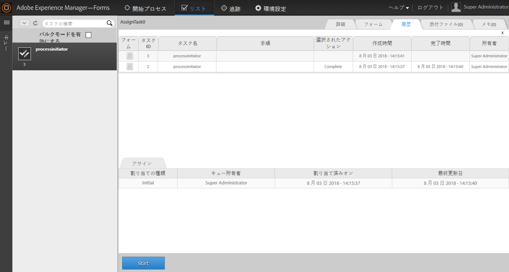

# AEM Forms Workspace における既存のプロセスデータを使用した新しいプロセスの開始 {#initiating-a-new-process-with-existing-process-data-in-aem-forms-workspace}

>[!CAUTION]
>
>AEM 6.4 の拡張サポートは終了し、このドキュメントは更新されなくなりました。 詳細は、 [技術サポート期間](https://helpx.adobe.com/jp/support/programs/eol-matrix.html). サポートされているバージョンを見つける [ここ](https://experienceleague.adobe.com/docs/?lang=ja).

既存のプロセスデータのデータを使用して、新しいプロセスを開始できます。 既存のプロセスデータから新しいプロセスを開始する必要が生じるのは、同じフォームを頻繁に使用し、有料タイムオフフォームのようなコンテンツの変更がほとんどない場合です。 この機能により、特にプロセスに記入に時間がかかる場合に、ユーザーの時間と労力を節約できます。

既存のプロセスデータから新しいプロセスを開始する手順は次のとおりです。

1. 次のいずれかの操作を実行します。

   * 「トラッキング」で、使用するデータのプロセスインスタンスをクリックします。 右側のウィンドウの「Process History」ビューで、開始点に対応するタスク行をクリックします。
   * 「追跡」で、プロセスインスタンスのリストを表示する検索テンプレートを選択します。 使用するデータのインスタンスを選択します。
   * 内 **[!UICONTROL TODO]** タブで、タスクを選択します。 次をクリック： **[!UICONTROL 履歴]** 「 」タブをクリックし、プロセスインスタンスを開始したタスクを選択します。

    

1. 「タスクアクション」ツールバーで、「**[!UICONTROL 開始]**」をクリックします。データが事前入力された新しいプロセスインスタンスのアダプティブフォームが表示されます。

1. 必要に応じてデータを更新し、「**[!UICONTROL 完了]**」またはフォーム上の適切なボタンをクリックします。
