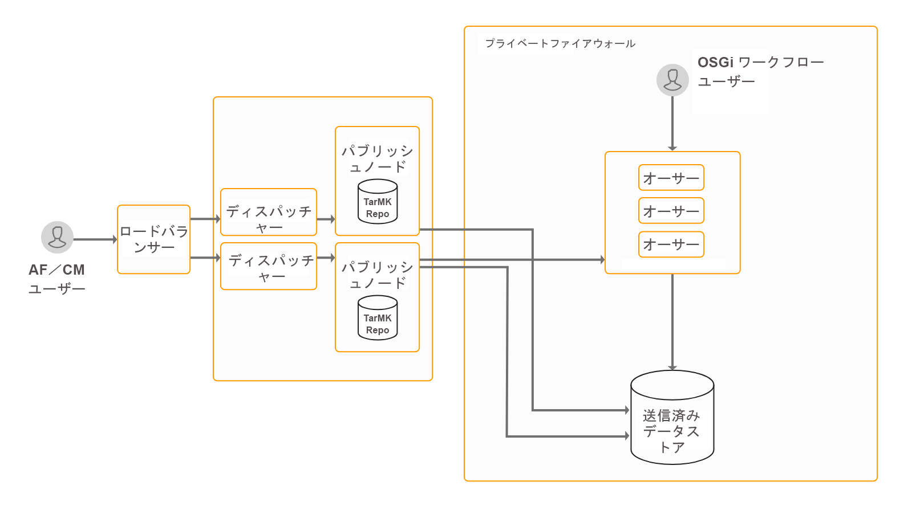

# データ取得機能をインストールして設定する {#install-and-configure-data-capture-capabilities}

アダプティブフォーム、PDF forms、HTML5 Formsをインストールして設定します。 アダプティブフォーム用にAdobe AnalyticsとAdobe Targetを設定し、フォームの使用状況を分析し、ユーザーのプロファイルに基づいてターゲットを設定します。

## はじめに {#introduction}

AEM Formsは、エンドユーザーからデータを取得するための一連のフォームを提供します。アダプティブフォーム、HTML5 FormsおよびPDF forms。 また、Web ページ上の使用可能なすべてのフォームを一覧表示し、フォームの使用状況を分析し、ユーザーのプロファイルに基づいてユーザーをターゲットにするためのツールも提供します。 これらの機能は、AEM Formsアドオンパッケージに含まれています。 アドオンパッケージは、AEMのオーサーインスタンスまたはパブリッシュインスタンスにデプロイされます。

**アダプティブフォーム：** これらのフォームは、デバイスの画面サイズに応じて外観を変更し、魅力的でインタラクティブです。 アダプティブFormsは、Adobe Analytics、Acrobat Sign、Adobe Targetとも統合できます。 これにより、デモグラフィやその他の機能に基づいて、パーソナライズされたフォームやプロセス指向のエクスペリエンスをユーザーに提供できます。 また、アダプティブフォームをAcrobat Signと統合することもできます。

**PDF forms** は、ピクセルパーフェクトな印刷およびPDFドキュメント内のデジタル情報のキャプチャに適しています。 デジタルアバターでは、Adobe AcrobatまたはAcrobat Readerを使用してこれらのフォームに入力できます。 これらのフォームを Web サイト上でホストすることも、フォームポータルを使用してAEMサイト上で一覧表示することもできます。 また、これらのフォームを添付ファイルとして他のユーザーに電子メールで送信することもできます。 これらのフォームは、デスクトップ環境に最適です。

**HTML5 Forms** は、ブラウザーに適したバージョンのPDF formsです。 HTML5 Formsは、PDFプラグインをサポートしない環境に適しています。 HTML5 Formsを使用すると、XFA ベースのPDFがサポートされていないモバイルデバイスおよびデスクトップブラウザーでの XFA ベースのフォームのレンダリングが可能になります。 これらのフォームは、タブレットとデスクトップ環境に最適です。

AEM Formsは強力なエンタープライズクラスのプラットフォームであり、データキャプチャ ( アダプティブフォーム、PDF forms、HTML5 Forms) はAEM Formsの機能の 1 つに過ぎません。 機能の完全な一覧については、「[AEM Forms の概要](/help/forms/using/introduction-aem-forms.md)」を参照してください。

## デプロイメントトポロジ {#deployment-topology}

AEM Formsアドオンパッケージは、AEMにデプロイされたアプリケーションです。 AEM Formsのデータキャプチャ機能を実行するには、少なくとも 1 つの AEM オーサーインスタンスと AEM パブリッシュインスタンスのみが必要です。 AEM Forms AEM Formsのデータキャプチャ機能を実行する場合は、次のトポロジをお勧めします。 トポロジーについて詳しくは、「[AEM Forms のアーキテクチャとデプロイメントトポロジー](/help/forms/using/aem-forms-architecture-deployment.md)」を参照してください。



## システム要件 {#system-requirements}

データキャプチャ機能のインストールと設定を開始する前に、AEM Formsで以下を確認してください。

* ハードウェアとソフトウェアのインフラが正しく設定されていること。サポート対象のハードウェアとソフトウェアの一覧について詳しくは、「[技術要件](/help/sites-deploying/technical-requirements.md)」を参照してください。

* AEMインスタンスのインストールパスに空白が含まれていません。
* AEMインスタンスが起動し、実行中です。 AEM の用語では、「インスタンス」とは、サーバー上でオーサーモードまたはパブリッシュモードで実行されている AEM のコピーのことです。少なくとも 2 つ必要です [AEMインスタンス（1 つのオーサーと 1 つのパブリッシュ）](/help/sites-deploying/deploy.md) AEM Formsのデータキャプチャ機能を実行するには：

   * **作成者**:コンテンツの作成、アップロード、編集、Web サイトの管理に使用されるAEMインスタンス。 公開の準備が整ったコンテンツは、パブリッシュインスタンスにレプリケートされます。
   * **公開**:公開されたコンテンツをインターネットまたは内部ネットワーク経由で公開するAEMインスタンス。

* メモリ要件を満たしています。 AEM Forms アドオンパッケージでは、次が必要です。

   * 15 GB の一時領域 (Microsoft Windows ベースのインストール用 )
   * Unix ベースのインストールの場合、6 GB の一時的な空きスペースが必要です。

* オーサーインスタンスとパブリッシュインスタンスのレプリケーションとリバースレプリケーションが設定されている。 詳しくは、 [レプリケーション](/help/sites-deploying/replication.md).
* UNIX ベースのシステムの追加要件：UNIX ベースのオペレーティングシステムを使用している場合は、各オペレーティングシステムのインストールメディアから次のパッケージをインストールします。

<table> 
 <tbody> 
  <tr> 
   <td>expat</td> 
   <td>libxcb</td> 
   <td>freetype</td> 
   <td>libXau</td> 
  </tr> 
  <tr> 
   <td>libSM</td> 
   <td>zlib</td> 
   <td>libICE</td> 
   <td>libuuid</td> 
  </tr> 
  <tr> 
   <td>glibc</td> 
   <td>libXext</td> 
   <td><p>nss-softokn-freebl</p> </td> 
   <td>fontconfig</td> 
  </tr> 
  <tr> 
   <td>libX11</td> 
   <td>libXrender</td> 
   <td>libXrandr</td> 
   <td>libXinerama</td> 
  </tr> 
 </tbody> 
</table>

## AEM Forms アドオンパッケージのインストール {#install-aem-forms-add-on-package}

AEM Formsアドオンパッケージは、AEMにデプロイされたアプリケーションです。 このパッケージには、AEM Formsデータキャプチャおよびその他の機能が含まれています。 次の手順を実行してアドオンパッケージをインストールします。

1. [ソフトウェア配布](https://experience.adobe.com/downloads)を開きます。ソフトウェア配布にログインするには、Adobe ID が必要です。
1. ヘッダーメニューで「**[!UICONTROL Adobe Experience Manager]**」をタップします。
1. 内 **[!UICONTROL フィルター]** セクション：
   1. 選択 **[!UICONTROL Forms]** から **[!UICONTROL 解決策]** 」ドロップダウンリストから選択できます。
   2. パッケージのバージョンとタイプを選択します。「**[!UICONTROL ダウンロードを検索]**」オプションを使用して結果をフィルターすることもできます。
1. お使いのオペレーティングシステムに適したパッケージの名前をタップし、「**[!UICONTROL EULA 利用規約に同意する]**」を選択して、「**[!UICONTROL ダウンロード]**」をタップします。
1. [パッケージマネージャー](https://experienceleague.adobe.com/docs/experience-manager-65/administering/contentmanagement/package-manager.html?lang=ja)を開き、「**[!UICONTROL パッケージをアップロード]**」をクリックしてパッケージをアップロードします。
1. パッケージを選択して「**[!UICONTROL インストール]**」をクリックします。

   [AEM Forms リリース](https://helpx.adobe.com/jp/aem-forms/kb/aem-forms-releases.html)の記事に記載されている直接リンクからパッケージをダウンロードすることもできます。

1. パッケージのインストールが完了したら、AEM インスタンスを再起動するよう指示されます。**すぐにサーバーを再起動しないでください。** AEM Forms サーバーを停止する前に、ServiceEvent REGISTERED メッセージと ServiceEvent UNREGISTERED メッセージが [AEM-Installation-Directory]/crx-quickstart/logs/error.log ファイルに表示されなくなり、このログファイルが安定した状態になるまで待ってください。
1. 手順 1 から 7 を、すべてのオーサーインスタンスとパブリッシュインスタンスで繰り返します。

## インストール後の設定 {#post-installation-configurations}

AEM Formsには、いくつかの必須およびオプションの設定があります。 必須の設定には、BouncyCastle ライブラリの設定やシリアル化エージェントの設定が含まれます。 オプションの設定には、Dispatcher、Forms Portal、Acrobat Sign、Adobe Analytics、Adobe Targetの設定が含まれます。

### 必須のインストール後の設定 {#mandatory-post-installation-configurations}

#### RSA ライブラリと BouncyCastle ライブラリの設定  {#configure-rsa-and-bouncycastle-libraries}

これらのライブラリを起動するには、すべてのオーサーインスタンスとパブリッシュインスタンスで次の手順を実行します。 

1. 基になる AEM インスタンスを停止します。
1. 編集用に [AEM インストールディレクトリ ]\crx-quickstart\conf\sling.properties ファイルを開きます。

   [AEM インストールディレクトリ ]\crx-quickstart\bin\start.bat を使用して AEM を起動する場合は、[AEM ルート ]\crx-quickstart\ にある sling.properties を編集してください。

1. 次のプロパティを sling.properties ファイルに追加します。

   ```
   sling.bootdelegation.class.com.rsa.jsafe.provider.JsafeJCE=com.rsa.*
   sling.bootdelegation.class.org.bouncycastle.jce.provider.BouncyCastleProvider=org.bouncycastle.*
   ```

1. （AIX のみ）以下のプロパティを sling.properties ファイルに追加します。

   ```
   sling.bootdelegation.xerces=org.apache.xerces.*
   ```

1. ファイルを保存して閉じ、AEM インスタンスを起動します。
1. 手順 1 ～ 4 を、すべてのオーサーインスタンスとパブリッシュインスタンスで繰り返します。

#### シリアル化エージェントの設定 {#configure-the-serialization-agent}

このパッケージを許可リストに加えるには、オーサーインスタンスとパブリッシュインスタンスの両方で以下の手順を実行します。

1. ブラウザーウィンドウで、AEM Configuration Manager を開きます。デフォルトの URL は `https://[server]:[port]/system/console/configMgr` です。
1. **[!UICONTROL デシリアライゼーションファイアウォール設定]**&#x200B;を検索して開きます。
1. **[!UICONTROL sun.util.calendar]** パッケージを「**[!UICONTROL 許可リストに加える]**」フィールドに追加します。「**[!UICONTROL 保存]**」をクリックします。
1. 手順 1 ～ 3 を、すべてのオーサーインスタンスとパブリッシュインスタンスで繰り返します。

### インストール後のオプション設定 {#optional-post-installation-configurations}

#### Dispatcher の設定 {#configure-dispatcher}

Dispatcher は、AEMのキャッシュおよびロードバランシングツールです。 AEM Dispatcher は、AEMサーバーを攻撃から保護するのにも役立ちます。 エンタープライズクラスの Web サーバーと組み合わせて Dispatcher を使用することで、AEMインスタンスのセキュリティを強化できます。 [ディスパッチャー](https://helpx.adobe.com/jp/experience-manager/dispatcher/using/dispatcher-configuration.html)を使用する場合は、AEM Forms の次の設定を実行してください。

1. AEM Forms のアクセスの設定：

   dispatcher.any ファイルを編集用に開きます。 フィルターセクションに移動し、次のフィルターをフィルターセクションに追加します。

   `/0025 { /type "allow" /glob "* /bin/xfaforms/submitaction*" } # to enable AEM Forms submission`

   ファイルを保存して閉じます。 フィルターについて詳しくは、 [Dispatcher のドキュメント](https://experienceleague.adobe.com/docs/experience-manager-dispatcher/using/configuring/dispatcher-configuration.html?lang=ja).

1. リファラーフィルターサービスを設定します。

   Apache Felix Configuration Manager に管理者としてログインします。 Configuration Manager のデフォルト URL は `https://[server]:[port_number]/system/console/configMgr` です。**[!UICONTROL Configurations]**&#x200B;メニューで「**[!UICONTROL Apache Sling Referrer Filter]**」を選択します。「Allow Hosts」フィールドで、ディスパッチャーのホスト名を入力してそれをリファラーとして許可し、「**[!UICONTROL 保存]**」をクリックします。URL の形式は、`https://[server]:[port]` です。

#### キャッシュの設定 {#configure-cache}

キャッシュは、データアクセス時間の短縮、待ち時間の短縮、入出力 (I/O) 速度の向上を実現するメカニズムです。 アダプティブフォームのキャッシュには、アダプティブフォームのHTMLコンテンツと JSON 構造のみが保存されます。事前入力されたデータは保存されません。 これにより、アダプティブフォームのレンダリングに要する時間を短縮できます。

* アダプティブフォームのキャッシュを使用する場合は、 [AEM Dispatcher](https://experienceleague.adobe.com/docs/experience-manager-dispatcher/using/configuring/dispatcher-configuration.html?lang=ja) アダプティブフォームのクライアントライブラリ（CSS および JavaScript）をキャッシュする場合。
* カスタムコンポーネントを開発する際は、開発に使用するサーバー上でアダプティブフォームのキャッシュを無効にしておく必要があります。

次の手順を実行してアダプティブフォームのキャッシュを設定します。

1. `https://[server]:[port]/system/console/configMgr` の AEM Web コンソール設定マネージャーに移動します。
1. 「**[!UICONTROL アダプティブフォームおよびインタラクティブ通信 Web チャネルの設定]**」をクリックして、設定値を編集します。設定値を編集ダイアログで、AEM Forms サーバーのインスタンスでキャッシュできるフォームまたはドキュメントの最大数を「**[!UICONTROL アダプティブフォームの数]**」フィールドに指定します。デフォルト値は 100 です。「**[!UICONTROL 保存]**」をクリックします。

   >[!NOTE]
   >
   >キャッシュを無効にするには、「アダプティブフォームの数」フィールドの値を **0** に設定します。キャッシュ設定を無効にしたり変更したりすると、キャッシュがリセットされ、すべてのフォームとドキュメントがキャッシュから削除されます。

#### フォームデータモデル用の SSL 通信の設定 {#configure-ssl-communcation-for-form-data-model}

フォームデータモデルの SSL 通信を有効にできます。 フォームデータモデルの SSL 通信を有効にするには、任意のAEM Formsインスタンスを起動する前に、すべてのインスタンスの Java Trust Store に証明書を追加します。 次のコマンドを実行して証明書を追加することができます。 ``

`keytool -import -alias <alias-name> -file <pathTo .cer certificate file> -keystore <<pathToJRE>\lib\security\cacerts>`

#### Acrobat Signの設定 {#configure-adobe-sign}

Acrobat Signを使用すると、アダプティブフォームの電子署名ワークフローが有効になります。 電子サインを使用すると、法務、販売、給与、人事管理など、様々な分野におけるドキュメント処理ワークフローが改善されます。

一般的なAcrobat Signおよびアダプティブフォームのシナリオでは、ユーザーはアダプティブフォームに入力してサービスを申し込みます。 例えば、クレジットカードの申込フォームや住民サービスフォームなどです。ユーザーが申込フォームに入力、送信、署名すると、フォームがサービスプロバイダーに送信され、さらにアクションが実行されます。 サービスプロバイダーは、申し込みを確認し、Acrobat Signを使用して申し込みを承認済みとマークします。 同様の電子署名ワークフローを有効にするには、Acrobat SignとAEM Formsを統合します。

AEM FormsでAcrobat Signを使用するには、 [Acrobat SignとAEM Formsの統合](/help/forms/using/adobe-sign-integration-adaptive-forms.md).

#### Adobe Analytics の設定 {#configure-adobe-analytics}

AEM Forms は、Adobe Analytics と統合されているため、発行済みのフォームとドキュメントのパフォーマンス指標を取得および追跡できます。これらの指標分析の意図は、フォームやドキュメントをさらに有効利用するために必要な変更に関して十分な情報に基づいた決定を行えるよう支援することです。

AEM Forms で Adobe Analytics を使用するには、「[分析とレポートの設定](/help/forms/using/configure-analytics-forms-documents.md)」を参照してください。

#### Adobe Targetの統合 {#integrate-adobe-target}

顧客は、フォームのエクスペリエンスが魅力的でない場合、フォームを放棄する可能性が高くなります。 顧客にとって不満が生じる一方で、組織のサポート量とコストが増加する可能性もあります。 コンバージョン率を高める適切な顧客体験を特定し提供することは、困難であると同時に重要です。 この問題を解決する鍵はAEM forms にあります。

AEM forms は、Adobe Marketing CloudソリューションであるAdobe Targetと統合して、パーソナライズされた魅力的な顧客体験を複数のデジタルチャネルで提供します。 Adobe Target を A/B テストのアダプティブフォームに対して使用するには、「[Adobe Target を AEM Forms に統合する](/help/forms/using/ab-testing-adaptive-forms.md#setupandintegratetargetinaemforms)」を参照してください。 

## 次の手順 {#next-steps}

AEM Formsのデータキャプチャ機能を使用する環境を設定しました。 この機能を使用するための次の手順は次のとおりです。

* [最初のアダプティブフォームを作成する](/help/forms/using/create-your-first-adaptive-form.md)
* [最初の PDF フォームを作成する](https://helpx.adobe.com/content/dam/help/en/experience-manager/6-4/forms/pdf/designer-quickstart.pdf)
* [HTML5 フォームの概要](/help/forms/using/introduction.md)
