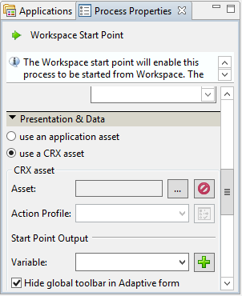
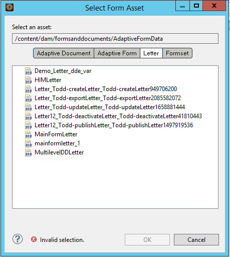
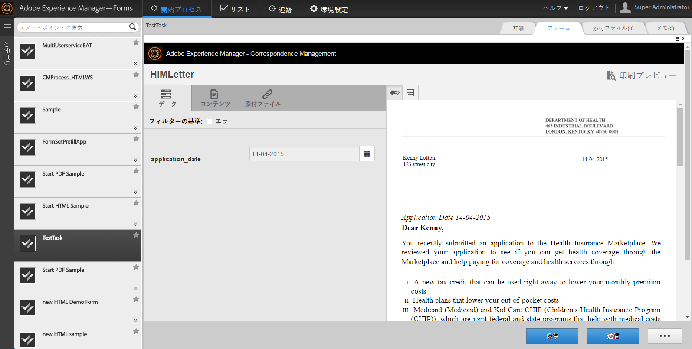

# AEM Forms Workspace でのサードパーティアプリケーションの統合 {#integrating-third-party-applications-in-aem-forms-workspace}

AEM Forms workspace は、フォームとドキュメントのタスクの割り当てと完了アクティビティの管理をサポートしています。 これらのフォームとドキュメントは、XDP、PDF、HTML、Flexの各形式でレンダリングされた XDP Forms、Flex®フォーム、または Guide （非推奨）にすることができます。

これらの機能はさらに強化されています。 AEM Formsは、AEM Forms workspace と同様の機能をサポートするサードパーティアプリケーションとのコラボレーションをサポートするようになりました。 この機能の共通の部分は、割り当てのワークフローとタスクの後続の承認です。 AEM Formsは、AEM Formsのエンタープライズユーザーに対して単一の統合されたエクスペリエンスを提供し、サポートされるアプリケーションのタスクの割り当てや承認をすべてAEM Forms workspace で処理できるようにします。

例として、AEM Forms Workspace との統合にサンプル候補として Correspondence Management を考慮してみましょう。Correspondence Management には、「レター」という概念があります。レターをレンダリングし、レターに対してアクションを実行できます。

## Correspondence Management アセットの作成 {#create-correspondence-management-assets}

まず、AEM Forms Workspace にレンダリングされたサンプル Correspondence Management テンプレートを作成します。詳しくは、[レターテンプレートを作成](/help/forms/using/create-letter.md)を参照してください。

Correspondence Management テンプレートにその URL でアクセスして Correspondence Management テンプレートが正常にレンダリングすることができるかどうか確認します。URL は `https://[server]:[port]/lc/content/cm/createcorrespondence.html?cmLetterId=encodedLetterId&cmUseTestData=1&cmPreview=0;` のようなパターンを持っています。

ここで、`encodedLetterId` は URL エンコードされたレター ID です。Workbench でワークスペースタスクのレンダリングプロセスを定義する際には、同じ文字 ID を指定します。

## レターをレンダリングしてAEM Workspace で送信するタスクを作成します {#create-a-task-to-render-and-submit-a-letter-in-aem-workspace}

これらの手順を実行する前に、次のグループのメンバーであることを確認します。

* cm-agent-users
* Workspace ユーザー

詳しくは、 [ユーザーの追加と設定](/help/forms/using/admin-help/adding-configuring-users.md).

次の手順を使用して、AEM Workspace でレターをレンダリングして送信するタスクを作成します。

1. Workbench を起動します。 管理者として localhost にログインします。
1. File / New / Application をクリックします。 アプリケーション名フィールドで、`CMDemoSample` を入力して「終了」をクリックします。
1. 「`CMDemoSample/1.0`」を選択して、「`NewProcess`」を右クリックします。名前フィールドで、`CMRenderer` を入力して「終了」をクリックします。
1. Start Point アクティビティピッカーをドラッグして設定します。

   1. 「プレゼンテーションデータ」で、「CRX アセットを使用」を選択します。

      

   1. アセットを参照します。 フォームアセットを選択ダイアログの「レター」タブに、サーバー上のすべてのレターが表示されます。

      

   1. 適切なレターを選択して、「**OK**」をクリックします。

1. 「アクションプロファイルの管理」をクリックします。 Manage Action Profile ダイアログが表示されます。 「Render Process」と「Submit Process」が適切に選択されていることを確認します。
1. データ XML ファイルを使用してレターを開くには、データ準備プロセスで適切なデータファイルを参照して選択します。
1. 「OK」をクリックします。
1. スタートポイント出力とタスク添付ファイルの変数を定義します。 定義した変数には、Start Point Output とタスクの添付ファイルのデータが格納されます。
1. （オプション）ワークフローに別のユーザーを追加するには、アクティビティピッカーをドラッグして設定し、ユーザーに割り当てます。 カスタムラッパー（以下のサンプル）を作成するか、DSC（以下に示す）をダウンロードしてインストールし、レターテンプレート、スタートポイント出力、タスク添付を抽出します。

   カスタムラッパーの例を次に示します。

   ```java
   public LetterInstanceInfo getLetterInstanceInfo(Document dataXML) throws Exception {
   try {
   if(dataXML == null)
   throw new Exception("dataXML is missing");
   
   CoreService coreService = getRemoteCoreService();
   if (coreService == null)
   throw new Exception("Unable to retrive service. Please verify connection details.");
   Map<String, Object> result = coreService.getLetterInstanceInfo(IOUtils.toString(dataXML.getInputStream(), "UTF-8"));
   LetterInstanceInfo letterInstanceInfo = new LetterInstanceInfo();
   
   List<Document> attachmentDocs = new ArrayList<Document>();
   List<byte[]> attachments = (List<byte[]>)result.get(CoreService.ATTACHMENT_KEY);
   if (attachments != null){
   for (byte[] attachment : attachments)
   { attachmentDocs.add(new Document(attachment)); }
   
   }
   letterInstanceInfo.setLetterAttachments(attachmentDocs);
   
   byte[] updateLayout = (byte[])result.get(CoreService.LAYOUT_TEMPLATE_KEY);
   if (updateLayout != null)
   { letterInstanceInfo.setLetterTemplate(new Document(updateLayout)); }
   
   else
   { throw new Exception("template bytes missing while getting Letter instance Info."); }
   
   return letterInstanceInfo;
   } catch (Exception e)
   { throw new Exception(e); }
   
   }
   ```

   [ファイルを入手](assets/dscsample.zip)`DSCSample.zip`
DSC をダウンロード：DSC のサンプルは上記に添付されている ファイルの中にあります。をダウンロードして展開します。 `DSCSample.zip` ファイル。 DSC サービスを使用する前に、DSC サービスを設定する必要があります。 詳しくは、[DSC サービスを設定](/help/forms/using/add-action-button-in-create-correspondence-ui.md#p-configure-the-dsc-service-p)を参照してください。

   「アクティビティを定義」ダイアログで、適切なアクティビティ（例： getLetterInstanceInfo ）を選択し、「 **OK**.

1. アプリケーションをデプロイします。 アセットをチェックインして保存するように求められた場合は、
1. 次の場所にあるAEM forms workspace にログインします。 `https://[server]:[port]/lc/content/ws`.
1. 追加したタスク CMRenderer を開きます。 Correspondence Management レターが表示されます。

   

1. 必要なデータを入力してレターを送信します。ウィンドウが閉じます。このプロセスでは、手順 9 のワークフローで指定されたユーザーにタスクが割り当てられます。

   >[!NOTE]
   >
   >「送信」ボタンは、レター内の必要な変数がすべて入力されるまで有効になりません。
