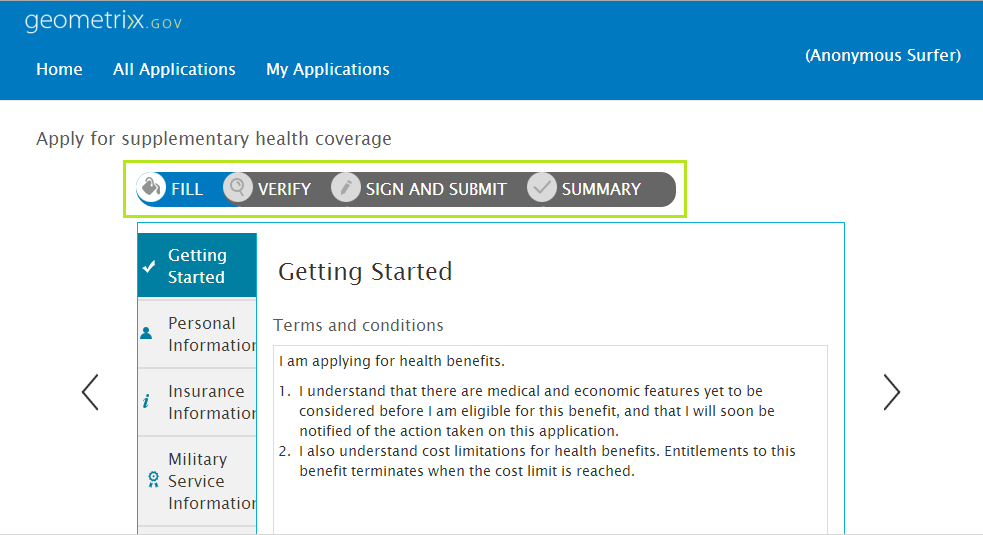

# 複数手順フォームシーケンスの概要 {#introduction-to-multi-step-form-sequence}

>[!CAUTION]
>
>AEM 6.4 の拡張サポートは終了し、このドキュメントは更新されなくなりました。 詳細は、 [技術サポート期間](https://helpx.adobe.com/jp/support/programs/eol-matrix.html). サポートされているバージョンを見つける [ここ](https://experienceleague.adobe.com/docs/?lang=ja).

アダプティブフォームを使用すると、フォーム作成者は、複数手順のデータキャプチャの操作を非常に簡単に作成できます。 複数パネルの作成や、各パネルと別の移動パターンとの関連付けに対する組み込みサポートが付属しています。フォーム作成者は、フォームフィールドを論理セクションにグループ化し、グループをパネルとして表すことができます。 パネル間の移動はすべてパネルレイアウトを使用して制御されます。作成者は、様々なレイアウトでパネルを配置できます。例えば、ウィザードレイアウトで順番に配置することも、タブ付きレイアウトを使って臨時に配置することもできます。パネルレイアウトについて詳しくは、 [アダプティブフォームのレイアウト機能](/help/forms/using/layout-capabilities-adaptive-forms.md).

一般的なフォームの記入では、データを取得する以上に、関連する多くのステップがあります。完全なフォーム送信ステップには、フォームへの電子署名、フォームに入力した情報の検証、支払い処理など、その他のステップが含まれる場合があります。場合によって異なります。

データの取得に一連の手順が必要な場合や、規制に応じて特定の手順を実行する必要がある場合は、AEM Formsを使用すると、フォーム全体でその共通の構造を強制的に適用できます。 フォーム構造の実装を事前に計画して、フォームのステップのシーケンスを定義します。

フォームの入力、検証、署名、確認の手順のシーケンスを作成する必要がある使用例を見てみましょう。 このようなシーケンスを作成する手順は次のとおりです。

1. フォームテンプレートを定義し、それに必要なパネルを追加します。 シーケンス内の各ステップに対して 1 つのパネルが存在することに注意してください。 ただし、パネル内にサブパネルを含めることはできます。

   この例では、次のパネルを追加できます。

   * **塗り**:データを取得するためのフォームフィールドが含まれます。 ここではネストされたサブパネルを追加して、さまざまな種類の情報（個人、家族、財務など）のセクションを作成できます。
   * **検証**：XFA ベースのアダプティブフォームで使用できる&#x200B;**検証**&#x200B;コンポーネントが含まれます。入力パネルで取得した情報を検証するため、読み取り専用モードで表示します。
   * **E 署名**：XFA ベースのアダプティブフォームで使用できる&#x200B;**署名**&#x200B;コンポーネントが含まれます。次の署名サービスを提供します。

      * Adobe Document Cloud 電子サインサービス
      * 手書き署名
   * **確認**：ユーザーがフォームに署名してシーケンスの確認（概要）段階に到達したときにフォーム送信の確認メッセージを表示する&#x200B;**概要**&#x200B;コンポーネントが含まれます。作成者は概要コンポーネントのテキストの構成、お礼のメッセージの表示、生成された PDF へのリンクの表示などを設定できます。

1. root パネルのレイアウトを **[!UICONTROL ウィザード]** として選択します。
1. 残りの手順を実行して、フォームテンプレートを作成します。 詳しくは、 [カスタムアダプティブフォームテンプレートの作成](/help/forms/using/custom-adaptive-forms-templates.md).

フォームテンプレートでフォームのシーケンスを定義したら、そのテンプレートを使用して、適切なシーケンスで定義した基本構造を持つフォームを作成できます。フォームはいつでも要件に合わせてカスタマイズできます。
