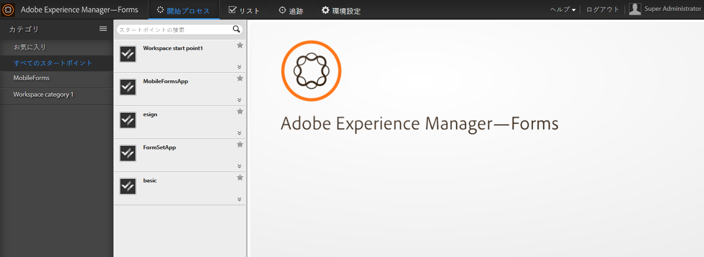

# AEM Forms Workspace の概要 {#introduction-to-aem-forms-workspace}

>[!CAUTION]
>
>AEM 6.4 の拡張サポートは終了し、このドキュメントは更新されなくなりました。 詳細は、 [技術サポート期間](https://helpx.adobe.com/jp/support/programs/eol-matrix.html). サポートされているバージョンを見つける [ここ](https://experienceleague.adobe.com/docs/?lang=ja).

Formsのワークフローは、自動化を行い、重要なドキュメントやフォーム関連のビジネスプロセスを可視化することで、組織の効率を高めます。 Process Management モジュールを使用すると、オンラインまたはオフラインでアクセス可能な、合理化されたエンドツーエンドのワークフロー（人、システム、コンテンツ、ビジネスルールなど）を構築できます。Forms Workflow には、AEM Forms Workspace が含まれます。 AEM Forms workspace には、workspace を拡張および統合し、より使いやすくする新しい機能が追加されています。

AEM Forms Workspace はより多くのデバイスやフォームファクターと互換性があります。Flash® Player と Adobe® Reader® を使用しなくてもクライアントでタスク管理が可能です。PDF formsに加えて、HTMLFormsのレンディションを容易にします。

**主な機能**:

* プロセスの参加者は、動的なPDF forms、モバイルインターフェイス、Web アプリケーションを利用して、あらゆる場所でエンゲージメントをおこないます。
* Workspace コンポーネントを Web アプリケーションと簡単に統合できます。 AEM Forms Workspace は容易にカスタマイズや再利用が可能なコンポーネントベースのソフトウェアです。
* AEM Forms Workspace アプリを使用して、オンラインとオフラインの両方のモバイルワーカーに対するビジネスプロセスを拡張します。
* レポートを表示してバックログ、作業クエリ、KPIs (key performance indicators)をモニタリングします。API を使用すると、サードパーティのレポートツールを使用して、さらに分析するためのデータを抽出できます。
