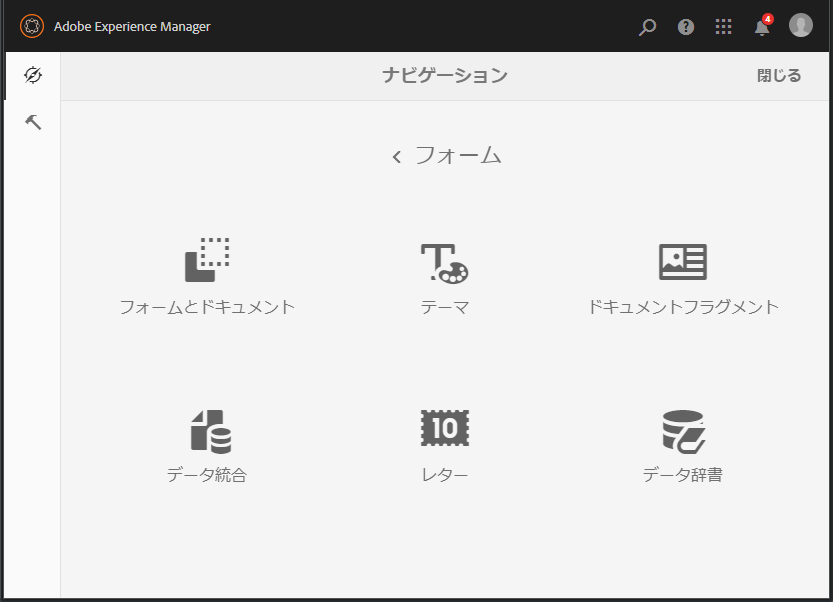
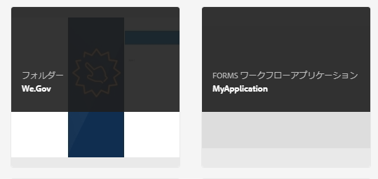
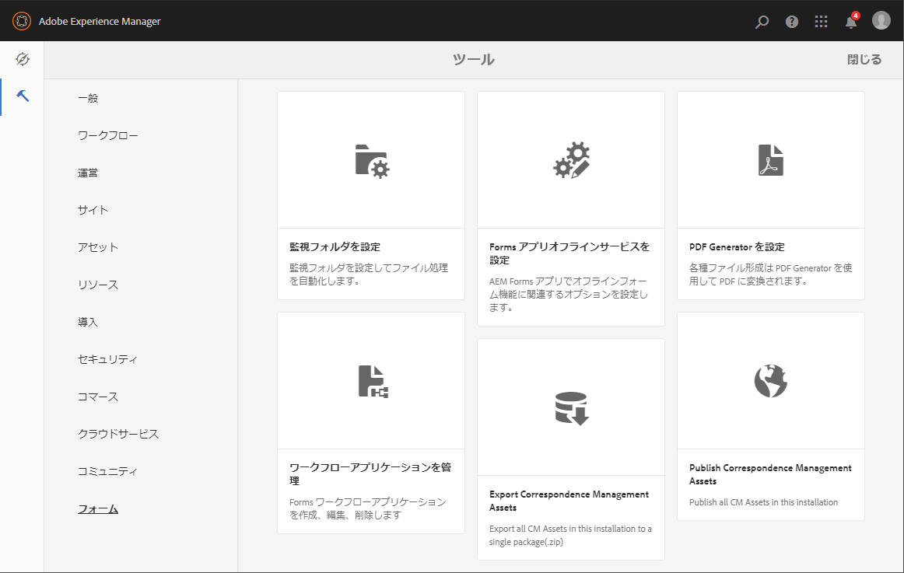

# フォーム管理の概要 {#introduction-to-managing-forms}

AEM Formsは、フォーム、ドキュメント、テーマ、レター、ドキュメントフラグメント、データ辞書、関連アセットを作成および管理するための、シンプルで強力なユーザーインターフェイスを備えています。 開発者のデスクトップから提供まで、フォーム、ドキュメント、および関連アセットのライフサイクル全体を管理するのに役立ちます。\
エンドユーザー向けのポータルサーバー上にある。 AEM Formsユーザーインターフェイスを使用して、次のことができます。

* AEM Formsコンポーネントへのアクセス
* AEM Forms設定へのアクセス

>[!NOTE]
>
>その他のAEMツールおよびオプションについて詳しくは、 [オーサー環境の使用](/help/sites-authoring/home.md).

## AEM Formsコンポーネントへのアクセス {#access-aem-forms-components}

AEMには、フォーム、ドキュメント、および関連アセットを作成するためのオプションに加えて、サイトの作成、アセットの管理、AEMインスタンスの管理などのオプションも用意されています。  Experience Manager ロゴをクリックすると、使用可能なすべてのツールに移動できます。他のコンポーネントのコンソールへのリンクに加えて、 AEM Formsへのリンクも含まれます。 AEM Formsに移動するには、 **Experience Managerロゴ**  > **ナビゲーション**  > **Forms**. 次のコンソールのリンクが表示されます。

* フォームとドキュメント
* テーマ
* レター
* ドキュメントフラグメント
* データディクショナリ

### フォームとドキュメント  {#forms-documents}

Forms &amp; Documents には、インタラクティブ通信、アダプティブフォーム、アダプティブフォームフラグメント、フォームセットを作成するためのオプションが用意されています。 JEE 上のAEM Formsの場合のみ、Formsとドキュメントには、ローカルストレージからファイルを読み込み、AEM Formsのアセットを Workbench に同期するオプションが用意されています。

「作成」ボタンは、AEM Formsアセットの作成またはアップロードのプロセスの開始点です。 次の項目を作成するためのオプションが用意されています。

* **インタラクティブ通信**：インタラクティブ通信は、パーソナライズされ、デバイスで使いやすい HTML ベースのインタラクティブなデジタルの通信、取引明細、ドキュメントを示します。インタラクティブ通信はレスポンシブな特性を持っているため、使用するデバイスや設定に応じて、レイアウトとデザインが自動的に変わります。詳しくは、[インタラクティブ通信の概要](/help/forms/using/interactive-communications-overview.md)を参照してください。。

* **アダプティブフォーム：**&#x200B;アダプティブフォームは、魅力的でレスポンシブなフォームです。アダプティブフォームをオーサリングし、ユーザーの応答、デバイスまたは作業環境に基づいてフォームのセクションを追加または削除して、ユーザーの入力に動的に対応することができます。アダプティブフォームについて詳しくは、[アダプティブフォームの作成について](/help/forms/using/introduction-forms-authoring.md)を参照してください。

* **アダプティブフォームフラグメント：** 各フォームは特定の目的のために設計されていますが、ほとんどのフォームには、名前や住所、家族の詳細、収入の詳細などの個人の詳細を提供するセグメントなど、一般的なセグメントがあります。 このようなセクション用に個々のアセットを作成できます。 これらの再利用可能なスタンドアロンのセグメントを、アダプティブフォームフラグメントと呼びます。詳しくは、[アダプティブフォームフラグメント](/help/forms/using/adaptive-form-fragments.md)を参照してください。

* **フォームセット：** フォームセットは、1 つにグループ化され、エンドユーザーに対して 1 つのフォームのセットとして提供されるHTML5 のフォームの集まりです。 エンドユーザーがフォームセットの入力を開始すると、フォームはフォーム間をシームレスに移行します。 最終的に、ユーザーはワンクリックですべてのフォームを単一のエンティティとして送信することができます。詳しくは、[AEM Forms におけるフォームセット](/help/forms/using/formset-in-aem-forms.md)を参照してください。

* **フォルダー：** AEM Formsのユーザーインターフェイスでは、フォルダーを使用してアセットを整理します。 サポートされているフォルダーは 2 種類あります。

   * **一般フォルダ：** これらのフォルダーは、AEM Formsユーザーインターフェイスで作成されたアセットに対して使用されます。 これらのフォルダーには、厳密なフォルダー構造はありません。これらのフォルダーでは、フォルダー名の変更とサブフォルダーの作成を行うことができます。また、アダプティブフォーム、インタラクティブ通信、アダプティブフォームフラグメント、フォームテンプレート（XDP）、PDF Forms、ドキュメント、関連アセットを、これらのフォルダーに保存することができます。
   * **Forms Workflowフォルダ：** Formsワークフローフォルダーは、Workbench プロセス (LiveCycleアーカイブ ) が移行され、AEM Formsユーザーインターフェイスと同期されるときに作成されます。 このフォルダーの名前を変更することはできません。また、このフォルダー内に、サブフォルダー、インタラクティブ通信、アダプティブフォームフラグメントを作成することはできません。さらに、バージョンフォルダーを削除したり、アダプティブフォーム、アダプティブフォームフラグメント、インタラクティブ通信を同時に作成してバージョンフォルダーにアップロードしたりすることはできません。

**A.** 一般フォルダー **B.** Forms Workflow フォルダー

Formsとドキュメントパネルには、次のオプションも用意されています。

* **ローカルストレージからファイルをインポート：** PDF formsとドキュメント、フォームテンプレート（XFA フォーム）、およびその他のリソース（XSD 用の画像および XML スキーマ）を読み込むことができます。 詳細な手順については、 [AEM Formsへのアセットの読み込みと書き出し](/help/forms/using/import-export-forms-templates.md).

* **AEM Forms Assets と Workbench の同期：** 「 Workbench のファイル」オプションを使用して、AEM Formsユーザーインターフェイスと Workbench の間でアセットを同期することができます。 これにより、すべてのアセットがAEM Formsユーザーインターフェイスと Workbench の crx-repository アセットの選択で使用できるようになります。

### テーマ  {#themes}

テーマには、コンポーネントとパネルのスタイル設定の詳細が含まれます。 テーマには独立した ID があります。 複数のアダプティブフォームで 1 つのテーマを再利用することができます。 コンポーネントのスタイルを指定したり、フォーム全体で使用される様々なコンポーネントの CSS プロパティを変更したりできます。 スタイルには、背景色、状態色、透明度、サイズなどのプロパティが含まれます。 テーマのカスタマイズを保存し、プリセットとしてフォームのコンポーネントに移植することができます。 テーマをフォームに追加すると、指定したスタイルがフォームの対応するコンポーネントに反映されます。 AEM 6.2 Formsでは、テーマを作成してフォームに適用できます。

テーマの作成と使用について詳しくは、 [AEM Formsのテーマ](/help/forms/using/themes.md).

### レター  {#letters}

AEM forms のレターは、安全でパーソナライズされたインタラクティブな通信です。 AEM Formsを使用すると、合理化されたプロセスで、承認済みのコンテンツとカスタム作成のコンテンツの両方から、レター（通信とも呼ばれます）をすばやく組み立てることができます。

レターの作成と使用について詳しくは、 [レターを作成](/help/forms/using/create-letter.md).

### ドキュメントフラグメント {#document-fragments}

ドキュメントフラグメントは、レターを作成できる再利用可能な通信のパーツまたはコンポーネントです。 ドキュメントフラグメントのタイプは、テキスト、リスト、条件、レイアウトフラグメントです。 ドキュメントフラグメントの作成と使用について詳しくは、 [ドキュメントフラグメントの作成](/help/forms/using/document-fragments.md).

### データディクショナリ {#data-dictionaries}

通常、ビジネスユーザーは、XSD（XML スキーマ）や Java クラスなどのメタデータ表現に関する知識は必要ありません。 ただし、通常はソリューションを構築するために、これらのデータ構造や属性へのアクセスが必要となります。AEM Formsではデータディクショナリを使用することで、ビジネスユーザーは、基になるデータモデルの技術的な詳細を把握することなく、バックエンドデータソースの情報を使用できます。

データ要素の作成と使用について詳しくは、[データ要素に関する記事](/help/forms/using/data-dictionary.md)を参照してください。

## AEM Forms Configurations へのアクセス {#accessing-aem-forms-configurations}

AEM ツールパネルには、様々なコンポーネント用のツールが含まれています。AEM Forms固有のツールに移動するには、 **Experience Managerロゴ**  > **ツール**  > **Forms**. 次の機能を実行するツールが表示されます。

* **監視フォルダーを設定：** 管理者は、監視PDFーと呼ばれるネットワークフォルダーを設定できます。これにより、ユーザーが監視フォルダーにファイル（フォルダーファイルなど）を配置すると、事前に設定された操作が開始され、ファイルが操作されます。 <!-- Fix broken link For detailed information, see Create and Configure a watched folder. -->

* **Forms App Offline Service の設定：** AEM Forms App Offline Service は、フォームで使用されるリソースのパスまたは URL をキャッシュします。 フォームで使用されるリソースのパスや URL をキャッシュに保存することで、サーバー側のパフォーマンスが向上します。AEM Forms アプリケーションのサーバーサイドのオフラインコンポーネントを設定するには「[オフラインモードの使用](/help/forms/using/work-offline-mode.md)」を参照してください。

* **PDFジェネレータの設定：** 管理者は、AEM FormsPDFジェネレーターの設定、ユーザーアカウントの追加、PDFジェネレーターへの設定の読み込みまたは書き出しをおこなうことができます。
* **Correspondence Management アセットを発行：** AEM Formsでは、すべてのレター、ドキュメントフラグメント、データ辞書および関連する依存関係を、1 つのオーサーインスタンスから一度に公開できます。 公開済みのアセットには、すべての Correspondence Management アセットと関連する依存性が含まれます。詳しくは、[フォームとドキュメントの公開と非公開](/help/forms/using/publishing-unpublishing-forms.md#publishallthecorrespondencemanagementassets)を参照してください。
* **Correspondence Management アセットを書き出し：** すべての Correspondence Management アセットと関連する依存関係を、AEM forms インスタンスからパッケージとしてダウンロードできます。 手順について詳しくは、[AEM Forms におけるアセットのインポートとエクスポート](/help/forms/using/import-export-forms-templates.md#importandexportassetsincorrespondencemanagement)を参照してください。

## 共通のユーザーインターフェイス要素 {#commonelements}

* **左レール：** 左側のパネルアイコン  :AEM Formsのタイムラインおよび参照機能を表示します。

   * **タイムライン：**&#x200B;タイムラインで確認可能なアセットに対して、コメントを追加して表示できます。手順について詳しくは、[フォームのアセットのレビューの作成と管理](/help/forms/using/create-reviews-forms.md)を参照してください。
   * **参照：** 1 つのAEM Formsアセットを複数のAEM Formsアセットで使用できます。 例えば、1 つのドキュメントフラグメントを複数のレターで使用できます。参照は、選択したアセットを使用しているアセット（他のフォームまたはリソース）のリストであり、選択したアセットが使用している他のアセットのリストでもあります。

* **パンくずリスト：** パンくずは、現在のコンソールまたはフォルダーのタイトルを表します。 「パンくず」オプションをクリックして、階層の上位にあるフォルダーのレベル間を移動できます。
* **表示切り替え：**「表示切り替え」アイコン  または  をクリックすると、リスト表示とカード表示をすばやく切り替えることができます。一般的なユーザーインターフェイスコンポーネントについて詳しくは、 [オーサー環境の使用](/help/sites-authoring/basic-handling.md).
* **検索：**&#x200B;検索オプション  を使用すると、必要なコンテンツとツールをすばやく見つけて移動できます。コンテンツまたは製品機能の名前を入力し、提案から選択します。例えば、「ドキュメント」と入力すると、フォームとドキュメントコンソールやドキュメントフラグメントコンソールをすばやく見つけて移動できます。検索について詳しくは、AEM 6.2 の[検索](/help/sites-authoring/search.md)に関する記事を参照してください。
* **アクションツールバー**:アセットを選択すると、アセットのリストの上にアクションツールバーが表示されます。 選択したアセットのすべての管理ツールが含まれます。 「ツール」アイコンの上にマウスを移動すると、その機能を説明するツールヒントが表示されます。

>[!NOTE]
>
>ユーザーがFormsとドキュメントの任意のコンソールを検索すると、レールには **フィルターおよびオプション**. フィルターおよびオプションを使用して、詳細検索を実行できます。

* **アクションツールバー**:アセットを選択すると、アセットのリストの上にアクションツールバーが表示されます。 選択したアセットのすべての管理ツールが含まれます。 「ツール」アイコンの上にマウスを移動すると、その機能を説明するツールヒントが表示されます。

