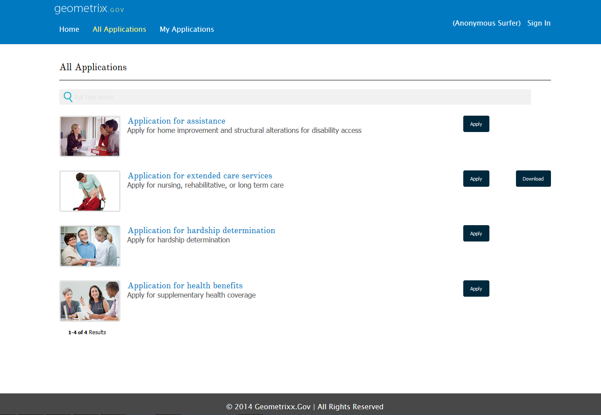

# ポータル上のフォーム発行の概要 {#introduction-to-publishing-forms-on-a-portal}

## AEM Forms portal コンポーネントの概要 {#aem-forms-portal-components-overview}

一般的なフォーム中心のポータルデプロイメントシナリオでは、フォーム開発とポータル開発が 2 つの異なるアクティビティになります。 フォームデザイナーがフォームを設計してリポジトリに保存する一方、Web 開発者はフォームを一覧表示し、フォームの送信を処理する Web アプリケーションを作成します。 Formsは、フォームリポジトリと Web アプリケーションの間で通信がおこなわれないので、Web 層にコピーされます。

このようなシナリオは、多くの場合、管理上の問題と生産の遅延を引き起こします。 例えば、リポジトリに新しいバージョンのフォームがある場合、Web 層でフォームを置き換え、Web アプリケーションを変更し、パブリックサイトでフォームを再デプロイする必要があります。 Web アプリケーションを再デプロイすると、サーバーのダウンタイムが発生する場合があります。 通常、サーバーのダウンタイムは計画的なアクティビティなので、変更を瞬時に公開サイトにプッシュすることはできません。

AEM Formsは、管理のオーバーヘッドと実稼動の遅延を軽減するポータルコンポーネントを提供します。 このコンポーネントにより、Web 開発者は、Adobe Experience Manager(AEM) を使用して作成された Web サイトでフォームポータルを作成し、カスタマイズできます。

フォームポータルコンポーネントを使用すると、次の機能を追加できます。

* カスタマイズしたレイアウトでフォームを一覧表示します。リスト表示、カード表示、パネル表示のレイアウトが標準で用意されています。 独自のカスタムレイアウトを作成できます。
* リスト表示時にカスタムメタデータとカスタムアクションを表示できます。
* フォームポータルコンポーネントを使用しているパブリッシュインスタンス上の AEM Forms UI が発行したフォームを一覧表示します。
* HTML 形式および PDF 形式でフォームをレンダリングできるようにします。 
* カスタム HTML プロファイルを使用してフォームをレンダリングします。
* 様々な検索条件（フォームプロパティ、メタデータ、タグなど）に基づいたフォームの検索を有効にします。 
* フォームデータをサーブレットに送信します。
* カスタム CSS を使用してポータルのルックアンドフィールをカスタマイズします。 
* フォームへのリンクを作成します。
* エンドユーザーが作成したアダプティブフォームに関連するドラフトと送信を一覧表示します。

## 使用可能なAEM Formsポータルコンポーネント {#available-aem-forms-portal-components}

AEM Forms は次の標準ポータルコンポーネントを、**Document Services** および **Document Services Predicates** コンポーネントグループの下にグループ化して提供します。

### 検索とリスター {#search-amp-lister}

Search &amp; Lister コンポーネントを使用すると、フォームリポジトリからポータルページにフォームを一覧表示でき、指定した条件に基づいてフォームを一覧表示するための設定オプションを提供します。 また、検索条件を指定することにより、ポータルユーザーがフォームのリストから検索できるようにします。

### ドラフトと送信 {#drafts-amp-submissions}

Search &amp; Lister コンポーネントには、Formsの作成者が公開したフォームが表示され、Drafts &amp; Submissions コンポーネントには、後で完了するためにドラフトとして保存されたフォームと送信済みのフォームが表示されます。 このコンポーネントは、ログインしたすべてのユーザーに対してパーソナライズされたエクスペリエンスを提供します。

### リンク {#link}

リンクコンポーネントを使用すると、ページの任意の場所にフォームへのリンクを作成できます。 トレーニングプログラムを提供し、ユーザーがフォームを送信してトレーニングに登録したい場合を考えてみましょう。 Web サイトに、プログラムの詳細を投稿しました。 以下に、登録フォームへのリンクを示します。 リンクコンポーネントは、そのリンクの作成に役立ちます。

## フォームポータルのワークフロー {#forms-portal-workflow}

フォームポータルを使用すると、フォームリポジトリからポータルページにフォームを一覧表示できます。また、検索条件を指定することにより、ポータルユーザーがフォームのリストから検索できるようにします。また、ドラフトと送信コンポーネントを使用して、後で完成させるためにドラフトとして保存されたフォームや送信済みのフォームを表示することもできます。これらの機能を Sites ページで使用するには、一連の操作を実行する必要があります。リストに表示された順序で手順を実行して、コンポーネントと各機能をサイトページで使用できるようにします。

1. **フォームポータルコンポーネントを有効にする**：標準提供のフォームポータルコンポーネントは使用できません。AEM Sites ページ用に [AEM サイドキックからコンポーネントを有効にします](/help/forms/using/enabling-forms-portal-components.md)。
1. **ページ上のフォームを一覧表示（フォームポータルページを作成）：** AEM Sites ページと非 AEM Site ページの両方でフォームを一覧表示できます。リストには、パブリッシュインスタンスで使用できるフォームが含まれています。ユーザーはフォームを開き、入力を開始できます。ユーザーがフォームを開くたびに、フォームの新しいインスタンスが作成されます。

   1. **AEM Sites ページ上のフォームを一覧表示**：**[Search &amp; Lister](/help/forms/using/creating-form-portal-page.md)** コンポーネントをページに追加してその中に&#x200B;**[リストペイン](/help/forms/using/creating-form-portal-page.md#p-list-pane-p)**&#x200B;を設定し、 ページ上のフォームを一覧表示します。**[検索ペイン](/help/forms/using/creating-form-portal-page.md#search-pane)**&#x200B;コンポーネントを **Search &amp; Lister** コンポーネントに追加して設定し、ページにも検索機能を追加します。フォームポータルコンポーネントを含むページは、[フォームポータルページ](/help/forms/using/creating-form-portal-page.md)と呼ばれます。
   1. **非 AEM Sites ページ上のフォームを一覧表示：** [フォームポータル検索 API](/help/forms/using/listing-forms-webpage-using-apis.md) を使用して、非 AEM Sites のページのフォームをクエリ、取得、一覧表示します。

1. **フォームポータルページ上のドラフトフォームと送信済みフォームを一覧表示**：Drafts &amp; Submissions コンポーネントをフォームポータルページに追加して設定します。このコンポーネントは、ドラフト状態のすべてのフォームと、既に送信済みのフォームを一覧表示します。

   アダプティブフォームの送信を有効化して「送信」タブに表示するには、「**送信アクション**」を「**[フォームポータル送信アクション](https://helpx.adobe.com/in/experience-manager/6-4/forms/using/configuring-submit-actions.html)」に設定します。**&#x200B;または、「フォームポータル送信」オプションを有効にします。ユーザーがフォームを送信するたびに、フォームが「送信」タブに追加されます。

1. **ドラフトおよび送信済みのフォームデータのストレージを設定：**&#x200B;デフォルトでは、ドラフトと送信データは AEM リポジトリに保存されます。実稼働環境では、ドラフトまたは送信済みのフォームデータを AEM リポジトリに格納しないことをお勧めします。[安全な場所にデータを保存するためのフォームポータルコンポーネントを設定します](/help/forms/using/draft-submission-component.md#customizing-the-storage)。
1. **（オプション）フォームポータルコンポーネントのカスタマイズ：** [フォームポータルのページテンプレートをカスタマイズ](/help/forms/using/customizing-templates-forms-portal-components.md)して、コンポーネントに独特の外観を提供します。
1. **（オプション）フォームにカスタムメタデータを追加：** [フォームにカスタムメタデータを追加](/help/forms/using/customizing-templates-forms-portal-components.md)して、リストと検索のエクスペリエンスを向上させます。
1. **フォームポータルページを公開：**&#x200B;これで、フォームポータルページの準備が整いました。ページを公開します。

## 関連記事 {#related-articles}

* [フォームポータルコンポーネントの有効化](/help/forms/using/enabling-forms-portal-components.md)
* [フォームポータルページの作成 ](/help/forms/using/creating-form-portal-page.md)
* [API を使用した Web ページ上のフォームの一覧表示](/help/forms/using/listing-forms-webpage-using-apis.md)
* [ドラフトと送信コンポーネントの使用](/help/forms/using/draft-submission-component.md)
* [ドラフトと送信済みフォームのストレージのカスタマイズ](/help/forms/using/draft-submission-component.md#customizing-the-storage)
* [ドラフトと送信コンポーネントとデータベースの統合のサンプル](https://helpx.adobe.com/in/experience-manager/6-4/forms/using/integrate-draft-submission-database.html)

* [フォームポータルコンポーネントのテンプレートをカスタマイズする](/help/forms/using/customizing-templates-forms-portal-components.md)
* [ポータル上のフォーム発行の概要](/help/forms/using/introduction-publishing-forms.md)
