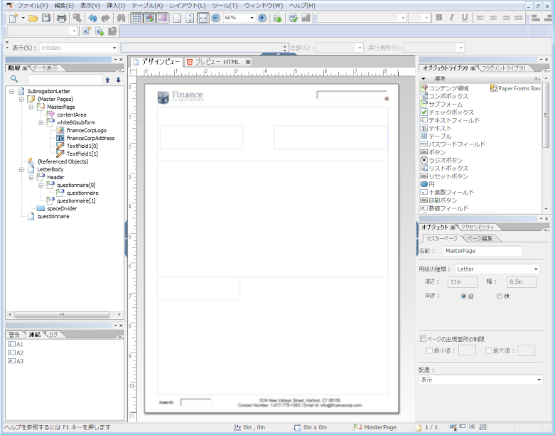

# レイアウトデザイン {#layout-design}

>[!CAUTION]
>
>AEM 6.4 の拡張サポートは終了し、このドキュメントは更新されなくなりました。 詳細は、 [技術サポート期間](https://helpx.adobe.com/jp/support/programs/eol-matrix.html). サポートされているバージョンを見つける [ここ](https://experienceleague.adobe.com/docs/?lang=ja).

XFA フォームテンプレートまたは XDP は、次のテンプレートです。

* [レター](/help/forms/using/create-letter.md)
* [インタラクティブ通信](/help/forms/using/interactive-communications-overview.md)の[印刷チャネル](/help/forms/using/web-channel-print-channel.md#printchannel)

* レイアウトフラグメント

XDP は Adobe Forms Designer でデザインします。この記事では、フォームフィールドやターゲット領域を使用する場所や、どういった場合にレイアウトフラグメントを使用するかなど、効率的な通信やインタラクティブ通信を作成するための XDP のデザイン方法について説明します。

## レターまたはインタラクティブ通信の印刷チャネル用のレイアウトを作成する {#creating-a-layout-for-letters-or-for-interactive-communications-print-channel}

レイアウトを使用して、レターまたはインタラクティブ通信の印刷チャネルの外観を定義します。レイアウトには、「住所」や「参照番号」などの一般的なフォームフィールドを含めることができます。 また、ターゲット領域を示す空のサブフォームも含みます。フォームデザイナーでレイアウトを作成し、完了したら、アプリケーションスペシャリストがAEMサーバーにレイアウトをアップロードします。 通信テンプレートを作成する際、またはインタラクティブ通信の印刷チャネルを作成する際に、ここからレイアウトを選択できます。

インタラクティブ通信のレター/印刷チャネルのレイアウトを作成するには、次の手順に従います。

1. レイアウトを分析し、すべてのページで繰り返されるコンテンツを特定する。通常、このカテゴリにはページのヘッダーとフッターが適用されます。 このコンテンツは、レイアウトのマスターページに配置されます。 残りのコンテンツはレイアウトのボディページに移動します。 ポリシージャケットでは、ロゴと会社の住所をマスターページのヘッダーおよびフッターに追加できます。 例えば、キャンセル通知の場合も同じレイアウトが使用されます。
1. ボディページをデザインする場合は、ページのコンテンツを複数のセクションに分割します。 各セクションは、レイアウト自体に埋め込まれるサブフォーム、またはフラグメントレイアウトとしてデザインされます。 セクションにテーブルが含まれる場合は、セクションをレイアウトフラグメントとしてモデル化します。
1. レイアウトは、次のように設計できます。

   1. 各セクションを、セクションのすべての要素を含む個別のサブフォームとして作成します。
   1. 各セクションサブフォームを同じ親サブフォームの子にします。 親サブフォームのレイアウトはフローに設定され、大きなデータが前のセクションにマージされた場合に、セクションを下に移動できるようにします。
   1. セクションプライマリの住居は、他のレイアウトでも再利用できます。 フラグメントレイアウトとして作成します。
   1. セクション追加の関心の詳細には、2 つの要素のみが次の階層に配置され、大きなデータを含むことができ、フローレイアウトとして設計されます。
   1. その他のセクションには、特定の位置に要素が含まれるので、位置固定レイアウトとして設計されます。
   1. セクションに特定の位置の要素が含まれ、これらの要素に大量のデータが含まれている場合、セクションをサブフォームに分割します。 次に、目的の動作を実現するようにサブフォームを配置します。
   1. 「プライマリの住居」セクションに、プレースホルダーターゲット領域を追加します。 このプレースホルダーは、レター/インタラクティブプライマリの設計時に、フラグメント通信の住居にバインドされます。
   1. レイアウト（およびレイアウトを使用するフラグメントがある場合は、それを使用）をAEM Formsサーバーにアップロードします。

## スキーマの使用 {#using-schema}

レイアウトまたはレイアウトフラグメントでスキーマを使用できますが、必須ではありません。 スキーマを使用する場合は、次の点を確認します。

1. レター/インタラクティブ通信で使用されるレイアウトとすべてのフラグメントレイアウトは、レター/インタラクティブ通信と同じスキーマを使用します。
1. データの入力が必要なフィールドは、すべてスキーマに連結されます。

## 関連付け可能なフィールドの作成 {#creating-relatable-fields}

デフォルトでは、すべてのフィールドは他の様々なデータソースと関連付け可能と見なされます。 レイアウトにデータソースに関連付け可能でないフィールドが含まれている場合は、そのフィールドに「_int」（内部）サフィックスを付けます。例えば、pageCount_int のように指定します。

関連付け可能なフィールドには、次の条件が必要です。

* XFA &lt;field> または &lt;exclGroup>
* XFA 連結参照を持つ
* もしそれが &lt;exclgroup>、少なくとも 1 つの子ラジオボタンフィールドが必要です。それ以外の場合は、値の型を決定できません

関連付け可能なフィールドには、次の条件が必要です。

* 名前がある

関連付け可能なフィールドは次のことはできません。

* 名前に「_int」サフィックスを含める
* 連結が「なし」に設定されている
* &lt;exclGroup> 要素の子である

関連付け可能なフィールドが上記の基準を満たす限り、レイアウト内の任意の場所と任意の深さで配置できます。 マスターページ内で関連付け可能なフィールドを使用できます。

フィールドは、ターゲット領域のサブフォームよりもレイアウト設定の方が柔軟です。ただし、単一の値タイプに結び付けられています。 フィールドを大きくしたり、幅と高さを固定したりできます。 解決されたモジュールまたはルールの結果が、フィールドにプッシュされます。

## サブフォームとテキストフィールドを使用するタイミングの決定 {#deciding-when-to-use-subforms-and-text-nbsp-fields}

トップダウンの垂直フローレイアウト（複数の段落または画像）で複数のモジュールコンテンツを取り込む場合は、サブフォームを使用します。 レイアウトは、サブフォームのコンテンツに合わせて高さが拡大されるという点に対応する必要があります。 サブフォーム/ターゲットに関連付けられたコンテンツの長さがレイアウトのサブフォーム用に確保されたスペースを超えていないと確信できない場合は、フローサブフォームコンテナ内に子としてサブフォームを作成します。 このプロセスにより、サブフォームの下のレイアウトオブジェクトは、サブフォームの拡大に応じて下方にフローします。

モジュールデータやデータディクショナリ要素のデータをレイアウトのスキーマに取り込む場合は、フィールドを使用します。フィールドはデータに連結されているためです。 マスターページ内のコンテンツは本文ページのコンテンツと共にフローできないので、画像フィールドをヘッダーロゴとして使用する必要があります。 次の表に、レイアウトでサブフォームとフィールドのどちらを使用するかについて、その他の条件を示します。

<table> 
 <tbody> 
  <tr> 
   <td>
<strong>サブフォームを使用する場合</strong>
 </td> 
   <td>
<strong>テキストフィールドを使用する場合</strong>
 </td> 
  </tr> 
  <tr> 
   <td>
姓と名など、要素の組み合わせが含まれます
 </td> 
   <td>
ポリシー番号など、単一の要素が含まれます。
 </td> 
  </tr> 
  <tr> 
   <td>
複数の段落が含まれます
 </td> 
   <td>
テキストを折り返し、両端揃えします。
 </td> 
  </tr> 
  <tr> 
   <td>
繰り返し、オプションおよび条件付きのデータグループはサブフォームに連結され、スクリプトを使用して同じ結果を得る場合に発生する可能性のある設計エラーのリスクを軽減します
 </td> 
   <td>
組織のロゴや住所などの要素は、レター/インタラクティブ通信のすべてのページに表示されます。 この場合、これらの要素のフォームフィールドを作成し、マスターページに配置します。 フィールドの連結を「データ連結なし」に設定した場合、レター/インタラクティブ通信エディターでは、関連付け可能なフィールドとしてフィールドが表示されません。 これらのフィールドに何らかの種類のコンテンツを関連付ける場合は、連結が必要です。
 
会社の住所に複数行のデータが含まれる場合は、テキストフィールドの「複数行」オプションを使用して、レイアウト上の住所を表します。
 
テキストフィールドのデータタイプがプレーンテキストに設定されている場合、リッチテキストバージョンの代わりに、モジュール出力のプレーンテキストバージョンが使用されます（すべての書式が破棄されます）。 書式設定を保持するには、テキストフィールドのデータタイプをリッチテキストに設定します。
 </td> 
  </tr> 
  <tr> 
   <td>
テキストをフローします
 </td> 
   <td>
テキストフィールドと画像フィールドは、マスターページで使用されます。 マスターページでは、サブフォームをターゲット領域として使用できません。
 </td> 
  </tr> 
  <tr> 
   <td>
サブフォームをデータ要素に連結せずに、オブジェクトをグループ化し、整理します
 </td> 
   <td>
 
 </td> 
  </tr> 
  <tr> 
   <td>
サブフォーム内にテキストフィールドがあります。 サブフォームは拡大しても、レイアウト上のサブフォームの下にある他のオブジェクトは上書きされません。
 </td> 
   <td>
後処理で、そのデータに簡単にアクセスできる必要があります。
 </td> 
  </tr> 
 </tbody> 
</table>

## 繰り返し要素の設定 {#setting-up-repetitive-elements}

組織のロゴや住所などの要素がレターやインタラクティブ通信のすべてのページに表示される場合は、それらの要素のフォームフィールドを作成し、マスターページに配置します。 これらのフィールドには名前（フィールド名）の連結を使用します。

## サーバーのレンダリング形式を指定 {#specify-the-server-nbsp-render-format}

レイアウトのサーバーレンダリング形式をダイナミック XML フォームに使用する。そうしないと、このレイアウトに基づくレターやインタラクティブ通信は正しくレンダリングされません。 デフォルトでは、Forms Designer のサーバーレンダリング形式はダイナミック XML フォームに設定されています。 正しい形式を使用していることを確認するには、次の手順を実行します。

* Designer で、 **[!UICONTROL ファイル/フォームのプロパティ/デフォルト]**&#x200B;をクリックし、「PDFのレンダリング/形式」設定が「動的 XML フォーム」に設定されていることを確認します。
