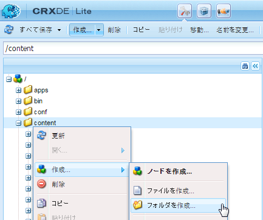
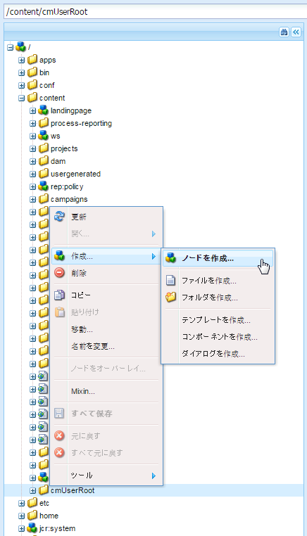

# エージェント署名画像の管理 {#manage-agent-signature-images}

## 概要 {#overview}

Correspondence Management では、画像を使用してレター内でエージェントの署名をレンダリングできます。 エージェント署名画像を設定すると、レターの作成時に、送信側エージェントの署名としてエージェント署名画像がレターにレンダリングされます。

agentSignatureImage DDE は、エージェントの署名画像を表す計算済み DDE です。 この計算済み DDE の式は、Expression Manager 構築ブロックで公開される新しいカスタム関数を使用します。 このカスタム関数は、agentID と agentFolder を入力パラメーターとして取得し、これらのパラメーターに基づいて画像コンテンツを取得します。 新しい SystemContext システムデータディクショナリにより、Correspondence Management で作成されたレターは、現在のシステムコンテキストの情報にアクセスできるようになります。システムコンテキストには、現在ログイン中のユーザーとアクティブな設定パラメーターに関する情報が含まれます。

画像は、cmuserroot フォルダーの下に追加することができます。[Correspondence Management 設定プロパティ](/help/forms/using/cm-configuration-properties.md)では、CM ユーザールートプロパティを使用することで、エージェント署名画像の参照先からフォルダーを変更することができます。

agentFolder DDE の値は、Correspondence Management 設定プロパティに向けて CMUserRoot 設定パラメーターから取得されます。デフォルトでは、この設定パラメーターは CRX リポジトリの /content/cmUserRoot を参照します。CMUserRoot 構成は、Configuration Properties から変更できます。
\
また、デフォルトのカスタム関数を上書きすることで、ユーザー署名画像を取得するための独自のロジックを定義することもできます。

## エージェント署名画像を追加する {#adding-agent-signature-image}

1. エージェント署名画像の名前と、AEM のユーザー名が一致することを確認してください。（画像ファイル名には、拡張子は必要ありません。）
1. CRX で、コンテンツフォルダー内に `cmUserRoot` フォルダーを作成します。

   1. `https://[server]:[port]/crx/de` にアクセスします。必要に応じて、管理者としてログインします。

   1. **content**&#x200B;フォルダーを右クリックし、**作成**／**フォルダーの作成**&#x200B;を選択します。

      

   1. ファイルを作成ダイアログで、フォルダー名を「`cmUserRoot`」と入力します。「**すべて保存**」をクリックします。

      >[!NOTE]
      >
      >cmUserRoot は、AEMがエージェント署名画像を検索するデフォルトの場所です。 ただし、[Correspondence Management 設定プロパティ](/help/forms/using/cm-configuration-properties.md)から CM ユーザールートプロパティを編集することで、参照先を変更することができます。

1. Content Explorer で cmUserRoot フォルダーに移動し、その中にエージェント署名画像を追加します。

   1. `https://[server]:[port]/crx/explorer/index.jsp` にアクセスします。必要に応じて、管理者としてログインします。
   1. クリック **Content Explorer**. 新しいウィンドウが開き、Content Explorer が開きます。
   1. Content Explorer で、cmUserRoot フォルダに移動して選択します。 を右クリックします。 **cmUserRoot** フォルダーと選択 **新しいノード**.

      

      新しいノードの行に以下のエントリを作成した後、緑色のチェックマークをクリックします。

      **名前**：JohnDoe（またはエージェント署名ファイルの名前）

      **タイプ：** nt:file

      `cmUserRoot` フォルダーの下に、「`JohnDoe`」の名前（または前の手順で指定した名前）で新しいフォルダーが作成されます。

   1. 新しく作成したフォルダーをクリックします（ここでは`JohnDoe`）。Content Explorer では、フォルダーの内容が暗く表示されます。

   1. **jcr:content** プロパティをダブルクリックし、タイプを **nt:resource** に設定します。その後、緑色のチェックマークをクリックしてエントリを保存します。

      プロパティが表示されていない場合は、まず、名前が「jcr:content」のプロパティを作成します。

      

      jcr:content のサブプロパティの中に、暗く表示されている jcr:data が含まれています。 jcr:data をダブルクリックします。 プロパティが編集可能になり、「ファイルの選択」ボタンがエントリに表示されます。「**ファイルを選択**」をクリックし、ロゴとして使用する画像ファイルを選択します。画像ファイルには、拡張子を付ける必要はありません。

      
   「**すべて保存**」をクリックします。

1. レターで使用する XDP\layout に、署名画像をレンダリングするための画像フィールドが左下（または署名をレンダリングするレイアウト内の他の適切な場所）にあることを確認します。
1. 通信の作成時は、以下の手順に従って、署名画像を配置するための画像フィールドを「データ」タブから選択します。

   1. 右ペインの「リンケージタイプ」ポップアップメニューから「システム」を選択します。

   1. SystemContext DD 用のデータ要素パネルのリストから、agentSignatureImage DDE を選択します。

   1. レターを保存します。

1. レターのプレビューを描画すると、レイアウトに応じて配置された画像フィールド内に署名が表示されます。

   
