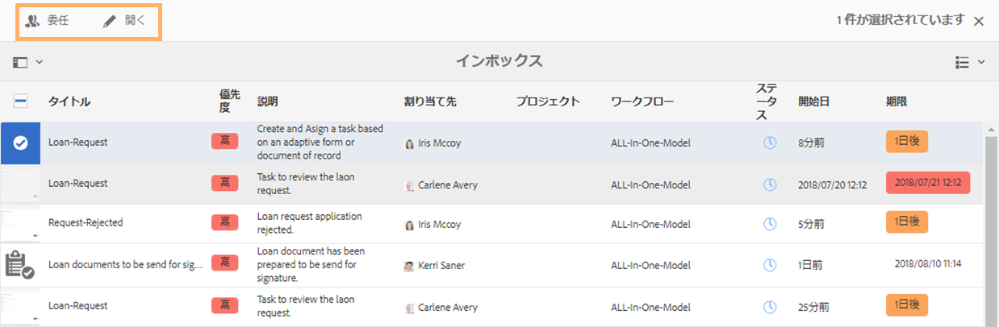
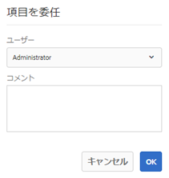
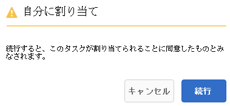
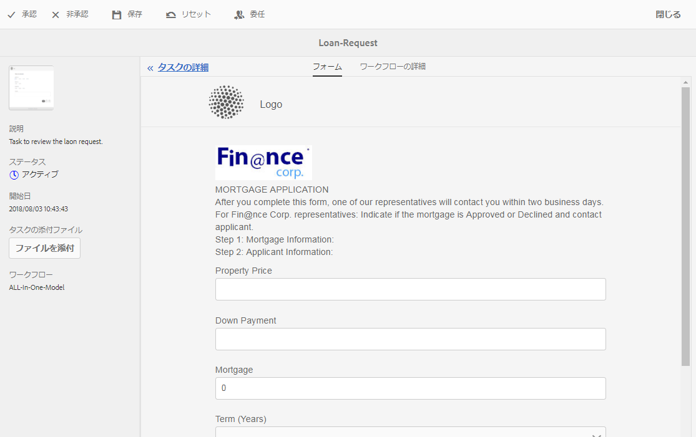
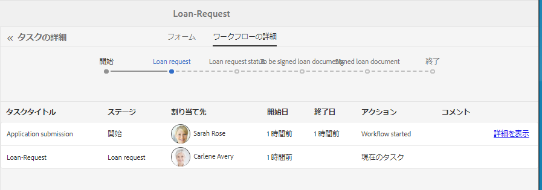
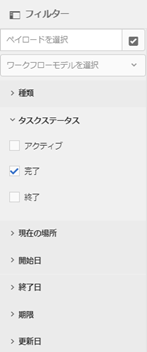
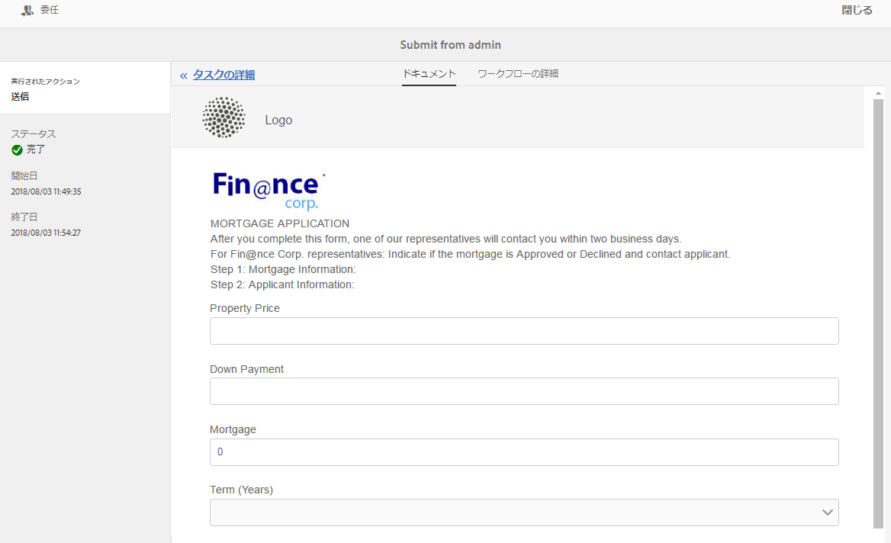
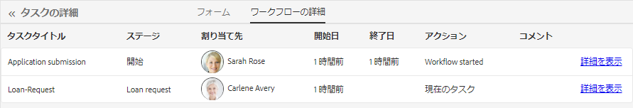

# AEM インボックスでの Forms アプリケーションとタスクの管理  {#manage-forms-applications-and-tasks-in-aem-inbox}

Forms 中心のワークフローを起動またはトリガーする多くの方法の 1 つに、AEM インボックスのアプリケーションから行う方法があります。Forms ワークフローを使用できるようにするためのワークフローアプリケーションを、インボックス内のアプリケーションとして作成する必要があります。ワークフローアプリケーションおよび Forms ワークフローを起動するためのその他の方法について詳しくは、「[OSGi 上での Forms 中心のワークフローの起動](/help/forms/using/aem-forms-workflow.md#launch)」を参照してください。

さらに、AEM インボックスは、Forms ワークフローを含む様々な AEM コンポーネントの通知やタスクを統合します。タスクを割り当てステップを含む Forms ワークフローがトリガーされると、関連するアプリケーションが担当者のインボックスにタスクとしてリストされます。担当者がグループの場合、そのタスクは、個人が要求するまで、またはタスクを委任するまで、グループのメンバー全員のインボックスに表示されます。

インボックスのユーザーインターフェイスでは、リストビューまたはカレンダービューでタスクを表示できます。ビューの設定もできます。様々なパラメーターに基づいて、タスクをフィルターできます。ビューとフィルターについて詳しくは、「[インボックス](/help/sites-authoring/inbox.md)」を参照してください。

要約すると、インボックスでは新しいアプリケーションを作成して割り当てタスクを管理できます。

>[!NOTE]
>
>AEM インボックスを使用するには、workflow-users グループのメンバーである必要があります。

## アプリケーションの作成 {#create-application}

1. AEMインボックス ( ) に移動します。 `https://[server]:[port]/aem/inbox`.
1. インボックスの UI で、**[!UICONTROL 作成／アプリケーション]**&#x200B;をタップします。アプリケーションを選択ページが表示されます。
1. アプリケーションを選択してから、「**[!UICONTROL 作成]**」をクリックします。アプリケーションに関連するアダプティブフォームが開きます。フォームに入力し、 **[!UICONTROL 送信]**. 関連するワークフローが起動し、担当者のインボックスにタスクが作成されます。

## タスクの管理 {#manage-tasks}

Forms ワークフローがトリガーされ、自分が担当者であるまたは担当者グループの一部である場合には、インボックスにタスクが表示されます。インボックス内のタスクについて、タスクの詳細を表示し、使用可能なアクションを実行できます。

### タスクの要求または委任 {#claim-or-delegate-tasks}

グループに割り当てられたタスクは、グループのメンバー全員のインボックスに表示されます。グループのメンバーなら誰でも、タスクを要求したり他のグループメンバーに委任したりできます。この作業を行うには、以下の手順を実行します。

1. タスクのサムネールをタップして選択します。タスクを開く、または委任するオプションが上部に表示されます。

   

1. 以下のいずれかの操作を行います。

   * タスクを委任するには、「**[!UICONTROL 委任]**」をタップします。項目を委任ダイアログが開きます。ユーザーを選択し、任意でコメントを追加して、「**[!UICONTROL OK]**」をタップします。

   

   * タスクを要求するには、「**[!UICONTROL 開く]**」をタップします。自分に割り当てダイアログが開きます。「**[!UICONTROL 続行]**」をタップして、タスクを要求します。要求したタスクが、自分が担当者としてインボックスに表示されます。

   

### タスクの詳細の表示とアクションの実行 {#view-details-and-perform-actions-on-tasks}

タスクを開くと、タスクの詳細を表示して使用可能なアクションを実行できます。タスクで使用可能なアクションは、関連する Forms ワークフローのタスクを割り当てステップで定義できます。

1. タスクのサムネールをタップして選択します。選択したタスクを開く、または委任するオプションが上部に表示されます。
1. 「**[!UICONTROL 開く]**」をタップしてタスクの詳細を表示し、アクションを実行します。タスクの詳細表示が開きます。このビューでは、タスクの詳細を表示したり、アクションを実行したりできます。

   >[!NOTE]
   >
   >タスクがグループに割り当てられている場合、詳細表示を開くにはタスクを要求する必要があります。

タスクの詳細表示は、以下のセクションで構成されます。

* タスクの詳細
* フォーム
* ワークフローの詳細
* アクションツールバー

#### タスクの詳細 {#task-details}

タスクの詳細セクションは、タスクについての情報を表示します。表示される情報は、ワークフローの[タスクを割り当てステップ](/help/sites-developing/workflows-step-ref.md)の設定によって異なります。上記の例では、タスクの説明、状態、開始日および使用されているワークフローが表示されています。また、タスクにファイルを添付することもできます。

#### フォーム {#form}

メインコンテンツ領域の「フォーム」タブには、送信されたフォームと、フィールドレベルの添付ファイル（存在する場合）が表示されます。

#### ワークフローの詳細 {#workflow-details}

上部にある「ワークフローの詳細」タブには、ワークフロー全体を通してタスクの進捗が表示されます。タスクの完了、現在、保留の各段階を示します。ワークフローの各段階は、関連するワークフローの[タスクを割り当てステップ](/help/sites-developing/workflows-step-ref.md)で定義されます。

さらに、タブはワークフローの完了した各段階ごとのタスクの履歴を表示します。完了した段階の「**[!UICONTROL 詳細を表示]**」をタップして、その段階の詳細を知ることができます。タスクに関するコメント、フォーム、タスクの添付ファイル、状態、開始日、終了日などが表示されます。

#### アクションツールバー {#actions-toolbar}

アクションツールバーは、タスクの使用可能なすべてのオプションを表示します。デフォルトのアクションは、保存、リセット、委任です。その他のアクションは、[タスクを割り当てステップ](/help/sites-developing/workflows-step-ref.md)で設定されます。上記の例では、ワークフローに承認と拒否が設定されています。

タスクに対してアクションを実行すると、ワークフローの次の段階に進みます。

### 完了したタスクの表示 {#view-completed-tasks}

AEM インボックスでは、アクティブなタスクのみが表示されます。完了したタスクはリストには表示されません。ただし、インボックスフィルターを使用して、いくつかのパラメーター（タスクのタイプ、状態、開始日と終了日など）に基づいてタスクをフィルターできます。完了したタスクを表示するには、以下の手順を実行します。

1. AEM インボックスで、 をタップしてフィルターセレクターを開きます。
1. 「**[!UICONTROL タスクステータス]**」アコーディオンをタップして、「**[!UICONTROL 完了]**」を選択します。完了されたすべてのタスクが表示されます。

   

1. タップしてタスクを選択し、「**[!UICONTROL 開く]**」をクリックします。

タスクが開き、タスクに関連するドキュメントまたはアダプティブフォームが表示されます。アダプティブフォームの場合は、読み取り専用のアダプティブフォームまたはそのレコードのPDFドキュメントが、 [タスクの割り当てワークフローステップ](/help/sites-developing/workflows-step-ref.md).

「タスクの詳細」セクションでは、実行済みアクション、タスクのステータス、開始日、終了日が表示されます。

「**[!UICONTROL ワークフローの詳細]**」タブには、ワークフローの各ステップが表示されます。ステップの詳細を表示するには、「**[!UICONTROL 詳細を表示]**」をタップします。

